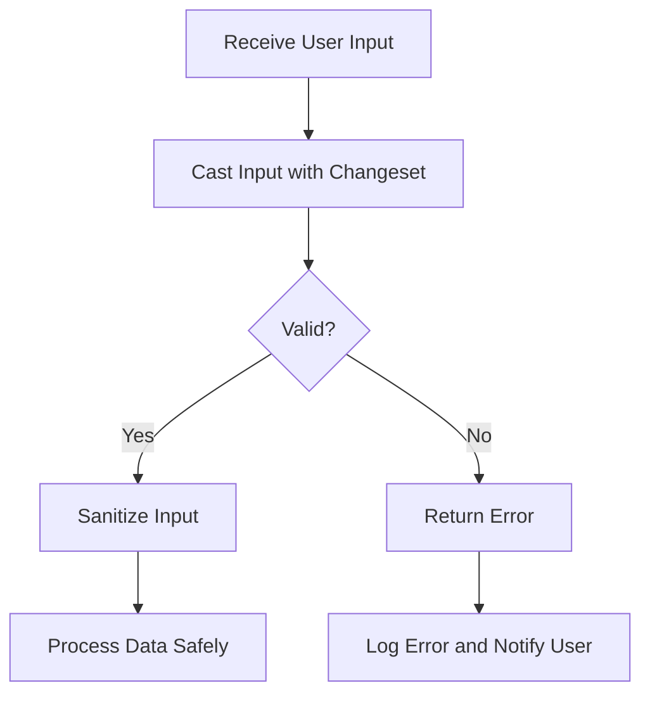

## 23.6. Input Validation and Sanitization

In the realm of software development, especially when dealing with web applications, input validation and sanitization are crucial for maintaining security and data integrity. In Elixir, a language known for its robustness and concurrency, these practices are no less important. This section will guide you through the best practices for input validation and sanitization in Elixir, focusing on using Ecto changesets, sanitizing inputs, and preventing injection attacks.

### Validating User Inputs

Input validation is the first line of defense against malicious data. It ensures that the data received by your application is both expected and safe to process. In Elixir, Ecto changesets provide a powerful mechanism for validating data.

#### Using Ecto Changesets for Data Validation

Ecto is a database wrapper and query generator for Elixir, and changesets are its primary tool for data validation and casting. Changesets allow you to define a set of rules that data must adhere to before it is considered valid.

**Example: Basic Changeset Validation**

```elixir
defmodule MyApp.User do
  use Ecto.Schema
  import Ecto.Changeset

  schema "users" do
    field :name, :string
    field :email, :string
    field :age, :integer
  end

  def changeset(user, params \\ %{}) do
    user
    |> cast(params, [:name, :email, :age])
    |> validate_required([:name, :email])
    |> validate_format(:email, ~r/@/)
    |> validate_number(:age, greater_than: 0)
  end
end
```

In this example, we define a `User` schema and a `changeset` function. The `cast/3` function is used to filter and cast the input parameters, while `validate_required/2`, `validate_format/3`, and `validate_number/3` are used to enforce validation rules.

**Key Points:**

- **Casting**: Converts input data into the appropriate types.
- **Validation**: Ensures data meets specified criteria.
- **Error Messages**: Automatically generated for invalid data, aiding in debugging and user feedback.

#### Advanced Changeset Validations

Ecto changesets also support more complex validations, such as custom validation functions and constraints.

**Example: Custom Validation**

```elixir
def validate_username(changeset) do
  validate_change(changeset, :name, fn :name, name ->
    if String.length(name) < 3 do
      [name: "must be at least 3 characters long"]
    else
      []
    end
  end)
end

def changeset(user, params \\ %{}) do
  user
  |> cast(params, [:name, :email, :age])
  |> validate_required([:name, :email])
  |> validate_format(:email, ~r/@/)
  |> validate_number(:age, greater_than: 0)
  |> validate_username()
end
```

In this example, `validate_username/1` is a custom validation function that checks the length of the username.

### Sanitizing Inputs

Sanitization involves cleaning input data to remove or encode potentially harmful content. This is crucial for preventing security vulnerabilities such as cross-site scripting (XSS) and SQL injection.

#### Removing or Encoding Potentially Harmful Data

Sanitization can be achieved by removing unwanted characters or encoding data to neutralize harmful content.

**Example: HTML Sanitization**

```elixir
defmodule MyApp.Sanitizer do
  def sanitize_html(input) do
    input
    |> String.replace(~r/<.*?>/u, "")
    |> String.replace(~r/&/, "&amp;")
    |> String.replace(~r/</, "&lt;")
    |> String.replace(~r/>/, "&gt;")
  end
end
```

This function removes HTML tags and encodes special characters to prevent XSS attacks.

**Key Points:**

- **Neutralization**: Converts potentially harmful data into a safe format.
- **Encoding**: Transforms special characters to prevent execution as code.

### Preventing Injection Attacks

Injection attacks occur when untrusted data is executed as code. Elixir provides several mechanisms to prevent these attacks, particularly through the use of Ecto and parameterized queries.

#### Avoiding the Execution of Untrusted Code

Parameterized queries in Ecto automatically escape input data, preventing SQL injection.

**Example: Safe Query Execution**

```elixir
def get_user_by_email(email) do
  from(u in User, where: u.email == ^email)
  |> Repo.one()
end
```

In this example, the `^` operator is used to bind the `email` variable, ensuring it is safely escaped.

**Key Points:**

- **Parameterized Queries**: Automatically escape input data.
- **Avoid Dynamic Queries**: Use Ecto's query syntax to prevent injection.

### Visualizing Input Validation and Sanitization

To better understand the flow of input validation and sanitization, let's visualize the process using a flowchart.



**Diagram Description:** This flowchart illustrates the process of receiving user input, casting and validating it with a changeset, sanitizing it, and then processing it safely. If validation fails, an error is returned, logged, and the user is notified.

### References and Links

- [Ecto Documentation](https://hexdocs.pm/ecto/Ecto.html) - Official Ecto documentation for more details on changesets and queries.
- [OWASP XSS Prevention Cheat Sheet](https://cheatsheetseries.owasp.org/cheatsheets/XSS_Prevention_Cheat_Sheet.html) - A comprehensive guide on preventing XSS attacks.
- [Elixir Security Best Practices](https://elixir-lang.org/getting-started/mix-otp/introduction-to-mix.html) - Best practices for securing Elixir applications.

### Knowledge Check

- **Question:** What is the primary purpose of input validation?
  - **Answer:** To ensure that the data received by your application is both expected and safe to process.

- **Question:** How do Ecto changesets help in input validation?
  - **Answer:** They provide a mechanism to define rules that data must adhere to before it is considered valid.

- **Question:** What is the difference between validation and sanitization?
  - **Answer:** Validation checks if data meets certain criteria, while sanitization cleans data to remove or encode harmful content.

### Embrace the Journey

Remember, mastering input validation and sanitization is a journey. As you progress, you'll build more secure and robust applications. Keep experimenting, stay curious, and enjoy the journey!

### Quiz: Input Validation and Sanitization



### What is the primary purpose of input validation?

- [x] To ensure data is expected and safe to process
- [ ] To remove harmful content from data
- [ ] To encode special characters
- [ ] To execute untrusted code

> **Explanation:** Input validation ensures that the data received by your application is both expected and safe to process.

### How do Ecto changesets help in input validation?

- [x] By defining rules that data must adhere to
- [ ] By encoding special characters
- [ ] By removing HTML tags
- [ ] By executing dynamic queries

> **Explanation:** Ecto changesets provide a mechanism to define rules that data must adhere to before it is considered valid.

### What is the difference between validation and sanitization?

- [x] Validation checks criteria, sanitization cleans data
- [ ] Validation encodes data, sanitization checks criteria
- [ ] Validation removes tags, sanitization executes code
- [ ] Validation processes data, sanitization logs errors

> **Explanation:** Validation checks if data meets certain criteria, while sanitization cleans data to remove or encode harmful content.

### What is the role of parameterized queries in preventing injection attacks?

- [x] They automatically escape input data
- [ ] They execute untrusted code
- [ ] They remove harmful content
- [ ] They encode special characters

> **Explanation:** Parameterized queries automatically escape input data, preventing SQL injection attacks.

### Which function is used in Ecto to filter and cast input parameters?

- [x] cast/3
- [ ] validate_required/2
- [ ] validate_format/3
- [ ] validate_number/3

> **Explanation:** The `cast/3` function is used to filter and cast input parameters in Ecto changesets.

### What does the `validate_format/3` function do in Ecto?

- [x] Ensures data matches a specific format
- [ ] Removes HTML tags
- [ ] Encodes special characters
- [ ] Executes dynamic queries

> **Explanation:** The `validate_format/3` function ensures that data matches a specific format, such as an email address.

### How can you prevent XSS attacks in Elixir?

- [x] By sanitizing inputs to remove or encode harmful content
- [ ] By executing untrusted code
- [ ] By using dynamic queries
- [ ] By logging errors

> **Explanation:** Sanitizing inputs to remove or encode harmful content is a key strategy in preventing XSS attacks.

### What is the purpose of the `^` operator in Ecto queries?

- [x] To bind variables and ensure safe escaping
- [ ] To execute untrusted code
- [ ] To remove harmful content
- [ ] To encode special characters

> **Explanation:** The `^` operator is used to bind variables in Ecto queries, ensuring they are safely escaped.

### How can custom validation functions be implemented in Ecto?

- [x] By using `validate_change/3`
- [ ] By encoding special characters
- [ ] By removing HTML tags
- [ ] By executing dynamic queries

> **Explanation:** Custom validation functions can be implemented in Ecto using the `validate_change/3` function.

### True or False: Sanitization is the process of checking if data meets certain criteria.

- [ ] True
- [x] False

> **Explanation:** Sanitization is the process of cleaning data to remove or encode harmful content, not checking if it meets criteria.



By following these practices and understanding the underlying principles, you can build secure and robust applications in Elixir. Keep exploring and refining your skills, and you'll be well-equipped to handle any challenges that come your way.
