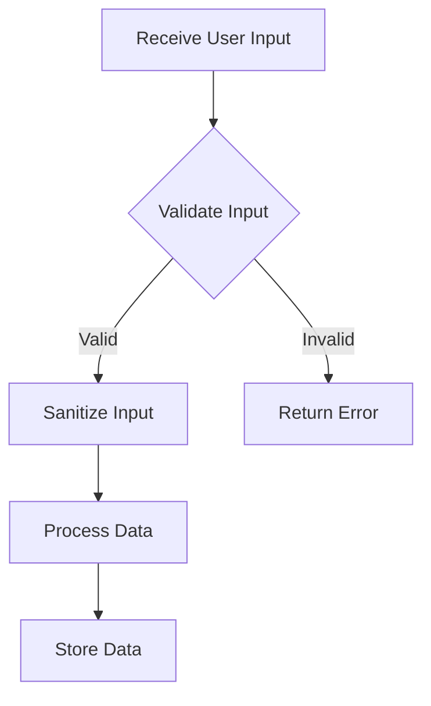

## 23.6. Input Validation and Sanitization

In today's digital landscape, ensuring the security and integrity of applications is paramount. One of the fundamental aspects of application security is the proper handling of user inputs. Input validation and sanitization are crucial processes that help protect applications from various types of attacks, such as injection attacks, and ensure that data is processed safely and correctly.

In this section, we'll delve into the concepts of input validation and sanitization within the Elixir programming language. We'll explore how to use Ecto changesets for data validation, discuss techniques for sanitizing inputs, and provide strategies to prevent injection attacks. By the end of this section, you'll have a comprehensive understanding of how to secure your Elixir applications against common input-related vulnerabilities.

### Validating User Inputs

Input validation is the process of ensuring that user inputs meet specific criteria before they are processed by the application. In Elixir, Ecto changesets provide a robust mechanism for validating data. Let's explore how Ecto changesets can be utilized for effective input validation.

#### Using Ecto Changesets for Data Validation

Ecto is a powerful library in Elixir that provides tools for interacting with databases, but it also offers a comprehensive system for data validation through changesets. Changesets allow you to define rules and constraints for your data, ensuring that only valid data is persisted to the database.

Here's a basic example of how to use Ecto changesets for input validation:

```elixir
defmodule MyApp.User do
  use Ecto.Schema
  import Ecto.Changeset

  schema "users" do
    field :name, :string
    field :email, :string
    field :age, :integer
  end

  @doc false
  def changeset(user, attrs) do
    user
    |> cast(attrs, [:name, :email, :age])
    |> validate_required([:name, :email, :age])
    |> validate_format(:email, ~r/@/)
    |> validate_number(:age, greater_than: 0)
  end
end
```

In this example, the `changeset/2` function is used to define validation rules for a `User` schema. The `cast/3` function specifies which attributes to allow, while `validate_required/2`, `validate_format/3`, and `validate_number/3` enforce specific validation rules. This ensures that the `name`, `email`, and `age` fields are present, the email has a valid format, and the age is a positive number.

#### Key Benefits of Using Ecto Changesets

- **Consistency**: Centralize validation logic in one place, ensuring consistency across your application.
- **Reusability**: Easily reuse changesets for different operations, such as creating and updating records.
- **Extensibility**: Extend changesets with custom validation functions tailored to your application's needs.

#### Advanced Validation Techniques

While basic validations are essential, there are scenarios where more complex validation logic is required. Ecto changesets support custom validations, allowing you to implement sophisticated validation rules.

```elixir
def validate_custom(changeset, field, opts) do
  validate_change(changeset, field, fn _, value ->
    if custom_condition?(value) do
      []
    else
      [{field, opts[:message] || "is invalid"}]
    end
  end)
end

defp custom_condition?(value) do
  # Implement custom validation logic here
end
```

In this snippet, `validate_custom/3` is a custom validation function that checks a specific condition. If the condition is not met, an error is added to the changeset.

### Sanitizing Inputs

Sanitization involves cleaning or transforming input data to remove potentially harmful elements. This step is crucial for preventing security vulnerabilities, such as cross-site scripting (XSS) and injection attacks.

#### Removing or Encoding Potentially Harmful Data

Sanitization can be achieved by either removing unwanted characters or encoding them to neutralize their effects. In Elixir, you can use libraries such as `HTMLSanitizeEx` to sanitize HTML content.

```elixir
defmodule MyApp.Sanitizer do
  alias HTMLSanitizeEx

  def sanitize_html(input) do
    HTMLSanitizeEx.strip_tags(input)
  end
end

# Usage
sanitized_input = MyApp.Sanitizer.sanitize_html("<script>alert('XSS');</script>")
```

In this example, `HTMLSanitizeEx.strip_tags/1` is used to remove HTML tags from the input, effectively neutralizing potential XSS attacks.

#### Encoding User Inputs

Encoding is another effective technique for sanitizing inputs. By converting special characters into their HTML or URL-encoded equivalents, you can prevent malicious scripts from being executed.

```elixir
defmodule MyApp.Encoder do
  def encode_html(input) do
    Plug.HTML.html_escape(input)
  end
end

# Usage
encoded_input = MyApp.Encoder.encode_html("<script>alert('XSS');</script>")
```

Here, `Plug.HTML.html_escape/1` is used to encode HTML characters, ensuring that any potentially harmful scripts are rendered harmless.

### Preventing Injection Attacks

Injection attacks occur when untrusted data is executed as code. These attacks can be mitigated by following best practices for input validation and sanitization.

#### Avoiding the Execution of Untrusted Code

To prevent injection attacks, it's crucial to never execute user inputs directly. Instead, use parameterized queries and prepared statements to safely handle user data.

For example, when interacting with a database, use Ecto's query syntax to avoid SQL injection:

```elixir
def get_user_by_email(email) do
  from(u in User, where: u.email == ^email)
  |> Repo.one()
end
```

In this query, the `^` operator is used to safely interpolate the `email` variable into the query, preventing SQL injection.

#### Protecting Against Command Injection

Command injection can occur when user inputs are used to construct system commands. To prevent this, avoid using user inputs directly in command execution. Instead, use functions that safely handle command execution.

```elixir
defmodule MyApp.Command do
  def safe_execute(command, args) do
    System.cmd(command, args)
  end
end

# Usage
MyApp.Command.safe_execute("ls", ["-l"])
```

In this example, `System.cmd/2` is used to execute a command with a list of arguments, ensuring that user inputs are not directly executed as part of the command.

### Visualizing the Input Validation and Sanitization Process

To better understand the flow of input validation and sanitization, let's visualize the process using a flowchart.


```mermaid
graph TD;
    A[Receive User Input] --> B{Validate Input};
    B -->|Valid| C[Sanitize Input];
    B -->|Invalid| D[Return Error];
    C --> E[Process Data];
    E --> F[Store Data];
```

**Caption**: This flowchart illustrates the process of receiving user input, validating it, sanitizing it, and finally processing and storing the data if valid.

### Try It Yourself

To solidify your understanding of input validation and sanitization in Elixir, try modifying the code examples provided. Experiment with different validation rules, custom validation functions, and sanitization techniques. Consider how these practices can be applied to your own projects to enhance security and data integrity.

### Knowledge Check

- Why is input validation important in application security?
- How do Ecto changesets facilitate data validation in Elixir?
- What are some common techniques for sanitizing inputs?
- How can you prevent injection attacks in Elixir applications?

### Summary

In this section, we've explored the critical concepts of input validation and sanitization in Elixir. By leveraging Ecto changesets, implementing effective sanitization techniques, and following best practices for preventing injection attacks, you can significantly enhance the security and reliability of your applications. Remember, this is just the beginning. As you progress, continue to refine your skills and stay informed about the latest security practices.

## Quiz Time!



### What is the primary purpose of input validation?

- [x] To ensure that user inputs meet specific criteria before processing
- [ ] To remove all special characters from user inputs
- [ ] To execute user inputs as code
- [ ] To store user inputs without modification

> **Explanation:** Input validation ensures that user inputs meet specific criteria before they are processed by the application, enhancing security and data integrity.

### How do Ecto changesets help in data validation?

- [x] They provide a mechanism to define rules and constraints for data
- [ ] They automatically sanitize user inputs
- [ ] They execute user inputs as database queries
- [ ] They store data without any validation

> **Explanation:** Ecto changesets allow developers to define validation rules and constraints, ensuring that only valid data is processed and stored.

### Which library can be used for HTML sanitization in Elixir?

- [x] HTMLSanitizeEx
- [ ] Plug.HTML
- [ ] Ecto
- [ ] Phoenix.HTML

> **Explanation:** HTMLSanitizeEx is a library in Elixir used for sanitizing HTML content, helping to prevent XSS attacks.

### What is the role of encoding in input sanitization?

- [x] To convert special characters into their safe equivalents
- [ ] To remove all whitespace from inputs
- [ ] To execute user inputs as HTML
- [ ] To validate the format of user inputs

> **Explanation:** Encoding converts special characters into their safe equivalents, preventing malicious scripts from being executed.

### How can SQL injection be prevented in Elixir?

- [x] By using parameterized queries and the `^` operator in Ecto
- [ ] By executing raw SQL queries with user inputs
- [ ] By encoding all user inputs as HTML
- [ ] By removing all special characters from inputs

> **Explanation:** SQL injection can be prevented by using parameterized queries and the `^` operator in Ecto to safely interpolate variables into queries.

### What is a common technique to prevent command injection?

- [x] Using functions like `System.cmd/2` to safely handle command execution
- [ ] Executing user inputs directly as system commands
- [ ] Removing all special characters from command inputs
- [ ] Encoding command inputs as HTML

> **Explanation:** Functions like `System.cmd/2` safely handle command execution by separating command and arguments, preventing command injection.

### Why is it important to sanitize inputs?

- [x] To remove or neutralize potentially harmful data
- [ ] To execute user inputs as code
- [ ] To ensure inputs meet specific criteria
- [ ] To store inputs without modification

> **Explanation:** Sanitizing inputs removes or neutralizes potentially harmful data, protecting applications from security vulnerabilities like XSS.

### What does the `Plug.HTML.html_escape/1` function do?

- [x] It encodes HTML characters to prevent XSS
- [ ] It removes all HTML tags from inputs
- [ ] It validates the format of HTML inputs
- [ ] It executes HTML inputs as code

> **Explanation:** `Plug.HTML.html_escape/1` encodes HTML characters, preventing XSS by ensuring that potentially harmful scripts are rendered harmless.

### What is the benefit of custom validation functions in Ecto changesets?

- [x] They allow for more complex and tailored validation logic
- [ ] They automatically sanitize inputs
- [ ] They execute user inputs as database queries
- [ ] They store data without validation

> **Explanation:** Custom validation functions in Ecto changesets allow developers to implement more complex and tailored validation logic specific to their application's needs.

### True or False: Input validation and sanitization are only necessary for web applications.

- [ ] True
- [x] False

> **Explanation:** Input validation and sanitization are necessary for any application that processes user inputs, not just web applications, to ensure security and data integrity.



Remember, mastering input validation and sanitization is a crucial step in building secure and robust Elixir applications. Keep experimenting, stay curious, and enjoy the journey!
