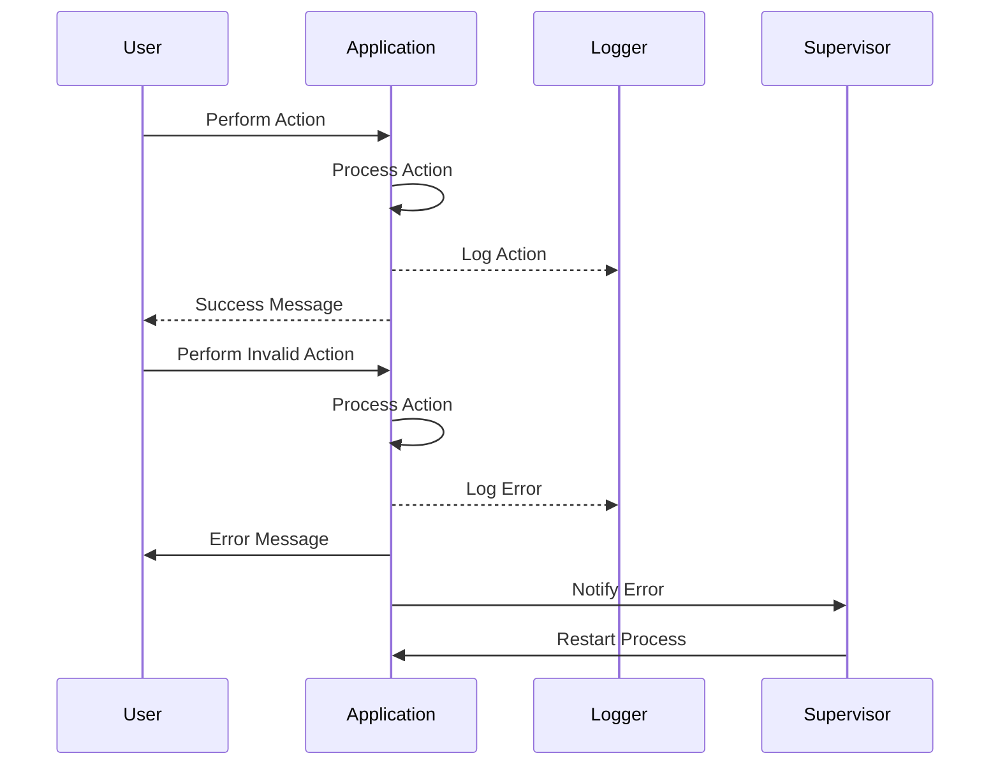

## 23.7. Error Handling and Logging Sensitive Data

In the realm of software development, particularly in languages like Elixir that are designed for building scalable and fault-tolerant systems, error handling and logging are crucial components. They not only help in diagnosing issues but also play a significant role in maintaining the security and integrity of the system. This section delves into the best practices for error handling and logging sensitive data in Elixir, ensuring that your applications are both robust and secure.

### Avoiding Information Leakage

Information leakage occurs when an application inadvertently exposes sensitive information to unauthorized users. This can happen through error messages, logs, or even through the application's user interface. In Elixir, as in any language, it's essential to avoid such leaks to protect user data and maintain system security.

#### Not Exposing Stack Traces or System Information

One of the most common ways information leakage occurs is through stack traces. While stack traces are invaluable during development and debugging, they can reveal too much information about the system's internals when exposed in a production environment.

**Best Practices:**

- **Use Custom Error Messages:** Instead of displaying raw stack traces, provide user-friendly error messages that do not reveal system details.
  
- **Configure Logger Levels:** In production, set the logger level to `:info` or `:warn` to prevent detailed error logs from being exposed. Use `:debug` level only in development environments.

- **Sanitize Error Outputs:** Ensure that any error messages displayed to users are sanitized and do not include sensitive information such as database queries or file paths.

**Example:**

```elixir
defmodule MyApp.ErrorHandler do
  require Logger

  def handle_error(error) do
    Logger.error("An error occurred: #{inspect(error)}")
    {:error, "An unexpected error has occurred. Please try again later."}
  end
end
```

In this example, the `handle_error` function logs the error for internal review while returning a generic message to the user.

### Secure Logging Practices

Logging is essential for monitoring and debugging applications, but it can also be a source of information leakage if not handled correctly. Logs should be carefully managed to ensure that sensitive information is not inadvertently exposed.

#### Anonymizing Sensitive Information in Logs

When logging information, it's crucial to anonymize or obfuscate any sensitive data to prevent unauthorized access.

**Best Practices:**

- **Mask Sensitive Data:** Use techniques to mask or hash sensitive data before logging it. For example, replace credit card numbers with asterisks except for the last four digits.

- **Use Structured Logging:** Implement structured logging to separate sensitive data from log messages, making it easier to filter out sensitive information.

- **Implement Access Controls:** Ensure that log files are stored securely and that access is restricted to authorized personnel only.

**Example:**

```elixir
defmodule MyApp.Logger do
  require Logger

  def log_user_action(user_id, action) do
    masked_user_id = mask_user_id(user_id)
    Logger.info("User #{masked_user_id} performed action: #{action}")
  end

  defp mask_user_id(user_id) do
    String.replace(user_id, ~r/\d{4}$/, "****")
  end
end
```

In this example, the `log_user_action` function masks the user ID before logging it, ensuring that sensitive information is not exposed.

### Handling Exceptions Carefully

Exception handling is a critical aspect of building resilient applications. In Elixir, the "let it crash" philosophy encourages developers to allow processes to fail and rely on supervisors to restart them. However, it's still important to handle exceptions gracefully to ensure a smooth user experience and maintain system integrity.

#### Graceful Error Recovery Without Revealing Internals

When an error occurs, it's important to recover gracefully without exposing internal details to the user.

**Best Practices:**

- **Use Try-Rescue Blocks:** Use `try-rescue` blocks to catch exceptions and handle them appropriately without exposing stack traces.

- **Implement Fallback Mechanisms:** Provide fallback mechanisms or default values to ensure that the application can continue to function even when an error occurs.

- **Log Errors Internally:** Log errors internally for debugging purposes, but ensure that the logs do not contain sensitive information.

**Example:**

```elixir
defmodule MyApp.Calculator do
  require Logger

  def divide(a, b) do
    try do
      {:ok, a / b}
    rescue
      ArithmeticError ->
        Logger.error("Division by zero attempted with values: #{a}, #{b}")
        {:error, "Cannot divide by zero"}
    end
  end
end
```

In this example, the `divide` function uses a `try-rescue` block to handle division by zero errors gracefully, logging the error internally and returning a user-friendly message.

### Visualizing Error Handling and Logging in Elixir

To better understand the flow of error handling and logging in Elixir, let's visualize the process using a sequence diagram.



**Diagram Description:** This sequence diagram illustrates the flow of error handling and logging in an Elixir application. When a user performs an action, the application processes it and logs the action. If an error occurs, the application logs the error, notifies the supervisor, and restarts the process.

### References and Links

For further reading on error handling and logging in Elixir, consider the following resources:

- [Elixir Logger Documentation](https://hexdocs.pm/logger/Logger.html)
- [Elixir Error Handling Guide](https://elixir-lang.org/getting-started/try-catch-and-rescue.html)
- [Secure Coding Practices](https://owasp.org/www-project-secure-coding-practices-quick-reference-guide/)

### Knowledge Check

To reinforce your understanding of error handling and logging in Elixir, consider the following questions:

1. What are some common ways information leakage can occur in an application?
2. How can you anonymize sensitive information in logs?
3. What is the "let it crash" philosophy in Elixir, and how does it relate to error handling?
4. Why is it important to use structured logging in applications?
5. How can you handle exceptions gracefully without exposing internal details?

### Embrace the Journey

Remember, mastering error handling and logging in Elixir is a journey. As you continue to build and refine your applications, keep experimenting with different techniques and stay curious about new developments in the field. Enjoy the process of creating robust and secure systems!

### Quiz: Error Handling and Logging Sensitive Data



### What is a common way information leakage occurs in applications?

- [x] Exposing stack traces
- [ ] Using structured logging
- [ ] Implementing access controls
- [ ] Masking sensitive data

> **Explanation:** Exposing stack traces can reveal sensitive information about the system's internals, leading to information leakage.

### How can you anonymize sensitive information in logs?

- [x] Mask sensitive data
- [ ] Use raw stack traces
- [ ] Log all user actions
- [ ] Display detailed error messages

> **Explanation:** Masking sensitive data before logging it helps prevent unauthorized access to sensitive information.

### What is the "let it crash" philosophy in Elixir?

- [x] Allow processes to fail and rely on supervisors to restart them
- [ ] Prevent all errors from occurring
- [ ] Log all errors to the console
- [ ] Display detailed error messages to users

> **Explanation:** The "let it crash" philosophy encourages allowing processes to fail and using supervisors to handle restarts, promoting fault tolerance.

### Why is structured logging important in applications?

- [x] It separates sensitive data from log messages
- [ ] It exposes stack traces
- [ ] It logs all user actions
- [ ] It displays detailed error messages

> **Explanation:** Structured logging helps separate sensitive data from log messages, making it easier to filter out sensitive information.

### How can you handle exceptions gracefully without exposing internal details?

- [x] Use try-rescue blocks
- [ ] Display raw stack traces
- [ ] Log all errors to the console
- [ ] Prevent all errors from occurring

> **Explanation:** Using try-rescue blocks allows you to catch exceptions and handle them appropriately without exposing internal details.

### What should you do to prevent information leakage in error messages?

- [x] Sanitize error outputs
- [ ] Display raw stack traces
- [ ] Log all errors to the console
- [ ] Use detailed error messages

> **Explanation:** Sanitizing error outputs ensures that error messages do not include sensitive information such as database queries or file paths.

### How can you ensure that log files are secure?

- [x] Implement access controls
- [ ] Log all user actions
- [ ] Display detailed error messages
- [ ] Use raw stack traces

> **Explanation:** Implementing access controls ensures that log files are stored securely and that access is restricted to authorized personnel only.

### What is a fallback mechanism in error handling?

- [x] A method to ensure the application can continue to function even when an error occurs
- [ ] A way to expose stack traces
- [ ] A method to log all errors to the console
- [ ] A way to display detailed error messages

> **Explanation:** A fallback mechanism provides a way for the application to continue functioning even when an error occurs, ensuring a smooth user experience.

### Why is it important to log errors internally?

- [x] For debugging purposes
- [ ] To expose stack traces
- [ ] To display detailed error messages
- [ ] To log all user actions

> **Explanation:** Logging errors internally helps in diagnosing issues and maintaining system integrity without exposing sensitive information.

### True or False: In production, it's best to set the logger level to :debug.

- [ ] True
- [x] False

> **Explanation:** In production, it's best to set the logger level to :info or :warn to prevent detailed error logs from being exposed.



By following these best practices for error handling and logging in Elixir, you can build secure and robust applications that protect sensitive data and provide a seamless user experience. Keep exploring and refining your skills, and remember that the journey to mastering Elixir is an ongoing process.
