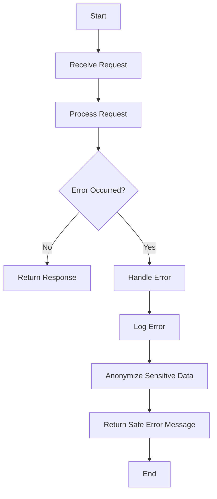

## 23.7. Error Handling and Logging Sensitive Data

In the world of software development, error handling and logging are critical components that ensure the robustness and reliability of applications. In Elixir, a language designed for building scalable and maintainable applications, mastering these components is essential. This section will guide you through advanced techniques for error handling and logging sensitive data in Elixir, with a focus on avoiding information leakage, secure logging practices, and careful exception handling.

### Avoiding Information Leakage

Information leakage occurs when sensitive data is inadvertently exposed to unauthorized users. This can happen through error messages, logs, or system outputs. In Elixir, it is crucial to prevent such leaks to maintain the security and integrity of your application.

#### Not Exposing Stack Traces or System Information

Exposing stack traces or detailed system information can provide attackers with valuable insights into your application's architecture and potential vulnerabilities. To avoid this, follow these best practices:

1. **Customize Error Messages**: Ensure that error messages are user-friendly and do not reveal internal details. Use generic messages like "An error occurred, please try again later."

2. **Control Stack Trace Exposure**: In production environments, configure your application to suppress stack traces in error responses. Use tools like `Plug.ErrorHandler` to customize error responses.

3. **Environment-Specific Configurations**: Use environment variables or configuration files to control the level of detail in error messages based on the environment (development, staging, production).

4. **Use Logging Libraries**: Utilize logging libraries that allow you to control the verbosity of logs and mask sensitive information. Libraries like `Logger` in Elixir provide options to customize log levels and formats.

```elixir
# Example of controlling error message exposure

defmodule MyApp.ErrorHandler do
  import Plug.Conn

  def init(opts), do: opts

  def call(conn, _opts) do
    try do
      conn
    rescue
      _exception ->
        send_resp(conn, 500, "An error occurred, please try again later.")
    end
  end
end
```

### Secure Logging Practices

Logging is an essential part of monitoring and debugging applications. However, it is crucial to ensure that logs do not contain sensitive information that could be exploited if accessed by unauthorized users.

#### Anonymizing Sensitive Information in Logs

To protect sensitive data in logs, consider the following practices:

1. **Data Masking**: Mask sensitive data such as passwords, credit card numbers, or personal identifiers before logging. Use regular expressions or custom functions to replace sensitive parts with placeholders.

2. **Structured Logging**: Use structured logging to separate sensitive data from log messages. This allows you to control what gets logged and ensures that sensitive information is not accidentally included.

3. **Log Rotation and Retention**: Implement log rotation and retention policies to limit the amount of log data stored and reduce the risk of exposure. Tools like `Logrotate` can help manage log files efficiently.

4. **Access Controls**: Restrict access to log files to authorized personnel only. Use file permissions and access control lists (ACLs) to enforce security.

5. **Encryption**: Encrypt log files or sensitive parts of log entries to protect them from unauthorized access.

```elixir
# Example of data masking in logs

defmodule MyApp.Logger do
  require Logger

  def log_sensitive_data(data) do
    masked_data = mask_sensitive_info(data)
    Logger.info("Processed data: #{masked_data}")
  end

  defp mask_sensitive_info(data) do
    Regex.replace(~r/\b\d{16}\b/, data, "**** **** **** ****")
  end
end
```

### Handling Exceptions Carefully

Exception handling is a critical aspect of building resilient applications. In Elixir, it is important to handle exceptions gracefully without revealing internal details that could be exploited.

#### Graceful Error Recovery Without Revealing Internals

1. **Use Try-Rescue Blocks**: Use `try-rescue` blocks to catch exceptions and handle them appropriately. Ensure that error messages returned to users do not contain sensitive information.

2. **Centralized Error Handling**: Implement a centralized error handling mechanism to manage exceptions consistently across your application. This can be achieved using middleware or custom error handlers.

3. **Fail-Safe Defaults**: In case of an error, ensure that your application falls back to a safe state. Avoid leaving the system in an inconsistent or vulnerable state.

4. **Logging Exceptions**: Log exceptions with care, ensuring that stack traces or sensitive data are not exposed. Use log levels to differentiate between critical errors and informational messages.

5. **Testing and Monitoring**: Regularly test your error handling mechanisms and monitor logs for unusual patterns or frequent errors that may indicate underlying issues.

```elixir
# Example of using try-rescue for exception handling

defmodule MyApp.Calculator do
  def divide(a, b) do
    try do
      {:ok, a / b}
    rescue
      ArithmeticError ->
        {:error, "Division by zero is not allowed"}
    end
  end
end
```

### Visualizing Error Handling and Logging

To better understand the flow of error handling and logging in an Elixir application, consider the following diagram that illustrates the process:


```mermaid
flowchart TD
    A[Start] --> B[Receive Request]
    B --> C[Process Request]
    C --> D{Error Occurred?}
    D -->|No| E[Return Response]
    D -->|Yes| F[Handle Error]
    F --> G[Log Error]
    G --> H[Anonymize Sensitive Data]
    H --> I[Return Safe Error Message]
    I --> J[End]
```

**Caption**: This diagram shows the flow of error handling and logging in an Elixir application. It emphasizes the importance of processing requests, handling errors gracefully, logging errors securely, and returning safe error messages to users.

### References and Links

For further reading on error handling and logging in Elixir, consider the following resources:

- [Elixir Logger Documentation](https://hexdocs.pm/logger/Logger.html)
- [Plug.ErrorHandler Documentation](https://hexdocs.pm/plug/Plug.ErrorHandler.html)
- [OWASP Logging Cheat Sheet](https://cheatsheetseries.owasp.org/cheatsheets/Logging_Cheat_Sheet.html)

### Knowledge Check

Before we conclude, let's reinforce our understanding with a few questions:

1. What are some best practices for avoiding information leakage in error messages?
2. How can you anonymize sensitive data in logs?
3. What is the purpose of using try-rescue blocks in Elixir?
4. Why is it important to implement log rotation and retention policies?
5. How can centralized error handling benefit an application?

### Embrace the Journey

Remember, mastering error handling and logging in Elixir is a journey that enhances the security and reliability of your applications. As you continue to explore these concepts, keep experimenting, stay curious, and enjoy the process of building robust software solutions.

### Quiz Time!



### What is a key practice to avoid information leakage in error messages?

- [x] Customizing error messages to be user-friendly and generic
- [ ] Exposing stack traces in production
- [ ] Logging all internal system information
- [ ] Using verbose error messages for all environments

> **Explanation:** Customizing error messages to be user-friendly and generic helps avoid exposing internal system details to users.

### How can sensitive data be anonymized in logs?

- [x] By using data masking techniques
- [ ] By logging all data as is
- [ ] By storing logs in plain text format
- [ ] By removing all logs

> **Explanation:** Data masking techniques replace sensitive parts of data with placeholders, ensuring sensitive information is not exposed in logs.

### What is the purpose of using try-rescue blocks in Elixir?

- [x] To catch and handle exceptions gracefully
- [ ] To expose internal errors to users
- [ ] To increase application performance
- [ ] To log sensitive information

> **Explanation:** Try-rescue blocks are used to catch and handle exceptions gracefully, preventing the exposure of internal errors to users.

### Why is it important to implement log rotation and retention policies?

- [x] To limit the amount of log data stored and reduce risk of exposure
- [ ] To store logs indefinitely
- [ ] To expose logs to all users
- [ ] To increase application complexity

> **Explanation:** Log rotation and retention policies help manage log data efficiently, reducing the risk of sensitive information exposure.

### How can centralized error handling benefit an application?

- [x] By managing exceptions consistently across the application
- [ ] By exposing all errors to users
- [ ] By increasing the complexity of error handling
- [ ] By reducing the need for error handling

> **Explanation:** Centralized error handling ensures consistent management of exceptions across the application, enhancing reliability and security.

### What is a benefit of structured logging?

- [x] It separates sensitive data from log messages
- [ ] It exposes internal system details
- [ ] It increases log verbosity
- [ ] It makes logs harder to read

> **Explanation:** Structured logging separates sensitive data from log messages, allowing for better control over what gets logged.

### What should be done to stack traces in production environments?

- [x] Suppress them in error responses
- [ ] Expose them to all users
- [ ] Log them in detail
- [ ] Ignore them

> **Explanation:** Suppressing stack traces in production environments prevents the exposure of internal system details to users.

### What is a key consideration when logging exceptions?

- [x] Ensuring stack traces or sensitive data are not exposed
- [ ] Logging all exceptions as they occur
- [ ] Ignoring exceptions
- [ ] Exposing exceptions to users

> **Explanation:** When logging exceptions, it is important to ensure stack traces or sensitive data are not exposed to unauthorized users.

### What is the role of access controls in logging?

- [x] To restrict access to log files to authorized personnel
- [ ] To expose logs to all users
- [ ] To increase log verbosity
- [ ] To eliminate the need for logging

> **Explanation:** Access controls restrict access to log files, ensuring that only authorized personnel can view sensitive information.

### True or False: Encrypting log files is a recommended practice for secure logging.

- [x] True
- [ ] False

> **Explanation:** Encrypting log files is a recommended practice to protect sensitive information from unauthorized access.


