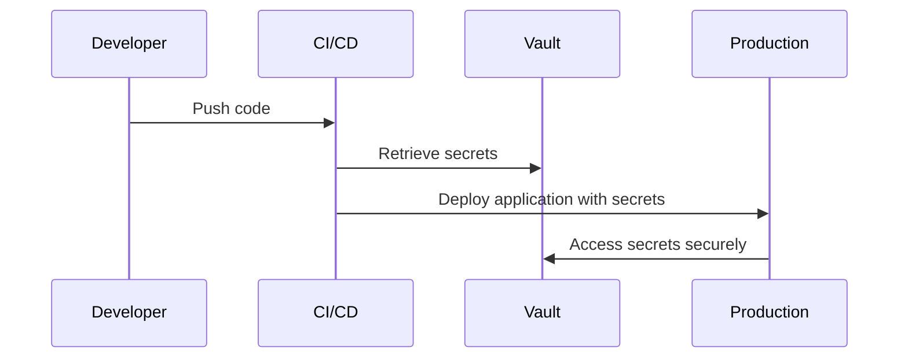

## 23.8. Secure Configuration Management

In the realm of software development, secure configuration management is paramount to safeguarding sensitive information and ensuring the integrity of applications. For Elixir developers, understanding how to manage secrets, protect configuration files, and secure deployments is crucial. This section delves into these aspects, providing expert guidance for implementing secure configuration management in Elixir applications.

### Managing Secrets

Managing secrets, such as API keys, database credentials, and encryption keys, is a critical component of secure configuration management. In Elixir, there are several strategies to handle secrets securely:

#### Using Environment Variables

Environment variables are a common method for managing secrets. They allow you to separate sensitive data from your codebase, reducing the risk of accidental exposure. Here's how you can use environment variables in Elixir:

```elixir
# config/config.exs

config :my_app, MyApp.Repo,
  username: System.get_env("DB_USERNAME"),
  password: System.get_env("DB_PASSWORD"),
  database: System.get_env("DB_NAME"),
  hostname: System.get_env("DB_HOST"),
  pool_size: 10
```

**Key Points:**
- **Separation of Concerns:** Environment variables keep sensitive data out of your source code.
- **Flexibility:** Easily change configurations without modifying code.
- **Security:** Environment variables can be managed securely by the operating system.

#### Using Vaults for Secrets

For enhanced security, consider using a secrets management tool like HashiCorp Vault. Vault provides a centralized, secure way to store and access secrets. Here's how you can integrate Vault with an Elixir application:

1. **Install and Configure Vault:**
   - Set up a Vault server and configure it to store your secrets.

2. **Access Secrets in Elixir:**
   - Use a library like `vault-elixir` to interact with Vault.

```elixir
# Fetching secrets from Vault
{:ok, vault_client} = Vault.new()
{:ok, secret} = Vault.read(vault_client, "secret/data/my_app")

db_username = secret["data"]["username"]
db_password = secret["data"]["password"]
```

**Benefits of Using Vault:**
- **Centralized Management:** Store all secrets in one place.
- **Access Control:** Fine-grained access control policies.
- **Audit Logging:** Track who accessed which secrets and when.

### Configuration Files

Configuration files often contain sensitive information that needs protection. Here are best practices for securing configuration files in Elixir:

#### Protecting Files Containing Sensitive Data

1. **Encryption:**
   - Encrypt sensitive configuration files to prevent unauthorized access.

2. **Access Control:**
   - Restrict file permissions to limit access to authorized users only.

3. **Version Control:**
   - Avoid storing sensitive data in version control systems. Use `.gitignore` to exclude sensitive files.

```plaintext
# .gitignore

# Ignore configuration files containing secrets
config/secrets.exs
```

#### Example of Secure Configuration File

```elixir
# config/prod.secret.exs

use Mix.Config

config :my_app, MyApp.Repo,
  username: "encrypted_username",
  password: "encrypted_password",
  database: "my_app_prod",
  hostname: "prod_db_host",
  pool_size: 15
```

**Key Considerations:**
- **Encryption:** Use tools like GPG or OpenSSL for file encryption.
- **Access Control:** Ensure only necessary personnel have access to configuration files.

### Deployment Considerations

Securing configurations during deployment is crucial to prevent leaks and unauthorized access. Here are strategies to ensure secure deployments:

#### Ensuring Configurations Are Secure in All Environments

1. **Environment-Specific Configurations:**
   - Use environment-specific configuration files to separate development, testing, and production settings.

```elixir
# config/config.exs

import_config "#{Mix.env()}.exs"
```

2. **Secure Deployment Pipelines:**
   - Use CI/CD tools to automate deployments, ensuring configurations are applied securely.

3. **Secrets Management in CI/CD:**
   - Integrate secrets management tools with your CI/CD pipeline to securely inject secrets during deployment.

#### Example Deployment Pipeline

```yaml
# .github/workflows/deploy.yml

name: Deploy

on:
  push:
    branches:
      - main

jobs:
  deploy:
    runs-on: ubuntu-latest
    steps:
      - name: Checkout code
        uses: actions/checkout@v2

      - name: Set up Elixir
        uses: actions/setup-elixir@v1
        with:
          elixir-version: '1.12'
          otp-version: '24.0'

      - name: Install dependencies
        run: mix deps.get

      - name: Build release
        run: mix release

      - name: Deploy to production
        env:
          DB_USERNAME: ${{ secrets.DB_USERNAME }}
          DB_PASSWORD: ${{ secrets.DB_PASSWORD }}
        run: ./deploy.sh
```

**Key Considerations:**
- **Environment-Specific Configurations:** Tailor configurations for each environment.
- **Secure Pipelines:** Use secure methods to handle secrets in CI/CD pipelines.

### Visualizing Secure Configuration Management

To better understand the flow of secure configuration management, let's visualize the process using a sequence diagram:



**Diagram Description:**
- **Developer:** Initiates the deployment process by pushing code.
- **CI/CD:** Retrieves secrets from Vault and deploys the application.
- **Vault:** Provides secure access to secrets.
- **Production:** Runs the application with securely managed secrets.

### Knowledge Check

Before we conclude, let's reinforce our understanding with a few questions:

- **What are the benefits of using environment variables for managing secrets?**
- **How can Vault enhance the security of secret management?**
- **What are some best practices for protecting configuration files?**
- **Why is it important to have environment-specific configurations?**

### Embrace the Journey

Remember, secure configuration management is an ongoing process. As you continue to develop and deploy Elixir applications, keep refining your strategies to protect sensitive information. Stay curious, explore new tools, and enjoy the journey of building secure, robust applications.

## Quiz: Secure Configuration Management



### What is a primary benefit of using environment variables for managing secrets?

- [x] They keep sensitive data out of the source code.
- [ ] They are stored in version control.
- [ ] They are always encrypted by default.
- [ ] They are accessible to all users.

> **Explanation:** Environment variables help keep sensitive data separate from the source code, reducing the risk of exposure.

### How does HashiCorp Vault enhance secret management?

- [x] Provides centralized management and access control.
- [ ] Automatically encrypts all files.
- [ ] Stores secrets in version control.
- [ ] Requires no configuration.

> **Explanation:** Vault offers centralized management, fine-grained access control, and audit logging for secrets.

### What is a recommended practice for protecting configuration files?

- [x] Encrypt sensitive files and restrict access.
- [ ] Store them in public repositories.
- [ ] Use plain text for easy access.
- [ ] Share them with all team members.

> **Explanation:** Encrypting files and restricting access helps protect sensitive information in configuration files.

### Why should configurations be environment-specific?

- [x] To tailor settings for development, testing, and production.
- [ ] To use the same settings across all environments.
- [ ] To simplify deployment processes.
- [ ] To avoid using environment variables.

> **Explanation:** Environment-specific configurations ensure that each environment has appropriate settings, enhancing security and functionality.

### What is a key consideration for secure deployment pipelines?

- [x] Integrate secrets management tools.
- [ ] Use the same credentials for all environments.
- [ ] Deploy manually to ensure security.
- [ ] Avoid using CI/CD tools.

> **Explanation:** Integrating secrets management tools in CI/CD pipelines ensures that secrets are handled securely during deployment.

### What is the role of the CI/CD pipeline in secure configuration management?

- [x] Automates deployments and securely injects secrets.
- [ ] Stores secrets in version control.
- [ ] Manually manages all configurations.
- [ ] Avoids using environment variables.

> **Explanation:** CI/CD pipelines automate deployments and can securely inject secrets, enhancing security and efficiency.

### How can you prevent sensitive data from being stored in version control?

- [x] Use `.gitignore` to exclude sensitive files.
- [ ] Store all files in the repository.
- [ ] Use plain text for easy access.
- [ ] Share them with all team members.

> **Explanation:** Using `.gitignore` helps prevent sensitive files from being included in version control.

### What is a benefit of using a secrets management tool like Vault?

- [x] Centralized management and audit logging.
- [ ] Secrets are stored in plain text.
- [ ] No need for access control.
- [ ] Automatically shares secrets with all users.

> **Explanation:** Vault provides centralized management, access control, and audit logging, enhancing security.

### What should be considered when managing secrets in CI/CD pipelines?

- [x] Securely inject secrets during deployment.
- [ ] Store secrets in version control.
- [ ] Use the same credentials for all environments.
- [ ] Avoid using secrets management tools.

> **Explanation:** Securely injecting secrets during deployment ensures that they are handled safely and not exposed.

### True or False: Environment variables are always encrypted by default.

- [ ] True
- [x] False

> **Explanation:** Environment variables are not encrypted by default; they need to be managed securely by the operating system.


