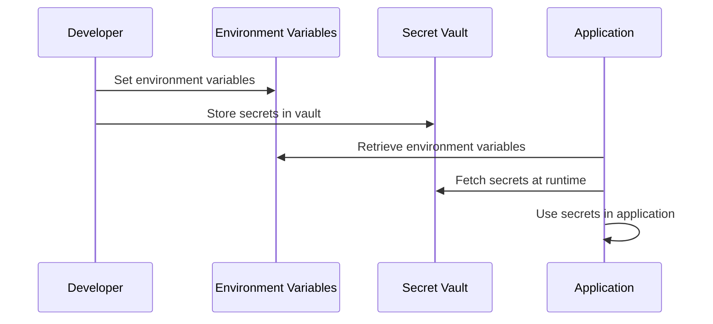

## 23.8. Secure Configuration Management

In the realm of software development, secure configuration management is a critical aspect that often determines the robustness of an application against security threats. This section delves into secure configuration management in Elixir, focusing on managing secrets, protecting configuration files, and ensuring secure deployments across different environments. As expert software engineers and architects, understanding these concepts is crucial for building secure and resilient systems.

### Managing Secrets

Managing secrets is a fundamental part of secure configuration management. Secrets include sensitive information such as API keys, database credentials, and encryption keys that, if exposed, can lead to severe security breaches. In Elixir, secrets can be managed effectively using environment variables and secret management tools or vaults.

#### Using Environment Variables

Environment variables are a common method for managing secrets. They allow you to separate configuration data from your codebase, reducing the risk of accidental exposure through version control systems.

**Advantages of Using Environment Variables:**

- **Separation of Concerns:** Keeps sensitive data out of the codebase.
- **Flexibility:** Easily changeable without modifying the code.
- **Environment-Specific Configurations:** Different values can be set for development, testing, and production environments.

**Best Practices:**

- **Use a `.env` file:** For local development, use a `.env` file to store environment variables. Tools like `dotenv` can help load these variables into the environment.
- **Avoid Hardcoding Secrets:** Never hardcode secrets directly in your codebase.
- **Limit Access:** Ensure only necessary processes and users have access to the environment variables.

**Example:**

```elixir
# config/config.exs
config :my_app, MyApp.Repo,
  username: System.get_env("DB_USERNAME"),
  password: System.get_env("DB_PASSWORD"),
  database: System.get_env("DB_NAME"),
  hostname: System.get_env("DB_HOST"),
  pool_size: 10
```

In this example, database credentials are retrieved from environment variables, keeping them out of the codebase.

#### Using Secret Management Tools and Vaults

For enhanced security, especially in production environments, using secret management tools or vaults is recommended. These tools provide secure storage and access control for sensitive information.

**Popular Secret Management Tools:**

- **HashiCorp Vault:** Offers dynamic secrets, data encryption, and access control.
- **AWS Secrets Manager:** Manages secrets in the AWS ecosystem.
- **Azure Key Vault:** Provides secure storage for secrets in Azure.

**Integration with Elixir:**

Using a secret management tool involves fetching secrets at runtime. Here's an example using HashiCorp Vault:

```elixir
# Fetching secrets from Vault
defmodule MyApp.VaultClient do
  @vault_url "https://vault.example.com"
  @vault_token System.get_env("VAULT_TOKEN")

  def get_secret(secret_path) do
    headers = [{"X-Vault-Token", @vault_token}]
    url = "#{@vault_url}/v1/#{secret_path}"

    case HTTPoison.get(url, headers) do
      {:ok, %HTTPoison.Response{status_code: 200, body: body}} ->
        {:ok, Poison.decode!(body)["data"]}

      {:error, %HTTPoison.Error{reason: reason}} ->
        {:error, reason}
    end
  end
end
```

In this example, secrets are fetched from Vault using HTTPoison, a popular HTTP client in Elixir.

#### Key Considerations for Secret Management

- **Access Control:** Implement strict access controls to limit who can view or modify secrets.
- **Audit Logging:** Enable logging to track access and changes to secrets.
- **Regular Rotation:** Regularly rotate secrets to minimize the impact of potential leaks.
- **Encryption:** Ensure secrets are encrypted both at rest and in transit.

### Configuration Files

Configuration files are another area where sensitive data can reside. Protecting these files is essential to prevent unauthorized access.

#### Protecting Configuration Files

To protect configuration files, consider the following strategies:

- **Encryption:** Encrypt configuration files to prevent unauthorized access. Use libraries like `cloak` for encryption in Elixir.
- **Access Controls:** Set file permissions to restrict access to configuration files.
- **Version Control Exclusion:** Add configuration files containing sensitive data to `.gitignore` to prevent accidental commits to version control.

**Example of Encrypting Configuration Files:**

```elixir
# Using Cloak for encryption
defmodule MyApp.Config do
  use Cloak.Vault, otp_app: :my_app

  def encrypt_config(data) do
    encrypt(data)
  end

  def decrypt_config(data) do
    decrypt(data)
  end
end
```

In this example, `Cloak` is used to encrypt and decrypt configuration data.

#### Secure Configuration Management Practices

- **Environment-Specific Files:** Use different configuration files for each environment (e.g., `config/dev.exs`, `config/prod.exs`).
- **Minimal Exposure:** Only include necessary configurations in each file.
- **Secure Storage:** Store configuration files in secure locations with restricted access.

### Deployment Considerations

Ensuring secure configurations in all environments is crucial for maintaining the security posture of your application.

#### Ensuring Secure Deployments

- **Configuration Validation:** Validate configurations before deployment to catch potential issues.
- **Environment-Specific Configurations:** Ensure configurations are appropriate for each environment.
- **Automated Deployment Pipelines:** Use CI/CD pipelines to automate deployments and reduce human error.
- **Secure Transport:** Use secure protocols (e.g., HTTPS, SSH) for deploying configurations.

**Example of Environment-Specific Configuration:**

```elixir
# config/prod.exs
import Config

config :my_app, MyApp.Repo,
  username: System.get_env("DB_USERNAME"),
  password: System.get_env("DB_PASSWORD"),
  database: System.get_env("DB_NAME"),
  hostname: System.get_env("DB_HOST"),
  pool_size: 15,
  ssl: true
```

In this example, the production configuration includes SSL for secure database connections.

#### Key Considerations for Deployment Security

- **Rollback Mechanisms:** Implement rollback mechanisms to revert to previous configurations in case of issues.
- **Monitoring and Alerts:** Set up monitoring and alerts to detect and respond to configuration-related issues.
- **Regular Audits:** Conduct regular audits of configurations to ensure compliance with security policies.

### Visualizing Secure Configuration Management

To better understand the flow of secure configuration management, let's visualize the process using a sequence diagram.


```mermaid
sequenceDiagram
    participant Dev as Developer
    participant Env as Environment Variables
    participant Vault as Secret Vault
    participant App as Application

    Dev->>Env: Set environment variables
    Dev->>Vault: Store secrets in vault
    App->>Env: Retrieve environment variables
    App->>Vault: Fetch secrets at runtime
    App->>App: Use secrets in application
```

This diagram illustrates the interaction between a developer, environment variables, a secret vault, and the application during secure configuration management.

### Try It Yourself

Experiment with the concepts discussed by:

- Modifying the code examples to use different secret management tools.
- Implementing encryption for configuration files in your projects.
- Setting up a CI/CD pipeline to automate deployments with secure configurations.

### References and Links

- [Elixir Cloak Library](https://hexdocs.pm/cloak/readme.html)
- [HashiCorp Vault](https://www.vaultproject.io/)
- [AWS Secrets Manager](https://aws.amazon.com/secrets-manager/)
- [Azure Key Vault](https://azure.microsoft.com/en-us/services/key-vault/)

### Knowledge Check

- Why is it important to separate configuration data from the codebase?
- What are the benefits of using secret management tools over environment variables?
- How can you ensure that configuration files remain secure?

### Embrace the Journey

Remember, secure configuration management is an ongoing process. As you implement these practices, you'll enhance the security and resilience of your applications. Keep exploring, stay vigilant, and enjoy the journey of building secure systems!

## Quiz Time!



### What is a key advantage of using environment variables for managing secrets?

- [x] They keep sensitive data out of the codebase.
- [ ] They are always encrypted by default.
- [ ] They cannot be accessed by unauthorized users.
- [ ] They automatically rotate secrets.

> **Explanation:** Environment variables help keep sensitive data out of the codebase, reducing the risk of exposure through version control systems.

### Which tool is commonly used for managing secrets in a secure manner?

- [x] HashiCorp Vault
- [ ] GitHub
- [ ] Docker
- [ ] PostgreSQL

> **Explanation:** HashiCorp Vault is a popular tool for managing secrets securely.

### What is a recommended practice for protecting configuration files?

- [x] Encrypting configuration files
- [ ] Storing them in a public repository
- [ ] Hardcoding secrets within them
- [ ] Sharing them with all team members

> **Explanation:** Encrypting configuration files helps prevent unauthorized access to sensitive data.

### What should be avoided when managing secrets?

- [x] Hardcoding secrets in the codebase
- [ ] Using environment variables
- [ ] Encrypting secrets
- [ ] Using secret management tools

> **Explanation:** Hardcoding secrets in the codebase increases the risk of exposure and should be avoided.

### What is an important consideration for deployment security?

- [x] Using secure protocols for transport
- [ ] Ignoring configuration validation
- [ ] Allowing unrestricted access to configurations
- [ ] Using the same configuration for all environments

> **Explanation:** Using secure protocols like HTTPS and SSH ensures secure transport of configurations during deployment.

### How can you ensure that only necessary configurations are included in each environment-specific file?

- [x] By using environment-specific configuration files
- [ ] By hardcoding configurations
- [ ] By storing all configurations in a single file
- [ ] By ignoring environment differences

> **Explanation:** Using environment-specific configuration files helps ensure that only necessary configurations are included for each environment.

### What is a benefit of using secret management tools over environment variables?

- [x] Enhanced security features
- [ ] Simplicity in setup
- [ ] Guaranteed encryption
- [ ] Automatic secret rotation

> **Explanation:** Secret management tools offer enhanced security features like access control and audit logging.

### Which of the following is a secure practice for managing secrets?

- [x] Regularly rotating secrets
- [ ] Hardcoding secrets in the application
- [ ] Sharing secrets with all team members
- [ ] Storing secrets in plaintext

> **Explanation:** Regularly rotating secrets minimizes the impact of potential leaks.

### What is the role of audit logging in secret management?

- [x] Tracking access and changes to secrets
- [ ] Encrypting secrets
- [ ] Automatically rotating secrets
- [ ] Preventing unauthorized access

> **Explanation:** Audit logging helps track access and changes to secrets, providing accountability.

### True or False: Environment variables are always encrypted by default.

- [ ] True
- [x] False

> **Explanation:** Environment variables are not encrypted by default; additional measures are needed to secure them.


