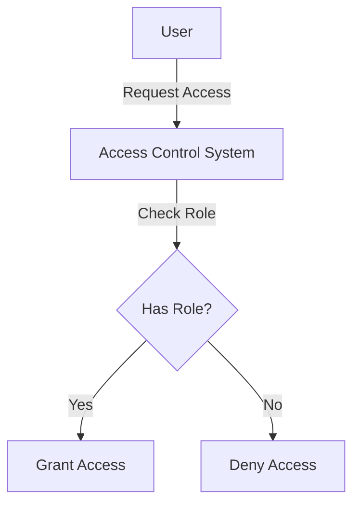

## 23.9. Handling Sensitive Information

In today's digital age, handling sensitive information securely is paramount for any application. As expert software engineers and architects, it is our responsibility to ensure that sensitive data is protected from unauthorized access and breaches. This section delves into the best practices and design patterns for handling sensitive information in Elixir applications, focusing on data privacy, data minimization, and access control.

### Data Privacy

Data privacy is a critical aspect of handling sensitive information. It involves ensuring that personal data is collected, processed, and stored in a manner that respects individuals' privacy rights. Compliance with regulations such as the General Data Protection Regulation (GDPR) is essential for maintaining data privacy.

#### Complying with Regulations like GDPR

The GDPR is a comprehensive data protection regulation that applies to organizations operating within the European Union (EU) or handling the data of EU citizens. It mandates strict guidelines for data collection, processing, and storage. Here are some key points to consider when ensuring GDPR compliance in your Elixir applications:

1. **Data Subject Rights**: Implement mechanisms to allow users to exercise their rights, such as the right to access, rectify, or delete their data.

2. **Data Protection by Design**: Incorporate data protection principles into the design of your application from the outset.

3. **Data Breach Notification**: Establish procedures for detecting, reporting, and investigating data breaches.

4. **Data Processing Agreements**: Ensure that any third-party processors you work with comply with GDPR requirements.

5. **Data Transfer**: Implement safeguards for transferring data outside the EU, such as using standard contractual clauses.

#### Code Example: Implementing Data Subject Rights

Let's explore how to implement a simple mechanism for users to access and delete their data in an Elixir application.

```elixir
defmodule MyApp.UserController do
  use MyApp, :controller

  alias MyApp.Users

  # Allow users to request their data
  def show(conn, %{"id" => user_id}) do
    user = Users.get_user!(user_id)
    render(conn, "show.json", user: user)
  end

  # Allow users to delete their data
  def delete(conn, %{"id" => user_id}) do
    with {:ok, _user} <- Users.delete_user(user_id) do
      send_resp(conn, :no_content, "")
    end
  end
end
```

In this example, we define two actions: `show` for retrieving user data and `delete` for removing user data. These actions align with GDPR's data subject rights.

### Data Minimization

Data minimization is the practice of collecting only the data that is necessary for a specific purpose. This principle helps reduce the risk of data breaches and ensures compliance with data protection regulations.

#### Collecting Only Necessary Data

When designing your application, consider the following strategies to minimize data collection:

1. **Purpose Specification**: Clearly define the purpose for which data is being collected and ensure that only relevant data is collected.

2. **Data Anonymization**: Use techniques such as pseudonymization or anonymization to protect personal data.

3. **Data Retention Policies**: Implement policies to regularly review and delete data that is no longer needed.

#### Code Example: Data Anonymization

Here's an example of how to anonymize user data in Elixir:

```elixir
defmodule MyApp.Anonymizer do
  alias MyApp.Users

  # Anonymize user data
  def anonymize_user(user_id) do
    user = Users.get_user!(user_id)

    anonymized_user = %{
      user |
      email: anonymize_email(user.email),
      name: "Anonymous"
    }

    Users.update_user(user_id, anonymized_user)
  end

  defp anonymize_email(email) do
    [local_part, domain] = String.split(email, "@")
    "#{String.slice(local_part, 0, 2)}***@#{domain}"
  end
end
```

In this example, we anonymize the user's email by masking part of the local part and replacing the name with "Anonymous."

### Access Control

Access control is a fundamental aspect of securing sensitive information. It involves restricting access to data based on user roles and permissions.

#### Restricting Access to Sensitive Data

Implementing robust access control mechanisms is crucial for protecting sensitive data. Consider the following strategies:

1. **Role-Based Access Control (RBAC)**: Define roles and permissions to control access to resources.

2. **Authentication and Authorization**: Use secure authentication methods and ensure that users are authorized to access specific resources.

3. **Audit Logging**: Maintain logs of access to sensitive data for auditing and compliance purposes.

#### Code Example: Role-Based Access Control

Let's implement a simple RBAC system in an Elixir application:

```elixir
defmodule MyApp.Auth do
  alias MyApp.Users

  # Check if a user has a specific role
  def has_role?(user, role) do
    user.roles |> Enum.any?(fn r -> r == role end)
  end
end

defmodule MyApp.UserController do
  use MyApp, :controller

  alias MyApp.Auth

  # Restrict access to admin users
  def index(conn, _params) do
    user = conn.assigns[:current_user]

    if Auth.has_role?(user, :admin) do
      # Fetch and render user list
    else
      conn
      |> put_status(:forbidden)
      |> render("403.json")
    end
  end
end
```

In this example, we define a `has_role?/2` function to check if a user has a specific role. We then use this function to restrict access to the `index` action to admin users only.

### Visualizing Access Control

To better understand how access control works, let's visualize a simple RBAC system using a Mermaid.js diagram.



This diagram illustrates the process of a user requesting access, the access control system checking the user's role, and either granting or denying access based on the role.

### Knowledge Check

Before we proceed, let's test your understanding of the concepts covered so far:

1. What is the purpose of data minimization?
2. How can you implement data subject rights in an Elixir application?
3. What is the difference between authentication and authorization?

### Embrace the Journey

Handling sensitive information is a critical responsibility for software engineers and architects. By implementing the best practices and patterns discussed in this section, you can ensure that your Elixir applications are secure, compliant, and respectful of user privacy. Remember, this is just the beginning. As you continue to build and refine your applications, keep exploring new techniques and strategies for protecting sensitive data.

### References and Links

- [GDPR Compliance](https://gdpr.eu/)
- [Elixir Documentation](https://elixir-lang.org/docs.html)
- [OWASP Top Ten](https://owasp.org/www-project-top-ten/)

## Quiz: Handling Sensitive Information



### What is the primary goal of data minimization?

- [x] To collect only the data necessary for a specific purpose
- [ ] To collect as much data as possible
- [ ] To store data indefinitely
- [ ] To anonymize all data

> **Explanation:** Data minimization aims to collect only the data necessary for a specific purpose, reducing the risk of data breaches and ensuring compliance with data protection regulations.

### Which regulation mandates strict guidelines for data collection and processing in the EU?

- [x] GDPR
- [ ] HIPAA
- [ ] PCI DSS
- [ ] CCPA

> **Explanation:** The General Data Protection Regulation (GDPR) is a comprehensive data protection regulation that applies to organizations operating within the EU or handling the data of EU citizens.

### What is the purpose of role-based access control (RBAC)?

- [x] To define roles and permissions to control access to resources
- [ ] To encrypt all data
- [ ] To anonymize user data
- [ ] To store data in the cloud

> **Explanation:** RBAC is used to define roles and permissions to control access to resources, ensuring that users have access only to the data they are authorized to view.

### How can you anonymize user data in Elixir?

- [x] By masking sensitive information such as email addresses
- [ ] By deleting all user data
- [ ] By encrypting user data
- [ ] By storing data in a secure database

> **Explanation:** Anonymizing user data involves masking sensitive information, such as email addresses, to protect personal data.

### What is the difference between authentication and authorization?

- [x] Authentication verifies a user's identity, while authorization determines what resources a user can access
- [ ] Authentication determines what resources a user can access, while authorization verifies a user's identity
- [ ] Authentication and authorization are the same
- [ ] Authorization is more important than authentication

> **Explanation:** Authentication verifies a user's identity, while authorization determines what resources a user can access.

### What is a key requirement for GDPR compliance?

- [x] Implementing data protection by design
- [ ] Collecting as much data as possible
- [ ] Storing data indefinitely
- [ ] Anonymizing all data

> **Explanation:** GDPR requires implementing data protection by design, incorporating data protection principles into the design of applications from the outset.

### How can you ensure secure authentication in an Elixir application?

- [x] By using secure authentication methods such as OAuth or JWT
- [ ] By storing passwords in plain text
- [ ] By allowing anonymous access
- [ ] By using weak passwords

> **Explanation:** Secure authentication methods, such as OAuth or JWT, help ensure that users are authenticated securely.

### What is the purpose of audit logging?

- [x] To maintain logs of access to sensitive data for auditing and compliance purposes
- [ ] To delete all logs regularly
- [ ] To store logs in plain text
- [ ] To anonymize all logs

> **Explanation:** Audit logging involves maintaining logs of access to sensitive data for auditing and compliance purposes.

### What is the benefit of data anonymization?

- [x] It protects personal data by masking sensitive information
- [ ] It deletes all user data
- [ ] It encrypts user data
- [ ] It stores data in a secure database

> **Explanation:** Data anonymization protects personal data by masking sensitive information, reducing the risk of data breaches.

### True or False: Access control is only necessary for admin users.

- [ ] True
- [x] False

> **Explanation:** Access control is necessary for all users, not just admin users, to ensure that sensitive data is protected from unauthorized access.



By following these best practices and patterns, you can ensure that your Elixir applications handle sensitive information securely and comply with data protection regulations. Keep exploring and refining your approach to data security, and remember that protecting sensitive information is an ongoing journey.
