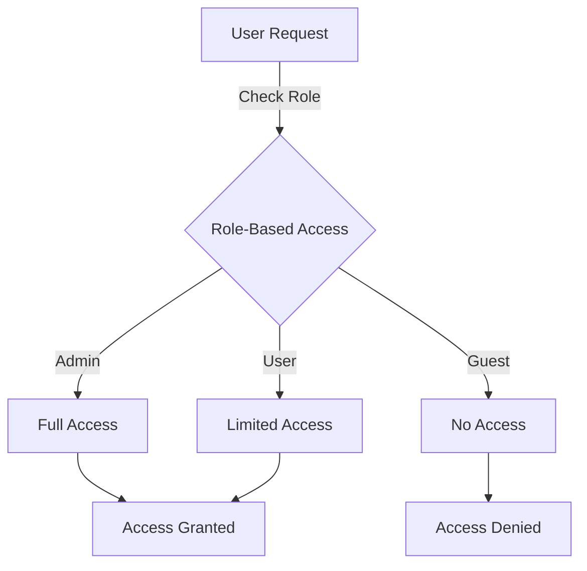

## 23.9. Handling Sensitive Information

In today's digital era, safeguarding sensitive information is paramount. As expert software engineers and architects, we must ensure that our Elixir applications are designed to protect user data, comply with regulations, and maintain trust. This section delves into the critical aspects of handling sensitive information, focusing on data privacy, minimization, and access control in Elixir applications.

### Introduction to Data Privacy

Data privacy is the practice of safeguarding personal information from unauthorized access and ensuring that users have control over their data. In the context of Elixir applications, this involves implementing robust security measures, adhering to legal requirements, and fostering transparency with users.

#### Complying with Regulations like GDPR

The General Data Protection Regulation (GDPR) is a comprehensive data protection law that imposes strict requirements on how organizations handle personal data. Compliance with GDPR is crucial for any application that processes data from EU citizens.

- **Data Processing Principles**: Ensure data is processed lawfully, fairly, and transparently. Collect data for specified, explicit, and legitimate purposes.
- **User Rights**: Provide users with rights to access, rectify, and erase their data. Implement mechanisms for data portability and the right to object.
- **Data Protection by Design**: Incorporate data protection measures into the design of your application. Use pseudonymization and encryption to protect data.
- **Data Breach Notifications**: Establish protocols for detecting, reporting, and investigating data breaches. Notify authorities and affected individuals promptly.

#### Implementing GDPR Compliance in Elixir

To achieve GDPR compliance in Elixir, we must integrate privacy-centric features into our applications. Consider the following strategies:

- **Data Mapping**: Identify and document the flow of personal data within your application. Use Elixir's pattern matching to track data usage and storage.
- **Consent Management**: Implement mechanisms to obtain and manage user consent. Use Elixir's functional programming capabilities to design flexible consent workflows.
- **Audit Trails**: Maintain logs of data processing activities. Leverage Elixir's logging libraries to create detailed audit trails.
- **Data Minimization**: Collect only the data necessary for your application's purposes. Use Elixir's data structures to efficiently manage and minimize data storage.

### Data Minimization in Elixir

Data minimization is the practice of limiting data collection to only what is necessary for a specific purpose. This principle not only enhances privacy but also reduces the risk of data breaches.

#### Collecting Only Necessary Data

When designing Elixir applications, it's essential to adopt a minimalist approach to data collection. Here are some best practices:

- **Define Clear Objectives**: Clearly define the purpose of data collection. Use Elixir's pattern matching and guards to enforce data validation rules.
- **Use Anonymization Techniques**: Anonymize data whenever possible. Elixir's powerful data transformation capabilities can help implement anonymization algorithms.
- **Regular Data Audits**: Conduct regular audits to review data collection practices. Use Elixir's metaprogramming features to automate audit processes.

#### Code Example: Implementing Data Minimization

```elixir
defmodule DataHandler do
  @moduledoc """
  A module for handling user data with minimization and privacy in mind.
  """

  @doc """
  Collects only necessary user data.
  """
  def collect_user_data(params) do
    # Pattern match to extract only necessary fields
    %{
      name: name,
      email: email
    } = params

    # Validate and process data
    validate_and_store_data(name, email)
  end

  defp validate_and_store_data(name, email) do
    # Ensure data meets validation criteria
    if valid_email?(email) do
      # Store data securely
      :ok = store_data(%{name: name, email: email})
    else
      {:error, "Invalid email"}
    end
  end

  defp valid_email?(email) do
    # Simple email validation
    String.contains?(email, "@")
  end

  defp store_data(data) do
    # Placeholder for secure data storage logic
    IO.puts("Storing data: #{inspect(data)}")
    :ok
  end
end
```

### Access Control in Elixir

Access control is the practice of restricting access to sensitive data within an application. It ensures that only authorized users can view or modify sensitive information.

#### Restricting Access to Sensitive Data

Implementing robust access control mechanisms is crucial for protecting sensitive data. Consider the following strategies:

- **Role-Based Access Control (RBAC)**: Assign roles to users and restrict access based on their roles. Use Elixir's pattern matching to enforce role-based permissions.
- **Attribute-Based Access Control (ABAC)**: Implement access control based on user attributes and environmental conditions. Elixir's functional programming paradigm can facilitate complex access control logic.
- **Audit and Monitor Access**: Continuously monitor access to sensitive data. Use Elixir's logging capabilities to track access attempts and generate alerts for suspicious activities.

#### Code Example: Implementing Role-Based Access Control

```elixir
defmodule AccessControl do
  @moduledoc """
  A module for managing access control using roles.
  """

  @roles %{admin: :all_access, user: :limited_access}

  @doc """
  Checks if a user has access to a resource based on their role.
  """
  def has_access?(user_role, resource) do
    case Map.get(@roles, user_role) do
      :all_access -> true
      :limited_access -> resource_accessible?(resource)
      _ -> false
    end
  end

  defp resource_accessible?(resource) do
    # Define logic for checking resource accessibility
    resource in [:public_data, :user_profile]
  end
end
```

### Visualizing Access Control with Mermaid.js

To better understand access control mechanisms, let's visualize a simple role-based access control (RBAC) system using Mermaid.js.


```mermaid
graph TD;
    A[User Request] -->|Check Role| B{Role-Based Access}
    B -->|Admin| C[Full Access]
    B -->|User| D[Limited Access]
    B -->|Guest| E[No Access]
    C --> F[Access Granted]
    D --> F
    E --> G[Access Denied]
```

**Caption**: Diagram illustrating a role-based access control system, where user requests are evaluated based on their roles to determine the level of access granted.

### Best Practices for Handling Sensitive Information

To effectively handle sensitive information in Elixir applications, adhere to the following best practices:

- **Encrypt Sensitive Data**: Use strong encryption algorithms to protect data at rest and in transit. Elixir's `:crypto` module provides robust encryption capabilities.
- **Implement Secure Authentication**: Use secure authentication mechanisms, such as OAuth2, to verify user identities. Elixir's `Guardian` library can facilitate secure authentication.
- **Regular Security Audits**: Conduct regular security audits to identify vulnerabilities. Use Elixir's testing frameworks to automate security testing.
- **Stay Informed**: Keep up-to-date with the latest security trends and best practices. Engage with the Elixir community to share knowledge and insights.

### Try It Yourself

Encourage experimentation by modifying the provided code examples to suit your application's needs. Consider implementing additional access control mechanisms or exploring different data minimization techniques.

### References and Further Reading

- [General Data Protection Regulation (GDPR)](https://gdpr.eu/)
- [Elixir's Crypto Module](https://hexdocs.pm/elixir/1.12/crypto.html)
- [Guardian Library for Authentication](https://github.com/ueberauth/guardian)

### Knowledge Check

- How does GDPR impact data handling practices in Elixir applications?
- What are the key principles of data minimization?
- How can role-based access control be implemented in Elixir?

### Embrace the Journey

Remember, handling sensitive information is an ongoing process. As you continue to develop your Elixir applications, prioritize data privacy, minimization, and access control. Keep experimenting, stay informed, and enjoy the journey of building secure and trustworthy applications.

## Quiz Time!



### What is the primary goal of data minimization?

- [x] To collect only necessary data for a specific purpose
- [ ] To collect as much data as possible for future use
- [ ] To anonymize all collected data
- [ ] To encrypt all data at rest

> **Explanation:** Data minimization focuses on collecting only the data necessary for a specific purpose, reducing the risk of data breaches and enhancing privacy.

### Which Elixir feature can be used to enforce role-based access control?

- [x] Pattern matching
- [ ] Anonymous functions
- [ ] ETS tables
- [ ] GenServer

> **Explanation:** Pattern matching in Elixir can be used to enforce role-based access control by matching user roles with predefined access rules.

### How does GDPR affect data processing?

- [x] It imposes strict requirements on data handling and user rights
- [ ] It allows organizations to process data without restrictions
- [ ] It only applies to non-EU countries
- [ ] It mandates the use of specific programming languages

> **Explanation:** GDPR imposes strict requirements on how organizations handle personal data, ensuring user rights and data protection.

### What is a key benefit of implementing access control?

- [x] Restricting unauthorized access to sensitive data
- [ ] Increasing data redundancy
- [ ] Enhancing data visualization
- [ ] Simplifying data storage

> **Explanation:** Access control restricts unauthorized access to sensitive data, ensuring that only authorized users can view or modify it.

### Which library can be used for secure authentication in Elixir?

- [x] Guardian
- [ ] Phoenix
- [ ] Ecto
- [ ] Plug

> **Explanation:** The Guardian library in Elixir can be used to implement secure authentication mechanisms, such as OAuth2.

### What is a common technique for protecting data at rest?

- [x] Encryption
- [ ] Data duplication
- [ ] Data visualization
- [ ] Data minimization

> **Explanation:** Encryption is a common technique used to protect data at rest by converting it into a secure format that can only be read with a decryption key.

### What should be included in a data breach notification protocol?

- [x] Reporting and investigating data breaches
- [ ] Increasing data collection
- [ ] Anonymizing all data
- [ ] Removing all access controls

> **Explanation:** A data breach notification protocol should include procedures for reporting and investigating data breaches, as well as notifying authorities and affected individuals.

### What is the role of audit trails in data privacy?

- [x] To maintain logs of data processing activities
- [ ] To increase data collection
- [ ] To anonymize user data
- [ ] To encrypt data in transit

> **Explanation:** Audit trails maintain logs of data processing activities, providing transparency and accountability in data handling practices.

### What is the purpose of using pseudonymization in data protection?

- [x] To protect data by replacing identifiable information with pseudonyms
- [ ] To encrypt data in transit
- [ ] To increase data redundancy
- [ ] To simplify data storage

> **Explanation:** Pseudonymization protects data by replacing identifiable information with pseudonyms, reducing the risk of re-identification while maintaining data utility.

### True or False: Data minimization can help reduce the risk of data breaches.

- [x] True
- [ ] False

> **Explanation:** True. By collecting only necessary data, data minimization reduces the amount of sensitive information at risk, thereby lowering the potential impact of data breaches.




