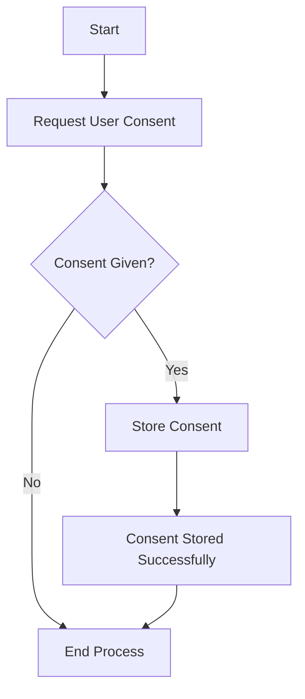
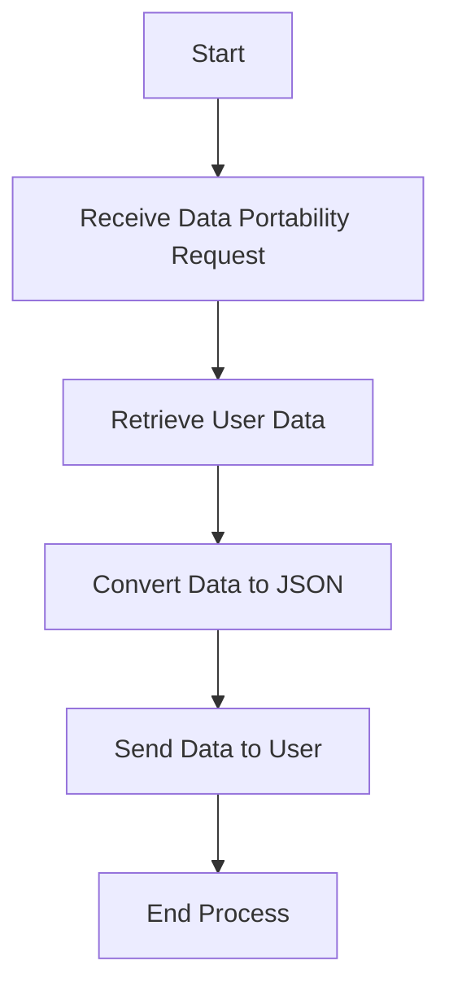

## 24.1. Understanding Compliance Requirements (e.g., GDPR, HIPAA)

In today's digital age, understanding compliance requirements is crucial for software engineers and architects. Regulations such as the General Data Protection Regulation (GDPR) and the Health Insurance Portability and Accountability Act (HIPAA) have set the standard for data protection and privacy. This section will guide you through the essential aspects of these regulations, focusing on their impact on software development, key obligations, and applicability.

### Data Protection Laws

Data protection laws are designed to safeguard personal information and ensure privacy. They are critical in maintaining trust between users and organizations. Let's delve into the two most prominent regulations affecting software applications: GDPR and HIPAA.

#### General Data Protection Regulation (GDPR)

The GDPR is a comprehensive data protection law enacted by the European Union (EU) in 2018. It aims to protect the personal data of EU citizens and residents, regardless of where the data is processed. Here are some key aspects:

- **Scope and Applicability**: GDPR applies to any organization that processes the personal data of EU citizens, regardless of the organization's location. This includes companies outside the EU that offer goods or services to EU citizens or monitor their behavior.

- **Key Principles**: GDPR is built on principles such as lawfulness, fairness, transparency, purpose limitation, data minimization, accuracy, storage limitation, integrity, and confidentiality.

- **Data Subject Rights**: GDPR grants individuals rights over their data, including the right to access, rectify, erase, restrict processing, data portability, and object to processing.

- **Penalties**: Non-compliance can result in hefty fines, up to €20 million or 4% of the company's global annual turnover, whichever is higher.

#### Health Insurance Portability and Accountability Act (HIPAA)

HIPAA is a U.S. law enacted in 1996 to protect sensitive patient health information. It applies to healthcare providers, health plans, and healthcare clearinghouses, as well as their business associates. Key components include:

- **Protected Health Information (PHI)**: HIPAA protects any information that can identify an individual and relates to their health condition, healthcare provision, or payment for healthcare.

- **Privacy Rule**: Establishes standards for the protection of PHI, ensuring that individuals' health information is properly protected while allowing the flow of health information needed to provide high-quality healthcare.

- **Security Rule**: Specifies safeguards to ensure the confidentiality, integrity, and availability of electronic PHI.

- **Breach Notification Rule**: Requires covered entities to notify affected individuals, the Secretary of Health and Human Services, and, in some cases, the media of a breach of unsecured PHI.

### Key Obligations

Understanding the key obligations under GDPR and HIPAA is essential for compliance. These obligations ensure that organizations handle personal data responsibly and transparently.

#### User Consent

Both GDPR and HIPAA emphasize the importance of obtaining user consent before processing personal data. Here's how they differ:

- **GDPR**: Consent must be freely given, specific, informed, and unambiguous. It requires a clear affirmative action, such as checking a box on a website. Organizations must also provide an easy way for individuals to withdraw consent.

- **HIPAA**: Consent is required for the use and disclosure of PHI for treatment, payment, and healthcare operations. However, HIPAA allows for certain uses and disclosures without consent, such as for public health activities and law enforcement purposes.

#### Data Portability

Data portability is a key right under GDPR, allowing individuals to obtain and reuse their personal data across different services. This right enables users to receive their data in a structured, commonly used, and machine-readable format and to transmit it to another data controller.

HIPAA does not explicitly address data portability, but it does require covered entities to provide individuals with access to their PHI upon request.

#### Right to be Forgotten

The right to be forgotten, or the right to erasure, is a fundamental aspect of GDPR. It allows individuals to request the deletion of their personal data when it is no longer necessary for the purposes for which it was collected, or if they withdraw consent.

HIPAA does not include a right to be forgotten, but it does allow individuals to request amendments to their PHI if they believe it is incorrect or incomplete.

### Applicability

Determining which laws apply to your application is crucial for compliance. Here are some factors to consider:

#### Geographic Scope

- **GDPR**: Applies to organizations that process the personal data of EU citizens, regardless of the organization's location. If your application targets EU users or monitors their behavior, GDPR compliance is necessary.

- **HIPAA**: Applies to U.S.-based healthcare providers, health plans, and healthcare clearinghouses, as well as their business associates. If your application handles PHI, HIPAA compliance is required.

#### Nature of Data

- **GDPR**: Covers all personal data, which is any information relating to an identified or identifiable person. This includes names, email addresses, IP addresses, and more.

- **HIPAA**: Specifically protects PHI, which includes any information that can identify an individual and relates to their health condition, healthcare provision, or payment for healthcare.

#### Business Model

- **GDPR**: If your business model involves processing personal data of EU citizens, GDPR compliance is necessary. This includes e-commerce platforms, social media networks, and data analytics companies.

- **HIPAA**: If your business model involves handling PHI, such as providing healthcare services or developing healthcare applications, HIPAA compliance is required.

### Code Examples

To illustrate how compliance can be integrated into software development, let's look at some Elixir code examples. These examples demonstrate how to handle user consent and data requests in a GDPR-compliant manner.

#### Obtaining User Consent

```elixir
defmodule ConsentManager do
  @moduledoc """
  Module for managing user consent.
  """

  @doc """
  Obtains user consent for data processing.
  """
  def obtain_consent(user_id, consent) do
    # Store consent in the database
    :ok = Database.store_consent(user_id, consent)
    {:ok, "Consent obtained successfully"}
  end

  @doc """
  Withdraws user consent.
  """
  def withdraw_consent(user_id) do
    # Remove consent from the database
    :ok = Database.remove_consent(user_id)
    {:ok, "Consent withdrawn successfully"}
  end
end
```

#### Handling Data Portability Requests

```elixir
defmodule DataPortability do
  @moduledoc """
  Module for handling data portability requests.
  """

  @doc """
  Exports user data in a machine-readable format.
  """
  def export_data(user_id) do
    # Retrieve user data from the database
    user_data = Database.get_user_data(user_id)

    # Convert data to JSON format
    json_data = Jason.encode!(user_data)

    {:ok, json_data}
  end
end
```

### Visualizing Compliance Processes

To better understand the compliance processes, let's visualize the flow of obtaining user consent and handling data portability requests using Mermaid.js diagrams.

#### User Consent Flowchart



*This flowchart illustrates the process of obtaining user consent, storing it, and ending the process.*

#### Data Portability Flowchart



*This flowchart shows the steps involved in handling a data portability request, from receiving the request to sending the data to the user.*

### References and Links

For further reading on GDPR and HIPAA compliance, consider the following resources:

- [GDPR Official Website](https://gdpr.eu/)
- [HIPAA Journal](https://www.hipaajournal.com/)
- [European Data Protection Board](https://edpb.europa.eu/)
- [U.S. Department of Health & Human Services](https://www.hhs.gov/hipaa/index.html)

### Knowledge Check

To reinforce your understanding of compliance requirements, consider the following questions:

- What are the key principles of GDPR?
- How does HIPAA define Protected Health Information (PHI)?
- What is the right to be forgotten, and how does it apply under GDPR?
- How can you determine which compliance regulations apply to your application?

### Embrace the Journey

Remember, understanding compliance requirements is just the beginning. As you continue to develop software applications, keep these regulations in mind to ensure data protection and privacy. Stay curious, keep learning, and enjoy the journey of building compliant and secure applications!

### Quiz: Understanding Compliance Requirements (e.g., GDPR, HIPAA)



### What is the primary goal of GDPR?

- [x] To protect the personal data of EU citizens
- [ ] To regulate healthcare data in the U.S.
- [ ] To establish trade agreements between countries
- [ ] To manage financial transactions

> **Explanation:** GDPR aims to protect the personal data of EU citizens, ensuring their privacy and data rights.

### Which of the following is a key principle of GDPR?

- [x] Data minimization
- [ ] Unlimited data retention
- [ ] Mandatory data sharing
- [ ] Data obfuscation

> **Explanation:** Data minimization is a key principle of GDPR, requiring organizations to collect only the data necessary for their purposes.

### What does HIPAA protect?

- [x] Protected Health Information (PHI)
- [ ] Financial data
- [ ] Intellectual property
- [ ] Trade secrets

> **Explanation:** HIPAA protects Protected Health Information (PHI), ensuring the privacy and security of health data.

### Which right allows individuals to request the deletion of their personal data under GDPR?

- [x] Right to be forgotten
- [ ] Right to access
- [ ] Right to portability
- [ ] Right to rectification

> **Explanation:** The right to be forgotten allows individuals to request the deletion of their personal data when it is no longer necessary.

### How does HIPAA differ from GDPR in terms of data portability?

- [x] HIPAA does not explicitly address data portability
- [ ] HIPAA requires data to be portable across all platforms
- [ ] HIPAA mandates data portability for financial data
- [ ] HIPAA enforces data portability for all personal data

> **Explanation:** HIPAA does not explicitly address data portability, unlike GDPR, which grants individuals the right to data portability.

### What is the penalty for non-compliance with GDPR?

- [x] Up to €20 million or 4% of global annual turnover
- [ ] A warning letter
- [ ] A small fine
- [ ] Temporary suspension of operations

> **Explanation:** Non-compliance with GDPR can result in fines up to €20 million or 4% of the company's global annual turnover.

### Which regulation applies to U.S.-based healthcare providers?

- [x] HIPAA
- [ ] GDPR
- [ ] CCPA
- [ ] PCI DSS

> **Explanation:** HIPAA applies to U.S.-based healthcare providers, protecting sensitive patient health information.

### What is the purpose of the HIPAA Privacy Rule?

- [x] To establish standards for the protection of PHI
- [ ] To regulate financial transactions
- [ ] To enforce trade agreements
- [ ] To manage intellectual property rights

> **Explanation:** The HIPAA Privacy Rule establishes standards for the protection of PHI, ensuring individuals' health information is properly protected.

### Which of the following is a requirement under the GDPR's right to be forgotten?

- [x] Deletion of personal data when no longer necessary
- [ ] Permanent retention of all data
- [ ] Sharing data with third parties
- [ ] Encrypting all data

> **Explanation:** The right to be forgotten requires the deletion of personal data when it is no longer necessary for the purposes it was collected.

### True or False: GDPR applies only to organizations within the EU.

- [ ] True
- [x] False

> **Explanation:** GDPR applies to any organization that processes the personal data of EU citizens, regardless of the organization's location.


