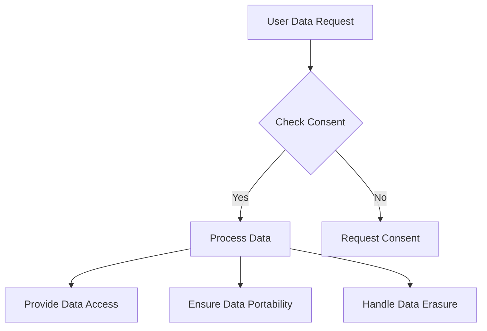

## 24.1. Understanding Compliance Requirements (e.g., GDPR, HIPAA)

In today's digital age, compliance with data protection laws is not just a legal obligation but a critical aspect of software development. As expert software engineers and architects, understanding these requirements is essential to ensure that your applications are not only functional but also secure and respectful of user privacy. In this section, we will delve into the intricacies of compliance requirements such as the General Data Protection Regulation (GDPR) and the Health Insurance Portability and Accountability Act (HIPAA), focusing on their relevance to Elixir applications.

### Data Protection Laws

Data protection laws are designed to safeguard personal information and ensure that individuals have control over their data. Two of the most significant regulations in this domain are GDPR and HIPAA.

#### Overview of Regulations Affecting Software Applications

1. **General Data Protection Regulation (GDPR):**
   - **Scope:** GDPR is a comprehensive data protection law that applies to all companies processing personal data of individuals residing in the European Union (EU), regardless of the company's location.
   - **Key Provisions:** It mandates data protection by design and by default, requires explicit user consent for data processing, and grants individuals rights such as data access, rectification, and erasure.

2. **Health Insurance Portability and Accountability Act (HIPAA):**
   - **Scope:** HIPAA applies to healthcare providers, health plans, and healthcare clearinghouses in the United States, as well as their business associates.
   - **Key Provisions:** It establishes standards for the protection of health information, ensuring confidentiality, integrity, and availability of electronic protected health information (ePHI).

3. **Other Notable Regulations:**
   - **California Consumer Privacy Act (CCPA):** Similar to GDPR, CCPA provides California residents with rights regarding their personal information.
   - **Personal Information Protection and Electronic Documents Act (PIPEDA):** Canada's federal privacy law for private-sector organizations.

### Key Obligations

Understanding the key obligations under these regulations is crucial for compliance. Let's explore some of the fundamental requirements that software applications must adhere to.

#### User Consent

- **GDPR:** Requires explicit and informed consent from users before processing their personal data. Consent must be freely given, specific, informed, and unambiguous.
- **HIPAA:** Consent is required for the use and disclosure of protected health information for purposes beyond treatment, payment, and healthcare operations.

#### Data Portability

- **GDPR:** Grants individuals the right to receive their personal data in a structured, commonly used, and machine-readable format, and to transmit it to another controller.
- **HIPAA:** While not explicitly called data portability, HIPAA allows individuals to request access to their health information and direct it to a third party.

#### Right to be Forgotten

- **GDPR:** Provides individuals with the right to have their personal data erased under certain conditions, such as when the data is no longer necessary for the purposes for which it was collected.
- **HIPAA:** Does not explicitly include a right to be forgotten, but individuals can request amendments to their health information.

### Applicability

Determining which laws apply to your application is a critical step in the compliance process. Here are some factors to consider:

1. **Geographical Reach:**
   - If your application processes data of EU residents, GDPR applies.
   - If your application involves healthcare data in the US, HIPAA is relevant.

2. **Nature of Data:**
   - Personal data under GDPR includes any information related to an identified or identifiable person.
   - Protected health information under HIPAA includes any information about health status, provision of healthcare, or payment for healthcare that can be linked to an individual.

3. **Business Model:**
   - Consider whether your application acts as a data controller or processor under GDPR, or as a covered entity or business associate under HIPAA.

### Ensuring Compliance in Elixir Applications

Elixir, with its robust features and functional programming paradigm, offers unique advantages in building compliant applications. Let's explore how you can leverage Elixir to meet compliance requirements.

#### Data Protection by Design and Default

Elixir's immutable data structures and functional nature inherently promote data protection by design. By minimizing side effects and ensuring that data transformations are explicit, Elixir helps in maintaining data integrity and security.

#### Implementing User Consent Mechanisms

Elixir's pattern matching and functional composition can be used to build clear and concise consent mechanisms. Here's a simple example of how you might implement a consent flow in Elixir:

```elixir
defmodule ConsentManager do
  @moduledoc """
  Module for managing user consent.
  """

  @doc """
  Checks if user consent is valid.
  """
  def valid_consent?(%{consent: true}), do: true
  def valid_consent?(_), do: false

  @doc """
  Processes user consent.
  """
  def process_consent(user_data) do
    if valid_consent?(user_data) do
      {:ok, "Consent valid"}
    else
      {:error, "Consent required"}
    end
  end
end

# Example usage
user_data = %{consent: true}
ConsentManager.process_consent(user_data)
```

#### Data Portability and Access

Elixir's powerful data manipulation capabilities can be leveraged to implement data portability features. Using libraries like Ecto, you can efficiently query and format data for export.

#### Handling Data Erasure Requests

Implementing the right to be forgotten in Elixir involves securely deleting user data. Elixir's pattern matching and error handling can be used to ensure that data is erased correctly and that any dependencies are managed.

### Visualizing Compliance Processes

To better understand the flow of compliance processes, let's visualize a typical GDPR compliance workflow using Mermaid.js:


```mermaid
flowchart TD
    A[User Data Request] --> B{Check Consent}
    B -- Yes --> C[Process Data]
    B -- No --> D[Request Consent]
    C --> E[Provide Data Access]
    C --> F[Ensure Data Portability]
    C --> G[Handle Data Erasure]
```

This diagram illustrates the decision-making process involved in handling user data requests, emphasizing the importance of consent and the various rights granted under GDPR.

### References and Links

- [GDPR Official Website](https://gdpr-info.eu/)
- [HIPAA Journal](https://www.hipaajournal.com/)
- [California Consumer Privacy Act (CCPA)](https://oag.ca.gov/privacy/ccpa)
- [Personal Information Protection and Electronic Documents Act (PIPEDA)](https://www.priv.gc.ca/en/privacy-topics/privacy-laws-in-canada/the-personal-information-protection-and-electronic-documents-act-pipeda/)

### Knowledge Check

- What are the key differences between GDPR and HIPAA?
- How can Elixir's functional programming paradigm aid in compliance?
- What are the implications of data portability for your application?

### Embrace the Journey

Remember, compliance is not a one-time task but an ongoing process. As you build and maintain your applications, keep user privacy and data protection at the forefront of your development practices. Stay informed about regulatory changes and continuously improve your compliance strategies. Keep experimenting, stay curious, and enjoy the journey of building secure and compliant applications!

## Quiz Time!



### What is the primary focus of GDPR?

- [x] Protecting personal data of EU residents
- [ ] Ensuring healthcare data security
- [ ] Regulating financial transactions
- [ ] Monitoring online activities

> **Explanation:** GDPR is focused on protecting the personal data of individuals residing in the EU.

### Which regulation applies to healthcare data in the United States?

- [ ] GDPR
- [x] HIPAA
- [ ] CCPA
- [ ] PIPEDA

> **Explanation:** HIPAA is the regulation that applies to healthcare data in the United States.

### What is a key requirement under GDPR for processing personal data?

- [x] Obtaining explicit user consent
- [ ] Encrypting all data
- [ ] Storing data in the cloud
- [ ] Using blockchain technology

> **Explanation:** GDPR requires explicit user consent for processing personal data.

### What does the right to be forgotten entail?

- [x] The ability to have personal data erased
- [ ] The right to access all stored data
- [ ] The right to transfer data to another service
- [ ] The ability to modify stored data

> **Explanation:** The right to be forgotten allows individuals to have their personal data erased under certain conditions.

### How can Elixir's functional nature aid in compliance?

- [x] By promoting data integrity and security
- [ ] By increasing application speed
- [ ] By simplifying user interfaces
- [ ] By reducing server costs

> **Explanation:** Elixir's functional nature promotes data integrity and security, aiding in compliance.

### What is data portability?

- [x] The right to receive personal data in a structured format
- [ ] The ability to delete all stored data
- [ ] The right to modify personal data
- [ ] The ability to encrypt data

> **Explanation:** Data portability is the right to receive personal data in a structured, commonly used, and machine-readable format.

### Which of the following is not a key obligation under GDPR?

- [ ] User consent
- [ ] Data portability
- [ ] Right to be forgotten
- [x] Mandatory cloud storage

> **Explanation:** Mandatory cloud storage is not a key obligation under GDPR.

### What is the scope of HIPAA?

- [ ] All companies processing EU data
- [x] Healthcare providers and associates in the US
- [ ] Financial institutions worldwide
- [ ] Online retailers in California

> **Explanation:** HIPAA applies to healthcare providers and their business associates in the United States.

### What is the significance of data protection by design?

- [x] It ensures data security is integrated into the development process
- [ ] It requires all data to be encrypted
- [ ] It mandates the use of specific programming languages
- [ ] It focuses on user interface design

> **Explanation:** Data protection by design ensures that data security is integrated into the development process from the outset.

### True or False: Compliance is a one-time task.

- [ ] True
- [x] False

> **Explanation:** Compliance is an ongoing process that requires continuous attention and adaptation.




