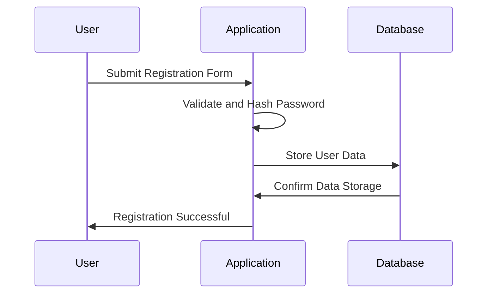

## 24.2. Data Protection and Privacy in Elixir Applications

In today's digital landscape, data protection and privacy have become paramount concerns for software developers and architects. As Elixir developers, we must ensure that our applications not only comply with legal regulations but also uphold the highest standards of data security and user privacy. In this section, we will explore key concepts and strategies for implementing data protection and privacy in Elixir applications, focusing on privacy by design, data minimization, and anonymization techniques.

### Privacy by Design

Privacy by Design is a proactive approach to embedding privacy into the design and architecture of information systems. This concept emphasizes the importance of considering privacy at every stage of the development process, from initial design to deployment and beyond.

#### Key Principles of Privacy by Design

1. **Proactive not Reactive; Preventative not Remedial**: Anticipate and prevent privacy-invasive events before they happen.
2. **Privacy as the Default Setting**: Ensure that personal data is automatically protected in any given IT system or business practice.
3. **Privacy Embedded into Design**: Integrate privacy into the design and architecture of IT systems and business practices.
4. **Full Functionality—Positive-Sum, not Zero-Sum**: Achieve both privacy and security without compromising functionality.
5. **End-to-End Security—Full Lifecycle Protection**: Secure data throughout its entire lifecycle, from collection to deletion.
6. **Visibility and Transparency**: Maintain transparency to users and stakeholders, ensuring that data practices are open and verifiable.
7. **Respect for User Privacy**: Keep user interests at the forefront, offering strong privacy defaults and user-friendly options.

#### Implementing Privacy by Design in Elixir

To implement Privacy by Design in Elixir applications, consider the following strategies:

- **Conduct Privacy Impact Assessments (PIAs)**: Evaluate the potential privacy risks associated with your application and identify measures to mitigate them.
- **Incorporate Privacy Features Early**: Integrate privacy features such as data encryption, access controls, and audit logs from the outset.
- **Adopt Secure Coding Practices**: Follow secure coding guidelines to prevent vulnerabilities that could compromise user data.
- **Use Elixir's Functional Paradigm**: Leverage Elixir's functional programming features to create immutable data structures, reducing the risk of unintended data modifications.

### Data Minimization

Data minimization is the practice of collecting and processing only the data that is strictly necessary for a specific purpose. This principle not only enhances privacy but also reduces the risk of data breaches and non-compliance with data protection regulations.

#### Strategies for Data Minimization

1. **Define Clear Data Requirements**: Identify the minimum data necessary to achieve your application's goals.
2. **Limit Data Collection**: Collect only the data you need and avoid gathering unnecessary information.
3. **Implement Data Retention Policies**: Establish policies for retaining data only as long as necessary and securely deleting it when no longer needed.
4. **Regularly Review Data Practices**: Continuously assess and update your data collection and processing practices to ensure compliance with data minimization principles.

#### Implementing Data Minimization in Elixir

In Elixir applications, data minimization can be achieved through:

- **Ecto Schemas**: Define schemas that include only the necessary fields for your application's functionality.
- **Data Validation**: Use Ecto changesets to validate and sanitize incoming data, ensuring that only required information is processed.
- **Selective Data Storage**: Store only essential data in your database, using techniques like encryption and hashing to protect sensitive information.

### Anonymization and Pseudonymization

Anonymization and pseudonymization are techniques used to protect user identities by transforming personal data in such a way that it cannot be attributed to a specific individual without additional information.

#### Anonymization

Anonymization involves removing or altering personal identifiers from data sets, making it impossible to identify individuals. This process is irreversible, meaning that once data is anonymized, it cannot be re-identified.

#### Pseudonymization

Pseudonymization replaces personal identifiers with pseudonyms or artificial identifiers. Unlike anonymization, pseudonymization is reversible, allowing data to be re-identified if necessary by using additional information.

#### Implementing Anonymization and Pseudonymization in Elixir

To implement these techniques in Elixir applications:

- **Use Cryptographic Hashing**: Apply cryptographic hashing algorithms to transform personal identifiers into pseudonyms.
- **Implement Data Masking**: Mask sensitive data fields to prevent unauthorized access while maintaining data utility.
- **Leverage Elixir Libraries**: Utilize Elixir libraries such as `cloak` for encryption and `ex_crypto` for cryptographic operations.

### Code Examples

Let's explore some practical code examples to illustrate these concepts in Elixir applications.

#### Privacy by Design: Secure Data Handling

```elixir
defmodule MyApp.User do
  use Ecto.Schema
  import Ecto.Changeset

  schema "users" do
    field :email, :string
    field :password_hash, :string
    field :name, :string
    field :phone_number, :string
    timestamps()
  end

  @doc """
  Creates a changeset for user registration.
  """
  def registration_changeset(user, attrs) do
    user
    |> cast(attrs, [:email, :password, :name, :phone_number])
    |> validate_required([:email, :password])
    |> validate_format(:email, ~r/@/)
    |> validate_length(:password, min: 6)
    |> hash_password()
  end

  defp hash_password(changeset) do
    if password = get_change(changeset, :password) do
      put_change(changeset, :password_hash, Bcrypt.hash_pwd_salt(password))
    else
      changeset
    end
  end
end
```

In this example, we ensure that user passwords are hashed before storing them in the database, enhancing data security and privacy.

#### Data Minimization: Selective Data Storage

```elixir
defmodule MyApp.Order do
  use Ecto.Schema
  import Ecto.Changeset

  schema "orders" do
    field :product_id, :integer
    field :quantity, :integer
    field :total_price, :decimal
    field :customer_id, :integer
    timestamps()
  end

  @doc """
  Creates a changeset for order creation.
  """
  def changeset(order, attrs) do
    order
    |> cast(attrs, [:product_id, :quantity, :total_price])
    |> validate_required([:product_id, :quantity, :total_price])
    |> validate_number(:quantity, greater_than: 0)
  end
end
```

Here, we define an Ecto schema for orders that includes only the necessary fields, adhering to data minimization principles.

#### Anonymization: Data Masking

```elixir
defmodule MyApp.Anonymizer do
  @moduledoc """
  Provides functions for anonymizing user data.
  """

  @doc """
  Masks the email address by replacing the domain with asterisks.
  """
  def mask_email(email) do
    [local_part, _domain] = String.split(email, "@")
    "#{local_part}@****.com"
  end
end
```

This function demonstrates a simple approach to anonymizing email addresses by masking the domain.

### Visualizing Data Protection Strategies

To better understand the flow of data protection strategies in Elixir applications, let's visualize the process using a sequence diagram.



**Figure 1: Data Protection Flow in User Registration**

This diagram illustrates the sequence of actions taken to protect user data during the registration process, highlighting the importance of validation and hashing.

### References and Further Reading

- [Privacy by Design: The 7 Foundational Principles](https://www.ipc.on.ca/privacy-by-design/)
- [Ecto: A Database Wrapper and Query Generator for Elixir](https://hexdocs.pm/ecto/Ecto.html)
- [Elixir Cloak: Encryption and Decryption Library](https://hexdocs.pm/cloak/readme.html)
- [ExCrypto: Cryptographic Functions for Elixir](https://hexdocs.pm/ex_crypto/readme.html)

### Knowledge Check

- What are the key principles of Privacy by Design?
- How can data minimization be implemented in Elixir applications?
- What is the difference between anonymization and pseudonymization?

### Embrace the Journey

Remember, data protection and privacy are ongoing processes that require continuous attention and improvement. As Elixir developers, we have the tools and frameworks necessary to build secure and privacy-conscious applications. Keep exploring, stay informed about the latest privacy regulations, and enjoy the journey of creating trustworthy software solutions.

### Quiz: Data Protection and Privacy in Elixir Applications



### What is the primary goal of Privacy by Design?

- [x] To embed privacy into the design and architecture of systems
- [ ] To react to privacy breaches after they occur
- [ ] To prioritize functionality over privacy
- [ ] To collect as much data as possible

> **Explanation:** Privacy by Design aims to integrate privacy considerations into the design and architecture of systems from the outset.

### Which of the following is a key principle of data minimization?

- [x] Collect only the data necessary for a specific purpose
- [ ] Store data indefinitely
- [ ] Collect as much data as possible
- [ ] Share data with third parties without restriction

> **Explanation:** Data minimization involves collecting only the data necessary for a specific purpose and avoiding unnecessary data collection.

### What is the difference between anonymization and pseudonymization?

- [x] Anonymization is irreversible, while pseudonymization is reversible
- [ ] Anonymization is reversible, while pseudonymization is irreversible
- [ ] Both are irreversible
- [ ] Both are reversible

> **Explanation:** Anonymization is irreversible, meaning data cannot be re-identified, while pseudonymization is reversible, allowing data to be re-identified if necessary.

### How can Elixir's functional paradigm enhance data protection?

- [x] By creating immutable data structures
- [ ] By allowing mutable data structures
- [ ] By encouraging data sharing
- [ ] By disabling encryption

> **Explanation:** Elixir's functional paradigm promotes the use of immutable data structures, reducing the risk of unintended data modifications.

### Which Elixir library can be used for encryption and decryption?

- [x] Cloak
- [ ] Ecto
- [ ] Phoenix
- [ ] Plug

> **Explanation:** Cloak is an Elixir library used for encryption and decryption operations.

### What is the purpose of a Privacy Impact Assessment (PIA)?

- [x] To evaluate potential privacy risks and identify mitigation measures
- [ ] To increase data collection
- [ ] To eliminate all privacy features
- [ ] To prioritize functionality over privacy

> **Explanation:** A Privacy Impact Assessment (PIA) evaluates potential privacy risks and identifies measures to mitigate them.

### What is a common technique for anonymizing data?

- [x] Data masking
- [ ] Data sharing
- [ ] Data duplication
- [ ] Data retention

> **Explanation:** Data masking is a common technique for anonymizing data by obscuring sensitive information.

### How can data retention policies enhance data protection?

- [x] By ensuring data is retained only as long as necessary
- [ ] By storing data indefinitely
- [ ] By sharing data with third parties
- [ ] By collecting unnecessary data

> **Explanation:** Data retention policies ensure that data is retained only as long as necessary, enhancing data protection.

### What is the role of Ecto in data minimization?

- [x] To define schemas with only necessary fields
- [ ] To collect as much data as possible
- [ ] To store data indefinitely
- [ ] To share data with third parties

> **Explanation:** Ecto helps define schemas with only the necessary fields, supporting data minimization principles.

### True or False: Anonymization is a reversible process.

- [ ] True
- [x] False

> **Explanation:** Anonymization is an irreversible process, meaning that once data is anonymized, it cannot be re-identified.



By understanding and implementing these data protection and privacy strategies, we can build Elixir applications that not only comply with legal requirements but also earn the trust of our users. Keep these principles in mind as you continue to develop secure and privacy-conscious software solutions.
