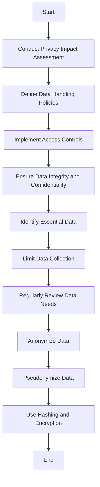

## 24.2. Data Protection and Privacy in Elixir Applications

In today's digital landscape, data protection and privacy have become paramount concerns for developers and organizations alike. Elixir, with its robust functional programming paradigm and powerful concurrency model, offers unique opportunities to implement effective data protection strategies. In this section, we'll explore how to leverage Elixir's features to build applications that prioritize data privacy and adhere to regulatory requirements.

### Privacy by Design

Privacy by Design (PbD) is a proactive approach that integrates privacy considerations into the development process from the outset. This principle ensures that privacy is not an afterthought but a core component of the application architecture. Let's delve into how we can implement Privacy by Design in Elixir applications.

#### Incorporating Privacy Considerations from the Start

To effectively incorporate privacy considerations, we must:

1. **Conduct Privacy Impact Assessments (PIAs):** Before starting the development process, conduct PIAs to identify potential privacy risks and design mitigation strategies.
2. **Define Data Handling Policies:** Clearly define how data will be collected, used, stored, and shared. Ensure these policies comply with relevant regulations such as GDPR or CCPA.
3. **Implement Access Controls:** Use Elixir's robust pattern matching and guard clauses to enforce access controls, ensuring that only authorized users can access sensitive data.
4. **Ensure Data Integrity and Confidentiality:** Use cryptographic techniques to protect data integrity and confidentiality. Elixir's `:crypto` module can be leveraged for encryption and hashing functions.

#### Code Example: Implementing Access Controls

Here's a simple example of how to implement access controls using pattern matching in Elixir:

```elixir
defmodule UserAccess do
  def access_data(user_role, data) do
    case user_role do
      :admin -> {:ok, data}
      :user -> {:error, "Access denied"}
      _ -> {:error, "Invalid role"}
    end
  end
end

# Usage
IO.inspect(UserAccess.access_data(:admin, "Sensitive Data")) # {:ok, "Sensitive Data"}
IO.inspect(UserAccess.access_data(:user, "Sensitive Data"))  # {:error, "Access denied"}
```

### Data Minimization

Data minimization is a principle that advocates for collecting only the data necessary for a specific purpose. This reduces the risk of data breaches and enhances user privacy.

#### Collecting Only Necessary Data

To implement data minimization:

1. **Identify Essential Data:** Determine the minimum data required to achieve your application's objectives.
2. **Limit Data Collection:** Use Elixir's pattern matching to filter out unnecessary data during the collection process.
3. **Regularly Review Data Needs:** Continuously assess whether the data being collected is still necessary and relevant.

#### Code Example: Filtering Data

Let's see how we can use pattern matching to filter out unnecessary data:

```elixir
defmodule DataFilter do
  def filter_data(data) do
    Enum.filter(data, fn {key, _value} -> key in [:name, :email] end)
  end
end

# Usage
data = [name: "Alice", email: "alice@example.com", age: 30, address: "123 Main St"]
IO.inspect(DataFilter.filter_data(data)) # [name: "Alice", email: "alice@example.com"]
```

### Anonymization and Pseudonymization

Anonymization and pseudonymization are techniques used to protect user identities by transforming personal data into a form that cannot be easily traced back to an individual.

#### Techniques to Protect User Identities

1. **Anonymization:** Remove personally identifiable information (PII) from datasets to prevent the identification of individuals.
2. **Pseudonymization:** Replace PII with pseudonyms or tokens, allowing data to be re-identified if necessary, under strict controls.
3. **Use Hashing and Encryption:** Utilize Elixir's `:crypto` module to hash or encrypt sensitive data, ensuring it remains secure even if accessed by unauthorized parties.

#### Code Example: Anonymizing Data

Here's an example of how to anonymize data using hashing:

```elixir
defmodule DataAnonymizer do
  def anonymize(data) do
    Enum.map(data, fn {key, value} ->
      if key in [:name, :email] do
        {key, :crypto.hash(:sha256, value) |> Base.encode16()}
      else
        {key, value}
      end
    end)
  end
end

# Usage
data = [name: "Alice", email: "alice@example.com", age: 30]
IO.inspect(DataAnonymizer.anonymize(data))
```

### Visualizing Data Protection Processes

To further understand these concepts, let's visualize the data protection processes using a flowchart.


```mermaid
graph TD;
    A[Start] --> B[Conduct Privacy Impact Assessment];
    B --> C[Define Data Handling Policies];
    C --> D[Implement Access Controls];
    D --> E[Ensure Data Integrity and Confidentiality];
    E --> F[Identify Essential Data];
    F --> G[Limit Data Collection];
    G --> H[Regularly Review Data Needs];
    H --> I[Anonymize Data];
    I --> J[Pseudonymize Data];
    J --> K[Use Hashing and Encryption];
    K --> L[End];
```

### Elixir's Unique Features for Data Protection

Elixir offers several unique features that can be leveraged for data protection and privacy:

1. **Immutable Data Structures:** Elixir's immutable data structures ensure that once data is created, it cannot be altered, reducing the risk of accidental data leaks or modifications.
2. **Concurrency Model:** Elixir's actor-based concurrency model allows for efficient and secure handling of data across multiple processes.
3. **Pattern Matching and Guards:** These features enable precise data filtering and validation, ensuring only authorized access to sensitive information.

### Differences and Similarities with Other Languages

While many programming languages offer data protection features, Elixir's functional programming paradigm and concurrency model provide distinct advantages:

- **Functional vs. Object-Oriented:** Unlike object-oriented languages, Elixir's functional approach emphasizes immutability and statelessness, which inherently supports data protection.
- **Concurrency Model:** Elixir's lightweight processes and message-passing model offer superior scalability and fault tolerance compared to traditional threading models.

### Design Considerations

When implementing data protection and privacy in Elixir applications, consider the following:

- **Regulatory Compliance:** Ensure your application complies with relevant data protection regulations such as GDPR, CCPA, or HIPAA.
- **Performance Impact:** Balance the need for data protection with application performance, especially when using cryptographic techniques.
- **User Experience:** Design privacy features that enhance, rather than hinder, the user experience.

### Try It Yourself

To deepen your understanding of these concepts, try modifying the code examples provided:

- Experiment with different data structures and access control mechanisms.
- Implement additional data protection techniques, such as encryption and pseudonymization.
- Test the performance impact of various data protection strategies.

### References and Further Reading

For more information on data protection and privacy in Elixir applications, consider the following resources:

- [GDPR Compliance](https://gdpr.eu/)
- [CCPA Overview](https://oag.ca.gov/privacy/ccpa)
- [Elixir's Crypto Module](https://hexdocs.pm/crypto/)

### Knowledge Check

To reinforce your understanding of data protection and privacy in Elixir applications, consider the following questions:

- How can pattern matching be used to enforce access controls?
- What are the benefits of data minimization?
- How do anonymization and pseudonymization differ?

### Embrace the Journey

Remember, data protection and privacy are ongoing processes. As you continue to develop Elixir applications, keep privacy considerations at the forefront of your design decisions. Stay informed about evolving regulations and best practices, and always strive to build applications that respect and protect user privacy.

## Quiz Time!



### What is Privacy by Design?

- [x] A proactive approach to integrating privacy into the development process
- [ ] A method for encrypting data at rest
- [ ] A technique for anonymizing user data
- [ ] A legal requirement for data protection

> **Explanation:** Privacy by Design is a proactive approach that integrates privacy considerations into the development process from the outset.

### What is the primary goal of data minimization?

- [x] To collect only the data necessary for a specific purpose
- [ ] To encrypt all collected data
- [ ] To anonymize user identities
- [ ] To comply with GDPR regulations

> **Explanation:** Data minimization aims to collect only the data necessary for a specific purpose, reducing the risk of data breaches and enhancing user privacy.

### How does anonymization differ from pseudonymization?

- [x] Anonymization removes personally identifiable information, while pseudonymization replaces it with pseudonyms
- [ ] Anonymization encrypts data, while pseudonymization hashes data
- [ ] Anonymization is reversible, while pseudonymization is not
- [ ] Anonymization is a legal requirement, while pseudonymization is optional

> **Explanation:** Anonymization removes personally identifiable information, while pseudonymization replaces it with pseudonyms, allowing data to be re-identified if necessary.

### Which Elixir feature helps ensure data integrity and confidentiality?

- [x] The `:crypto` module
- [ ] The `Enum` module
- [ ] The `String` module
- [ ] The `IO` module

> **Explanation:** Elixir's `:crypto` module provides cryptographic functions to ensure data integrity and confidentiality.

### What is a benefit of Elixir's immutable data structures?

- [x] They reduce the risk of accidental data leaks or modifications
- [ ] They increase the speed of data processing
- [ ] They allow for dynamic data changes
- [ ] They simplify data serialization

> **Explanation:** Elixir's immutable data structures ensure that once data is created, it cannot be altered, reducing the risk of accidental data leaks or modifications.

### What does the `access_data` function in the code example demonstrate?

- [x] Implementing access controls using pattern matching
- [ ] Encrypting sensitive data
- [ ] Anonymizing user identities
- [ ] Collecting user data

> **Explanation:** The `access_data` function demonstrates how to implement access controls using pattern matching in Elixir.

### How can pattern matching be used in data protection?

- [x] By filtering out unnecessary data during collection
- [ ] By encrypting sensitive information
- [ ] By anonymizing user identities
- [ ] By logging user access

> **Explanation:** Pattern matching can be used to filter out unnecessary data during collection, ensuring only essential data is retained.

### What is the purpose of a Privacy Impact Assessment (PIA)?

- [x] To identify potential privacy risks and design mitigation strategies
- [ ] To encrypt user data
- [ ] To anonymize user identities
- [ ] To comply with GDPR regulations

> **Explanation:** A Privacy Impact Assessment (PIA) is conducted to identify potential privacy risks and design mitigation strategies before starting the development process.

### What does pseudonymization allow for?

- [x] Data re-identification under strict controls
- [ ] Complete removal of personally identifiable information
- [ ] Encryption of sensitive data
- [ ] Logging of user access

> **Explanation:** Pseudonymization replaces PII with pseudonyms or tokens, allowing data to be re-identified if necessary, under strict controls.

### True or False: Elixir's concurrency model offers superior scalability compared to traditional threading models.

- [x] True
- [ ] False

> **Explanation:** Elixir's actor-based concurrency model, with lightweight processes and message-passing, offers superior scalability and fault tolerance compared to traditional threading models.




