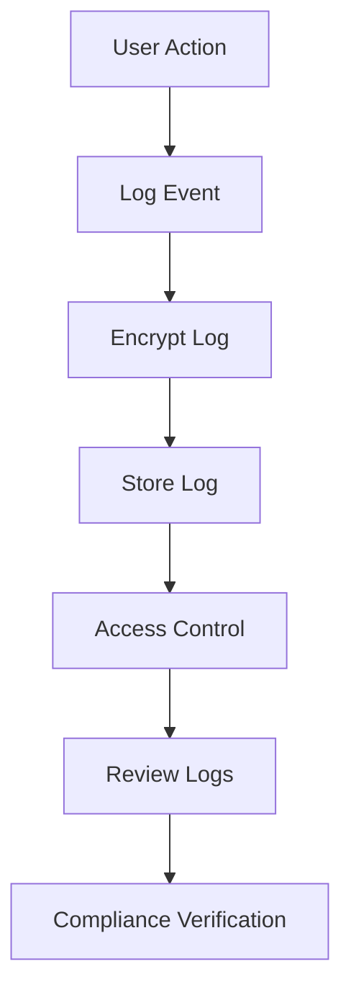

## 24.3. Audit Logging and Monitoring

In today's digital landscape, ensuring the security and compliance of software systems is paramount. Audit logging and monitoring are critical components in achieving these goals. In this section, we will delve into the concepts of audit logging and monitoring within Elixir applications, focusing on creating audit trails, securing logs, and verifying compliance.

### Creating Audit Trails

Audit trails are essential for recording user actions and system events, providing accountability and traceability. They serve as a historical record of activities, which can be invaluable during security investigations or compliance audits.

#### Key Concepts in Audit Trails

- **Event Recording**: Capture significant events such as user logins, data access, and configuration changes.
- **User Identification**: Ensure that each action is associated with a specific user or system entity.
- **Timestamping**: Record the exact time of each event to establish a chronological order.
- **Data Integrity**: Maintain the accuracy and consistency of audit logs over time.

#### Implementing Audit Trails in Elixir

To implement audit trails in Elixir, we can leverage its robust logging capabilities and functional programming paradigms. Here's a step-by-step guide:

1. **Define the Events to Log**: Identify the critical events that need to be captured. This could include user authentication, data modifications, and system errors.

2. **Use Elixir's Logger Module**: Elixir provides a built-in `Logger` module that can be used to log events. Configure the logger to capture the necessary details.

   ```elixir
   require Logger

   defmodule AuditLogger do
     def log_event(user_id, action, details) do
       Logger.info("User #{user_id} performed #{action}: #{inspect(details)}")
     end
   end
   ```

3. **Store Logs Securely**: Ensure that logs are stored in a secure and tamper-proof manner. Consider using a database or a dedicated logging service.

4. **Implement Access Controls**: Restrict access to audit logs to authorized personnel only. Use role-based access control (RBAC) to manage permissions.

5. **Regularly Review Logs**: Set up processes to review and analyze logs regularly. This helps in identifying suspicious activities and ensuring compliance.

### Securing Logs

Securing logs is crucial to protect their integrity and confidentiality. Unauthorized access or tampering with logs can undermine their reliability and the trustworthiness of the audit trail.

#### Strategies for Securing Logs

- **Encryption**: Encrypt logs both at rest and in transit to prevent unauthorized access.
- **Integrity Checks**: Use checksums or hashes to detect any unauthorized modifications to log files.
- **Access Controls**: Implement strict access controls to ensure that only authorized users can view or modify logs.
- **Log Rotation**: Regularly rotate logs to prevent them from growing too large and becoming unmanageable.

#### Implementing Log Security in Elixir

Elixir's ecosystem provides several tools and libraries to enhance log security. Here's how you can implement these strategies:

1. **Encrypt Logs**: Use libraries like `cloak` to encrypt sensitive log data before storing it.

   ```elixir
   defmodule SecureLogger do
     use Cloak.Ecto, repo: MyApp.Repo

     def encrypt_log(data) do
       {:ok, encrypted_data} = Cloak.encrypt(data)
       # Store encrypted_data in the log
     end
   end
   ```

2. **Integrity Verification**: Generate a hash for each log entry and store it alongside the log. Verify the hash during log retrieval to ensure integrity.

   ```elixir
   defmodule LogIntegrity do
     def hash_log_entry(entry) do
       :crypto.hash(:sha256, entry)
     end

     def verify_log_entry(entry, hash) do
       hash == :crypto.hash(:sha256, entry)
     end
   end
   ```

3. **Implement Access Controls**: Use Elixir's `Plug` library to enforce access controls on log endpoints.

   ```elixir
   defmodule LogAccessPlug do
     import Plug.Conn

     def init(default), do: default

     def call(conn, _opts) do
       if authorized?(conn) do
         conn
       else
         conn
         |> send_resp(403, "Forbidden")
         |> halt()
       end
     end

     defp authorized?(conn) do
       # Implement authorization logic
     end
   end
   ```

4. **Log Rotation**: Use tools like `logrotate` or implement custom logic to rotate logs periodically.

### Compliance Verification

Audit logs play a crucial role in demonstrating compliance with regulatory requirements. They provide evidence of adherence to policies and procedures during audits.

#### Using Logs for Compliance

- **Regulatory Requirements**: Understand the specific logging requirements of regulations such as GDPR, HIPAA, or PCI-DSS.
- **Audit Readiness**: Ensure that logs are readily available and easily accessible for audits.
- **Retention Policies**: Implement log retention policies that comply with regulatory requirements.

#### Implementing Compliance Verification in Elixir

1. **Understand Regulatory Requirements**: Familiarize yourself with the logging requirements of relevant regulations.

2. **Automate Compliance Checks**: Use tools like `credo` or `dialyzer` to automate compliance checks and ensure that your logging practices meet regulatory standards.

3. **Maintain Audit Readiness**: Regularly review and update your logging practices to ensure audit readiness.

4. **Implement Retention Policies**: Use Elixir's `Task` module to automate log retention and deletion processes.

   ```elixir
   defmodule LogRetention do
     def start_cleanup_task do
       Task.start(fn -> cleanup_old_logs() end)
     end

     defp cleanup_old_logs do
       # Implement log cleanup logic
     end
   end
   ```

### Visualizing Audit Logging and Monitoring

To better understand the flow of audit logging and monitoring, let's visualize the process using a Mermaid.js diagram.



**Diagram Description**: This flowchart illustrates the process of audit logging and monitoring. It starts with a user action, which triggers a log event. The log is then encrypted and stored securely. Access controls are applied to restrict unauthorized access. Logs are regularly reviewed, and compliance verification is conducted to ensure adherence to regulatory requirements.

### Try It Yourself

Now that we've explored the concepts of audit logging and monitoring, it's time to put them into practice. Try modifying the code examples provided to suit your application's needs. Experiment with different logging strategies and security measures to find the best fit for your system.

### Knowledge Check

- What are the key components of an audit trail?
- How can you ensure the integrity of audit logs?
- What are some common regulatory requirements for logging?
- How can Elixir's functional programming features enhance logging practices?

### Embrace the Journey

Remember, mastering audit logging and monitoring is an ongoing journey. As you continue to develop your skills, you'll gain a deeper understanding of how to secure your applications and ensure compliance. Keep experimenting, stay curious, and enjoy the process!

### References and Links

- [Elixir Logger Documentation](https://hexdocs.pm/logger/Logger.html)
- [Cloak Encryption Library](https://hexdocs.pm/cloak/Cloak.html)
- [GDPR Compliance Guidelines](https://gdpr-info.eu/)
- [HIPAA Compliance Guidelines](https://www.hhs.gov/hipaa/index.html)

## Quiz: Audit Logging and Monitoring



### What is the primary purpose of audit trails?

- [x] Recording user actions for accountability
- [ ] Enhancing application performance
- [ ] Reducing application size
- [ ] Improving user interface design

> **Explanation:** Audit trails are primarily used to record user actions and system events for accountability and traceability.

### Which Elixir module is commonly used for logging events?

- [x] Logger
- [ ] Plug
- [ ] Ecto
- [ ] Phoenix

> **Explanation:** The `Logger` module in Elixir is used for logging events and messages.

### How can you ensure the integrity of audit logs?

- [x] Use checksums or hashes
- [ ] Store logs in plain text
- [ ] Allow unrestricted access
- [ ] Disable encryption

> **Explanation:** Using checksums or hashes helps detect unauthorized modifications to log files, ensuring their integrity.

### What is a key strategy for securing logs?

- [x] Encrypt logs both at rest and in transit
- [ ] Store logs in a public directory
- [ ] Share logs with all users
- [ ] Disable log rotation

> **Explanation:** Encrypting logs both at rest and in transit prevents unauthorized access and ensures confidentiality.

### Which tool can be used for automating compliance checks in Elixir?

- [x] Credo
- [ ] Phoenix
- [ ] Ecto
- [ ] Plug

> **Explanation:** `Credo` is a static code analysis tool that can help automate compliance checks in Elixir applications.

### What is the role of access controls in log security?

- [x] Restrict unauthorized access to logs
- [ ] Increase log file size
- [ ] Enhance log readability
- [ ] Reduce log retention time

> **Explanation:** Access controls are used to restrict unauthorized access to logs, ensuring that only authorized personnel can view or modify them.

### How can you automate log retention and deletion processes in Elixir?

- [x] Use the Task module
- [ ] Use the Plug module
- [ ] Use the Phoenix module
- [ ] Use the Ecto module

> **Explanation:** The `Task` module in Elixir can be used to automate log retention and deletion processes.

### What is a common regulatory requirement for logging?

- [x] Implement log retention policies
- [ ] Store logs in plain text
- [ ] Allow unrestricted access
- [ ] Disable encryption

> **Explanation:** Implementing log retention policies is a common regulatory requirement to ensure that logs are retained for a specified period.

### How can you enhance the security of log data?

- [x] Encrypt sensitive log data
- [ ] Store logs in a public directory
- [ ] Share logs with all users
- [ ] Disable log rotation

> **Explanation:** Encrypting sensitive log data enhances security by preventing unauthorized access.

### True or False: Audit logs can be used to demonstrate compliance during audits.

- [x] True
- [ ] False

> **Explanation:** Audit logs provide evidence of adherence to policies and procedures, making them valuable for demonstrating compliance during audits.


