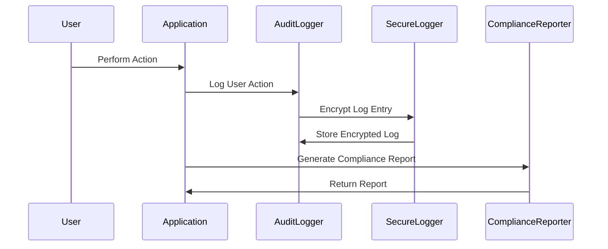

## 24.3. Audit Logging and Monitoring

In today's rapidly evolving digital landscape, maintaining accountability, ensuring compliance, and safeguarding security are paramount. Audit logging and monitoring in Elixir applications play a crucial role in achieving these objectives. This comprehensive guide will delve into the intricacies of creating audit trails, securing logs, and leveraging them for compliance verification. As expert software engineers and architects, understanding these concepts is essential for building robust and trustworthy systems.

### Creating Audit Trails

Audit trails are a fundamental aspect of any system that requires accountability and traceability. They provide a chronological record of user actions, system events, and other relevant activities. In Elixir, creating audit trails involves capturing detailed information about operations performed within an application.

#### Recording User Actions for Accountability

To effectively record user actions, it is essential to identify the key events that need to be logged. These events may include user logins, data modifications, access to sensitive information, and other critical operations. By capturing these actions, you can establish a clear audit trail that provides insights into who did what and when.

**Code Example: Logging User Actions**

```elixir
defmodule MyApp.AuditLogger do
  require Logger

  def log_user_action(user_id, action, details \\ %{}) do
    timestamp = DateTime.utc_now() |> DateTime.to_string()
    log_entry = %{
      user_id: user_id,
      action: action,
      details: details,
      timestamp: timestamp
    }

    Logger.info("Audit Log: #{inspect(log_entry)}")
  end
end

# Example usage
MyApp.AuditLogger.log_user_action(123, "login", %{ip_address: "192.168.1.1"})
```

In this example, we define a simple audit logger that captures user actions along with additional details such as the IP address. The `Logger` module in Elixir is used to record the log entry, which can be stored in a file or a centralized logging system.

#### Designing Effective Audit Trails

When designing audit trails, consider the following best practices:

- **Identify Key Events**: Determine which events are critical for audit purposes. Focus on actions that impact security, compliance, and business processes.
- **Capture Sufficient Details**: Include relevant details such as user identifiers, timestamps, IP addresses, and any contextual information that adds value to the log entry.
- **Ensure Consistency**: Maintain a consistent format for log entries to facilitate easy parsing and analysis.

### Securing Logs

Once audit logs are generated, securing them is imperative to prevent unauthorized access, tampering, and data breaches. Logs often contain sensitive information that must be protected to ensure confidentiality and integrity.

#### Protecting Log Integrity and Confidentiality

To secure logs effectively, implement the following strategies:

- **Access Controls**: Restrict access to logs based on roles and responsibilities. Only authorized personnel should have the ability to view or modify logs.
- **Encryption**: Encrypt log files both at rest and in transit to prevent unauthorized access. Use strong encryption algorithms to safeguard sensitive data.
- **Immutable Storage**: Store logs in an immutable format to prevent tampering. Consider using append-only storage mechanisms or blockchain-based solutions for enhanced integrity.

**Code Example: Securing Logs with Encryption**

```elixir
defmodule MyApp.SecureLogger do
  require Logger

  @encryption_key "super_secret_key"

  def log_encrypted_message(message) do
    encrypted_message = encrypt(message, @encryption_key)
    Logger.info("Encrypted Log: #{encrypted_message}")
  end

  defp encrypt(message, key) do
    :crypto.block_encrypt(:aes_gcm, key, <<0::96>>, message)
  end
end

# Example usage
MyApp.SecureLogger.log_encrypted_message("Sensitive log message")
```

In this example, we demonstrate how to encrypt log messages using AES-GCM encryption. By encrypting logs, we ensure that sensitive information remains confidential and protected from unauthorized access.

#### Implementing Secure Logging Practices

To further enhance log security, consider the following practices:

- **Regular Audits**: Conduct regular audits of log access and modifications to detect any unauthorized activities.
- **Log Rotation and Retention**: Implement log rotation policies to manage log file sizes and ensure that logs are retained for an appropriate duration.
- **Anomaly Detection**: Utilize anomaly detection techniques to identify unusual patterns in log entries that may indicate security breaches.

### Compliance Verification

Audit logs are invaluable for demonstrating compliance with regulatory requirements and industry standards. They provide a verifiable record of actions taken within a system, which can be used during audits and investigations.

#### Using Logs to Demonstrate Compliance

To effectively use logs for compliance verification, follow these guidelines:

- **Map Logs to Compliance Requirements**: Identify the specific compliance requirements that logs can address. For example, logs may be used to demonstrate access controls, data integrity, and incident response.
- **Automate Compliance Reporting**: Develop automated processes to generate compliance reports based on log data. This streamlines the audit process and ensures that reports are accurate and up-to-date.
- **Maintain Audit Trails**: Ensure that audit trails are comprehensive and cover all relevant activities. This includes user actions, system events, and any changes to critical configurations.

**Code Example: Generating Compliance Reports**

```elixir
defmodule MyApp.ComplianceReporter do
  def generate_report(logs) do
    logs
    |> Enum.filter(&compliance_relevant?/1)
    |> Enum.map(&format_log_entry/1)
    |> Enum.join("\n")
  end

  defp compliance_relevant?(log_entry) do
    log_entry.action in ["login", "data_access", "configuration_change"]
  end

  defp format_log_entry(log_entry) do
    "#{log_entry.timestamp} - User #{log_entry.user_id} performed #{log_entry.action}"
  end
end

# Example usage
logs = [
  %{user_id: 123, action: "login", timestamp: "2024-11-23T10:00:00Z"},
  %{user_id: 456, action: "data_access", timestamp: "2024-11-23T10:05:00Z"},
  %{user_id: 789, action: "configuration_change", timestamp: "2024-11-23T10:10:00Z"}
]

MyApp.ComplianceReporter.generate_report(logs)
```

In this example, we create a compliance reporter that filters and formats log entries relevant to compliance requirements. By automating the generation of compliance reports, we simplify the audit process and ensure that all necessary information is readily available.

### Visualizing Audit Logging and Monitoring

To better understand the flow of audit logging and monitoring, let's visualize the process using a sequence diagram.


```mermaid
sequenceDiagram
    participant User
    participant Application
    participant AuditLogger
    participant SecureLogger
    participant ComplianceReporter

    User->>Application: Perform Action
    Application->>AuditLogger: Log User Action
    AuditLogger->>SecureLogger: Encrypt Log Entry
    SecureLogger->>AuditLogger: Store Encrypted Log
    Application->>ComplianceReporter: Generate Compliance Report
    ComplianceReporter->>Application: Return Report
```

**Diagram Explanation**: This sequence diagram illustrates the interaction between different components involved in audit logging and monitoring. The user performs an action, which is logged by the `AuditLogger`. The log entry is then encrypted by the `SecureLogger` before being stored. The `ComplianceReporter` generates compliance reports based on the stored logs.

### Knowledge Check

To reinforce your understanding of audit logging and monitoring, consider the following questions:

1. What are the key components of an effective audit trail?
2. How can encryption enhance the security of audit logs?
3. Why is it important to map logs to compliance requirements?
4. What strategies can be implemented to prevent unauthorized access to logs?
5. How can automated compliance reporting benefit organizations?

### Embrace the Journey

Remember, mastering audit logging and monitoring is a continuous journey. As you implement these practices in your Elixir applications, you'll gain valuable insights into system behavior, enhance security, and ensure compliance. Keep experimenting, stay curious, and enjoy the journey!

### References and Further Reading

- [Elixir Logger Documentation](https://hexdocs.pm/logger/Logger.html)
- [NIST Special Publication 800-92: Guide to Computer Security Log Management](https://csrc.nist.gov/publications/detail/sp/800-92/final)
- [OWASP Logging Cheat Sheet](https://cheatsheetseries.owasp.org/cheatsheets/Logging_Cheat_Sheet.html)

## Quiz Time!



### What is the primary purpose of audit trails in Elixir applications?

- [x] To provide a chronological record of user actions and system events
- [ ] To enhance application performance
- [ ] To replace traditional logging mechanisms
- [ ] To encrypt sensitive data

> **Explanation:** Audit trails are used to record user actions and system events, providing accountability and traceability.

### Which of the following is a best practice for securing audit logs?

- [x] Encrypting logs both at rest and in transit
- [ ] Storing logs in plain text for easy access
- [ ] Allowing unrestricted access to logs
- [ ] Disabling log rotation

> **Explanation:** Encrypting logs ensures that sensitive information remains confidential and protected from unauthorized access.

### How can compliance verification be automated using audit logs?

- [x] By generating compliance reports based on log data
- [ ] By manually reviewing each log entry
- [ ] By disabling logging for non-compliant actions
- [ ] By storing logs in an unstructured format

> **Explanation:** Automating compliance reporting streamlines the audit process and ensures that reports are accurate and up-to-date.

### What is the role of the `SecureLogger` module in the provided code example?

- [x] To encrypt log messages for enhanced security
- [ ] To format log entries for compliance reports
- [ ] To filter logs based on compliance requirements
- [ ] To store logs in a database

> **Explanation:** The `SecureLogger` module encrypts log messages to protect sensitive information.

### Why is it important to identify key events for audit logging?

- [x] To focus on actions that impact security, compliance, and business processes
- [ ] To reduce the size of log files
- [ ] To improve application performance
- [ ] To eliminate the need for encryption

> **Explanation:** Identifying key events ensures that audit logs capture relevant actions that are critical for accountability and compliance.

### What is the benefit of using immutable storage for logs?

- [x] It prevents tampering and ensures log integrity
- [ ] It allows for easy modification of log entries
- [ ] It reduces storage costs
- [ ] It simplifies log analysis

> **Explanation:** Immutable storage mechanisms prevent unauthorized modifications, ensuring that logs remain trustworthy.

### Which of the following is a strategy for enhancing log security?

- [x] Implementing access controls based on roles and responsibilities
- [ ] Allowing all users to modify logs
- [ ] Storing logs in a public repository
- [ ] Disabling log encryption

> **Explanation:** Access controls restrict log access to authorized personnel, enhancing security.

### How can anomaly detection be used in audit logging?

- [x] To identify unusual patterns in log entries that may indicate security breaches
- [ ] To encrypt log messages
- [ ] To automate compliance reporting
- [ ] To disable logging for non-compliant actions

> **Explanation:** Anomaly detection helps identify potential security incidents by analyzing log patterns.

### What is the purpose of the `ComplianceReporter` module in the provided code example?

- [x] To generate compliance reports based on log data
- [ ] To encrypt log messages
- [ ] To store logs in a database
- [ ] To format log entries for display

> **Explanation:** The `ComplianceReporter` module filters and formats log entries to generate compliance reports.

### Audit logs can be used to demonstrate compliance with which of the following?

- [x] Regulatory requirements and industry standards
- [ ] Application performance metrics
- [ ] User interface design principles
- [ ] Database schema changes

> **Explanation:** Audit logs provide a verifiable record of actions taken within a system, which can be used to demonstrate compliance with regulatory requirements and industry standards.




