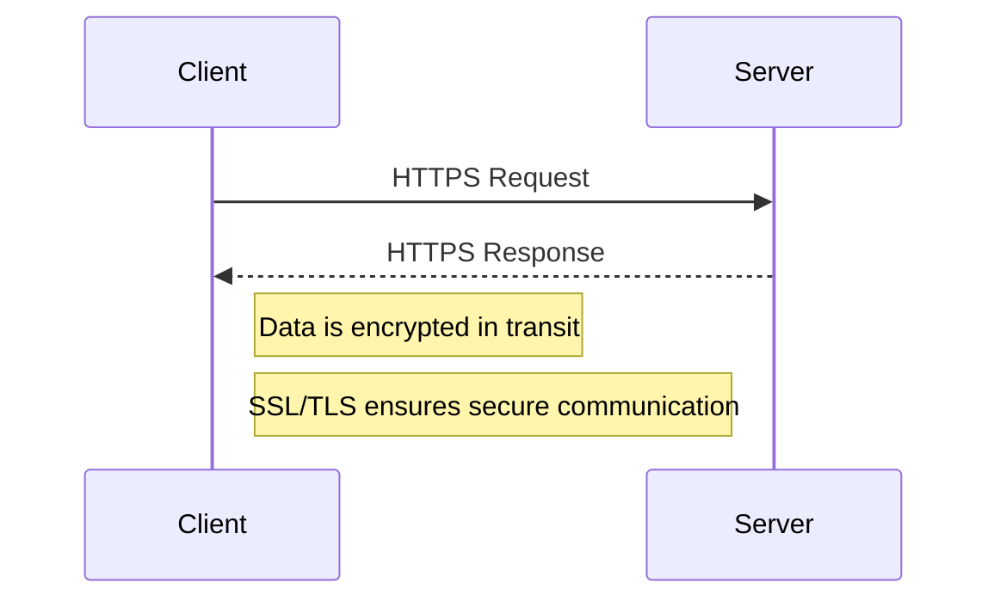

## 24.4. Secure Data Storage and Transmission

In today's digital landscape, securing data is paramount. As expert software engineers and architects, it's crucial to understand and implement secure data storage and transmission practices in Elixir applications. This section delves into encryption at rest, encryption in transit, and key management, providing comprehensive guidance on safeguarding sensitive information.

### Encryption at Rest

Encryption at rest refers to the protection of data stored on disk. This ensures that even if storage media is compromised, the data remains unreadable without the proper decryption keys.

#### Encrypting Databases and Storage Devices

To encrypt data at rest in Elixir, consider the following approaches:

1. **Database-Level Encryption**: Many modern databases offer built-in encryption features. For example, PostgreSQL supports Transparent Data Encryption (TDE), which encrypts data files and backups.

2. **Application-Level Encryption**: Encrypt data before storing it in the database. This approach provides an additional layer of security, as data remains encrypted even if the database's encryption is bypassed.

3. **File System Encryption**: Use file system-level encryption tools like LUKS (Linux Unified Key Setup) or BitLocker for encrypting entire storage devices.

#### Code Example: Encrypting Data Before Storage

Here's an example of encrypting data in Elixir using the `:crypto` module:

```elixir
defmodule SecureStorage do
  @moduledoc """
  Module for encrypting and decrypting data before storage.
  """

  @key :crypto.strong_rand_bytes(32) # Generate a random 256-bit key
  @iv :crypto.strong_rand_bytes(16)  # Generate a random 128-bit IV

  @doc """
  Encrypts the given plaintext using AES-256-CBC.
  """
  def encrypt(plaintext) do
    :crypto.crypto_one_time(:aes_256_cbc, @key, @iv, plaintext, true)
  end

  @doc """
  Decrypts the given ciphertext using AES-256-CBC.
  """
  def decrypt(ciphertext) do
    :crypto.crypto_one_time(:aes_256_cbc, @key, @iv, ciphertext, false)
  end
end

# Usage
plaintext = "Sensitive data"
ciphertext = SecureStorage.encrypt(plaintext)
decrypted_text = SecureStorage.decrypt(ciphertext)

IO.puts("Original: #{plaintext}")
IO.puts("Encrypted: #{Base.encode64(ciphertext)}")
IO.puts("Decrypted: #{decrypted_text}")
```

### Encryption in Transit

Encryption in transit protects data as it travels across networks. This is crucial for preventing interception and unauthorized access during data transmission.

#### Using HTTPS and Secure Protocols

1. **HTTPS**: Ensure all web traffic is encrypted using HTTPS. This involves obtaining an SSL/TLS certificate and configuring your web server to use it.

2. **Secure Protocols**: Use secure protocols like SSH, SFTP, and FTPS for data transfer. Avoid using insecure protocols like HTTP and FTP.

#### Code Example: Configuring HTTPS in Phoenix

To enable HTTPS in a Phoenix application, update the endpoint configuration in `config/prod.exs`:

```elixir
config :my_app, MyAppWeb.Endpoint,
  http: [port: 80],
  https: [
    port: 443,
    cipher_suite: :strong,
    keyfile: System.get_env("SSL_KEY_PATH"),
    certfile: System.get_env("SSL_CERT_PATH")
  ]
```

Ensure that the `SSL_KEY_PATH` and `SSL_CERT_PATH` environment variables point to your SSL certificate and key files.

### Key Management

Proper key management is critical for maintaining the security of encrypted data. Mishandling encryption keys can lead to data breaches and unauthorized access.

#### Handling Encryption Keys Securely

1. **Key Rotation**: Regularly rotate encryption keys to minimize the risk of key compromise. Implement automated key rotation policies.

2. **Secure Storage**: Store encryption keys in a secure location, such as a hardware security module (HSM) or a key management service (KMS) like AWS KMS or Google Cloud KMS.

3. **Access Control**: Restrict access to encryption keys to only those who need it. Implement strict access controls and audit logs.

#### Code Example: Using AWS KMS for Key Management

Here's an example of using AWS KMS to encrypt and decrypt data in Elixir:

```elixir
defmodule KMSClient do
  @moduledoc """
  Module for interacting with AWS KMS.
  """

  @kms_client ExAws.KMS.Client.new()

  @doc """
  Encrypts data using AWS KMS.
  """
  def encrypt(plaintext, key_id) do
    ExAws.KMS.encrypt(key_id, plaintext)
    |> ExAws.request!()
    |> Map.get("CiphertextBlob")
  end

  @doc """
  Decrypts data using AWS KMS.
  """
  def decrypt(ciphertext_blob) do
    ExAws.KMS.decrypt(ciphertext_blob)
    |> ExAws.request!()
    |> Map.get("Plaintext")
  end
end

# Usage
key_id = "arn:aws:kms:us-east-1:123456789012:key/abcd1234-a123-456a-a12b-a123b4cd56ef"
plaintext = "Sensitive data"
ciphertext_blob = KMSClient.encrypt(plaintext, key_id)
decrypted_text = KMSClient.decrypt(ciphertext_blob)

IO.puts("Original: #{plaintext}")
IO.puts("Encrypted: #{Base.encode64(ciphertext_blob)}")
IO.puts("Decrypted: #{decrypted_text}")
```

### Visualizing Secure Data Transmission

To better understand secure data transmission, let's visualize the process using a sequence diagram:



This diagram illustrates the secure communication between a client and server using HTTPS, ensuring data is encrypted during transmission.

### Key Takeaways

- **Encryption at Rest**: Encrypt data stored on disk using database-level, application-level, or file system encryption.
- **Encryption in Transit**: Use HTTPS and secure protocols to protect data during transmission.
- **Key Management**: Implement key rotation, secure storage, and access control to safeguard encryption keys.

### Try It Yourself

Experiment with the provided code examples by modifying the encryption algorithms or integrating with different key management services. Consider implementing additional security measures, such as two-factor authentication or intrusion detection systems.

### References and Further Reading

- [OWASP Cryptographic Storage Cheat Sheet](https://cheatsheetseries.owasp.org/cheatsheets/Cryptographic_Storage_Cheat_Sheet.html)
- [Mozilla SSL Configuration Generator](https://ssl-config.mozilla.org/)
- [AWS Key Management Service (KMS)](https://aws.amazon.com/kms/)

## Quiz: Secure Data Storage and Transmission



### What is the primary purpose of encryption at rest?

- [x] To protect data stored on disk from unauthorized access
- [ ] To secure data during transmission over networks
- [ ] To manage encryption keys securely
- [ ] To ensure data integrity during processing

> **Explanation:** Encryption at rest is designed to protect data stored on disk from unauthorized access, ensuring that even if storage media is compromised, the data remains unreadable without the proper decryption keys.

### Which protocol is recommended for securing data in transit?

- [ ] FTP
- [x] HTTPS
- [ ] HTTP
- [ ] Telnet

> **Explanation:** HTTPS is recommended for securing data in transit as it encrypts web traffic using SSL/TLS, preventing interception and unauthorized access.

### What is a key management service (KMS)?

- [ ] A tool for encrypting data at rest
- [x] A service for managing encryption keys securely
- [ ] A protocol for secure data transmission
- [ ] A database encryption feature

> **Explanation:** A key management service (KMS) is a service for managing encryption keys securely, providing features like key rotation, secure storage, and access control.

### What is the purpose of key rotation?

- [x] To minimize the risk of key compromise
- [ ] To encrypt data during transmission
- [ ] To store encryption keys securely
- [ ] To decrypt data at rest

> **Explanation:** Key rotation is the practice of regularly changing encryption keys to minimize the risk of key compromise and enhance security.

### Which Elixir module is used for encryption and decryption?

- [ ] :ssl
- [x] :crypto
- [ ] :http
- [ ] :logger

> **Explanation:** The `:crypto` module in Elixir is used for encryption and decryption, providing functions for cryptographic operations.

### What is the benefit of application-level encryption?

- [x] Provides an additional layer of security
- [ ] Simplifies key management
- [ ] Eliminates the need for HTTPS
- [ ] Increases data processing speed

> **Explanation:** Application-level encryption provides an additional layer of security by encrypting data before storing it in the database, ensuring data remains encrypted even if the database's encryption is bypassed.

### What is the role of SSL/TLS in HTTPS?

- [x] Ensures secure communication by encrypting web traffic
- [ ] Manages encryption keys securely
- [ ] Encrypts data stored on disk
- [ ] Provides access control for encryption keys

> **Explanation:** SSL/TLS ensures secure communication by encrypting web traffic, preventing interception and unauthorized access during data transmission.

### What is the purpose of file system encryption?

- [x] To encrypt entire storage devices
- [ ] To manage encryption keys securely
- [ ] To secure data during transmission
- [ ] To provide access control for encryption keys

> **Explanation:** File system encryption is used to encrypt entire storage devices, ensuring that data remains protected even if the physical media is compromised.

### What is the recommended practice for storing encryption keys?

- [x] Store in a secure location like an HSM or KMS
- [ ] Store in the application code
- [ ] Store in plain text files
- [ ] Store in the database alongside encrypted data

> **Explanation:** Encryption keys should be stored in a secure location like a hardware security module (HSM) or a key management service (KMS) to prevent unauthorized access.

### True or False: HTTPS encrypts data at rest.

- [ ] True
- [x] False

> **Explanation:** False. HTTPS encrypts data in transit, not at rest. It secures web traffic using SSL/TLS during transmission over networks.



Remember, securing data storage and transmission is a continuous process. Stay informed about the latest security practices and technologies to protect sensitive information effectively. Keep experimenting, stay curious, and enjoy the journey of mastering secure data practices in Elixir!
