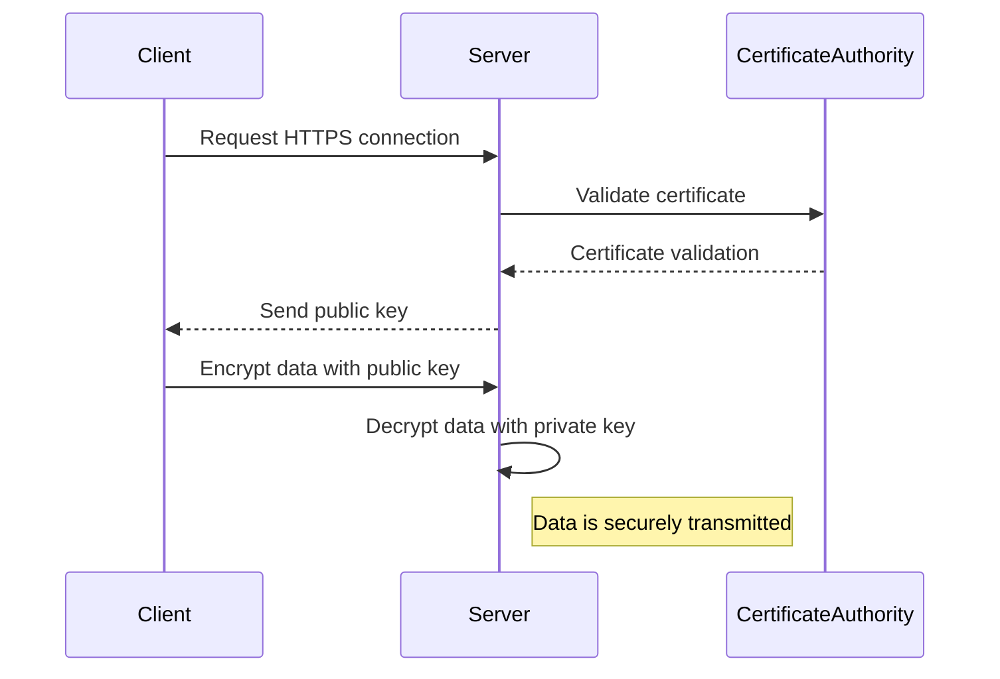

## 24.4. Secure Data Storage and Transmission

In today's digital landscape, ensuring the security of data storage and transmission is paramount. As expert software engineers and architects, understanding how to implement secure practices in Elixir is crucial. This section delves into the intricacies of secure data storage and transmission, focusing on encryption at rest, encryption in transit, and key management. Let's explore these concepts in detail and learn how to apply them effectively in Elixir applications.

### Introduction to Data Security

Data security involves protecting data from unauthorized access and corruption throughout its lifecycle. In Elixir, this means implementing robust security measures that align with the language's functional nature and concurrency model. The key areas of focus are:

- **Encryption at Rest**: Protecting stored data from unauthorized access.
- **Encryption in Transit**: Securing data as it moves across networks.
- **Key Management**: Safeguarding encryption keys to ensure data confidentiality.

### Encryption at Rest

Encryption at rest refers to encrypting data stored on disks, databases, or any storage medium. This ensures that even if the storage medium is compromised, the data remains unreadable without the decryption key.

#### Implementing Encryption at Rest in Elixir

To encrypt data at rest in Elixir, we can use libraries such as `cloak_ecto` or `comeonin`. These libraries provide tools for encrypting sensitive data before storing it in a database.

**Example: Using Cloak for Encryption**

```elixir
# Add Cloak to your mix.exs
defp deps do
  [
    {:cloak, "~> 1.0"},
    {:cloak_ecto, "~> 1.0"}
  ]
end

# Define a Vault module to handle encryption
defmodule MyApp.Vault do
  use Cloak.Vault, otp_app: :my_app

  @impl true
  def init(config) do
    config
    |> Keyword.put(:ciphers, [
      default: {Cloak.Ciphers.AES.GCM, tag: "AES.GCM.V1", key: <<0::256>>}
    ])
  end
end

# Encrypt a field in an Ecto schema
defmodule MyApp.User do
  use Ecto.Schema

  schema "users" do
    field :email, Cloak.Ecto.EncryptedField
    field :password_hash, :string
  end
end
```

In this example, we define a vault using `Cloak` to encrypt the `email` field in the `User` schema. The key management and encryption logic are abstracted, making it easy to implement encryption.

#### Best Practices for Encryption at Rest

- **Use Strong Encryption Algorithms**: Prefer AES-256 or similar algorithms for strong encryption.
- **Rotate Encryption Keys Regularly**: Regular key rotation mitigates the risk of key compromise.
- **Encrypt Sensitive Fields**: Only encrypt fields that contain sensitive information to optimize performance.

### Encryption in Transit

Encryption in transit protects data as it moves between systems, ensuring that it cannot be intercepted or tampered with by unauthorized parties. This is typically achieved by using secure protocols like HTTPS.

#### Implementing HTTPS in Phoenix

Phoenix, the popular web framework for Elixir, makes it straightforward to enforce HTTPS for secure data transmission.

**Example: Enforcing HTTPS in Phoenix**

```elixir
# In your Phoenix endpoint configuration
config :my_app, MyAppWeb.Endpoint,
  http: [port: 80],
  https: [
    port: 443,
    cipher_suite: :strong,
    keyfile: System.get_env("SSL_KEY_PATH"),
    certfile: System.get_env("SSL_CERT_PATH")
  ]

# Redirect HTTP to HTTPS
defmodule MyAppWeb.Plugs.ForceSSL do
  import Plug.Conn

  def init(default), do: default

  def call(conn, _opts) do
    case conn.scheme do
      :https -> conn
      _ -> redirect(conn, external: "https://#{conn.host}#{conn.request_path}")
    end
  end
end

# Add the plug to your endpoint
plug MyAppWeb.Plugs.ForceSSL
```

In this example, we configure the Phoenix endpoint to use HTTPS and redirect all HTTP traffic to HTTPS. This ensures that all data transmitted between the client and server is encrypted.

#### Best Practices for Encryption in Transit

- **Use TLS 1.2 or Higher**: Ensure that your application uses the latest version of TLS for secure communication.
- **Regularly Update Certificates**: Keep SSL/TLS certificates up to date to prevent vulnerabilities.
- **Enable HSTS**: HTTP Strict Transport Security (HSTS) enforces secure connections and protects against downgrade attacks.

### Key Management

Key management is the process of handling cryptographic keys securely throughout their lifecycle. Effective key management is crucial for maintaining data confidentiality and integrity.

#### Key Management Strategies

1. **Centralized Key Management Systems**: Use services like AWS KMS or HashiCorp Vault to manage keys centrally.
2. **Environment Variables**: Store keys in environment variables to keep them out of source code.
3. **Access Control**: Limit access to keys to only those who need it, using role-based access controls.

#### Implementing Key Management in Elixir

**Example: Using Environment Variables for Key Management**

```elixir
# Access keys from environment variables
defmodule MyApp.Encryption do
  @encryption_key System.get_env("ENCRYPTION_KEY")

  def encrypt(data) do
    :crypto.block_encrypt(:aes_gcm, @encryption_key, <<0::96>>, data)
  end

  def decrypt(ciphertext) do
    :crypto.block_decrypt(:aes_gcm, @encryption_key, <<0::96>>, ciphertext)
  end
end
```

In this example, we use environment variables to store the encryption key, ensuring that it is not hardcoded in the source code.

#### Best Practices for Key Management

- **Rotate Keys Regularly**: Regular key rotation reduces the risk of key compromise.
- **Audit Key Access**: Keep logs of who accesses keys and when to detect unauthorized access.
- **Use Hardware Security Modules (HSMs)**: HSMs provide physical security for key storage and operations.

### Visualizing Secure Data Transmission

To better understand secure data transmission, let's visualize the process using a sequence diagram.


```mermaid
sequenceDiagram
    participant Client
    participant Server
    participant CertificateAuthority

    Client->>Server: Request HTTPS connection
    Server->>CertificateAuthority: Validate certificate
    CertificateAuthority-->>Server: Certificate validation
    Server-->>Client: Send public key
    Client->>Server: Encrypt data with public key
    Server->>Server: Decrypt data with private key
    Note right of Server: Data is securely transmitted
```

**Diagram Description**: This sequence diagram illustrates the process of establishing a secure HTTPS connection between a client and a server. The client requests a secure connection, the server's certificate is validated by a certificate authority, and data is encrypted using the server's public key.

### Knowledge Check

Before we wrap up, let's reinforce what we've learned with a few questions:

- Why is encryption at rest important?
- What are the benefits of using HTTPS for data transmission?
- How can environment variables be used for key management?

### Summary of Key Takeaways

- **Encryption at Rest**: Encrypt sensitive data stored on disks to protect it from unauthorized access.
- **Encryption in Transit**: Use HTTPS and secure protocols to protect data as it moves across networks.
- **Key Management**: Implement robust key management practices to safeguard encryption keys.

### Embrace the Journey

Remember, securing data storage and transmission is an ongoing process. As you develop your Elixir applications, continue to refine your security practices and stay informed about the latest advancements in data protection. Keep experimenting, stay curious, and enjoy the journey of building secure applications!

## Quiz Time!



### Why is encryption at rest important?

- [x] To protect stored data from unauthorized access
- [ ] To increase data transmission speed
- [ ] To reduce data storage costs
- [ ] To ensure data is always available

> **Explanation:** Encryption at rest ensures that data stored on disks is protected from unauthorized access, even if the storage medium is compromised.

### What does HTTPS provide for data transmission?

- [x] Encryption in transit
- [ ] Faster data transfer
- [ ] Reduced server load
- [ ] Increased data redundancy

> **Explanation:** HTTPS encrypts data as it moves between the client and server, ensuring secure transmission.

### How can environment variables be used in key management?

- [x] To store encryption keys securely
- [ ] To increase application performance
- [ ] To reduce code complexity
- [ ] To manage user sessions

> **Explanation:** Environment variables can be used to store encryption keys securely, keeping them out of source code.

### What is a benefit of using centralized key management systems?

- [x] Simplified key rotation and access control
- [ ] Reduced application latency
- [ ] Increased data redundancy
- [ ] Enhanced user experience

> **Explanation:** Centralized key management systems simplify key rotation and access control, making it easier to manage keys securely.

### Which protocol should be used for secure data transmission?

- [x] TLS 1.2 or higher
- [ ] HTTP
- [ ] FTP
- [ ] Telnet

> **Explanation:** TLS 1.2 or higher should be used for secure data transmission to ensure data confidentiality and integrity.

### What is the purpose of HSTS?

- [x] To enforce secure connections
- [ ] To increase server response time
- [ ] To reduce data storage costs
- [ ] To manage user sessions

> **Explanation:** HTTP Strict Transport Security (HSTS) enforces secure connections and protects against downgrade attacks.

### What is a key benefit of encrypting sensitive fields only?

- [x] Optimized performance
- [ ] Increased data redundancy
- [ ] Simplified codebase
- [ ] Enhanced user experience

> **Explanation:** Encrypting only sensitive fields optimizes performance by reducing the overhead of encryption operations.

### What should be regularly updated to prevent vulnerabilities?

- [x] SSL/TLS certificates
- [ ] Application logs
- [ ] User passwords
- [ ] Database indexes

> **Explanation:** Regularly updating SSL/TLS certificates helps prevent vulnerabilities and ensures secure communication.

### Why is key rotation important?

- [x] To reduce the risk of key compromise
- [ ] To increase application performance
- [ ] To simplify code maintenance
- [ ] To enhance user experience

> **Explanation:** Regular key rotation reduces the risk of key compromise by limiting the time a single key is in use.

### True or False: Encryption in transit is only necessary for financial applications.

- [ ] True
- [x] False

> **Explanation:** Encryption in transit is necessary for any application that transmits sensitive data, not just financial applications.



By following these guidelines and practices, you can ensure that your Elixir applications are secure, reliable, and resilient against potential threats.
