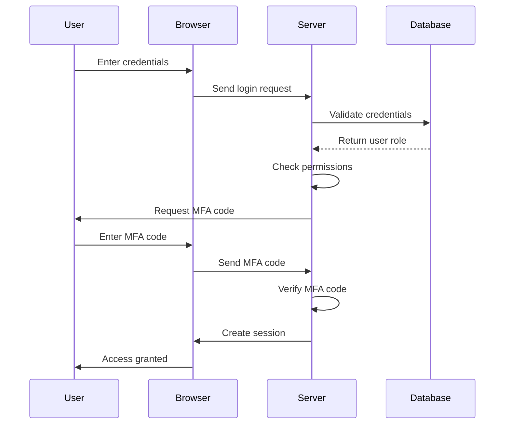

## 24.5. Access Control and Identity Management

In today's digital landscape, ensuring secure access to applications and data is paramount. Access control and identity management are critical components of any secure system, and Elixir provides robust tools and patterns to implement these effectively. In this section, we'll delve into three key aspects of access control and identity management: Role-Based Access Control (RBAC), Multi-Factor Authentication (MFA), and Session Management. We'll explore how these can be implemented in Elixir to enhance security and provide a seamless user experience.

### Role-Based Access Control (RBAC)

**Role-Based Access Control (RBAC)** is a method of regulating access to resources based on the roles assigned to users within an organization. This approach simplifies the management of permissions by associating roles with specific access rights, rather than assigning permissions directly to individual users.

#### Defining User Roles and Permissions

To implement RBAC in Elixir, we need to define user roles and their associated permissions. This can be achieved using Elixir's data structures and pattern matching capabilities.

```elixir
defmodule AccessControl do
  @moduledoc """
  A module for managing user roles and permissions.
  """

  @roles %{
    admin: [:read, :write, :delete],
    editor: [:read, :write],
    viewer: [:read]
  }

  @doc """
  Checks if a user has a specific permission.
  """
  def has_permission?(role, permission) do
    Map.get(@roles, role, [])
    |> Enum.member?(permission)
  end
end

# Example usage
IO.inspect AccessControl.has_permission?(:admin, :delete) # true
IO.inspect AccessControl.has_permission?(:viewer, :write) # false
```

In this example, we define a module `AccessControl` that contains a map of roles and their permissions. The `has_permission?/2` function checks if a given role has a specific permission.

#### Implementing RBAC in a Phoenix Application

In a Phoenix application, RBAC can be integrated into the authentication and authorization pipeline. Here's how you can implement it:

1. **Define Roles and Permissions**: Use a database table to store roles and permissions, or define them in a module as shown above.
2. **Assign Roles to Users**: Create a user schema with a role field.
3. **Authorize Requests**: Use a plug to check permissions before processing requests.

```elixir
defmodule MyAppWeb.Plugs.Authorize do
  import Plug.Conn
  alias MyApp.Accounts

  def init(default), do: default

  def call(conn, required_permission) do
    user = conn.assigns[:current_user]

    if Accounts.has_permission?(user.role, required_permission) do
      conn
    else
      conn
      |> put_status(:forbidden)
      |> Phoenix.Controller.render(MyAppWeb.ErrorView, "403.html")
      |> halt()
    end
  end
end
```

In this plug, we check if the current user has the required permission. If not, we return a 403 Forbidden response.

### Multi-Factor Authentication (MFA)

**Multi-Factor Authentication (MFA)** adds an extra layer of security by requiring users to provide two or more verification factors to gain access to a resource. This reduces the risk of unauthorized access due to compromised credentials.

#### Implementing MFA in Elixir

To implement MFA in Elixir, we can use libraries like `ex_twilio` for sending SMS codes or `pot` for generating TOTP (Time-based One-Time Passwords).

```elixir
defmodule MFA do
  @moduledoc """
  A module for handling multi-factor authentication.
  """

  @otp_secret "JBSWY3DPEHPK3PXP" # Example secret

  @doc """
  Generates a TOTP code.
  """
  def generate_totp do
    :pot.totp(@otp_secret)
  end

  @doc """
  Verifies a TOTP code.
  """
  def verify_totp(code) do
    :pot.valid_totp?(code, @otp_secret)
  end
end

# Example usage
IO.inspect MFA.generate_totp() # Generates a TOTP code
IO.inspect MFA.verify_totp("123456") # Verifies the TOTP code
```

In this example, we use the `pot` library to generate and verify TOTP codes. The secret key should be securely stored and unique for each user.

#### Integrating MFA into a Phoenix Application

To integrate MFA into a Phoenix application, follow these steps:

1. **Generate and Store Secrets**: Generate a unique secret for each user and store it securely.
2. **Send Verification Codes**: Use a service like Twilio to send SMS codes, or display TOTP codes in the user's account settings.
3. **Verify Codes**: Prompt users to enter the code during login and verify it using the `MFA` module.

```elixir
defmodule MyAppWeb.SessionController do
  use MyAppWeb, :controller
  alias MyApp.Accounts

  def create(conn, %{"session" => session_params}) do
    case Accounts.authenticate(session_params) do
      {:ok, user} ->
        if MFA.verify_totp(session_params["totp_code"]) do
          conn
          |> put_session(:user_id, user.id)
          |> redirect(to: "/dashboard")
        else
          conn
          |> put_flash(:error, "Invalid TOTP code")
          |> render("new.html")
        end

      :error ->
        conn
        |> put_flash(:error, "Invalid credentials")
        |> render("new.html")
    end
  end
end
```

In this controller action, we authenticate the user and verify the TOTP code before creating a session.

### Session Management

**Session Management** involves maintaining a user's state across multiple requests. Proper session management is crucial for ensuring security and a seamless user experience.

#### Ensuring Secure and Time-Limited Sessions

To manage sessions securely in Elixir, consider the following best practices:

1. **Use Secure Cookies**: Ensure cookies are marked as secure and HTTP-only to prevent XSS attacks.
2. **Implement Session Expiry**: Set a timeout for sessions to minimize the risk of session hijacking.
3. **Regenerate Session IDs**: Regenerate session IDs after login to prevent session fixation attacks.

```elixir
defmodule MyAppWeb.Endpoint do
  use Phoenix.Endpoint, otp_app: :my_app

  # Configure session options
  plug Plug.Session,
    store: :cookie,
    key: "_my_app_key",
    signing_salt: "random_salt",
    secure: true,
    http_only: true,
    max_age: 30 * 60 # 30 minutes

  # Other plugs...
end
```

In this configuration, we set the session to expire after 30 minutes and ensure cookies are secure and HTTP-only.

#### Implementing Session Management in a Phoenix Application

To implement session management in a Phoenix application, follow these steps:

1. **Configure Session Options**: Set secure options in the endpoint configuration.
2. **Manage Sessions in Controllers**: Use `put_session/3` and `delete_session/2` to manage session data.
3. **Handle Session Expiry**: Redirect users to the login page if their session has expired.

```elixir
defmodule MyAppWeb.SessionController do
  use MyAppWeb, :controller

  def delete(conn, _params) do
    conn
    |> delete_session(:user_id)
    |> redirect(to: "/login")
  end
end
```

In this controller action, we delete the user's session and redirect them to the login page.

### Visualizing Access Control and Identity Management

To better understand the flow of access control and identity management, let's visualize the process using a Mermaid.js diagram.



This diagram illustrates the sequence of events in a typical access control and identity management process, including role validation, MFA verification, and session creation.

### Key Takeaways

- **RBAC** simplifies permission management by associating roles with access rights.
- **MFA** enhances security by requiring multiple verification factors.
- **Session Management** ensures secure and seamless user experiences.

### Try It Yourself

Experiment with the code examples provided in this section. Try adding new roles and permissions, implementing different MFA methods, or customizing session management settings. This hands-on approach will deepen your understanding of access control and identity management in Elixir.

### References and Further Reading

- [Elixir Documentation](https://elixir-lang.org/docs.html)
- [Phoenix Framework Guides](https://hexdocs.pm/phoenix/overview.html)
- [ExTwilio Library](https://hexdocs.pm/ex_twilio/readme.html)
- [Pot Library for TOTP](https://hexdocs.pm/pot/readme.html)

## Quiz: Access Control and Identity Management



### What is the primary benefit of Role-Based Access Control (RBAC)?

- [x] Simplifies permission management by associating roles with access rights
- [ ] Provides a single point of access for all users
- [ ] Eliminates the need for authentication
- [ ] Increases the complexity of user management

> **Explanation:** RBAC simplifies permission management by associating roles with specific access rights, making it easier to manage permissions.

### Which library can be used in Elixir to generate TOTP codes for MFA?

- [x] Pot
- [ ] ExTwilio
- [ ] Phoenix
- [ ] Ecto

> **Explanation:** The `pot` library is used to generate and verify TOTP codes for multi-factor authentication in Elixir.

### What is a key practice for secure session management?

- [x] Use secure and HTTP-only cookies
- [ ] Store session data in plain text
- [ ] Allow unlimited session duration
- [ ] Share session IDs across users

> **Explanation:** Using secure and HTTP-only cookies helps prevent XSS attacks and ensures secure session management.

### How can session fixation attacks be prevented?

- [x] Regenerate session IDs after login
- [ ] Use the same session ID for all users
- [ ] Disable session expiration
- [ ] Store session data in cookies

> **Explanation:** Regenerating session IDs after login prevents session fixation attacks by ensuring that a new session ID is issued.

### What is the purpose of Multi-Factor Authentication (MFA)?

- [x] Adds an extra layer of security by requiring multiple verification factors
- [ ] Eliminates the need for passwords
- [ ] Provides a single sign-on experience
- [ ] Simplifies user registration

> **Explanation:** MFA adds an extra layer of security by requiring users to provide multiple verification factors, reducing the risk of unauthorized access.

### Which of the following is a common method for implementing MFA?

- [x] Time-based One-Time Passwords (TOTP)
- [ ] Single Sign-On (SSO)
- [ ] Password-only authentication
- [ ] OpenID Connect

> **Explanation:** Time-based One-Time Passwords (TOTP) are a common method for implementing MFA, providing an additional verification factor.

### What is a benefit of using secure cookies for session management?

- [x] Prevents XSS attacks
- [ ] Increases session duration
- [ ] Allows session data to be shared across domains
- [ ] Eliminates the need for encryption

> **Explanation:** Secure cookies help prevent XSS attacks by ensuring that cookies are only sent over secure connections and are not accessible via JavaScript.

### How can you ensure that a user's session is time-limited?

- [x] Set a max_age for the session
- [ ] Use plain text cookies
- [ ] Disable session expiration
- [ ] Store session data in the database

> **Explanation:** Setting a `max_age` for the session ensures that it expires after a specified duration, limiting the session's lifetime.

### What is the role of the `Plug.Session` module in Phoenix?

- [x] Manages session data and configuration
- [ ] Handles user authentication
- [ ] Provides database access
- [ ] Renders HTML templates

> **Explanation:** The `Plug.Session` module is responsible for managing session data and configuration in a Phoenix application.

### True or False: MFA can only be implemented using SMS codes.

- [ ] True
- [x] False

> **Explanation:** False. MFA can be implemented using various methods, including TOTP, SMS codes, and hardware tokens.



Remember, mastering access control and identity management is crucial for building secure applications. Keep experimenting, stay curious, and enjoy the journey of enhancing security in your Elixir applications!
