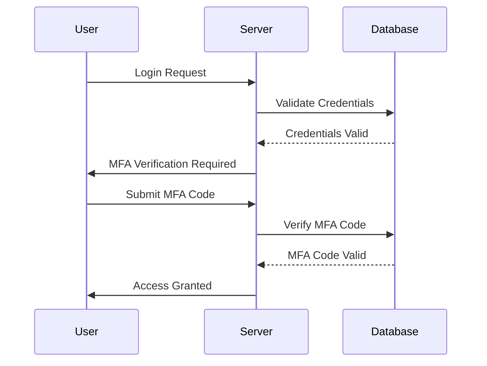

## 24.5. Access Control and Identity Management

In today's digital landscape, ensuring secure access to applications and data is paramount. Access control and identity management are crucial components of a robust security strategy. In this section, we'll delve into advanced techniques for implementing access control and identity management in Elixir applications. We'll cover Role-Based Access Control (RBAC), Multi-Factor Authentication (MFA), and secure session management, providing you with the tools and knowledge to build secure, scalable systems.

### Role-Based Access Control (RBAC)

Role-Based Access Control (RBAC) is a widely used approach for managing user permissions within an application. By defining roles and assigning permissions to these roles, you can effectively control what users can and cannot do within your system.

#### Defining User Roles and Permissions

To implement RBAC in Elixir, we first need to define the roles and permissions within our application. This involves creating a clear hierarchy of roles and associating specific permissions with each role.

```elixir
defmodule MyApp.Roles do
  @moduledoc """
  Defines roles and permissions for the application.
  """

  def roles do
    %{
      admin: [:read, :write, :delete],
      editor: [:read, :write],
      viewer: [:read]
    }
  end

  def has_permission?(role, permission) do
    roles()
    |> Map.get(role, [])
    |> Enum.member?(permission)
  end
end
```

In this example, we define three roles: `admin`, `editor`, and `viewer`, each with a set of permissions. The `has_permission?/2` function checks if a given role has a specific permission.

#### Assigning Roles to Users

Next, we need to associate these roles with users. This can be done by storing the user's role in the database and retrieving it during authentication.

```elixir
defmodule MyApp.User do
  use Ecto.Schema
  import Ecto.Changeset

  schema "users" do
    field :email, :string
    field :role, :string, default: "viewer"
    # other fields...
  end

  def changeset(user, attrs) do
    user
    |> cast(attrs, [:email, :role])
    |> validate_required([:email, :role])
  end
end
```

With the user's role stored in the database, we can easily check their permissions during runtime.

#### Checking Permissions

To enforce access control, we need to check permissions before performing any sensitive actions. This can be done using a plug in Phoenix.

```elixir
defmodule MyAppWeb.Plugs.Authorize do
  import Plug.Conn
  alias MyApp.Roles

  def init(default), do: default

  def call(conn, required_permission) do
    user = conn.assigns[:current_user]

    if Roles.has_permission?(user.role, required_permission) do
      conn
    else
      conn
      |> put_status(:forbidden)
      |> halt()
    end
  end
end
```

This plug checks if the current user has the necessary permission to proceed. If not, it halts the connection with a `403 Forbidden` status.

### Multi-Factor Authentication (MFA)

Multi-Factor Authentication (MFA) adds an extra layer of security by requiring users to provide additional verification factors beyond their password. This can significantly reduce the risk of unauthorized access.

#### Implementing MFA in Elixir

To implement MFA, we can use a combination of time-based one-time passwords (TOTPs) and email or SMS verification.

```elixir
defmodule MyApp.MFA do
  use GenServer
  alias MyApp.Mailer

  def start_link(_) do
    GenServer.start_link(__MODULE__, %{}, name: __MODULE__)
  end

  def init(state) do
    {:ok, state}
  end

  def generate_totp(secret) do
    :pot.totp(secret)
  end

  def send_verification_code(user) do
    code = generate_totp(user.mfa_secret)
    Mailer.send_email(user.email, "Your verification code is #{code}")
  end

  def verify_code(user, code) do
    generate_totp(user.mfa_secret) == code
  end
end
```

In this example, we use the `:pot` library to generate TOTPs and send them to the user via email. The `verify_code/2` function checks if the provided code matches the generated TOTP.

#### Enforcing MFA

To enforce MFA, we can add a plug to our authentication pipeline that checks if the user has completed MFA verification.

```elixir
defmodule MyAppWeb.Plugs.EnforceMFA do
  import Plug.Conn
  alias MyApp.MFA

  def init(default), do: default

  def call(conn, _opts) do
    user = conn.assigns[:current_user]

    if MFA.verify_code(user, conn.params["mfa_code"]) do
      conn
    else
      conn
      |> put_flash(:error, "Invalid MFA code")
      |> redirect(to: "/mfa")
      |> halt()
    end
  end
end
```

This plug checks if the provided MFA code is valid. If not, it redirects the user to the MFA verification page.

### Session Management

Session management is a critical aspect of access control, ensuring that user sessions are secure and time-limited.

#### Secure Session Handling

To manage sessions securely, we need to ensure that session data is encrypted and that sessions have a limited lifespan.

```elixir
# In config/config.exs
config :my_app, MyAppWeb.Endpoint,
  session_options: [
    store: :cookie,
    key: "_my_app_key",
    signing_salt: "random_salt",
    encryption_salt: "encryption_salt"
  ]
```

By configuring the session options, we ensure that session data is encrypted and signed, preventing tampering and unauthorized access.

#### Session Expiration

To prevent stale sessions, we can set a timeout for session expiration.

```elixir
defmodule MyAppWeb.Plugs.SessionTimeout do
  import Plug.Conn

  def init(default), do: default

  def call(conn, _opts) do
    last_access = get_session(conn, :last_access) || :os.system_time(:seconds)
    current_time = :os.system_time(:seconds)

    if current_time - last_access > 1800 do
      conn
      |> configure_session(drop: true)
      |> put_flash(:error, "Session expired")
      |> redirect(to: "/login")
      |> halt()
    else
      put_session(conn, :last_access, current_time)
    end
  end
end
```

This plug checks if the session has been inactive for more than 30 minutes and, if so, invalidates it.

### Visualizing Access Control Flow

To better understand the flow of access control and identity management, let's visualize the process using a sequence diagram.


```mermaid
sequenceDiagram
    participant User
    participant Server
    participant Database

    User->>Server: Login Request
    Server->>Database: Validate Credentials
    Database-->>Server: Credentials Valid
    Server->>User: MFA Verification Required
    User->>Server: Submit MFA Code
    Server->>Database: Verify MFA Code
    Database-->>Server: MFA Code Valid
    Server->>User: Access Granted
```

This diagram illustrates the typical flow of access control, from login to MFA verification and access granting.

### References and Further Reading

- [OWASP Authentication Cheat Sheet](https://cheatsheetseries.owasp.org/cheatsheets/Authentication_Cheat_Sheet.html)
- [Elixir Security Guide](https://elixir-lang.org/getting-started/mix-otp/introduction-to-mix.html)
- [Phoenix Framework Security](https://hexdocs.pm/phoenix/security.html)

### Knowledge Check

- How does Role-Based Access Control (RBAC) enhance security in an application?
- What are the benefits of implementing Multi-Factor Authentication (MFA)?
- How can session management be improved to prevent unauthorized access?

### Embrace the Journey

Implementing access control and identity management in Elixir is a rewarding journey that enhances the security and reliability of your applications. Remember, this is just the beginning. As you progress, you'll build more secure and robust systems. Keep experimenting, stay curious, and enjoy the journey!

### Quiz Time!



### What is the primary purpose of Role-Based Access Control (RBAC)?

- [x] To manage user permissions by defining roles
- [ ] To encrypt user passwords
- [ ] To log user activities
- [ ] To create user profiles

> **Explanation:** RBAC is used to manage user permissions by defining roles and associating specific permissions with each role.

### Which of the following is a benefit of Multi-Factor Authentication (MFA)?

- [x] Adds an extra layer of security
- [ ] Reduces server load
- [ ] Speeds up login processes
- [ ] Increases password complexity

> **Explanation:** MFA adds an extra layer of security by requiring additional verification factors beyond the password.

### What is the purpose of session management?

- [x] To ensure sessions are secure and time-limited
- [ ] To store user preferences
- [ ] To log user activities
- [ ] To encrypt user data

> **Explanation:** Session management ensures that sessions are secure and have a limited lifespan, preventing unauthorized access.

### In the context of MFA, what does TOTP stand for?

- [x] Time-Based One-Time Password
- [ ] Temporary One-Time Password
- [ ] Two-Factor One-Time Password
- [ ] Trusted One-Time Password

> **Explanation:** TOTP stands for Time-Based One-Time Password, a method used in MFA to generate time-sensitive codes.

### How can we enforce session expiration in Elixir?

- [x] By setting a timeout for session inactivity
- [ ] By encrypting session data
- [ ] By logging user activities
- [ ] By increasing session storage

> **Explanation:** Session expiration can be enforced by setting a timeout for session inactivity, ensuring sessions are invalidated after a period of inactivity.

### What is the role of the `has_permission?/2` function in RBAC?

- [x] To check if a role has a specific permission
- [ ] To assign roles to users
- [ ] To encrypt user data
- [ ] To log user activities

> **Explanation:** The `has_permission?/2` function checks if a given role has a specific permission.

### What library is used to generate TOTPs in the Elixir example?

- [x] :pot
- [ ] :crypto
- [ ] :ssl
- [ ] :mfa

> **Explanation:** The `:pot` library is used to generate Time-Based One-Time Passwords (TOTPs) in the Elixir example.

### What is the purpose of the `EnforceMFA` plug in the authentication pipeline?

- [x] To check if the user has completed MFA verification
- [ ] To encrypt user passwords
- [ ] To log user activities
- [ ] To create user profiles

> **Explanation:** The `EnforceMFA` plug checks if the user has completed MFA verification before allowing access.

### How does encrypting session data enhance security?

- [x] It prevents tampering and unauthorized access
- [ ] It speeds up session retrieval
- [ ] It reduces server load
- [ ] It logs user activities

> **Explanation:** Encrypting session data prevents tampering and unauthorized access, enhancing security.

### True or False: RBAC can be implemented without defining roles.

- [ ] True
- [x] False

> **Explanation:** False. RBAC requires defining roles to manage user permissions effectively.


