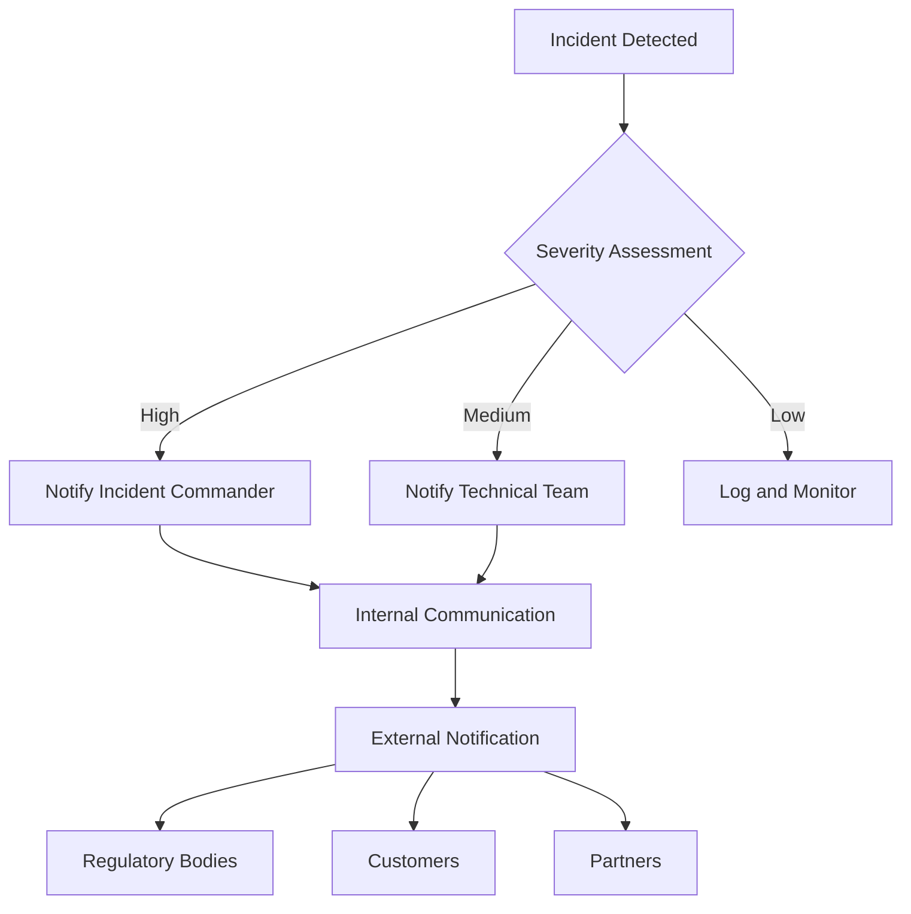
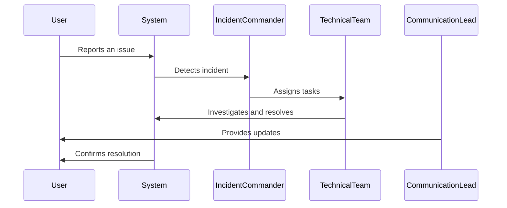

## 24.6. Incident Response Planning

In today's digital landscape, where systems are increasingly interconnected and complex, incident response planning is crucial for maintaining the integrity and availability of services. This section will guide you through developing a comprehensive incident response plan tailored for Elixir systems, focusing on preparing for incidents, establishing notification procedures, and devising recovery strategies.

### Preparing for Incidents

Incident response planning begins with preparation. This involves understanding potential threats, defining roles and responsibilities, and creating a structured plan to address incidents effectively.

#### Understanding Potential Threats

Identify and categorize potential threats to your Elixir systems. These may include:

- **Security Breaches**: Unauthorized access to sensitive data.
- **System Outages**: Downtime due to hardware failures, software bugs, or network issues.
- **Data Loss**: Accidental or malicious deletion or corruption of data.
- **Performance Degradation**: Slow response times affecting user experience.

#### Developing Response Plans

A well-defined response plan ensures that your team can act swiftly and efficiently during an incident. Key components include:

- **Incident Identification and Classification**: Establish criteria for identifying incidents and classifying their severity.
- **Roles and Responsibilities**: Define clear roles for team members, including incident commander, communication lead, and technical responders.
- **Communication Plan**: Develop internal and external communication strategies to keep stakeholders informed.
- **Documentation**: Maintain detailed records of incidents, actions taken, and lessons learned.

#### Code Example: Monitoring System Health

```elixir
defmodule HealthMonitor do
  use GenServer

  # Start the GenServer
  def start_link(_) do
    GenServer.start_link(__MODULE__, %{}, name: __MODULE__)
  end

  # Initialize state
  def init(state) do
    schedule_health_check()
    {:ok, state}
  end

  # Schedule periodic health checks
  defp schedule_health_check do
    Process.send_after(self(), :check_health, 5_000) # Check every 5 seconds
  end

  # Handle health check messages
  def handle_info(:check_health, state) do
    check_system_health()
    schedule_health_check()
    {:noreply, state}
  end

  # Simulate a health check
  defp check_system_health do
    IO.puts("Checking system health...")
    # Add logic to check system components
  end
end

# Start the HealthMonitor
{:ok, _pid} = HealthMonitor.start_link([])
```

This code snippet demonstrates a simple health monitoring system using Elixir's GenServer. It periodically checks the system's health and can be extended to include specific checks for various components.

### Notification Procedures

Notification procedures are critical for ensuring timely communication during an incident. They help manage stakeholder expectations and comply with legal requirements.

#### Legal Requirements for Breach Notifications

Different jurisdictions have specific legal requirements for breach notifications. Ensure your notification procedures comply with relevant laws, such as:

- **GDPR**: Requires notification within 72 hours of becoming aware of a breach.
- **HIPAA**: Mandates notification to affected individuals within 60 days.

#### Establishing Notification Protocols

Develop protocols for notifying internal and external stakeholders:

- **Internal Notifications**: Inform team members and management about the incident and response actions.
- **External Notifications**: Communicate with customers, partners, and regulatory bodies as required.
- **Templates and Scripts**: Prepare templates and scripts for consistent messaging.

#### Diagram: Notification Workflow



This diagram illustrates a notification workflow, showing the decision-making process and communication paths based on incident severity.

### Recovery Strategies

Recovery strategies focus on restoring services and data after an incident, minimizing downtime and data loss.

#### Restoring Services

Develop procedures for quickly restoring services:

- **Backup and Restore**: Implement regular backups and test restore procedures.
- **Failover Systems**: Use redundant systems to ensure continuity during outages.
- **Service Degradation**: Plan for graceful degradation of services to maintain core functionality.

#### Data Recovery

Ensure data integrity and availability through:

- **Data Replication**: Use data replication techniques to maintain copies of critical data.
- **Transaction Logs**: Leverage transaction logs for point-in-time recovery.
- **Data Validation**: Validate data integrity during recovery to prevent corruption.

#### Code Example: Data Backup

```elixir
defmodule DataBackup do
  @backup_dir "/path/to/backup"

  # Perform a backup
  def backup(data) do
    timestamp = :os.system_time(:seconds)
    file_path = "#{@backup_dir}/backup_#{timestamp}.json"

    case File.write(file_path, Jason.encode!(data)) do
      :ok -> IO.puts("Backup successful: #{file_path}")
      {:error, reason} -> IO.puts("Backup failed: #{reason}")
    end
  end
end

# Example usage
data = %{users: [%{id: 1, name: "Alice"}, %{id: 2, name: "Bob"}]}
DataBackup.backup(data)
```

This example demonstrates a simple data backup process, encoding data to JSON and saving it to a file. Modify the backup directory and data structure as needed for your application.

### Visualizing the Incident Response Process



This sequence diagram visualizes the incident response process, highlighting interactions between users, the system, and response team members.

### Knowledge Check

- **What are the key components of an incident response plan?**
- **How do legal requirements influence notification procedures?**
- **What strategies can be used to restore services after an incident?**

### Embrace the Journey

Remember, incident response planning is an ongoing process. Continuously refine your plans based on lessons learned and evolving threats. Stay proactive, keep experimenting, and enjoy the journey of building resilient Elixir systems!

## Quiz: Incident Response Planning



### What is the first step in preparing for incidents?

- [x] Understanding potential threats
- [ ] Developing recovery strategies
- [ ] Establishing notification procedures
- [ ] Conducting post-incident reviews

> **Explanation:** Understanding potential threats is the first step in preparing for incidents, as it helps identify and categorize risks.

### Which of the following is a legal requirement for breach notifications under GDPR?

- [x] Notify within 72 hours
- [ ] Notify within 24 hours
- [ ] Notify within 30 days
- [ ] Notify within 60 days

> **Explanation:** GDPR requires notification within 72 hours of becoming aware of a breach.

### What is the purpose of a communication plan in incident response?

- [x] To develop internal and external communication strategies
- [ ] To identify potential threats
- [ ] To restore services after an incident
- [ ] To conduct post-incident reviews

> **Explanation:** A communication plan is developed to ensure effective communication with stakeholders during an incident.

### Which Elixir module is used in the code example for monitoring system health?

- [x] GenServer
- [ ] Supervisor
- [ ] Task
- [ ] Agent

> **Explanation:** The code example uses the GenServer module to implement a health monitoring system.

### What is the role of transaction logs in data recovery?

- [x] To enable point-in-time recovery
- [ ] To notify stakeholders
- [ ] To classify incident severity
- [ ] To perform health checks

> **Explanation:** Transaction logs are used to enable point-in-time recovery of data.

### Which diagram type is used to illustrate the notification workflow?

- [x] Flowchart
- [ ] Sequence diagram
- [ ] Class diagram
- [ ] Entity-relationship diagram

> **Explanation:** A flowchart is used to illustrate the notification workflow.

### What is the main goal of recovery strategies?

- [x] To restore services and data after an incident
- [ ] To identify potential threats
- [ ] To develop communication plans
- [ ] To conduct post-incident reviews

> **Explanation:** The main goal of recovery strategies is to restore services and data after an incident.

### Which of the following is a key component of an incident response plan?

- [x] Roles and responsibilities
- [ ] Data encryption
- [ ] Software development
- [ ] Marketing strategies

> **Explanation:** Defining roles and responsibilities is a key component of an incident response plan.

### What is the purpose of using failover systems?

- [x] To ensure continuity during outages
- [ ] To notify stakeholders
- [ ] To classify incident severity
- [ ] To perform health checks

> **Explanation:** Failover systems are used to ensure continuity during outages.

### True or False: Incident response planning is a one-time process.

- [ ] True
- [x] False

> **Explanation:** Incident response planning is an ongoing process that requires continuous refinement based on lessons learned and evolving threats.


