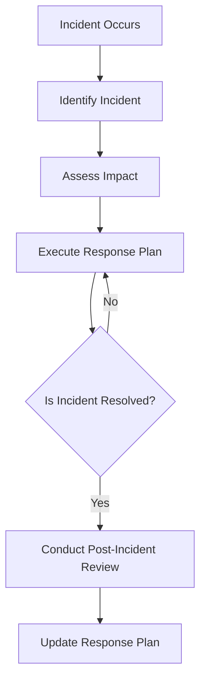

## 24.6. Incident Response Planning

In the rapidly evolving world of software development, preparing for incidents is not just a best practice; it's a necessity. With the increasing complexity of systems and the ever-present threat of security breaches, having a robust incident response plan is crucial. This section will guide you through the process of developing an effective incident response plan specifically tailored for Elixir applications. We will cover preparing for incidents, notification procedures, and recovery strategies.

### Preparing for Incidents

Incident response planning begins long before an incident occurs. The preparation phase involves developing comprehensive response plans for potential breaches or outages. This phase is critical for minimizing damage and ensuring a swift recovery.

#### Developing Response Plans

1. **Identify Potential Incidents**: Start by identifying the types of incidents that could affect your Elixir application. These might include data breaches, system outages, or performance degradation.

2. **Risk Assessment**: Conduct a risk assessment to determine the likelihood and impact of each type of incident. This will help prioritize your response efforts.

3. **Define Roles and Responsibilities**: Clearly define the roles and responsibilities of each team member in the event of an incident. This includes identifying who will lead the response effort, who will communicate with stakeholders, and who will be responsible for technical recovery.

4. **Develop Response Procedures**: Create detailed response procedures for each type of incident. These procedures should outline the steps to take during an incident, including containment, eradication, and recovery.

5. **Establish Communication Channels**: Set up communication channels for internal and external stakeholders. This ensures that everyone is informed and can coordinate effectively during an incident.

6. **Training and Drills**: Regularly train your team on the response procedures and conduct drills to test the effectiveness of your plan. This helps ensure that everyone knows their role and can act quickly in a real incident.

#### Code Example: Logging and Monitoring

To effectively prepare for incidents, logging and monitoring are essential. Here's an example of how you might set up logging in an Elixir application:

```elixir
defmodule MyApp.Logger do
  require Logger

  def log_info(message) do
    Logger.info(fn -> "INFO: #{message}" end)
  end

  def log_error(message) do
    Logger.error(fn -> "ERROR: #{message}" end)
  end
end

# Usage
MyApp.Logger.log_info("Application started successfully.")
MyApp.Logger.log_error("Failed to connect to the database.")
```

**Try It Yourself**: Modify the logging level to `:debug` and observe how it affects the output. This can help you fine-tune what information is logged during normal operations versus during incidents.

### Notification Procedures

Once an incident occurs, it's crucial to have a plan for notifying the appropriate parties. This includes complying with legal requirements for breach notifications and ensuring that all stakeholders are informed.

#### Complying with Legal Requirements

1. **Understand Legal Obligations**: Familiarize yourself with the legal requirements for breach notifications in your jurisdiction. This may include notifying affected individuals, regulatory bodies, or other stakeholders within a specific timeframe.

2. **Develop Notification Templates**: Prepare notification templates in advance to ensure that you can quickly send out accurate and compliant notifications. These should include key information such as the nature of the incident, the data affected, and steps being taken to address the issue.

3. **Establish a Notification Timeline**: Define a timeline for notifications that aligns with legal requirements and best practices. This should include immediate notifications for critical stakeholders and follow-up communications as more information becomes available.

#### Code Example: Automated Notifications

Automating notifications can help ensure timely communication during an incident. Here's an example using Elixir's `:gen_smtp` library to send email notifications:

```elixir
defmodule MyApp.Notification do
  use GenServer

  def send_email(to, subject, body) do
    :gen_smtp_client.send_blocking({
      :from_email,
      [to],
      subject,
      body
    })
  end
end

# Usage
MyApp.Notification.send_email("user@example.com", "Security Alert", "A potential breach has been detected.")
```

**Try It Yourself**: Experiment with different email templates and recipient lists to see how you can customize notifications for different types of incidents.

### Recovery Strategies

After an incident, the focus shifts to restoring services and data. Effective recovery strategies are essential for minimizing downtime and ensuring business continuity.

#### Restoring Services and Data

1. **Data Backup and Restoration**: Ensure that you have regular backups of your data and a tested restoration process. This will allow you to quickly recover lost or corrupted data.

2. **Service Failover**: Implement failover mechanisms to ensure that your services can continue operating even if a primary system fails. This might include using redundant servers or cloud-based failover solutions.

3. **Incident Analysis and Improvement**: After recovering from an incident, conduct a thorough analysis to understand what went wrong and how it can be prevented in the future. Use this information to improve your incident response plan.

#### Code Example: Data Backup

Here's an example of how you might implement a simple data backup process in Elixir:

```elixir
defmodule MyApp.Backup do
  def backup_data(data, file_path) do
    File.write!(file_path, :erlang.term_to_binary(data))
  end

  def restore_data(file_path) do
    {:ok, binary} = File.read(file_path)
    :erlang.binary_to_term(binary)
  end
end

# Usage
data = %{user: "john_doe", email: "john@example.com"}
MyApp.Backup.backup_data(data, "backup.dat")

restored_data = MyApp.Backup.restore_data("backup.dat")
IO.inspect(restored_data)
```

**Try It Yourself**: Modify the backup process to include encryption for added security. This can help protect sensitive data during storage and transfer.

### Visualizing Incident Response Workflow

To better understand the flow of an incident response plan, let's visualize it using a Mermaid.js diagram:


```mermaid
flowchart TD
    A[Incident Occurs] --> B[Identify Incident]
    B --> C[Assess Impact]
    C --> D[Execute Response Plan]
    D --> E{Is Incident Resolved?}
    E -->|Yes| F[Conduct Post-Incident Review]
    E -->|No| D
    F --> G[Update Response Plan]
```

**Description**: This flowchart represents the typical workflow of an incident response plan, from identifying an incident to conducting a post-incident review and updating the response plan.

### References and Links

For further reading on incident response planning and compliance, consider the following resources:

- [NIST Computer Security Incident Handling Guide](https://nvlpubs.nist.gov/nistpubs/SpecialPublications/NIST.SP.800-61r2.pdf)
- [GDPR Breach Notification Guidelines](https://gdpr.eu/article-33-breach-notification/)
- [OWASP Incident Response Guide](https://owasp.org/www-project-incident-response-guide/)

### Knowledge Check

To reinforce your understanding of incident response planning, consider the following questions:

1. What are the key components of an incident response plan?
2. How can you automate notifications to stakeholders during an incident?
3. What are the legal requirements for breach notifications in your jurisdiction?
4. How can data backups aid in recovery after an incident?
5. Why is it important to conduct a post-incident review?

### Embrace the Journey

Remember, incident response planning is an ongoing process. As you implement and refine your plan, you'll gain valuable insights that will help you improve your response capabilities. Stay proactive, keep learning, and embrace the journey towards building resilient Elixir applications.

## Quiz Time!



### What is the first step in developing an incident response plan?

- [x] Identify potential incidents
- [ ] Establish communication channels
- [ ] Conduct training and drills
- [ ] Develop notification templates

> **Explanation:** Identifying potential incidents is the foundation of an effective incident response plan, allowing you to tailor your preparations accordingly.

### Which Elixir library can be used to send email notifications during an incident?

- [ ] Logger
- [x] :gen_smtp
- [ ] Ecto
- [ ] Plug

> **Explanation:** The `:gen_smtp` library in Elixir is used for sending emails, making it suitable for automated notifications during incidents.

### Why is it important to comply with legal requirements for breach notifications?

- [x] To avoid legal penalties and maintain trust
- [ ] To increase the complexity of the response plan
- [ ] To ensure data backups are up-to-date
- [ ] To improve system performance

> **Explanation:** Complying with legal requirements for breach notifications helps avoid penalties and maintains trust with stakeholders.

### What should be included in a post-incident review?

- [x] Analysis of the incident and improvements to the response plan
- [ ] Only the technical details of the incident
- [ ] A list of all stakeholders involved
- [ ] A summary of all logged data

> **Explanation:** A post-incident review should analyze the incident and identify improvements to enhance future response efforts.

### How can data encryption enhance the backup process?

- [x] By protecting sensitive data during storage and transfer
- [ ] By reducing the size of backup files
- [ ] By speeding up the restoration process
- [ ] By simplifying the backup process

> **Explanation:** Data encryption secures sensitive information, ensuring it remains protected during storage and transfer.

### What is the purpose of conducting drills in incident response planning?

- [x] To ensure team members know their roles and can act quickly
- [ ] To increase the complexity of the response plan
- [ ] To automate the notification process
- [ ] To reduce the number of potential incidents

> **Explanation:** Drills help team members practice their roles, ensuring a swift and effective response during real incidents.

### What role does risk assessment play in incident response planning?

- [x] It helps prioritize response efforts based on likelihood and impact
- [ ] It automates the notification process
- [ ] It establishes communication channels
- [ ] It simplifies the backup process

> **Explanation:** Risk assessment identifies the likelihood and impact of incidents, helping prioritize response efforts.

### Which of the following is a key component of recovery strategies?

- [x] Data backup and restoration
- [ ] Notification templates
- [ ] Legal compliance
- [ ] Communication channels

> **Explanation:** Data backup and restoration are crucial for recovering lost or corrupted data after an incident.

### What is the benefit of using failover mechanisms in recovery strategies?

- [x] Ensures services continue operating even if a primary system fails
- [ ] Simplifies the response plan
- [ ] Reduces the need for data backups
- [ ] Automates the notification process

> **Explanation:** Failover mechanisms provide redundancy, ensuring services remain operational despite system failures.

### True or False: Incident response planning is a one-time process.

- [ ] True
- [x] False

> **Explanation:** Incident response planning is an ongoing process that requires regular updates and improvements based on new insights and changing conditions.


