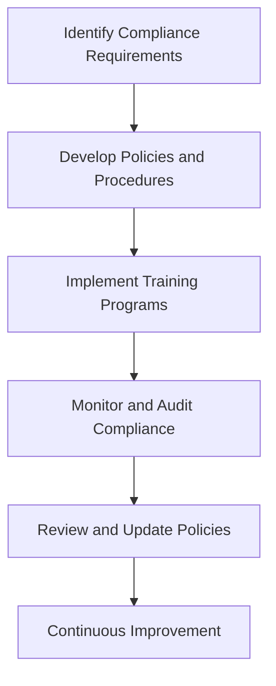

## 24.7. Best Practices for Regulatory Compliance

In today's rapidly evolving technological landscape, regulatory compliance is a critical aspect of software development. For Elixir developers, understanding and implementing best practices for regulatory compliance is essential to ensure that applications meet legal and ethical standards. This section will guide you through the key components of regulatory compliance, including documentation, regular training, and fostering a compliance culture within your organization.

### Understanding Regulatory Compliance

Regulatory compliance refers to the adherence to laws, regulations, guidelines, and specifications relevant to an organization's business processes. In the context of software development, this often involves ensuring that applications protect user data, maintain privacy, and operate within the legal frameworks of the jurisdictions in which they are used.

#### Key Regulations to Consider

- **General Data Protection Regulation (GDPR)**: A European Union regulation that mandates data protection and privacy for individuals within the EU.
- **Health Insurance Portability and Accountability Act (HIPAA)**: A US regulation that provides data privacy and security provisions for safeguarding medical information.
- **California Consumer Privacy Act (CCPA)**: A state statute intended to enhance privacy rights and consumer protection for residents of California, USA.

### Documentation: The Backbone of Compliance

Maintaining clear and comprehensive documentation is a cornerstone of regulatory compliance. Proper documentation not only demonstrates compliance efforts but also serves as a reference for audits and assessments.

#### Best Practices for Documentation

1. **Comprehensive Data Mapping**: Document all data flows within your application. This includes data collection, storage, processing, and sharing. Use diagrams to visualize data flow and identify potential compliance risks.

   ```mermaid
   graph TD;
       A[User Input] --> B[Data Collection];
       B --> C[Data Processing];
       C --> D[Data Storage];
       D --> E[Data Sharing];
   ```

   *Diagram: Visualizing Data Flow in an Application*

2. **Version Control**: Use version control systems like Git to track changes in documentation. This ensures that you have a historical record of compliance efforts and can easily revert to previous versions if necessary.

3. **Regular Updates**: Compliance requirements can change over time. Regularly review and update documentation to reflect the latest regulatory standards and organizational practices.

4. **Accessibility**: Ensure that documentation is easily accessible to all relevant stakeholders. Use centralized repositories or document management systems to facilitate access and collaboration.

5. **Audit Trails**: Maintain detailed audit trails of compliance-related activities. This includes records of data access, modifications, and deletions, as well as logs of compliance training sessions and policy updates.

### Regular Training: Empowering Your Team

Regular training is essential to keep your team informed about compliance obligations and best practices. Training programs should be tailored to the specific needs of your organization and the regulatory environment in which you operate.

#### Designing Effective Training Programs

1. **Identify Training Needs**: Conduct a needs assessment to identify gaps in knowledge and skills related to regulatory compliance. This will help you design targeted training programs that address specific areas of concern.

2. **Engage Experts**: Involve legal and compliance experts in the development and delivery of training programs. Their expertise can provide valuable insights into complex regulatory requirements and help clarify any ambiguities.

3. **Interactive Learning**: Use interactive learning methods, such as workshops, simulations, and role-playing exercises, to engage participants and enhance retention. Encourage active participation and provide opportunities for hands-on practice.

4. **Continuous Learning**: Regulatory compliance is an ongoing process. Implement continuous learning initiatives, such as regular refresher courses and updates on new regulations, to ensure that your team remains informed and compliant.

5. **Feedback and Evaluation**: Collect feedback from participants to evaluate the effectiveness of training programs. Use this feedback to make improvements and ensure that training remains relevant and impactful.

### Compliance Culture: Building Awareness and Responsibility

Fostering a compliance culture within your organization is crucial for ensuring that compliance is not just a checkbox exercise but a fundamental aspect of your operations. A strong compliance culture promotes awareness, responsibility, and accountability among all employees.

#### Strategies for Building a Compliance Culture

1. **Leadership Commitment**: Demonstrate leadership commitment to compliance by setting a positive example and prioritizing compliance initiatives. Leaders should actively participate in training programs and communicate the importance of compliance to the organization.

2. **Clear Policies and Procedures**: Develop clear and concise compliance policies and procedures that outline expectations and responsibilities. Ensure that these policies are communicated to all employees and are easily accessible.

3. **Open Communication**: Encourage open communication about compliance-related issues. Create channels for employees to report concerns or seek guidance without fear of retaliation.

4. **Incentives and Recognition**: Recognize and reward employees who demonstrate a strong commitment to compliance. This can include formal recognition programs, performance bonuses, or other incentives.

5. **Regular Assessments**: Conduct regular assessments of your compliance culture to identify areas for improvement. Use surveys, interviews, and focus groups to gather feedback and insights from employees.

### Code Examples: Implementing Compliance in Elixir

To illustrate how compliance can be integrated into Elixir development, let's explore some code examples that demonstrate best practices for data protection and privacy.

#### Example 1: Data Encryption

Encrypting sensitive data is a fundamental practice for ensuring data privacy and security. In Elixir, you can use the `:crypto` module to encrypt data.

```elixir
defmodule DataEncryption do
  @moduledoc """
  Module for encrypting and decrypting sensitive data.
  """

  @key :crypto.strong_rand_bytes(32)

  def encrypt(data) do
    :crypto.block_encrypt(:aes_gcm, @key, <<0::96>>, data)
  end

  def decrypt(encrypted_data) do
    :crypto.block_decrypt(:aes_gcm, @key, <<0::96>>, encrypted_data)
  end
end

# Usage
data = "Sensitive Information"
encrypted_data = DataEncryption.encrypt(data)
decrypted_data = DataEncryption.decrypt(encrypted_data)

IO.puts("Original: #{data}")
IO.puts("Encrypted: #{Base.encode64(encrypted_data)}")
IO.puts("Decrypted: #{decrypted_data}")
```

*Code Example: Encrypting and Decrypting Data in Elixir*

#### Example 2: Access Control

Implementing access control mechanisms is essential for protecting sensitive data and ensuring that only authorized users have access.

```elixir
defmodule AccessControl do
  @moduledoc """
  Module for managing user access control.
  """

  def authorize(user, resource) do
    case user.role do
      :admin -> {:ok, resource}
      :user -> if resource.public, do: {:ok, resource}, else: {:error, :unauthorized}
      _ -> {:error, :unauthorized}
    end
  end
end

# Usage
user = %{role: :user}
resource = %{public: false}

case AccessControl.authorize(user, resource) do
  {:ok, _} -> IO.puts("Access granted")
  {:error, _} -> IO.puts("Access denied")
end
```

*Code Example: Implementing Access Control in Elixir*

### Visualizing Compliance Processes

To better understand the compliance processes, let's visualize the workflow of implementing a compliance program in an organization.



*Diagram: Workflow of Implementing a Compliance Program*

### Try It Yourself: Experiment with Code Examples

To reinforce your understanding of compliance best practices, try modifying the code examples provided. Experiment with different encryption algorithms, access control rules, and data flows. Consider how these changes impact compliance and security.

### References and Further Reading

- [GDPR Compliance](https://gdpr.eu/)
- [HIPAA Compliance](https://www.hhs.gov/hipaa/index.html)
- [CCPA Compliance](https://oag.ca.gov/privacy/ccpa)

### Knowledge Check

- What are the key components of regulatory compliance in software development?
- How can documentation support compliance efforts?
- Why is regular training important for compliance?
- What strategies can be used to foster a compliance culture?
- How can Elixir be used to implement compliance best practices?

### Embrace the Journey

Remember, achieving regulatory compliance is an ongoing journey. As regulations evolve and new challenges arise, it's important to stay informed and proactive. By implementing best practices for documentation, training, and fostering a compliance culture, you can ensure that your Elixir applications remain compliant and secure. Keep experimenting, stay curious, and enjoy the journey!

## Quiz: Best Practices for Regulatory Compliance



### What is the primary purpose of regulatory compliance in software development?

- [x] To adhere to laws and regulations relevant to business processes
- [ ] To increase software performance
- [ ] To enhance user interface design
- [ ] To reduce development costs

> **Explanation:** Regulatory compliance ensures that applications operate within legal frameworks and protect user data.

### Which regulation mandates data protection and privacy for individuals within the EU?

- [x] GDPR
- [ ] HIPAA
- [ ] CCPA
- [ ] PCI DSS

> **Explanation:** The General Data Protection Regulation (GDPR) is a European Union regulation focused on data protection and privacy.

### What is a key benefit of maintaining comprehensive documentation for compliance?

- [x] It serves as a reference for audits and assessments
- [ ] It improves application performance
- [ ] It reduces development time
- [ ] It enhances user experience

> **Explanation:** Documentation demonstrates compliance efforts and provides a reference for audits.

### Why is regular training important for regulatory compliance?

- [x] To keep the team informed about compliance obligations
- [ ] To improve coding skills
- [ ] To reduce software bugs
- [ ] To enhance user interface design

> **Explanation:** Regular training ensures that the team is aware of compliance requirements and best practices.

### What is a strategy for fostering a compliance culture within an organization?

- [x] Leadership commitment
- [ ] Increasing development speed
- [ ] Reducing documentation
- [ ] Enhancing user interface design

> **Explanation:** Leadership commitment is crucial for promoting awareness and responsibility for compliance.

### What is a key feature of the `:crypto` module in Elixir?

- [x] Data encryption
- [ ] User interface design
- [ ] Performance optimization
- [ ] Database management

> **Explanation:** The `:crypto` module provides functions for encrypting and decrypting data.

### How can access control be implemented in Elixir?

- [x] By defining authorization rules based on user roles
- [ ] By optimizing database queries
- [ ] By enhancing user interface design
- [ ] By reducing application size

> **Explanation:** Access control involves defining rules to ensure only authorized users can access certain resources.

### What is the purpose of audit trails in compliance documentation?

- [x] To maintain records of compliance-related activities
- [ ] To improve application performance
- [ ] To enhance user interface design
- [ ] To reduce development costs

> **Explanation:** Audit trails provide a detailed record of compliance activities for reference and audits.

### What is a benefit of using interactive learning methods in compliance training?

- [x] Enhanced retention and engagement
- [ ] Reduced training costs
- [ ] Improved application performance
- [ ] Enhanced user interface design

> **Explanation:** Interactive learning methods engage participants and improve retention of compliance knowledge.

### True or False: Compliance requirements remain constant over time.

- [ ] True
- [x] False

> **Explanation:** Compliance requirements can change over time, necessitating regular updates to documentation and training.


