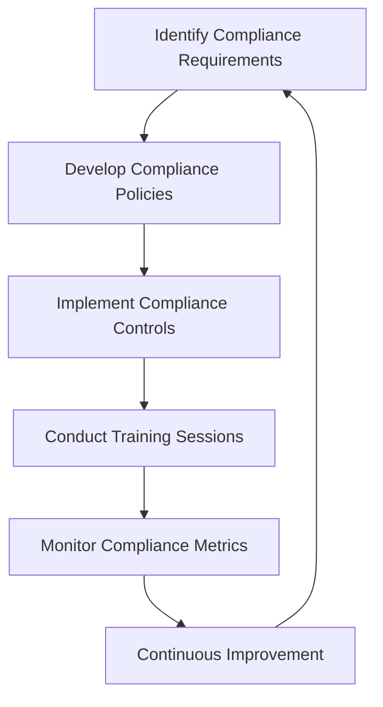

## 24.7. Best Practices for Regulatory Compliance

In today's rapidly evolving technological landscape, regulatory compliance has become a cornerstone of software development. As expert software engineers and architects working with Elixir, it's crucial to integrate compliance measures into your development processes. This section will guide you through best practices for achieving regulatory compliance, emphasizing documentation, regular training, and fostering a compliance culture within your organization.

### Introduction to Regulatory Compliance

Regulatory compliance involves adhering to laws, regulations, guidelines, and specifications relevant to your business processes. In software development, this often includes data protection laws, industry-specific regulations, and standards for security and privacy. Non-compliance can lead to legal penalties, financial losses, and damage to your organization's reputation.

### Importance of Regulatory Compliance in Software Development

Compliance is not just a legal obligation; it is also a competitive advantage. By demonstrating a commitment to compliance, organizations can build trust with customers and stakeholders. Moreover, compliance can drive innovation by encouraging the adoption of best practices and frameworks that enhance security, privacy, and data integrity.

### Key Regulatory Frameworks

Several regulatory frameworks are relevant to software development, including:

- **General Data Protection Regulation (GDPR):** A European Union regulation that focuses on data protection and privacy.
- **Health Insurance Portability and Accountability Act (HIPAA):** A U.S. regulation that sets standards for protecting sensitive patient information.
- **Payment Card Industry Data Security Standard (PCI DSS):** A set of security standards designed to protect card information during and after a financial transaction.

Understanding these frameworks and their implications is essential for developing compliant software solutions.

### Documentation: The Backbone of Compliance

#### Importance of Documentation

Documentation is a critical component of regulatory compliance. It provides evidence of compliance efforts and serves as a reference for audits and inspections. Proper documentation can also facilitate communication and collaboration within your team and with external stakeholders.

#### Types of Documentation

1. **Policy Documents:** Outline your organization's compliance policies and procedures.
2. **Process Documentation:** Detail the steps and controls implemented to ensure compliance.
3. **Training Records:** Document the training sessions conducted and the participants involved.
4. **Audit Trails:** Maintain logs of system activities to demonstrate compliance with regulatory requirements.

#### Best Practices for Documentation

- **Keep Documentation Up-to-Date:** Regularly review and update your documentation to reflect changes in regulations and business processes.
- **Use Clear and Concise Language:** Ensure that your documentation is easily understandable by all stakeholders.
- **Leverage Automation Tools:** Use tools to automate documentation processes, reducing the risk of human error and ensuring consistency.

### Regular Training: Empowering Your Team

#### Importance of Training

Training is essential for ensuring that your team understands compliance obligations and knows how to implement them effectively. Regular training sessions can help prevent compliance breaches and promote a culture of continuous improvement.

#### Designing Effective Training Programs

1. **Identify Training Needs:** Assess the specific compliance requirements relevant to your organization and tailor your training programs accordingly.
2. **Engage Experienced Trainers:** Utilize trainers with expertise in regulatory compliance and Elixir development to deliver high-quality training sessions.
3. **Incorporate Interactive Elements:** Use case studies, simulations, and hands-on exercises to enhance learning and engagement.

#### Evaluating Training Effectiveness

- **Conduct Assessments:** Use quizzes and tests to evaluate participants' understanding of the training material.
- **Gather Feedback:** Collect feedback from participants to identify areas for improvement in your training programs.
- **Monitor Compliance Metrics:** Track compliance-related metrics to assess the impact of training on your organization's compliance performance.

### Compliance Culture: Building a Compliance-First Organization

#### Importance of a Compliance Culture

A strong compliance culture is characterized by an organization-wide commitment to ethical behavior and regulatory adherence. It fosters an environment where compliance is viewed as a shared responsibility and an integral part of the organization's values.

#### Strategies for Fostering a Compliance Culture

1. **Leadership Commitment:** Ensure that organizational leaders demonstrate a commitment to compliance and set a positive example for employees.
2. **Open Communication:** Encourage open communication about compliance issues and provide channels for employees to report concerns without fear of retaliation.
3. **Incentivize Compliance:** Recognize and reward employees who contribute to compliance efforts and demonstrate ethical behavior.

#### Measuring Compliance Culture

- **Conduct Surveys:** Use surveys to assess employees' perceptions of the organization's compliance culture.
- **Analyze Incident Reports:** Review compliance-related incidents to identify trends and areas for improvement.
- **Monitor Employee Engagement:** Track engagement metrics to ensure that employees are motivated and aligned with the organization's compliance goals.

### Code Examples: Implementing Compliance in Elixir

Let's explore how to implement some compliance measures in Elixir through code examples.

#### Example 1: Logging and Audit Trails

```elixir
defmodule ComplianceLogger do
  @moduledoc """
  A module for logging compliance-related events.
  """

  require Logger

  @doc """
  Logs an event with a timestamp and user information.
  """
  def log_event(user_id, event) do
    timestamp = DateTime.utc_now() |> DateTime.to_string()
    Logger.info("[#{timestamp}] User #{user_id}: #{event}")
  end
end

# Usage
ComplianceLogger.log_event("user123", "Accessed sensitive data")
```

In this example, we create a simple logging module to track compliance-related events. The `log_event` function logs the event with a timestamp and user information, providing an audit trail for compliance purposes.

#### Example 2: Data Encryption

```elixir
defmodule DataEncryptor do
  @moduledoc """
  A module for encrypting and decrypting sensitive data.
  """

  @key :crypto.strong_rand_bytes(32)

  @doc """
  Encrypts the given data using AES encryption.
  """
  def encrypt(data) do
    :crypto.block_encrypt(:aes_gcm, @key, <<>>, data)
  end

  @doc """
  Decrypts the given encrypted data.
  """
  def decrypt(encrypted_data) do
    :crypto.block_decrypt(:aes_gcm, @key, <<>>, encrypted_data)
  end
end

# Usage
encrypted = DataEncryptor.encrypt("Sensitive Information")
decrypted = DataEncryptor.decrypt(encrypted)
```

This example demonstrates how to encrypt and decrypt sensitive data using AES encryption in Elixir. Data encryption is a critical compliance measure for protecting sensitive information.

### Visualizing Compliance Processes

To better understand the compliance processes, let's visualize a typical compliance workflow using a flowchart.


```mermaid
graph TD;
    A[Identify Compliance Requirements] --> B[Develop Compliance Policies]
    B --> C[Implement Compliance Controls]
    C --> D[Conduct Training Sessions]
    D --> E[Monitor Compliance Metrics]
    E --> F[Continuous Improvement]
    F --> A
```

**Diagram Description:** This flowchart represents a continuous compliance process, starting with identifying compliance requirements and developing policies, followed by implementing controls, conducting training, monitoring metrics, and continuously improving compliance efforts.

### References and Further Reading

For more information on regulatory compliance and best practices, consider exploring the following resources:

- [GDPR Overview](https://gdpr-info.eu/)
- [HIPAA Compliance Guide](https://www.hhs.gov/hipaa/for-professionals/index.html)
- [PCI DSS Standards](https://www.pcisecuritystandards.org/)

### Knowledge Check

- **Question:** What are the key components of a compliance culture?
- **Question:** How can documentation support regulatory compliance efforts?
- **Question:** Why is regular training important for compliance?

### Conclusion

Incorporating regulatory compliance into your Elixir development processes is essential for building secure, trustworthy, and legally compliant software solutions. By focusing on documentation, training, and fostering a compliance culture, you can ensure that your organization meets its compliance obligations and maintains a competitive edge in the marketplace.

Remember, compliance is an ongoing journey. Stay informed about regulatory changes, continuously evaluate your compliance processes, and strive for improvement. Embrace the challenge and enjoy the journey toward building a compliance-first organization.

## Quiz Time!



### What is the primary purpose of regulatory compliance in software development?

- [x] To adhere to laws and regulations relevant to business processes
- [ ] To increase software development speed
- [ ] To reduce software development costs
- [ ] To eliminate the need for testing

> **Explanation:** Regulatory compliance ensures adherence to laws and regulations, which is crucial for legal and ethical business operations.

### Which of the following is a key component of documentation for compliance?

- [x] Policy Documents
- [ ] Marketing Strategies
- [ ] User Interface Design
- [ ] Code Refactoring Guidelines

> **Explanation:** Policy documents outline compliance policies and procedures, serving as a foundation for compliance documentation.

### Why is regular training important for compliance?

- [x] It ensures the team understands compliance obligations
- [ ] It reduces the need for documentation
- [ ] It eliminates the need for audits
- [ ] It increases software performance

> **Explanation:** Regular training helps the team understand compliance obligations and implement them effectively.

### What is a benefit of fostering a compliance culture in an organization?

- [x] It promotes ethical behavior and shared responsibility
- [ ] It reduces the need for software updates
- [ ] It increases software complexity
- [ ] It eliminates the need for testing

> **Explanation:** A compliance culture promotes ethical behavior and shared responsibility for compliance across the organization.

### How can automation tools aid in compliance documentation?

- [x] By reducing human error and ensuring consistency
- [ ] By increasing manual data entry
- [ ] By eliminating the need for policy documents
- [ ] By making documentation more complex

> **Explanation:** Automation tools help reduce human error and ensure consistency in compliance documentation.

### What is the role of leadership in fostering a compliance culture?

- [x] Demonstrating commitment to compliance and setting a positive example
- [ ] Eliminating the need for compliance policies
- [ ] Increasing software development speed
- [ ] Reducing the need for audits

> **Explanation:** Leadership plays a crucial role in demonstrating commitment to compliance and setting a positive example for employees.

### What is the purpose of conducting assessments in compliance training?

- [x] To evaluate participants' understanding of the training material
- [ ] To reduce the need for compliance policies
- [ ] To eliminate the need for audits
- [ ] To increase software performance

> **Explanation:** Assessments help evaluate participants' understanding of the training material and identify areas for improvement.

### How can surveys help measure compliance culture?

- [x] By assessing employees' perceptions of the organization's compliance culture
- [ ] By increasing software development speed
- [ ] By reducing the need for documentation
- [ ] By eliminating the need for training

> **Explanation:** Surveys help assess employees' perceptions of the organization's compliance culture, providing insights for improvement.

### What is a key benefit of maintaining audit trails?

- [x] Providing evidence of compliance efforts
- [ ] Reducing software complexity
- [ ] Eliminating the need for testing
- [ ] Increasing software performance

> **Explanation:** Audit trails provide evidence of compliance efforts, which is essential for audits and inspections.

### True or False: Compliance is a one-time effort.

- [ ] True
- [x] False

> **Explanation:** Compliance is an ongoing journey that requires continuous evaluation and improvement to adapt to regulatory changes.


