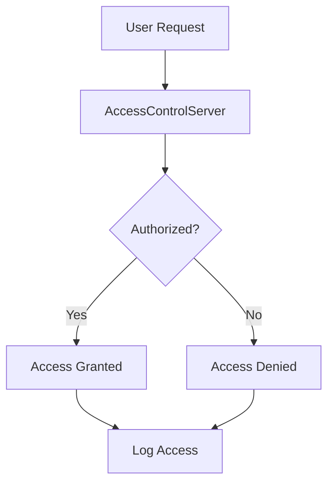
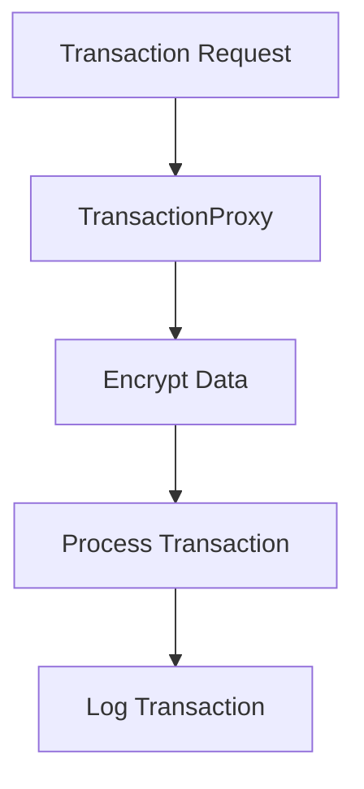

## 24.8. Case Studies in Regulated Industries

In this section, we delve into the application of Elixir design patterns within regulated industries, focusing on healthcare and financial services. These sectors demand stringent compliance with regulations such as HIPAA (Health Insurance Portability and Accountability Act) and PCI DSS (Payment Card Industry Data Security Standard). We will explore how Elixir's features and design patterns can be leveraged to meet these requirements effectively.

### Healthcare Applications

#### Implementing HIPAA-Compliant Features

Healthcare applications must adhere to HIPAA regulations, which mandate the protection of sensitive patient data. Elixir, with its robust concurrency model and fault-tolerant design, is well-suited for building secure and reliable healthcare systems.

**Key Requirements of HIPAA:**

1. **Data Encryption:** Protecting data both at rest and in transit.
2. **Access Control:** Ensuring that only authorized personnel can access sensitive information.
3. **Audit Trails:** Maintaining logs of data access and modifications.
4. **Data Integrity:** Ensuring that data is not altered or destroyed in an unauthorized manner.

**Elixir Design Patterns for HIPAA Compliance:**

- **Supervisor Pattern:** Utilize supervisors to manage processes that handle sensitive data, ensuring they are restarted in case of failure.
- **GenServer for Access Control:** Implement GenServers to manage user sessions and enforce access control policies.
- **ETS for Audit Trails:** Use Erlang Term Storage (ETS) to maintain audit logs, providing fast access and persistence.
- **Encryption Libraries:** Leverage libraries like `Comeonin` and `Argon2` for encrypting sensitive data.

**Code Example: Implementing Access Control with GenServer**

```elixir
defmodule AccessControlServer do
  use GenServer

  # Client API
  def start_link(initial_state) do
    GenServer.start_link(__MODULE__, initial_state, name: __MODULE__)
  end

  def authorize_user(user_id, resource) do
    GenServer.call(__MODULE__, {:authorize, user_id, resource})
  end

  # Server Callbacks
  def init(initial_state) do
    {:ok, initial_state}
  end

  def handle_call({:authorize, user_id, resource}, _from, state) do
    if authorized?(user_id, resource, state) do
      {:reply, :ok, state}
    else
      {:reply, {:error, :unauthorized}, state}
    end
  end

  defp authorized?(user_id, resource, state) do
    # Implement authorization logic here
    true
  end
end
```

**Try It Yourself:**

- Modify the `authorized?/3` function to implement specific authorization logic based on user roles or permissions.
- Experiment with adding logging to track authorization requests.

**Visualizing HIPAA Compliance in Elixir Applications**



**Diagram Description:** This flowchart illustrates the process of handling user requests in a HIPAA-compliant Elixir application using a GenServer for access control.

### Financial Services

#### Meeting Requirements like PCI DSS

Financial services must comply with PCI DSS to protect cardholder data. Elixir's capabilities in handling concurrent processes and ensuring data integrity make it an ideal choice for developing secure financial applications.

**Key Requirements of PCI DSS:**

1. **Secure Network:** Implementing firewalls and encryption.
2. **Data Protection:** Encrypting cardholder data and maintaining secure storage.
3. **Access Management:** Restricting access to cardholder data.
4. **Monitoring and Testing:** Regularly monitoring networks and testing security systems.

**Elixir Design Patterns for PCI DSS Compliance:**

- **Proxy Pattern with GenServers:** Use GenServers as proxies to manage and secure data transactions.
- **Decorator Pattern for Logging:** Implement decorators to log transactions and monitor access.
- **ETS for Secure Data Storage:** Utilize ETS for storing sensitive data securely and efficiently.
- **Task and Async Patterns:** Employ tasks for handling concurrent data processing and encryption.

**Code Example: Secure Data Transactions with GenServer**

```elixir
defmodule TransactionProxy do
  use GenServer

  # Client API
  def start_link(_) do
    GenServer.start_link(__MODULE__, %{}, name: __MODULE__)
  end

  def process_transaction(transaction_data) do
    GenServer.call(__MODULE__, {:process, transaction_data})
  end

  # Server Callbacks
  def init(state) do
    {:ok, state}
  end

  def handle_call({:process, transaction_data}, _from, state) do
    encrypted_data = encrypt(transaction_data)
    # Process the transaction
    {:reply, :ok, state}
  end

  defp encrypt(data) do
    # Implement encryption logic here
    data
  end
end
```

**Try It Yourself:**

- Implement the `encrypt/1` function using a library like `Comeonin`.
- Add error handling to manage failed transactions.

**Visualizing PCI DSS Compliance in Elixir Applications**



**Diagram Description:** This flowchart demonstrates the process of handling transaction requests in a PCI DSS-compliant Elixir application using a GenServer as a proxy.

### Lessons Learned

#### Challenges and Solutions from Real-World Compliance Efforts

Implementing compliance in regulated industries presents unique challenges. Here are some lessons learned from real-world applications:

1. **Challenge: Ensuring Data Integrity**
   - **Solution:** Use Elixir's immutable data structures to prevent unauthorized data modifications.

2. **Challenge: Managing Concurrent Access**
   - **Solution:** Leverage Elixir's concurrency model to handle multiple requests efficiently without data corruption.

3. **Challenge: Maintaining Audit Trails**
   - **Solution:** Implement logging mechanisms using ETS or external logging services to track data access and modifications.

4. **Challenge: Securing Data in Transit**
   - **Solution:** Use SSL/TLS for secure communication between services.

5. **Challenge: Adapting to Changing Regulations**
   - **Solution:** Design systems with flexibility in mind, allowing for easy updates to compliance-related features.

**Key Takeaways:**

- Elixir's design patterns and features provide a strong foundation for building compliant applications in regulated industries.
- The use of GenServers, Supervisors, and ETS can help manage data securely and efficiently.
- Regularly updating and testing systems is crucial to maintaining compliance with evolving regulations.

**Encouragement for Continued Learning:**

Remember, compliance is an ongoing journey. As regulations evolve, so too must our systems and practices. Stay informed, keep experimenting, and leverage the power of Elixir to build secure and compliant applications.

## Quiz: Case Studies in Regulated Industries



### Which Elixir feature is particularly useful for managing concurrent access in regulated industries?

- [x] GenServer
- [ ] Macros
- [ ] Pattern Matching
- [ ] Protocols

> **Explanation:** GenServer is a core feature in Elixir that helps manage state and handle concurrent requests efficiently, making it ideal for regulated industries.

### What is a key requirement of HIPAA compliance?

- [x] Data Encryption
- [ ] Open Source Licensing
- [ ] Real-Time Processing
- [ ] Cloud Integration

> **Explanation:** HIPAA requires data encryption to protect sensitive patient information both at rest and in transit.

### Which pattern is recommended for logging transactions in PCI DSS-compliant applications?

- [x] Decorator Pattern
- [ ] Singleton Pattern
- [ ] Factory Pattern
- [ ] Observer Pattern

> **Explanation:** The Decorator Pattern is useful for adding logging functionality to existing processes without modifying their core logic.

### What is a common challenge in implementing compliance in regulated industries?

- [x] Ensuring Data Integrity
- [ ] Implementing Machine Learning
- [ ] Developing Mobile Apps
- [ ] Creating User Interfaces

> **Explanation:** Ensuring data integrity is a critical challenge in regulated industries, requiring robust systems to prevent unauthorized data modifications.

### Which Elixir feature can be used for maintaining audit trails?

- [x] ETS
- [ ] Phoenix
- [ ] Ecto
- [ ] Plug

> **Explanation:** ETS (Erlang Term Storage) is a powerful feature for maintaining fast and persistent audit logs in Elixir applications.

### What is a benefit of using Elixir's immutable data structures in regulated industries?

- [x] Preventing unauthorized data modifications
- [ ] Enhancing user interfaces
- [ ] Simplifying code syntax
- [ ] Improving network speed

> **Explanation:** Immutable data structures help ensure data integrity by preventing unauthorized modifications, which is crucial in regulated industries.

### How can Elixir's concurrency model benefit regulated industries?

- [x] By handling multiple requests efficiently
- [ ] By simplifying database queries
- [ ] By enhancing graphical interfaces
- [ ] By reducing code complexity

> **Explanation:** Elixir's concurrency model allows for efficient handling of multiple requests, reducing the risk of data corruption in regulated industries.

### What is a recommended solution for securing data in transit?

- [x] Using SSL/TLS
- [ ] Implementing REST APIs
- [ ] Utilizing JSON
- [ ] Applying CSS

> **Explanation:** SSL/TLS is a standard protocol for securing data in transit, ensuring that sensitive information is protected from interception.

### Why is flexibility important in designing compliance-related features?

- [x] To adapt to changing regulations
- [ ] To improve user experience
- [ ] To enhance visual design
- [ ] To increase code readability

> **Explanation:** Flexibility allows systems to be easily updated to comply with evolving regulations, ensuring ongoing compliance.

### True or False: Elixir's design patterns are not suitable for regulated industries.

- [ ] True
- [x] False

> **Explanation:** Elixir's design patterns are highly suitable for regulated industries, offering robust solutions for compliance challenges.



By understanding and applying these concepts, you can leverage Elixir to build secure, compliant applications in regulated industries. Keep exploring, stay curious, and continue to refine your skills in this ever-evolving field.
