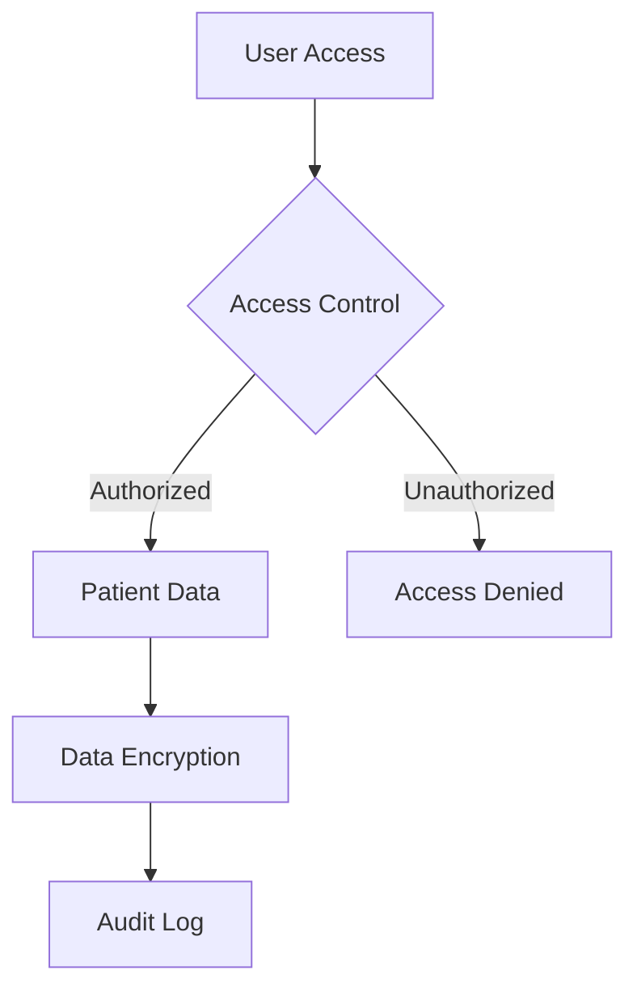
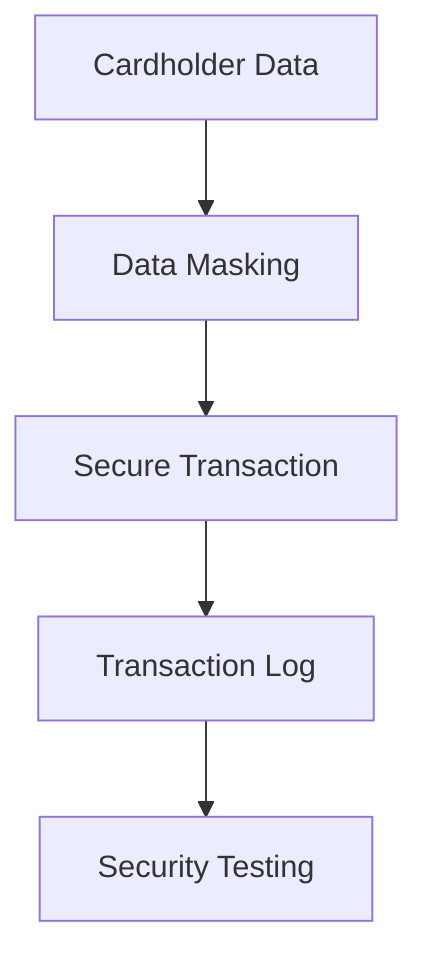

## 24.8. Case Studies in Regulated Industries

In this section, we will explore how Elixir is applied in regulated industries, focusing on healthcare and financial services. We will delve into the intricacies of implementing compliance with standards such as HIPAA (Health Insurance Portability and Accountability Act) and PCI DSS (Payment Card Industry Data Security Standard). Through real-world case studies, we will uncover the challenges faced and the solutions devised by expert software engineers and architects.

### Introduction to Compliance in Regulated Industries

Regulated industries are subject to stringent compliance requirements to ensure data protection, privacy, and security. These regulations are crucial in sectors like healthcare and financial services, where sensitive information is handled. Implementing these standards involves not only understanding the legal requirements but also designing systems that can adapt to evolving regulations.

**Key Compliance Standards:**

- **HIPAA:** Governs the privacy and security of health information.
- **PCI DSS:** Ensures secure handling of credit card information.

### Healthcare Applications: Implementing HIPAA-Compliant Features

In the healthcare sector, HIPAA compliance is paramount. It mandates the protection of patient information and enforces strict guidelines on data handling, access control, and auditing.

#### Case Study: Building a HIPAA-Compliant Telemedicine Platform

**Objective:** To create a telemedicine platform that allows healthcare providers to offer remote consultations while ensuring HIPAA compliance.

**Challenges:**

1. **Data Encryption:** Ensuring all patient data is encrypted both in transit and at rest.
2. **Access Control:** Implementing strict access controls to ensure only authorized personnel can access sensitive information.
3. **Audit Trails:** Maintaining detailed logs of data access and modifications for auditing purposes.

**Solution:**

- **Data Encryption:** Utilize Elixir's Erlang-based cryptographic libraries to encrypt data. Here's a simple example of encrypting data using Elixir:

```elixir
defmodule Encryptor do
  @moduledoc """
  Provides encryption and decryption functions for sensitive data.
  """

  @key :crypto.strong_rand_bytes(32)
  @iv :crypto.strong_rand_bytes(16)

  def encrypt(data) do
    :crypto.block_encrypt(:aes_gcm, @key, @iv, {data, ""})
  end

  def decrypt(ciphertext) do
    :crypto.block_decrypt(:aes_gcm, @key, @iv, ciphertext)
  end
end
```

- **Access Control:** Implement role-based access control (RBAC) using Elixir's pattern matching and guards. This ensures that only users with the appropriate roles can access certain functions.

```elixir
defmodule AccessControl do
  @moduledoc """
  Manages role-based access control for the platform.
  """

  def access?(user, :view_patient_data) when user.role in [:doctor, :nurse], do: true
  def access?(_, _), do: false
end
```

- **Audit Trails:** Use Elixir's logging capabilities to create detailed audit trails. Logs can be stored in a secure, immutable format for compliance checks.

```elixir
defmodule AuditLogger do
  @moduledoc """
  Logs access and modifications to patient data for auditing.
  """

  require Logger

  def log_access(user, resource) do
    Logger.info("#{user.id} accessed #{resource} at #{DateTime.utc_now()}")
  end
end
```

#### Lessons Learned in Healthcare Compliance

- **Regular Audits:** Regularly audit your systems to ensure compliance with HIPAA regulations.
- **Training and Awareness:** Train your team on HIPAA requirements and the importance of compliance.
- **Continuous Monitoring:** Implement continuous monitoring to detect and respond to potential breaches promptly.

### Financial Services: Meeting PCI DSS Requirements

In the financial sector, PCI DSS compliance is crucial for protecting cardholder data. It involves implementing security measures to prevent data breaches and fraud.

#### Case Study: Developing a PCI DSS-Compliant Payment Gateway

**Objective:** To build a secure payment gateway that complies with PCI DSS standards, ensuring the protection of cardholder data.

**Challenges:**

1. **Data Masking:** Masking cardholder data to prevent unauthorized access.
2. **Secure Transactions:** Ensuring all transactions are secure and tamper-proof.
3. **Regular Security Testing:** Conducting regular security tests to identify vulnerabilities.

**Solution:**

- **Data Masking:** Use Elixir's pattern matching to mask sensitive data before logging or displaying it.

```elixir
defmodule DataMasker do
  @moduledoc """
  Provides functions to mask sensitive cardholder data.
  """

  def mask_card_number(card_number) do
    String.replace(card_number, ~r/\d{12}(\d{4})/, "**** **** **** \\1")
  end
end
```

- **Secure Transactions:** Implement secure transaction protocols using Elixir's robust concurrency model to handle multiple transactions efficiently.

```elixir
defmodule TransactionHandler do
  @moduledoc """
  Handles secure transactions for the payment gateway.
  """

  def process_transaction(transaction) do
    # Simulate transaction processing
    :ok
  end
end
```

- **Regular Security Testing:** Use Elixir's testing frameworks to conduct regular security tests and vulnerability assessments.

```elixir
defmodule SecurityTests do
  use ExUnit.Case

  test "transaction processing is secure" do
    assert TransactionHandler.process_transaction(%{amount: 100, currency: "USD"}) == :ok
  end
end
```

#### Lessons Learned in Financial Services Compliance

- **Comprehensive Documentation:** Maintain comprehensive documentation of your compliance efforts.
- **Collaboration with Security Experts:** Collaborate with security experts to identify and mitigate potential risks.
- **Adaptability:** Be prepared to adapt to changes in compliance requirements and standards.

### Visualizing Compliance Architectures

To better understand the compliance architectures in these case studies, let's visualize the data flow and security measures using Mermaid.js diagrams.

#### Healthcare Compliance Architecture


```mermaid
flowchart TD
    A[User Access] --> B{Access Control}
    B -->|Authorized| C[Patient Data]
    B -->|Unauthorized| D[Access Denied]
    C --> E[Data Encryption]
    E --> F[Audit Log]
```

**Description:** This diagram illustrates the flow of user access in a HIPAA-compliant system. Access control ensures only authorized users can access patient data, which is encrypted and logged for auditing.

#### Financial Services Compliance Architecture


```mermaid
flowchart TD
    A[Cardholder Data] --> B[Data Masking]
    B --> C[Secure Transaction]
    C --> D[Transaction Log]
    D --> E[Security Testing]
```

**Description:** This diagram represents the flow of cardholder data in a PCI DSS-compliant payment gateway. Data masking protects sensitive information, while secure transactions and logs ensure compliance.

### Key Takeaways

- **Compliance is Continuous:** Achieving compliance is not a one-time task but an ongoing process that requires continuous monitoring and adaptation.
- **Leverage Elixir's Strengths:** Utilize Elixir's robust features, such as pattern matching and concurrency, to implement secure and compliant systems.
- **Collaboration is Crucial:** Work closely with legal and security experts to ensure your systems meet all regulatory requirements.

### Try It Yourself

Experiment with the code examples provided in this section. Try modifying the encryption keys, access control roles, and transaction processes to see how they affect compliance. Remember, understanding the underlying principles is key to building compliant systems.

### Further Reading

- [HIPAA Compliance Guide](https://www.hhs.gov/hipaa/for-professionals/index.html)
- [PCI DSS Quick Reference Guide](https://www.pcisecuritystandards.org/document_library)

## Quiz Time!



### What is the primary focus of HIPAA compliance in healthcare applications?

- [x] Protecting patient information
- [ ] Enhancing user experience
- [ ] Improving application performance
- [ ] Reducing development costs

> **Explanation:** HIPAA compliance is primarily focused on protecting patient information through privacy and security measures.

### Which Elixir feature is used for encrypting data in the provided case study?

- [x] Erlang-based cryptographic libraries
- [ ] Pattern matching
- [ ] GenServer
- [ ] Phoenix Framework

> **Explanation:** The case study uses Erlang-based cryptographic libraries available in Elixir for data encryption.

### What is a key challenge in implementing PCI DSS compliance?

- [x] Data Masking
- [ ] User Interface Design
- [ ] Code Refactoring
- [ ] Database Optimization

> **Explanation:** Data masking is a key challenge in PCI DSS compliance to prevent unauthorized access to cardholder data.

### In the healthcare case study, what is used to maintain detailed logs for auditing?

- [x] Elixir's logging capabilities
- [ ] GenStage
- [ ] Phoenix Channels
- [ ] ETS

> **Explanation:** Elixir's logging capabilities are used to maintain detailed audit logs for compliance checks.

### What is the role of regular security testing in financial services compliance?

- [x] Identifying vulnerabilities
- [ ] Improving user engagement
- [ ] Reducing server load
- [ ] Enhancing visual design

> **Explanation:** Regular security testing is crucial for identifying vulnerabilities and ensuring compliance in financial services.

### Which Elixir feature is highlighted for handling multiple transactions efficiently?

- [x] Concurrency model
- [ ] Pattern matching
- [ ] Phoenix LiveView
- [ ] Ecto

> **Explanation:** Elixir's robust concurrency model is highlighted for handling multiple transactions efficiently in a secure manner.

### What is a common lesson learned from compliance efforts in regulated industries?

- [x] Regular audits are essential
- [ ] Focus solely on performance
- [ ] Prioritize aesthetics over security
- [ ] Avoid documentation

> **Explanation:** Regular audits are essential to ensure ongoing compliance with regulatory standards.

### How does Elixir's pattern matching assist in compliance?

- [x] By enabling precise data handling
- [ ] By enhancing visual design
- [ ] By reducing code complexity
- [ ] By improving database performance

> **Explanation:** Elixir's pattern matching enables precise data handling, which is crucial for compliance.

### What is the purpose of access control in the healthcare case study?

- [x] To ensure only authorized personnel access sensitive information
- [ ] To enhance application speed
- [ ] To improve user interface design
- [ ] To reduce server costs

> **Explanation:** Access control ensures that only authorized personnel can access sensitive information, which is a key aspect of HIPAA compliance.

### True or False: Compliance in regulated industries is a one-time task.

- [ ] True
- [x] False

> **Explanation:** Compliance is an ongoing process that requires continuous monitoring and adaptation to changing regulations.



Remember, compliance in regulated industries is a journey, not a destination. Stay informed, keep your systems updated, and collaborate with experts to ensure your applications meet all necessary standards. Embrace the challenge, and let Elixir's powerful features guide you in building secure, compliant systems.
