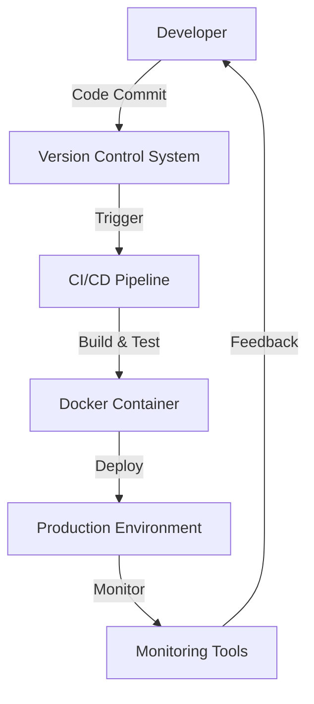

## 25.1. Introduction to DevOps in Elixir

In the ever-evolving landscape of software development, DevOps has emerged as a pivotal practice, bridging the gap between development and operations. This section delves into the integration of DevOps principles with Elixir, a functional programming language known for its concurrency and fault-tolerance capabilities. We will explore how Elixir's unique features, particularly the Open Telecom Platform (OTP), align with DevOps practices to enhance collaboration, streamline deployments, and improve system reliability.

### DevOps Principles

DevOps is a cultural and professional movement that emphasizes collaboration, communication, and integration between software developers and IT operations professionals. The core principles of DevOps include:

- **Collaboration**: Breaking down silos between development and operations teams to foster a culture of shared responsibility.
- **Automation**: Streamlining repetitive tasks to increase efficiency and reduce human error.
- **Continuous Integration and Continuous Deployment (CI/CD)**: Ensuring that code changes are automatically tested and deployed to production environments.
- **Monitoring and Feedback**: Implementing robust monitoring systems to gather feedback and improve system performance and reliability.

### Benefits of DevOps

The adoption of DevOps practices offers numerous benefits, including:

- **Faster Deployments**: By automating the deployment process, teams can release new features and updates more quickly and frequently.
- **Improved Reliability**: Continuous monitoring and feedback loops help identify and resolve issues before they impact users.
- **Enhanced Collaboration**: Cross-functional teams work together more effectively, leading to better communication and problem-solving.
- **Increased Efficiency**: Automation reduces manual work, allowing teams to focus on higher-value tasks.

### Elixir's Fit with DevOps

Elixir, with its robust concurrency model and fault-tolerant design, is well-suited for implementing DevOps practices. Here’s how Elixir and OTP support DevOps:

- **Concurrency and Scalability**: Elixir's lightweight processes and message-passing capabilities make it ideal for building scalable systems that can handle high loads.
- **Fault Tolerance**: OTP's supervision trees and "let it crash" philosophy ensure that systems can recover from failures gracefully.
- **Hot Code Upgrades**: Elixir supports hot code swapping, allowing updates to be deployed without downtime.
- **Integration with CI/CD Tools**: Elixir can be seamlessly integrated with popular CI/CD tools like Jenkins, GitLab CI, and CircleCI to automate testing and deployment.

### Implementing DevOps with Elixir

To effectively implement DevOps practices with Elixir, consider the following strategies:

#### 1. **Collaboration and Culture**

Foster a culture of collaboration by encouraging open communication between development and operations teams. Use tools like Slack or Microsoft Teams to facilitate real-time communication and collaboration.

#### 2. **Automation and CI/CD**

Automate the build, test, and deployment processes using tools like:

- **Mix**: Elixir's build tool, which can be used to automate tasks such as compiling code, running tests, and managing dependencies.
- **ExUnit**: Elixir's built-in testing framework, which supports automated testing.
- **Docker**: Containerize Elixir applications to ensure consistency across development, testing, and production environments.

#### 3. **Monitoring and Feedback**

Implement robust monitoring solutions to gather real-time data on system performance and user behavior. Tools like Prometheus and Grafana can be used to visualize metrics and set up alerts for potential issues.

#### 4. **Infrastructure as Code**

Use tools like Terraform or Ansible to manage infrastructure as code, ensuring that environments are consistent and reproducible.

#### 5. **Continuous Improvement**

Encourage a culture of continuous improvement by regularly reviewing processes and incorporating feedback from team members and users.

### Code Example: Automating Deployment with Elixir and Docker

Let's explore a simple example of how to automate the deployment of an Elixir application using Docker.

```elixir
# Dockerfile for Elixir Application

# Use the official Elixir image
FROM elixir:1.12

# Set the working directory
WORKDIR /app

# Copy the mix.exs and mix.lock files
COPY mix.exs mix.lock ./

# Install dependencies
RUN mix do deps.get, deps.compile

# Copy the application code
COPY . .

# Compile the application
RUN mix compile

# Expose the application port
EXPOSE 4000

# Start the application
CMD ["mix", "phx.server"]
```

In this Dockerfile, we:

1. Use the official Elixir image as the base.
2. Set the working directory to `/app`.
3. Copy the `mix.exs` and `mix.lock` files to the container and install dependencies.
4. Copy the application code and compile it.
5. Expose port 4000 for the application.
6. Start the Phoenix server using `mix phx.server`.

### Visualizing the DevOps Workflow with Elixir

Below is a Mermaid.js diagram illustrating a typical DevOps workflow for an Elixir application.



**Diagram Description**: This diagram represents the DevOps workflow, where developers commit code to a version control system, triggering a CI/CD pipeline that builds and tests the application. The application is then containerized using Docker and deployed to the production environment. Monitoring tools provide feedback to developers for continuous improvement.

### Knowledge Check

- **Question**: How does Elixir's concurrency model benefit DevOps practices?
- **Exercise**: Modify the provided Dockerfile to include environment variables for configuration.

### Embrace the Journey

Remember, integrating DevOps with Elixir is a journey. As you progress, you'll discover new ways to enhance collaboration, automate processes, and improve system reliability. Keep experimenting, stay curious, and enjoy the journey!

### References and Links

- [Elixir Official Documentation](https://elixir-lang.org/docs.html)
- [Docker Documentation](https://docs.docker.com/)
- [Prometheus Monitoring](https://prometheus.io/)
- [Grafana Visualization](https://grafana.com/)

## Quiz: Introduction to DevOps in Elixir



### How does Elixir's concurrency model benefit DevOps practices?

- [x] It allows for scalable and efficient handling of high loads.
- [ ] It simplifies the syntax of the code.
- [ ] It reduces the need for testing.
- [ ] It eliminates the need for version control.

> **Explanation:** Elixir's concurrency model, based on lightweight processes and message-passing, enables scalable and efficient handling of high loads, which is beneficial for DevOps practices.

### What is a key benefit of using Docker with Elixir applications?

- [x] Ensures consistency across environments.
- [ ] Increases the size of the application.
- [ ] Decreases application performance.
- [ ] Eliminates the need for testing.

> **Explanation:** Docker ensures consistency across development, testing, and production environments, which is crucial for reliable deployments.

### Which tool is used for monitoring Elixir applications?

- [x] Prometheus
- [ ] Mix
- [ ] ExUnit
- [ ] Docker

> **Explanation:** Prometheus is a monitoring tool that can be used to gather and visualize metrics from Elixir applications.

### What is the purpose of the CMD instruction in a Dockerfile?

- [x] To specify the command to run the application.
- [ ] To install dependencies.
- [ ] To expose the application port.
- [ ] To set the working directory.

> **Explanation:** The CMD instruction specifies the command to run the application when the container starts.

### How does the "let it crash" philosophy support DevOps?

- [x] It allows systems to recover gracefully from failures.
- [ ] It prevents any application crashes.
- [ ] It eliminates the need for error handling.
- [ ] It simplifies the codebase.

> **Explanation:** The "let it crash" philosophy in Elixir allows systems to recover gracefully from failures, supporting robust and reliable DevOps practices.

### What is the role of CI/CD in DevOps?

- [x] To automate testing and deployment.
- [ ] To write code.
- [ ] To monitor applications.
- [ ] To manage infrastructure.

> **Explanation:** CI/CD automates the testing and deployment processes, ensuring that code changes are reliably integrated and deployed.

### Which tool is used for infrastructure as code?

- [x] Terraform
- [ ] ExUnit
- [ ] Mix
- [ ] Docker

> **Explanation:** Terraform is a tool used for managing infrastructure as code, ensuring consistent and reproducible environments.

### What is the benefit of hot code upgrades in Elixir?

- [x] Allows updates without downtime.
- [ ] Simplifies the codebase.
- [ ] Reduces the need for testing.
- [ ] Increases application size.

> **Explanation:** Hot code upgrades in Elixir allow updates to be deployed without downtime, enhancing system availability.

### Which principle emphasizes collaboration between development and operations?

- [x] DevOps
- [ ] CI/CD
- [ ] Monitoring
- [ ] Automation

> **Explanation:** DevOps emphasizes collaboration between development and operations teams to improve communication and efficiency.

### True or False: Elixir's OTP supports fault tolerance.

- [x] True
- [ ] False

> **Explanation:** True. Elixir's OTP provides fault tolerance through features like supervision trees and the "let it crash" philosophy.


