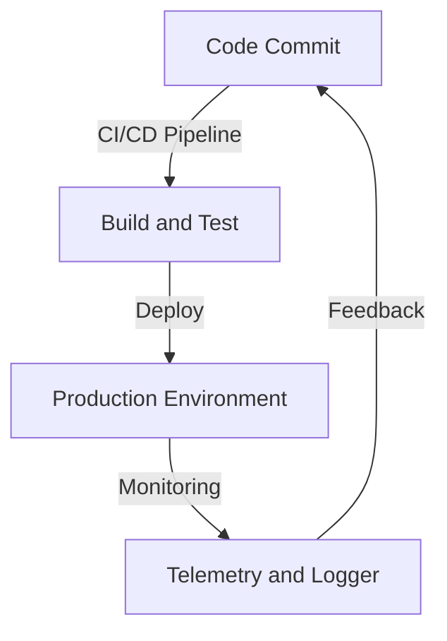

## 25.1. Introduction to DevOps in Elixir

In the rapidly evolving landscape of software development, the integration of DevOps principles has become a cornerstone for achieving agility, reliability, and efficiency. Elixir, with its functional programming paradigm and robust concurrency model provided by the Erlang VM (BEAM), offers unique capabilities that align well with DevOps practices. In this section, we will explore how Elixir supports DevOps, the benefits it brings, and how it enhances collaboration between development and operations.

### Understanding DevOps Principles

DevOps is a cultural and technical movement that emphasizes the collaboration between development and operations teams to automate and streamline the process of software delivery. The core principles of DevOps include:

- **Collaboration and Communication**: Breaking down silos between development and operations to foster a culture of shared responsibility.
- **Continuous Integration and Continuous Deployment (CI/CD)**: Automating the integration of code changes and the deployment process to ensure rapid and reliable software delivery.
- **Infrastructure as Code (IaC)**: Managing infrastructure through code to enable version control, testing, and automation.
- **Monitoring and Logging**: Implementing robust monitoring and logging to ensure system reliability and performance.
- **Feedback Loops**: Creating feedback loops to continuously improve processes and systems.

### Benefits of DevOps

Implementing DevOps practices offers several benefits:

- **Faster Time to Market**: By automating processes and improving collaboration, teams can deliver software more quickly.
- **Improved Reliability**: Continuous testing and monitoring lead to more stable and reliable systems.
- **Scalability**: Automated infrastructure management allows systems to scale efficiently.
- **Enhanced Security**: Automated security checks and compliance monitoring reduce vulnerabilities.
- **Increased Innovation**: With less time spent on manual processes, teams can focus on innovation and improvement.

### Elixir's Fit in DevOps

Elixir, built on the Erlang VM, is inherently designed for building scalable, fault-tolerant systems. Its features align well with DevOps practices:

- **Concurrency and Fault Tolerance**: Elixir's lightweight processes and supervision trees support building resilient applications that can handle failures gracefully.
- **Hot Code Swapping**: Elixir allows for updating code without downtime, facilitating continuous deployment.
- **Observability**: Tools like Telemetry and Logger provide robust monitoring and logging capabilities.
- **Scalability**: Elixir's architecture supports horizontal scaling, essential for handling increased loads.

### Collaboration Between Development and Operations

In a DevOps culture, collaboration between development and operations is crucial. Elixir's ecosystem supports this collaboration through:

- **Unified Tooling**: Tools like Mix and Distillery streamline the build and deployment process, making it easier for both developers and operations teams to work together.
- **Shared Language**: Elixir's clear syntax and functional paradigm encourage a shared understanding between teams, reducing miscommunication.
- **Automation**: Elixir's scripting capabilities facilitate automation of repetitive tasks, freeing up time for collaboration on more complex issues.

### Continuous Integration and Continuous Deployment (CI/CD) with Elixir

CI/CD is a core practice in DevOps, and Elixir provides several tools and frameworks to support it:

- **ExUnit**: Elixir's built-in testing framework ensures that code changes are tested automatically.
- **Mix**: The build tool for Elixir, Mix, integrates with CI/CD pipelines to automate the build and deployment process.
- **Docker**: Containerization with Docker allows for consistent environments across development, testing, and production.

#### Code Example: Basic CI/CD Pipeline with Elixir

Let's explore a simple CI/CD pipeline using Elixir and Docker:

```yaml
# .github/workflows/elixir-ci.yml
name: Elixir CI

on:
  push:
    branches: [ main ]
  pull_request:
    branches: [ main ]

jobs:
  build:
    runs-on: ubuntu-latest

    steps:
    - uses: actions/checkout@v2

    - name: Set up Elixir
      uses: actions/setup-elixir@v1
      with:
        elixir-version: '1.13'
        otp-version: '24'

    - name: Install Dependencies
      run: mix deps.get

    - name: Run Tests
      run: mix test
```

In this GitHub Actions workflow, we automate the process of setting up Elixir, installing dependencies, and running tests whenever code is pushed to the main branch.

### Infrastructure as Code (IaC) with Elixir

Infrastructure as Code is a practice where infrastructure is managed through code, enabling automation and version control. Elixir can be integrated with tools like Terraform and Ansible to manage infrastructure.

#### Example: Using Terraform with Elixir

```hcl
# main.tf
provider "aws" {
  region = "us-west-2"
}

resource "aws_instance" "web" {
  ami           = "ami-0c55b159cbfafe1f0"
  instance_type = "t2.micro"

  tags = {
    Name = "ElixirApp"
  }
}
```

This Terraform configuration file defines an AWS EC2 instance, which can be used to host an Elixir application. By managing infrastructure as code, we can easily replicate environments and ensure consistency.

### Monitoring and Logging in Elixir

Monitoring and logging are essential for maintaining system reliability and performance. Elixir provides several tools for observability:

- **Telemetry**: A library for instrumenting applications and collecting metrics.
- **Logger**: Elixir's built-in logging library, which can be extended with backends for more advanced logging.

#### Code Example: Using Telemetry in Elixir

```elixir
defmodule MyAppWeb.Telemetry do
  use Supervisor

  def start_link(_arg) do
    Supervisor.start_link(__MODULE__, :ok, name: __MODULE__)
  end

  def init(:ok) do
    children = [
      {Telemetry.Metrics, metrics: metrics()}
    ]

    Supervisor.init(children, strategy: :one_for_one)
  end

  defp metrics do
    [
      counter("http.request.count"),
      summary("http.request.duration", unit: {:native, :millisecond})
    ]
  end
end
```

In this example, we define a Telemetry module that tracks the number of HTTP requests and their duration, providing valuable insights into application performance.

### Feedback Loops and Continuous Improvement

Feedback loops are vital for continuous improvement in a DevOps environment. Elixir's ecosystem supports this through:

- **Real-Time Monitoring**: Tools like Phoenix LiveDashboard provide real-time insights into application performance.
- **Automated Testing**: Continuous testing with ExUnit ensures that feedback on code changes is immediate.
- **Iterative Development**: Elixir's functional paradigm encourages small, incremental changes, facilitating rapid feedback and improvement.

### Try It Yourself: Experimenting with DevOps in Elixir

To get hands-on experience with DevOps in Elixir, try the following:

1. **Set Up a CI/CD Pipeline**: Use GitHub Actions or another CI/CD tool to automate testing and deployment for an Elixir project.
2. **Implement Infrastructure as Code**: Use Terraform to define and manage the infrastructure for your Elixir application.
3. **Monitor Application Performance**: Integrate Telemetry and Logger into your application to track performance metrics.

### Visualizing DevOps in Elixir

To better understand the integration of DevOps practices with Elixir, let's visualize the workflow using a Mermaid.js diagram.


```mermaid
graph TD;
    A[Code Commit] -->|CI/CD Pipeline| B[Build and Test];
    B -->|Deploy| C[Production Environment];
    C -->|Monitoring| D[Telemetry and Logger];
    D -->|Feedback| A;
```

**Diagram Description**: This diagram illustrates the DevOps workflow in Elixir, starting from a code commit, passing through the CI/CD pipeline for build and testing, deploying to the production environment, monitoring with Telemetry and Logger, and feeding back insights for continuous improvement.

### Conclusion

Elixir's unique features, such as concurrency, fault tolerance, and hot code swapping, make it an excellent fit for implementing DevOps practices. By embracing DevOps principles, teams can achieve faster deployments, improved reliability, and a culture of collaboration and continuous improvement. As you continue your journey with Elixir and DevOps, remember to leverage the tools and techniques discussed in this section to build scalable, resilient, and efficient systems.

## Quiz Time!



### What is a core principle of DevOps?

- [x] Collaboration and Communication
- [ ] Manual Testing
- [ ] Siloed Teams
- [ ] Waterfall Development

> **Explanation:** Collaboration and communication are fundamental principles of DevOps, fostering a culture of shared responsibility.

### Which Elixir feature supports fault tolerance in DevOps practices?

- [x] Supervision Trees
- [ ] Mutable State
- [ ] Monolithic Architecture
- [ ] Manual Deployment

> **Explanation:** Supervision trees in Elixir help manage process failures, supporting fault tolerance.

### What is the purpose of Continuous Integration in DevOps?

- [x] Automate the integration of code changes
- [ ] Delay software delivery
- [ ] Increase manual testing
- [ ] Reduce collaboration

> **Explanation:** Continuous Integration automates the integration of code changes, ensuring rapid and reliable software delivery.

### Which tool can be used for Infrastructure as Code with Elixir?

- [x] Terraform
- [ ] Excel
- [ ] Notepad
- [ ] Manual Configuration

> **Explanation:** Terraform is a tool for managing infrastructure as code, enabling automation and version control.

### What does the Telemetry library in Elixir provide?

- [x] Instrumentation and metrics collection
- [ ] Manual logging
- [ ] Static analysis
- [ ] Code formatting

> **Explanation:** Telemetry provides instrumentation and metrics collection for monitoring application performance.

### How does Elixir support Continuous Deployment?

- [x] Hot Code Swapping
- [ ] Manual Code Updates
- [ ] Static Compilation
- [ ] Siloed Teams

> **Explanation:** Elixir supports Continuous Deployment through hot code swapping, allowing updates without downtime.

### Which Elixir tool is used for automated testing?

- [x] ExUnit
- [ ] Notepad
- [ ] Manual Testing
- [ ] Static Analysis

> **Explanation:** ExUnit is Elixir's built-in testing framework for automated testing.

### What is the benefit of using Docker with Elixir in DevOps?

- [x] Consistent environments across development, testing, and production
- [ ] Manual deployment
- [ ] Siloed teams
- [ ] Waterfall development

> **Explanation:** Docker provides consistent environments, facilitating smooth transitions across development, testing, and production.

### What is a benefit of implementing DevOps practices?

- [x] Faster Time to Market
- [ ] Increased Manual Processes
- [ ] Siloed Teams
- [ ] Reduced Collaboration

> **Explanation:** DevOps practices lead to faster time to market by automating processes and improving collaboration.

### Elixir's architecture supports which type of scaling?

- [x] Horizontal Scaling
- [ ] Vertical Scaling Only
- [ ] No Scaling
- [ ] Manual Scaling

> **Explanation:** Elixir's architecture supports horizontal scaling, essential for handling increased loads.


