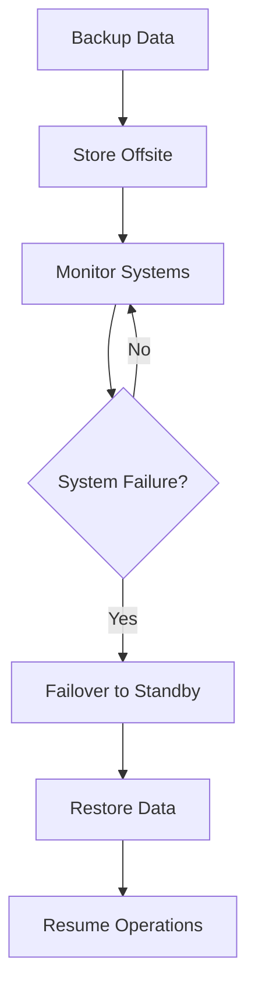

## 25.10. Disaster Recovery and Backups

In the world of software engineering, ensuring the resilience and availability of applications is paramount. This section delves into the critical aspects of disaster recovery and backups, particularly in the context of Elixir applications. We'll explore backup strategies, redundancy, and recovery plans, providing you with the knowledge to safeguard your systems against unforeseen events.

### Introduction to Disaster Recovery and Backups

Disaster recovery (DR) refers to the process and strategies involved in restoring systems and data after a catastrophic event, such as hardware failure, natural disasters, or cyber-attacks. Backups are a fundamental component of DR, serving as a safety net to recover lost or corrupted data.

#### Key Concepts

- **Disaster Recovery (DR):** The process of restoring systems and data to a functional state after a disaster.
- **Backups:** Copies of data stored separately from the primary data source to facilitate recovery.
- **Redundancy:** The duplication of critical components or functions to increase reliability.
- **Recovery Time Objective (RTO):** The maximum acceptable time to restore a system after a failure.
- **Recovery Point Objective (RPO):** The maximum acceptable amount of data loss measured in time.

### Backup Strategies

Effective backup strategies are essential for minimizing data loss and ensuring quick recovery. Here, we explore various approaches to backing up data in Elixir applications.

#### Regular Backups

Regularly backing up databases and critical data is crucial. This can be achieved through automated scripts or third-party tools that schedule backups at regular intervals.

```elixir
defmodule BackupScheduler do
  use GenServer

  @backup_interval :timer.hours(24)

  def start_link(_) do
    GenServer.start_link(__MODULE__, %{}, name: __MODULE__)
  end

  def init(state) do
    schedule_backup()
    {:ok, state}
  end

  def handle_info(:backup, state) do
    perform_backup()
    schedule_backup()
    {:noreply, state}
  end

  defp schedule_backup do
    Process.send_after(self(), :backup, @backup_interval)
  end

  defp perform_backup do
    # Logic to perform backup
    IO.puts("Performing backup...")
  end
end
```

**Explanation:** This code snippet demonstrates a simple GenServer that schedules and performs backups every 24 hours. The `perform_backup/0` function should contain the logic to back up your data.

#### Incremental Backups

Incremental backups only store changes made since the last backup, reducing storage requirements and speeding up the backup process.

- **Full Backup:** A complete copy of the data.
- **Incremental Backup:** Only the data that has changed since the last backup.

#### Offsite Backups

Storing backups offsite protects against physical disasters that could affect your primary data center. Cloud storage solutions like AWS S3 or Google Cloud Storage are popular choices.

### Redundancy

Redundancy involves duplicating critical components to ensure system availability even if one component fails. In Elixir, redundancy can be implemented through various means.

#### Failover Mechanisms

Failover mechanisms automatically switch to a standby system when the primary system fails. This can be achieved using Elixir's OTP (Open Telecom Platform) capabilities.

```elixir
defmodule MyApp.Supervisor do
  use Supervisor

  def start_link(_) do
    Supervisor.start_link(__MODULE__, :ok, name: __MODULE__)
  end

  def init(:ok) do
    children = [
      {MyApp.Worker, []}
    ]

    Supervisor.init(children, strategy: :one_for_one)
  end
end
```

**Explanation:** This example shows a simple supervisor setup using the `:one_for_one` strategy, which restarts a failed child process without affecting others.

#### Load Balancing

Load balancing distributes incoming network traffic across multiple servers to ensure no single server becomes a bottleneck. This can be achieved using external tools like Nginx or HAProxy.

### Recovery Plans

A well-defined recovery plan outlines the steps to restore services after a disaster. It should include procedures for data restoration, system reconfiguration, and communication with stakeholders.

#### Steps to Create a Recovery Plan

1. **Risk Assessment:** Identify potential risks and their impact on your systems.
2. **Define RTO and RPO:** Establish acceptable recovery time and data loss thresholds.
3. **Develop Recovery Procedures:** Document step-by-step procedures for restoring systems and data.
4. **Test and Update:** Regularly test the recovery plan and update it based on new risks or changes in the system.

### Code Example: Implementing a Simple Backup and Restore System

Let's implement a simple backup and restore system in Elixir to demonstrate these concepts.

```elixir
defmodule BackupSystem do
  @backup_dir "backups/"

  def backup(data, filename) do
    File.write!(@backup_dir <> filename, :erlang.term_to_binary(data))
    IO.puts("Backup created: #{filename}")
  end

  def restore(filename) do
    case File.read(@backup_dir <> filename) do
      {:ok, binary} -> 
        {:ok, :erlang.binary_to_term(binary)}
      {:error, reason} -> 
        {:error, reason}
    end
  end
end

# Usage
data = %{user: "John Doe", email: "john@example.com"}
BackupSystem.backup(data, "user_backup.bak")
{:ok, restored_data} = BackupSystem.restore("user_backup.bak")
IO.inspect(restored_data)
```

**Explanation:** This module provides basic functions to back up and restore data using Elixir's file handling capabilities. The `backup/2` function writes serialized data to a file, while `restore/1` reads and deserializes it.

### Visualizing Disaster Recovery Workflow

Below is a diagram illustrating a typical disaster recovery workflow, including backup, failover, and restoration processes.



**Caption:** This diagram shows the flow of actions in a disaster recovery process, from backing up data to resuming operations after a failure.

### Knowledge Check

- **Question:** What is the difference between RTO and RPO?
- **Exercise:** Modify the `BackupSystem` module to include incremental backup functionality.

### Embrace the Journey

Remember, disaster recovery and backups are not just about technology but also about planning and preparation. As you implement these strategies, you'll build more resilient and reliable systems. Keep experimenting, stay curious, and enjoy the journey!

### References and Links

- [AWS Backup Documentation](https://docs.aws.amazon.com/backup/index.html)
- [Google Cloud Storage Documentation](https://cloud.google.com/storage/docs)
- [Elixir GenServer Documentation](https://hexdocs.pm/elixir/GenServer.html)

## Quiz: Disaster Recovery and Backups



### What is the primary purpose of disaster recovery?

- [x] To restore systems and data after a catastrophic event
- [ ] To prevent data breaches
- [ ] To optimize system performance
- [ ] To reduce software development costs

> **Explanation:** Disaster recovery focuses on restoring systems and data after a disaster, ensuring business continuity.

### Which backup strategy involves storing only the changes made since the last backup?

- [ ] Full Backup
- [x] Incremental Backup
- [ ] Differential Backup
- [ ] Snapshot Backup

> **Explanation:** Incremental backups store only the changes made since the last backup, reducing storage requirements.

### What does RTO stand for in disaster recovery?

- [x] Recovery Time Objective
- [ ] Recovery Task Operation
- [ ] Redundant Time Optimization
- [ ] Restore Time Order

> **Explanation:** RTO stands for Recovery Time Objective, which is the maximum acceptable time to restore a system after a failure.

### In Elixir, which OTP feature can be used to implement failover mechanisms?

- [x] Supervisors
- [ ] GenEvent
- [ ] Mix
- [ ] ExUnit

> **Explanation:** Supervisors in Elixir's OTP can be used to implement failover mechanisms by restarting failed processes.

### What is the benefit of offsite backups?

- [x] Protection against physical disasters affecting the primary data center
- [ ] Faster data retrieval
- [ ] Reduced data redundancy
- [ ] Increased system performance

> **Explanation:** Offsite backups protect against physical disasters that could affect the primary data center, ensuring data availability.

### Which tool can be used for load balancing in Elixir applications?

- [ ] ExUnit
- [ ] Mix
- [x] Nginx
- [ ] Dialyzer

> **Explanation:** Nginx is a popular tool for load balancing, distributing network traffic across multiple servers.

### What is a key component of a recovery plan?

- [x] Risk Assessment
- [ ] Code Refactoring
- [ ] Performance Optimization
- [ ] User Interface Design

> **Explanation:** Risk assessment is a key component of a recovery plan, helping to identify potential risks and their impact.

### What does the `perform_backup/0` function do in the provided GenServer example?

- [x] It contains the logic to perform a backup
- [ ] It schedules the next backup
- [ ] It restores data from a backup
- [ ] It deletes old backups

> **Explanation:** The `perform_backup/0` function contains the logic to perform a backup, as indicated by the placeholder comment.

### Which Elixir module is used for file handling in the backup and restore example?

- [x] File
- [ ] Enum
- [ ] Stream
- [ ] Agent

> **Explanation:** The `File` module is used for file handling in Elixir, as demonstrated in the backup and restore example.

### True or False: Disaster recovery is only about technology.

- [ ] True
- [x] False

> **Explanation:** Disaster recovery is not only about technology but also involves planning, preparation, and communication with stakeholders.


