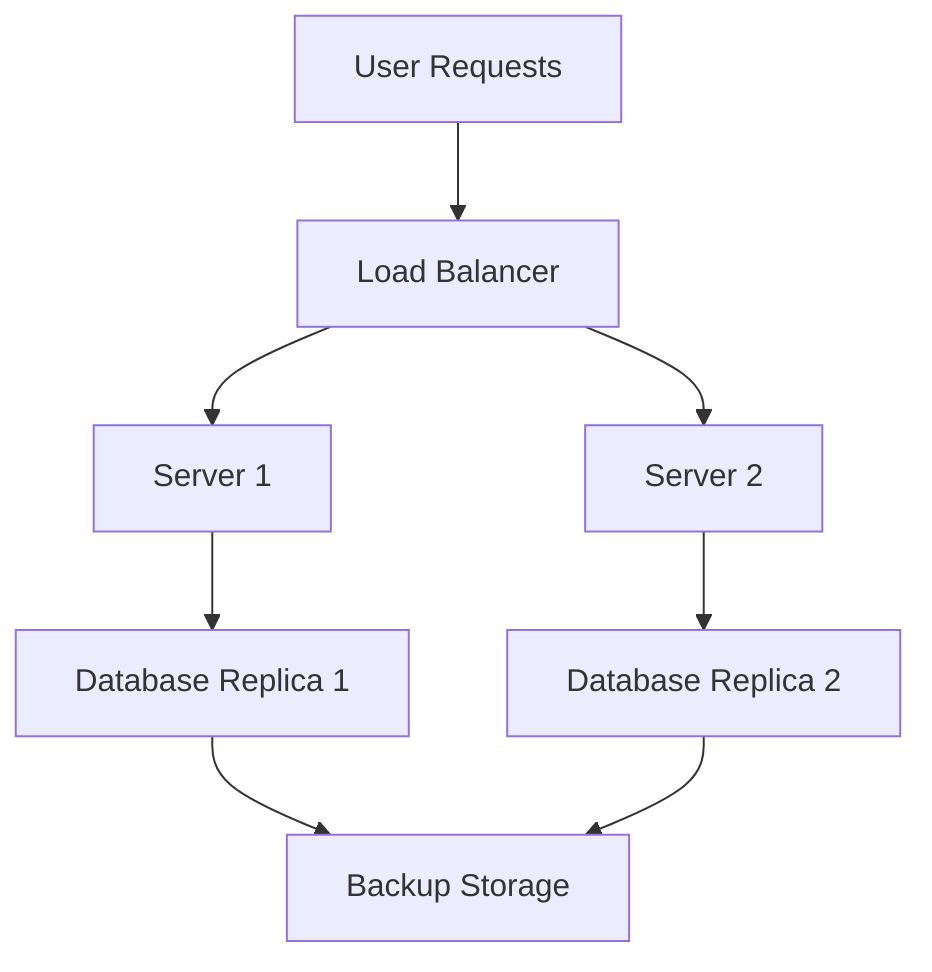

## 25.10. Disaster Recovery and Backups

In today's fast-paced digital landscape, the ability to recover from disasters and maintain data integrity is crucial for any system, especially those built with Elixir, known for its robust concurrency and fault tolerance. This section delves into disaster recovery and backup strategies tailored for Elixir systems, ensuring that your applications remain resilient and operational.

### Understanding Disaster Recovery

Disaster recovery (DR) involves a set of policies, tools, and procedures to enable the recovery or continuation of vital technology infrastructure and systems following a natural or human-induced disaster. In the context of Elixir, this means ensuring that applications can recover from failures, whether they are due to hardware malfunctions, software bugs, or external factors like cyber-attacks.

#### Key Components of Disaster Recovery

1. **Backup Strategies**: Regularly backing up databases and critical data to ensure that you can restore the system to a previous state in case of data loss.
2. **Redundancy**: Implementing failover mechanisms to switch to a backup system seamlessly if the primary system fails.
3. **Recovery Plans**: Detailed procedures to restore services after a disaster, including roles, responsibilities, and timelines.

### Backup Strategies

Backups are the cornerstone of any disaster recovery plan. They ensure that data can be restored to a known good state after a failure. Here are some strategies to consider:

#### Types of Backups

- **Full Backups**: A complete copy of all data. While comprehensive, full backups can be resource-intensive and time-consuming.
- **Incremental Backups**: Only the data that has changed since the last backup is saved. This approach is faster and requires less storage.
- **Differential Backups**: Saves changes since the last full backup. It strikes a balance between full and incremental backups.

#### Frequency and Scheduling

- **Regular Backups**: Schedule backups at regular intervals based on the criticality of the data and the acceptable data loss.
- **Automated Backups**: Use tools and scripts to automate the backup process, reducing the risk of human error.

#### Storage Solutions

- **On-Premises**: Store backups locally for quick access, but ensure they are protected against local disasters.
- **Cloud Storage**: Utilize cloud services for offsite backups, providing an additional layer of security and accessibility.
- **Hybrid Approach**: Combine on-premises and cloud storage to balance speed and safety.

#### Code Example: Automating Backups with Elixir

```elixir
defmodule BackupScheduler do
  use GenServer

  @backup_interval :timer.hours(24)

  def start_link(_) do
    GenServer.start_link(__MODULE__, %{}, name: __MODULE__)
  end

  def init(state) do
    schedule_backup()
    {:ok, state}
  end

  def handle_info(:perform_backup, state) do
    perform_backup()
    schedule_backup()
    {:noreply, state}
  end

  defp schedule_backup do
    Process.send_after(self(), :perform_backup, @backup_interval)
  end

  defp perform_backup do
    # Implement the logic to perform the backup
    IO.puts("Performing backup...")
  end
end
```

In this example, we use a GenServer to schedule and perform backups at regular intervals. This approach ensures that backups are automated and consistent.

### Redundancy

Redundancy is about having multiple systems in place so that if one fails, another can take over. This is crucial for maintaining service availability.

#### Types of Redundancy

- **Hardware Redundancy**: Duplicate hardware components to prevent a single point of failure.
- **Software Redundancy**: Use software solutions like load balancers to distribute traffic across multiple servers.
- **Data Redundancy**: Store data in multiple locations to ensure it remains accessible even if one location is compromised.

#### Implementing Failover Mechanisms

Failover mechanisms automatically switch to a backup system when the primary system fails. This can be achieved through:

- **Load Balancers**: Distribute traffic across multiple servers, automatically rerouting it if one server goes down.
- **Clustered Systems**: Use clustering technologies to ensure that if one node fails, another can take its place.
- **Database Replication**: Keep multiple copies of your database synchronized to ensure data availability.

#### Diagram: Redundancy and Failover Architecture


```mermaid
graph TD;
    A[User Requests] --> B[Load Balancer]
    B --> C[Server 1]
    B --> D[Server 2]
    C --> E[Database Replica 1]
    D --> F[Database Replica 2]
    E --> G[Backup Storage]
    F --> G
```

This diagram illustrates a typical redundancy and failover setup, where user requests are distributed by a load balancer to multiple servers, each connected to a replicated database.

### Recovery Plans

A recovery plan outlines the steps to restore services after a disaster. It should be comprehensive and regularly tested to ensure effectiveness.

#### Developing a Recovery Plan

- **Risk Assessment**: Identify potential risks and their impact on the system.
- **Define Recovery Objectives**: Establish Recovery Time Objectives (RTO) and Recovery Point Objectives (RPO) to guide the recovery process.
- **Roles and Responsibilities**: Assign roles to team members and define their responsibilities during a recovery scenario.

#### Testing and Maintenance

- **Regular Testing**: Conduct regular drills to test the recovery plan and ensure that all team members are familiar with their roles.
- **Plan Updates**: Regularly update the plan to reflect changes in the system or organization.

### Elixir-Specific Considerations

Elixir's concurrency model and fault-tolerance features provide unique opportunities for implementing disaster recovery and backups:

- **Supervision Trees**: Use Elixir's supervision trees to automatically restart failed processes, maintaining system stability.
- **Distributed Systems**: Leverage Elixir's capabilities to build distributed systems that can continue operating even if part of the system fails.

#### Code Example: Using Supervision Trees for Fault Tolerance

```elixir
defmodule MyApp.Application do
  use Application

  def start(_type, _args) do
    children = [
      {MyApp.Worker, arg1},
      MyApp.BackupScheduler
    ]

    opts = [strategy: :one_for_one, name: MyApp.Supervisor]
    Supervisor.start_link(children, opts)
  end
end
```

In this example, we define a supervision tree that includes a worker process and our backup scheduler. The supervision strategy ensures that if any process fails, it is automatically restarted.

### Conclusion

Disaster recovery and backups are essential components of a resilient Elixir system. By implementing robust backup strategies, redundancy, and comprehensive recovery plans, you can ensure that your applications remain operational in the face of adversity. Remember, the key to effective disaster recovery is preparation and regular testing.

### Try It Yourself

Experiment with the backup scheduler and supervision tree examples provided. Modify the backup interval or add additional processes to the supervision tree to see how Elixir's fault-tolerance features work in practice.

## Quiz Time!



### What is the primary goal of disaster recovery?

- [x] To ensure the recovery or continuation of vital technology infrastructure and systems after a disaster.
- [ ] To improve the performance of an application.
- [ ] To increase the number of features in an application.
- [ ] To reduce the cost of infrastructure.

> **Explanation:** Disaster recovery focuses on recovering or continuing vital technology infrastructure and systems after a disaster.

### Which type of backup saves only the data that has changed since the last backup?

- [ ] Full Backup
- [x] Incremental Backup
- [ ] Differential Backup
- [ ] Snapshot Backup

> **Explanation:** Incremental backups save only the data that has changed since the last backup.

### What is the purpose of redundancy in disaster recovery?

- [x] To have multiple systems in place so that if one fails, another can take over.
- [ ] To reduce the cost of infrastructure.
- [ ] To increase the complexity of the system.
- [ ] To improve the user interface.

> **Explanation:** Redundancy ensures that multiple systems are in place so that if one fails, another can take over, maintaining service availability.

### Which Elixir feature can be used to automatically restart failed processes?

- [x] Supervision Trees
- [ ] GenServer
- [ ] Mix
- [ ] ExUnit

> **Explanation:** Supervision trees in Elixir are used to automatically restart failed processes, maintaining system stability.

### What should be established to guide the recovery process in a disaster recovery plan?

- [x] Recovery Time Objectives (RTO) and Recovery Point Objectives (RPO)
- [ ] User Experience Objectives (UXO)
- [ ] Cost Reduction Objectives (CRO)
- [ ] Feature Expansion Objectives (FEO)

> **Explanation:** Recovery Time Objectives (RTO) and Recovery Point Objectives (RPO) are established to guide the recovery process in a disaster recovery plan.

### Which storage solution provides an additional layer of security and accessibility for backups?

- [ ] On-Premises
- [x] Cloud Storage
- [ ] Local Storage
- [ ] External Hard Drive

> **Explanation:** Cloud storage provides an additional layer of security and accessibility for backups, as it is offsite and can be accessed remotely.

### What is the role of a load balancer in a redundancy setup?

- [x] To distribute traffic across multiple servers and reroute it if one server goes down.
- [ ] To increase the speed of a single server.
- [ ] To store backup data.
- [ ] To monitor system performance.

> **Explanation:** A load balancer distributes traffic across multiple servers and reroutes it if one server goes down, ensuring service availability.

### How often should a disaster recovery plan be tested?

- [x] Regularly
- [ ] Once a year
- [ ] Only after a disaster
- [ ] Never

> **Explanation:** A disaster recovery plan should be tested regularly to ensure its effectiveness and that all team members are familiar with their roles.

### What is the benefit of using Elixir's distributed systems capabilities in disaster recovery?

- [x] It allows the system to continue operating even if part of the system fails.
- [ ] It reduces the cost of infrastructure.
- [ ] It increases the speed of data processing.
- [ ] It simplifies the user interface.

> **Explanation:** Elixir's distributed systems capabilities allow the system to continue operating even if part of the system fails, enhancing resilience.

### True or False: Supervision trees can only be used for backup processes in Elixir.

- [ ] True
- [x] False

> **Explanation:** Supervision trees can be used for any processes in Elixir, not just backup processes. They are a general mechanism for fault tolerance.



Remember, this is just the beginning of your journey in mastering disaster recovery and backups in Elixir. As you progress, continue to explore and experiment with different strategies to find what works best for your systems. Stay resilient, and keep learning!
