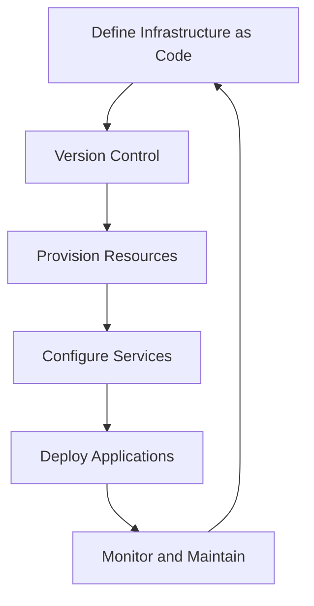

## 25.2. Infrastructure as Code with Elixir

In the rapidly evolving world of software development, managing infrastructure efficiently and reliably is crucial. Infrastructure as Code (IaC) is a practice that allows developers to manage and provision infrastructure through code, enabling automation, consistency, and scalability. In this section, we'll delve into the concept of IaC, explore popular tools like Terraform and Ansible, and examine how Elixir can play a pivotal role in automating infrastructure tasks.

### Understanding Infrastructure as Code (IaC)

Infrastructure as Code is a methodology that treats infrastructure configuration and management as software development. By using code to define and manage infrastructure, teams can automate the provisioning and configuration of resources, ensuring consistency and reducing the risk of human error.

#### Key Benefits of IaC

- **Consistency**: Code-based configurations ensure that environments are consistent across development, testing, and production.
- **Version Control**: Infrastructure configurations can be versioned and tracked, just like application code.
- **Automation**: Automating infrastructure tasks reduces manual intervention and speeds up deployment processes.
- **Scalability**: IaC enables rapid scaling of infrastructure to meet demand.
- **Reusability**: Code can be reused across different projects and environments.

### Tools for Infrastructure as Code

Several tools are available to implement IaC, each with its strengths and use cases. Two of the most popular tools are Terraform and Ansible.

#### Terraform

Terraform is an open-source tool by HashiCorp that allows you to define infrastructure as code using a declarative configuration language. It supports a wide range of cloud providers and services, making it a versatile choice for managing infrastructure.

- **Declarative Language**: Terraform uses HashiCorp Configuration Language (HCL) to define infrastructure resources.
- **State Management**: Terraform maintains a state file to track the current state of infrastructure, enabling it to apply changes incrementally.
- **Provider Ecosystem**: Terraform supports numerous providers, including AWS, Azure, Google Cloud, and more.

#### Ansible

Ansible is an open-source automation tool that simplifies configuration management, application deployment, and task automation. It uses a simple, human-readable language (YAML) to define tasks and playbooks.

- **Agentless**: Ansible does not require agents to be installed on target machines, simplifying deployment.
- **Idempotency**: Ansible ensures that tasks are applied consistently, regardless of the current state of the system.
- **Extensibility**: Ansible can be extended with custom modules and plugins.

### Elixir's Role in Infrastructure Automation

Elixir, a functional programming language known for its concurrency and fault-tolerance, can be a powerful tool in automating infrastructure tasks. While Elixir is not traditionally associated with IaC, it offers several features that make it suitable for this domain.

#### Automating Tasks with Elixir Scripts

Elixir scripts can be used to automate various infrastructure tasks, such as provisioning resources, configuring services, and managing deployments. By leveraging Elixir's concurrency model, scripts can efficiently handle multiple tasks simultaneously.

```elixir
# Example Elixir script to automate a simple task
defmodule InfrastructureAutomation do
  def provision_resources do
    # Simulate provisioning resources
    IO.puts("Provisioning resources...")
    :timer.sleep(1000)
    IO.puts("Resources provisioned successfully!")
  end

  def configure_services do
    # Simulate configuring services
    IO.puts("Configuring services...")
    :timer.sleep(1000)
    IO.puts("Services configured successfully!")
  end

  def deploy_application do
    # Simulate deploying an application
    IO.puts("Deploying application...")
    :timer.sleep(1000)
    IO.puts("Application deployed successfully!")
  end
end

# Execute tasks
InfrastructureAutomation.provision_resources()
InfrastructureAutomation.configure_services()
InfrastructureAutomation.deploy_application()
```

#### Mix Tasks for Infrastructure Automation

Mix, Elixir's build tool, can be extended with custom tasks to automate infrastructure-related processes. Mix tasks provide a convenient way to encapsulate and execute scripts, making them reusable and easy to integrate into CI/CD pipelines.

```elixir
# Define a custom Mix task for provisioning resources
defmodule Mix.Tasks.Provision do
  use Mix.Task

  @shortdoc "Provisions infrastructure resources"

  def run(_) do
    IO.puts("Running provisioning task...")
    InfrastructureAutomation.provision_resources()
  end
end

# Define a custom Mix task for configuring services
defmodule Mix.Tasks.Configure do
  use Mix.Task

  @shortdoc "Configures infrastructure services"

  def run(_) do
    IO.puts("Running configuration task...")
    InfrastructureAutomation.configure_services()
  end
end

# Define a custom Mix task for deploying applications
defmodule Mix.Tasks.Deploy do
  use Mix.Task

  @shortdoc "Deploys the application"

  def run(_) do
    IO.puts("Running deployment task...")
    InfrastructureAutomation.deploy_application()
  end
end
```

### Visualizing Infrastructure as Code Workflow

To better understand the workflow of Infrastructure as Code, let's visualize the process using a flowchart. This diagram represents the typical steps involved in managing infrastructure using IaC principles.



**Figure 1: Infrastructure as Code Workflow**

### Integrating Elixir with Terraform and Ansible

While Elixir can automate tasks independently, it can also be integrated with tools like Terraform and Ansible to enhance infrastructure automation capabilities.

#### Using Elixir with Terraform

Elixir can be used to generate Terraform configuration files dynamically, allowing for more flexible and parameterized infrastructure definitions. By leveraging Elixir's metaprogramming capabilities, you can create reusable templates and modules.

```elixir
defmodule TerraformGenerator do
  def generate_config do
    # Define a simple Terraform configuration
    config = """
    provider "aws" {
      region = "us-west-2"
    }

    resource "aws_instance" "example" {
      ami           = "ami-0c55b159cbfafe1f0"
      instance_type = "t2.micro"
    }
    """

    File.write!("main.tf", config)
    IO.puts("Terraform configuration generated successfully!")
  end
end

# Generate Terraform configuration
TerraformGenerator.generate_config()
```

#### Using Elixir with Ansible

Elixir can be used to orchestrate Ansible playbooks, providing a higher-level abstraction for managing complex deployments. By integrating Elixir with Ansible, you can automate the execution of playbooks and manage dependencies.

```elixir
defmodule AnsibleOrchestrator do
  def run_playbook(playbook) do
    # Execute Ansible playbook
    System.cmd("ansible-playbook", [playbook])
    IO.puts("Ansible playbook executed successfully!")
  end
end

# Run Ansible playbook
AnsibleOrchestrator.run_playbook("site.yml")
```

### Best Practices for Infrastructure as Code with Elixir

To maximize the benefits of IaC and Elixir, consider the following best practices:

- **Modularize Code**: Break down infrastructure code into reusable modules and components.
- **Use Version Control**: Store all infrastructure code in a version control system to track changes and collaborate effectively.
- **Automate Testing**: Implement automated tests to validate infrastructure configurations and ensure reliability.
- **Document Configurations**: Provide clear documentation for infrastructure code to facilitate understanding and maintenance.
- **Monitor and Audit**: Continuously monitor infrastructure and audit changes to detect issues early.

### Try It Yourself

Experiment with the provided code examples by modifying parameters, adding new resources, or integrating additional tools. Consider creating a simple infrastructure setup using Elixir scripts and Mix tasks, and explore how Elixir can enhance your existing IaC workflows.

### Conclusion

Infrastructure as Code is a powerful practice that enables efficient and reliable management of infrastructure. By leveraging Elixir's capabilities, you can automate tasks, integrate with popular IaC tools, and enhance your infrastructure automation workflows. Remember, this is just the beginning. As you progress, you'll discover new ways to optimize and scale your infrastructure. Keep experimenting, stay curious, and enjoy the journey!

## Quiz: Infrastructure as Code with Elixir



### What is Infrastructure as Code (IaC)?

- [x] A practice that manages infrastructure using code and automation
- [ ] A method for writing application code
- [ ] A tool for monitoring infrastructure
- [ ] A language for configuring databases

> **Explanation:** Infrastructure as Code (IaC) is a practice that involves managing and provisioning infrastructure through code, enabling automation and consistency.

### Which tool uses a declarative configuration language for defining infrastructure?

- [x] Terraform
- [ ] Ansible
- [ ] Elixir
- [ ] Docker

> **Explanation:** Terraform uses HashiCorp Configuration Language (HCL) to define infrastructure resources declaratively.

### What is a key benefit of using Infrastructure as Code?

- [x] Consistency across environments
- [ ] Increased manual intervention
- [ ] Reduced scalability
- [ ] Lack of version control

> **Explanation:** IaC ensures consistency across development, testing, and production environments by using code-based configurations.

### How can Elixir be used in infrastructure automation?

- [x] By writing scripts and Mix tasks to automate tasks
- [ ] By replacing Terraform and Ansible
- [ ] By managing databases directly
- [ ] By monitoring network traffic

> **Explanation:** Elixir can automate infrastructure tasks through scripts and Mix tasks, enhancing automation workflows.

### What is a feature of Ansible?

- [x] Agentless architecture
- [ ] Requires agents on target machines
- [ ] Uses HCL for configuration
- [ ] Limited to AWS

> **Explanation:** Ansible is agentless, meaning it does not require agents to be installed on target machines, simplifying deployment.

### How can Elixir integrate with Terraform?

- [x] By generating Terraform configuration files dynamically
- [ ] By replacing Terraform's state management
- [ ] By executing Terraform commands directly
- [ ] By managing Terraform providers

> **Explanation:** Elixir can generate Terraform configuration files dynamically, allowing for flexible and parameterized infrastructure definitions.

### What is a best practice for Infrastructure as Code?

- [x] Modularize code into reusable components
- [ ] Avoid using version control
- [ ] Rely on manual testing
- [ ] Ignore documentation

> **Explanation:** Modularizing code into reusable components enhances maintainability and reusability in IaC.

### What is the role of Mix tasks in Elixir?

- [x] To encapsulate and execute scripts for automation
- [ ] To replace Ansible playbooks
- [ ] To manage databases
- [ ] To monitor application performance

> **Explanation:** Mix tasks in Elixir provide a convenient way to encapsulate and execute scripts, making them reusable and easy to integrate into CI/CD pipelines.

### Which tool is known for its idempotency feature?

- [x] Ansible
- [ ] Terraform
- [ ] Elixir
- [ ] Docker

> **Explanation:** Ansible ensures that tasks are applied consistently, regardless of the current state of the system, through its idempotency feature.

### True or False: Elixir can only be used for application development, not infrastructure automation.

- [ ] True
- [x] False

> **Explanation:** Elixir can be used for infrastructure automation by writing scripts and Mix tasks to automate various tasks.


