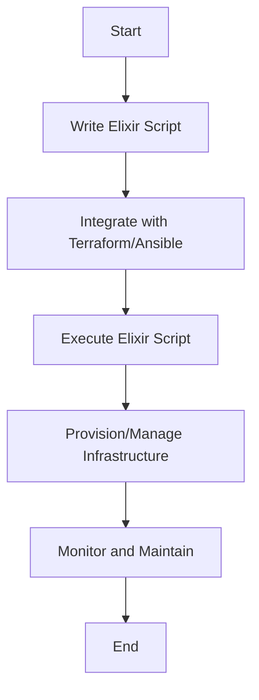

## 25.2. Infrastructure as Code with Elixir

### Introduction to Infrastructure as Code (IaC)

Infrastructure as Code (IaC) is a modern approach to managing and provisioning computing infrastructure through machine-readable definition files, rather than physical hardware configuration or interactive configuration tools. This paradigm shift allows for more efficient, consistent, and scalable infrastructure management. By treating infrastructure as code, organizations can apply software engineering practices such as version control, testing, and continuous integration to infrastructure management.

#### Key Benefits of IaC

- **Consistency**: Ensures that environments are configured identically, reducing the chances of discrepancies and errors.
- **Automation**: Automates the provisioning and management of infrastructure, reducing manual effort and human error.
- **Scalability**: Easily scales resources up or down based on demand, without manual intervention.
- **Version Control**: Infrastructure configurations can be versioned and tracked, allowing for rollback and auditability.
- **Collaboration**: Enables better collaboration among teams by using code as the source of truth for infrastructure.

### Tools for Infrastructure as Code

Several tools facilitate the implementation of IaC, each with its own strengths and use cases. Two of the most popular tools are Terraform and Ansible.

#### Terraform

Terraform is an open-source tool by HashiCorp that allows you to define and provision infrastructure using a high-level configuration language. It supports a wide range of cloud providers and services, making it a versatile choice for managing infrastructure.

- **Declarative Language**: Uses HashiCorp Configuration Language (HCL) to declare the desired state of your infrastructure.
- **Provider Support**: Supports a wide range of providers, including AWS, Azure, Google Cloud, and more.
- **State Management**: Maintains a state file to track the current state of your infrastructure, enabling incremental updates.

#### Ansible

Ansible is an open-source automation tool that provides configuration management, application deployment, and task automation. It uses YAML files to define configurations and is agentless, meaning it does not require any software to be installed on the target machines.

- **Simplicity**: Uses simple, human-readable YAML files for configuration.
- **Agentless**: Does not require agents on target systems, simplifying deployment.
- **Extensibility**: Supports a wide range of modules for various tasks and integrations.

### Elixir's Role in Infrastructure as Code

Elixir, a dynamic, functional language designed for building scalable and maintainable applications, can play a significant role in automating and managing infrastructure. While Elixir is not traditionally used as an IaC tool, its concurrency model and ease of scripting make it a powerful choice for automating infrastructure tasks.

#### Automating Tasks with Elixir Scripts

Elixir scripts can be used to automate repetitive tasks, such as deploying applications, managing configurations, and monitoring infrastructure. By leveraging Elixir's powerful concurrency model, you can efficiently handle multiple tasks simultaneously.

```elixir
defmodule InfrastructureAutomation do
  def deploy_application do
    IO.puts("Deploying application...")
    # Simulate deployment process
    :timer.sleep(2000)
    IO.puts("Application deployed successfully!")
  end

  def manage_configuration do
    IO.puts("Managing configuration...")
    # Simulate configuration management
    :timer.sleep(1000)
    IO.puts("Configuration updated!")
  end

  def monitor_infrastructure do
    IO.puts("Monitoring infrastructure...")
    # Simulate monitoring process
    :timer.sleep(1500)
    IO.puts("Infrastructure is healthy!")
  end
end

# Execute tasks concurrently
tasks = [
  Task.async(fn -> InfrastructureAutomation.deploy_application() end),
  Task.async(fn -> InfrastructureAutomation.manage_configuration() end),
  Task.async(fn -> InfrastructureAutomation.monitor_infrastructure() end)
]

Enum.each(tasks, &Task.await/1)
```

#### Mix Tasks for Infrastructure Automation

Mix is Elixir's build tool that provides tasks for creating, compiling, and testing applications. You can create custom Mix tasks to automate infrastructure-related processes, such as deploying applications or managing configurations.

```elixir
defmodule Mix.Tasks.Deploy do
  use Mix.Task

  @shortdoc "Deploys the application"

  def run(_) do
    IO.puts("Starting deployment...")
    # Simulate deployment process
    :timer.sleep(2000)
    IO.puts("Deployment completed successfully!")
  end
end
```

To run the custom Mix task, use the following command:

```bash
mix deploy
```

### Integrating Elixir with Terraform and Ansible

While Elixir can automate many tasks, integrating it with established IaC tools like Terraform and Ansible can provide a more comprehensive infrastructure management solution.

#### Using Elixir with Terraform

Elixir can be used to execute Terraform commands programmatically, allowing you to automate the provisioning and management of infrastructure.

```elixir
defmodule TerraformAutomation do
  def apply_configuration do
    IO.puts("Applying Terraform configuration...")
    System.cmd("terraform", ["apply", "-auto-approve"])
    IO.puts("Terraform configuration applied!")
  end
end

TerraformAutomation.apply_configuration()
```

#### Using Elixir with Ansible

Similarly, Elixir can be used to execute Ansible playbooks, automating configuration management and application deployment.

```elixir
defmodule AnsibleAutomation do
  def run_playbook do
    IO.puts("Running Ansible playbook...")
    System.cmd("ansible-playbook", ["site.yml"])
    IO.puts("Ansible playbook executed!")
  end
end

AnsibleAutomation.run_playbook()
```

### Visualizing Infrastructure as Code Workflow

To better understand the workflow of Infrastructure as Code with Elixir, let's visualize the process using a flowchart.


```mermaid
graph TD;
    A[Start] --> B[Write Elixir Script];
    B --> C[Integrate with Terraform/Ansible];
    C --> D[Execute Elixir Script];
    D --> E[Provision/Manage Infrastructure];
    E --> F[Monitor and Maintain];
    F --> G[End];
```

**Diagram Description**: This flowchart illustrates the workflow of using Elixir for Infrastructure as Code. It starts with writing an Elixir script, integrating it with Terraform or Ansible, executing the script, provisioning and managing infrastructure, and finally monitoring and maintaining the infrastructure.

### Best Practices for Infrastructure as Code with Elixir

- **Modularize Code**: Break down infrastructure automation scripts into modular components for better maintainability and reusability.
- **Use Version Control**: Store infrastructure code in a version control system like Git to track changes and collaborate with team members.
- **Test Infrastructure Code**: Implement testing strategies to ensure infrastructure code works as expected and does not introduce errors.
- **Document Code**: Provide clear documentation for infrastructure code to facilitate understanding and collaboration.
- **Monitor and Log**: Implement monitoring and logging to track the performance and health of the infrastructure.

### Knowledge Check

As you explore Infrastructure as Code with Elixir, consider the following questions to reinforce your understanding:

- How can Elixir's concurrency model benefit infrastructure automation?
- What are the advantages of using Terraform and Ansible for Infrastructure as Code?
- How can you integrate Elixir with Terraform and Ansible to automate infrastructure tasks?

### Try It Yourself

Experiment with the provided code examples by modifying them to suit your own infrastructure needs. Try creating a custom Mix task to automate a specific infrastructure process or integrate Elixir with a different IaC tool.

### Conclusion

Infrastructure as Code is a powerful approach to managing infrastructure efficiently and consistently. By leveraging Elixir's scripting capabilities and integrating with tools like Terraform and Ansible, you can automate and streamline infrastructure management processes. Remember, this is just the beginning. As you progress, you'll discover new ways to enhance and optimize your infrastructure automation workflows. Keep experimenting, stay curious, and enjoy the journey!

## Quiz Time!



### What is Infrastructure as Code (IaC)?

- [x] A method for managing infrastructure through code and automation
- [ ] A type of hardware configuration tool
- [ ] A manual process for configuring servers
- [ ] A programming language for infrastructure

> **Explanation:** Infrastructure as Code (IaC) is a method for managing infrastructure using code and automation, allowing for more efficient and consistent management.

### Which tool uses HashiCorp Configuration Language (HCL)?

- [x] Terraform
- [ ] Ansible
- [ ] Elixir
- [ ] Docker

> **Explanation:** Terraform uses HashiCorp Configuration Language (HCL) to define the desired state of infrastructure.

### What is a key benefit of using Ansible?

- [x] It is agentless
- [ ] It requires agents on target systems
- [ ] It uses a proprietary language
- [ ] It is only for cloud infrastructure

> **Explanation:** Ansible is agentless, meaning it does not require any software to be installed on the target machines, simplifying deployment.

### How can Elixir be used in Infrastructure as Code?

- [x] By automating tasks with Elixir scripts or Mix tasks
- [ ] By replacing Terraform and Ansible
- [ ] By configuring hardware manually
- [ ] By writing infrastructure in YAML

> **Explanation:** Elixir can automate tasks using scripts or Mix tasks, complementing tools like Terraform and Ansible.

### What is the role of Mix in Elixir?

- [x] It is a build tool for creating, compiling, and testing applications
- [ ] It is a database management tool
- [ ] It is a cloud service provider
- [ ] It is a hardware configuration tool

> **Explanation:** Mix is Elixir's build tool that provides tasks for creating, compiling, and testing applications.

### Which command is used to run a custom Mix task?

- [x] mix task_name
- [ ] elixir task_name
- [ ] run task_name
- [ ] execute task_name

> **Explanation:** Custom Mix tasks can be executed using the `mix task_name` command.

### What is a benefit of using Elixir's concurrency model in IaC?

- [x] Efficiently handle multiple tasks simultaneously
- [ ] Replace the need for cloud providers
- [ ] Eliminate the need for version control
- [ ] Automate hardware configuration

> **Explanation:** Elixir's concurrency model allows for efficient handling of multiple tasks simultaneously, which is beneficial in infrastructure automation.

### How does Terraform manage the current state of infrastructure?

- [x] By maintaining a state file
- [ ] By using YAML files
- [ ] By manual configuration
- [ ] By using Ansible

> **Explanation:** Terraform maintains a state file to track the current state of infrastructure, enabling incremental updates.

### What is the primary language used by Ansible for configuration?

- [x] YAML
- [ ] HCL
- [ ] JSON
- [ ] XML

> **Explanation:** Ansible uses simple, human-readable YAML files for configuration.

### True or False: Elixir can be used to execute Terraform commands programmatically.

- [x] True
- [ ] False

> **Explanation:** Elixir can be used to execute Terraform commands programmatically, allowing for automation of infrastructure provisioning and management.


