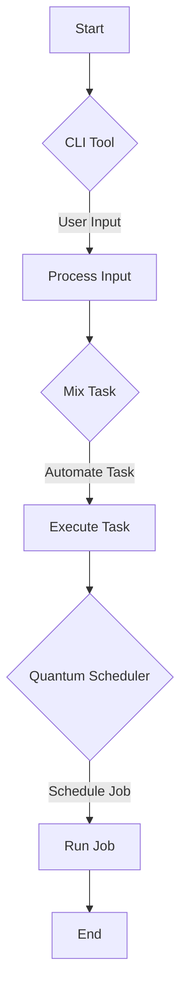

## 25.3. Automation Scripts and Tools

In the realm of modern software development, automation is a cornerstone for efficiency and reliability. Elixir, with its robust concurrency model and functional programming paradigm, offers a powerful toolkit for building automation scripts and tools. This section delves into creating command-line interfaces (CLIs), scripting with Mix tasks, and scheduling continuous tasks using tools like Quantum.

### Command-Line Interfaces

Command-line interfaces (CLIs) are essential for automating tasks and interacting with systems programmatically. Elixir provides a seamless way to build CLIs, leveraging its powerful language features and ecosystem.

#### Building CLI Tools with Elixir

To build a CLI tool in Elixir, we can use the `OptionParser` module to parse command-line arguments and the `System` module to interact with the operating system.

**Example: A Simple CLI Tool**

Let's create a simple CLI tool that greets the user:

```elixir
defmodule Greeter.CLI do
  def main(args) do
    {opts, _, _} = OptionParser.parse(args, switches: [name: :string])
    name = Keyword.get(opts, :name, "World")
    IO.puts("Hello, #{name}!")
  end
end

# To run this CLI tool, compile the module and execute:
# elixir -e "Greeter.CLI.main(System.argv())" -- --name=Elixir
```

**Explanation:**

- We use `OptionParser.parse/2` to handle command-line arguments, specifying that `--name` is a string option.
- The `IO.puts/1` function outputs the greeting message.
- The `System.argv/0` function retrieves the command-line arguments.

#### Advanced CLI Features

For more advanced CLI tools, consider using libraries like `escript` for packaging and `ExCLI` for more complex argument parsing and command handling.

**Example: Packaging with escript**

```elixir
# In mix.exs, add:
defp escript_config do
  [main_module: Greeter.CLI]
end

# Build the escript:
mix escript.build

# Run the escript:
./greeter --name=Elixir
```

**Explanation:**

- The `escript` configuration in `mix.exs` specifies the main module for the CLI.
- `mix escript.build` compiles the project into a standalone executable.

### Scripting with Mix Tasks

Mix tasks are a powerful feature in Elixir for automating repetitive tasks within a project. They are akin to Rake tasks in Ruby or Makefiles in C/C++.

#### Creating Custom Mix Tasks

To create a custom Mix task, define a module under the `Mix.Tasks` namespace and implement the `run/1` function.

**Example: A Custom Mix Task**

```elixir
defmodule Mix.Tasks.Greet do
  use Mix.Task

  @shortdoc "Greets the user with a message"

  def run(args) do
    {opts, _, _} = OptionParser.parse(args, switches: [name: :string])
    name = Keyword.get(opts, :name, "World")
    Mix.shell().info("Hello, #{name}!")
  end
end

# Run the task with:
# mix greet --name=Elixir
```

**Explanation:**

- The `@shortdoc` attribute provides a brief description of the task.
- `Mix.shell().info/1` outputs messages to the console.

#### Automating Repetitive Tasks

Mix tasks can automate a variety of tasks, such as database migrations, code generation, and deployment scripts. By leveraging Mix tasks, you can streamline your development workflow and reduce manual effort.

### Continuous Tasks

Continuous tasks are essential for scheduling and executing jobs at regular intervals. Elixir provides tools like Quantum for managing such tasks efficiently.

#### Scheduling Jobs with Quantum

Quantum is a powerful library for scheduling cron-like jobs in Elixir applications. It allows you to define jobs with flexible schedules and manage them seamlessly.

**Example: Scheduling a Job with Quantum**

```elixir
# Add Quantum to your mix.exs dependencies:
defp deps do
  [
    {:quantum, "~> 3.0"}
  ]
end

# Define a job in your application:
defmodule MyApp.Scheduler do
  use Quantum, otp_app: :my_app

  @impl true
  def init(config) do
    config
    |> Quantum.add_job(:greet, %Quantum.Job{
      schedule: ~e[*/5 * * * *],
      task: fn -> IO.puts("Hello, Elixir!") end
    })
  end
end
```

**Explanation:**

- The `Quantum.add_job/2` function schedules a job to run every 5 minutes.
- The job executes a simple task that prints a message to the console.

#### Advanced Scheduling Features

Quantum supports advanced scheduling features, such as time zone awareness, overlapping job prevention, and dynamic job management. These features make it a versatile tool for handling complex scheduling requirements.

### Visualizing Automation Workflows

To better understand the flow of automation scripts and tools, let's visualize a typical workflow using Mermaid.js.



**Description:**

- The workflow starts with a CLI tool that processes user input.
- The input is used to trigger a Mix task, which automates a specific task.
- Quantum Scheduler manages the scheduling of jobs, executing them at defined intervals.

### References and Links

- [Elixir Official Documentation](https://elixir-lang.org/docs.html)
- [Quantum GitHub Repository](https://github.com/quantum-elixir/quantum-core)
- [Mix Task Documentation](https://hexdocs.pm/mix/Mix.Task.html)

### Knowledge Check

- What are the benefits of using Elixir for building CLI tools?
- How can Mix tasks improve your development workflow?
- What are the key features of Quantum for scheduling tasks?

### Embrace the Journey

Remember, mastering automation scripts and tools in Elixir is an ongoing journey. As you explore these concepts, you'll discover new ways to enhance your productivity and streamline your workflows. Keep experimenting, stay curious, and enjoy the process!

### Quiz: Automation Scripts and Tools



### What module is commonly used for parsing command-line arguments in Elixir?

- [x] OptionParser
- [ ] System
- [ ] Mix
- [ ] Quantum

> **Explanation:** `OptionParser` is the module used for parsing command-line arguments in Elixir.

### Which function retrieves command-line arguments in Elixir?

- [x] System.argv/0
- [ ] IO.gets/1
- [ ] Mix.env/0
- [ ] Quantum.add_job/2

> **Explanation:** `System.argv/0` retrieves the command-line arguments passed to an Elixir program.

### What is the purpose of Mix tasks in Elixir?

- [x] Automating repetitive tasks
- [ ] Building web applications
- [ ] Managing dependencies
- [ ] Scheduling jobs

> **Explanation:** Mix tasks are used for automating repetitive tasks within an Elixir project.

### Which library is used for scheduling cron-like jobs in Elixir?

- [x] Quantum
- [ ] Mix
- [ ] Ecto
- [ ] Phoenix

> **Explanation:** Quantum is the library used for scheduling cron-like jobs in Elixir applications.

### How can you package a CLI tool as a standalone executable in Elixir?

- [x] Using escript
- [ ] Using Mix tasks
- [ ] Using Quantum
- [ ] Using Ecto

> **Explanation:** `escript` is used to package a CLI tool as a standalone executable in Elixir.

### What attribute provides a brief description of a Mix task?

- [x] @shortdoc
- [ ] @moduledoc
- [ ] @doc
- [ ] @taskdoc

> **Explanation:** The `@shortdoc` attribute provides a brief description of a Mix task.

### Which function is used to output messages to the console in a Mix task?

- [x] Mix.shell().info/1
- [ ] IO.puts/1
- [ ] System.cmd/2
- [ ] Quantum.add_job/2

> **Explanation:** `Mix.shell().info/1` is used to output messages to the console in a Mix task.

### What is a key feature of Quantum for scheduling tasks?

- [x] Time zone awareness
- [ ] Dependency management
- [ ] Web server integration
- [ ] Database migrations

> **Explanation:** Quantum supports time zone awareness as a key feature for scheduling tasks.

### Which of the following is NOT a feature of Quantum?

- [x] Web server integration
- [ ] Time zone awareness
- [ ] Overlapping job prevention
- [ ] Dynamic job management

> **Explanation:** Quantum does not provide web server integration as a feature.

### True or False: Mix tasks can only be used for database migrations.

- [ ] True
- [x] False

> **Explanation:** Mix tasks can be used for a variety of purposes, not just database migrations.


