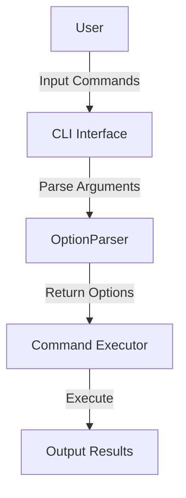
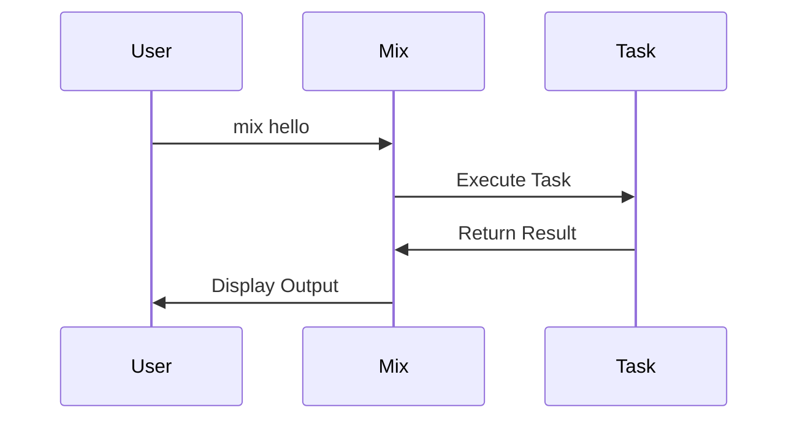
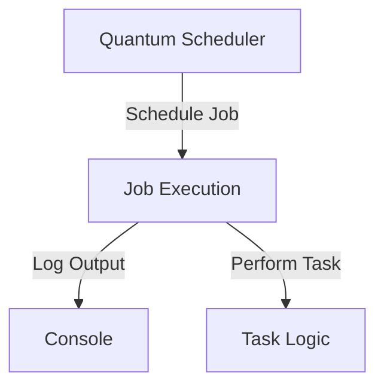

## 25.3. Automation Scripts and Tools

As expert software engineers and architects, harnessing Elixir for automation can significantly enhance your DevOps and infrastructure workflows. This section delves into building command-line interfaces (CLIs), scripting with Mix tasks, and scheduling jobs with Quantum. By mastering these tools, you can automate repetitive tasks, streamline processes, and improve system reliability.

### Command-Line Interfaces

Command-line interfaces (CLIs) are powerful tools that allow users to interact with software via text-based commands. In Elixir, building CLIs can automate tasks, manage applications, and simplify complex workflows.

#### Building CLI Tools with Elixir

Elixir's robust ecosystem makes it an excellent choice for developing CLI tools. Let's explore how you can create a simple CLI application using Elixir.

**Step 1: Setting Up the Project**

First, create a new Elixir project using Mix:

```bash
mix new my_cli --module MyCLI
```

This command initializes a new project named `my_cli` with a module `MyCLI`.

**Step 2: Implementing the CLI Logic**

Navigate to the `lib/my_cli.ex` file and implement the CLI logic:

```elixir
defmodule MyCLI do
  def main(args) do
    case parse_args(args) do
      {:ok, options} -> execute_command(options)
      {:error, message} -> IO.puts("Error: #{message}")
    end
  end

  defp parse_args(args) do
    # Parse the command-line arguments
    # Return a tuple {:ok, options} or {:error, message}
  end

  defp execute_command(options) do
    # Execute the command based on parsed options
  end
end
```

**Step 3: Parsing Command-Line Arguments**

Use the `OptionParser` module to parse command-line arguments:

```elixir
defp parse_args(args) do
  OptionParser.parse(args, switches: [help: :boolean, version: :boolean])
end
```

**Step 4: Executing Commands**

Implement the `execute_command/1` function to handle different commands:

```elixir
defp execute_command(options) do
  if options[:help] do
    IO.puts("Usage: my_cli [options]")
  else
    IO.puts("Executing command with options: #{inspect(options)}")
  end
end
```

**Step 5: Running the CLI**

Compile the project and run the CLI:

```bash
mix escript.build
./my_cli --help
```

This command builds the project as an executable script and runs it with the `--help` option.

#### Visualizing CLI Architecture


```mermaid
graph TD;
    A[User] -->|Input Commands| B[CLI Interface];
    B -->|Parse Arguments| C[OptionParser];
    C -->|Return Options| D[Command Executor];
    D -->|Execute| E[Output Results];
```

*Diagram: The flow of a CLI application, from user input to command execution.*

### Scripting with Mix Tasks

Mix tasks are an essential part of Elixir's build tool, Mix. They enable you to automate repetitive tasks, such as compiling code, running tests, and managing dependencies.

#### Creating Custom Mix Tasks

To create a custom Mix task, follow these steps:

**Step 1: Define the Task Module**

Create a new file in the `lib/mix/tasks` directory:

```elixir
# lib/mix/tasks/hello.ex

defmodule Mix.Tasks.Hello do
  use Mix.Task

  @shortdoc "Prints a greeting message"

  def run(_) do
    IO.puts("Hello, Elixir!")
  end
end
```

**Step 2: Running the Custom Task**

Run the custom task using Mix:

```bash
mix hello
```

This command executes the `Hello` task, printing "Hello, Elixir!" to the console.

**Step 3: Adding Arguments to the Task**

Modify the task to accept arguments:

```elixir
def run(args) do
  name = List.first(args) || "Elixir"
  IO.puts("Hello, #{name}!")
end
```

Run the task with an argument:

```bash
mix hello World
```

This command prints "Hello, World!" to the console.

#### Visualizing Mix Task Execution


```mermaid
sequenceDiagram
    participant User
    participant Mix
    participant Task
    User->>Mix: mix hello
    Mix->>Task: Execute Task
    Task->>Mix: Return Result
    Mix->>User: Display Output
```

*Diagram: The sequence of executing a Mix task, from user command to output.*

### Continuous Tasks

Continuous tasks involve scheduling and executing jobs at specified intervals. In Elixir, the Quantum library provides a robust solution for task scheduling.

#### Scheduling Jobs with Quantum

Quantum is a powerful library for scheduling recurring tasks in Elixir applications.

**Step 1: Adding Quantum to Your Project**

Add Quantum to your `mix.exs` file:

```elixir
defp deps do
  [
    {:quantum, "~> 3.0"}
  ]
end
```

Run `mix deps.get` to fetch the dependency.

**Step 2: Configuring Quantum**

Configure Quantum in `config/config.exs`:

```elixir
config :my_app, MyApp.Scheduler,
  jobs: [
    {"* * * * *", fn -> IO.puts("This job runs every minute") end}
  ]
```

**Step 3: Defining the Scheduler Module**

Create a scheduler module:

```elixir
defmodule MyApp.Scheduler do
  use Quantum, otp_app: :my_app
end
```

**Step 4: Running the Scheduler**

Start the scheduler by adding it to your application's supervision tree:

```elixir
def start(_type, _args) do
  children = [
    MyApp.Scheduler
  ]

  opts = [strategy: :one_for_one, name: MyApp.Supervisor]
  Supervisor.start_link(children, opts)
end
```

#### Visualizing Quantum Job Scheduling


```mermaid
graph TB;
    A[Quantum Scheduler] -->|Schedule Job| B[Job Execution];
    B -->|Log Output| C[Console];
    B -->|Perform Task| D[Task Logic];
```

*Diagram: The process of scheduling and executing jobs with Quantum.*

### Key Takeaways

- **Elixir's CLI capabilities**: Building command-line tools in Elixir allows for efficient automation of tasks.
- **Mix tasks**: Custom Mix tasks streamline repetitive processes, enhancing productivity.
- **Quantum scheduling**: Quantum provides a powerful framework for scheduling and managing recurring tasks.

### Try It Yourself

Experiment with the examples provided:

- Modify the CLI tool to accept additional options and arguments.
- Create a Mix task that automates a routine task in your workflow.
- Schedule a Quantum job that performs a specific task at regular intervals.

### References and Further Reading

- [Elixir Lang](https://elixir-lang.org/) - Official Elixir website.
- [Quantum GitHub Repository](https://github.com/quantum-elixir/quantum-core) - Quantum library for job scheduling.
- [Mix Task Documentation](https://hexdocs.pm/mix/Mix.Task.html) - Official Mix task documentation.

## Quiz Time!



### What is the primary purpose of building CLI tools with Elixir?

- [x] To automate tasks and manage applications via text-based commands.
- [ ] To create graphical user interfaces for applications.
- [ ] To replace Mix tasks entirely.
- [ ] To compile Elixir code into executables.

> **Explanation:** CLI tools in Elixir are designed to automate tasks and manage applications through command-line interactions.

### Which Elixir module is commonly used for parsing command-line arguments?

- [x] OptionParser
- [ ] Enum
- [ ] Stream
- [ ] GenServer

> **Explanation:** `OptionParser` is the Elixir module used for parsing command-line arguments.

### How do you run a custom Mix task in Elixir?

- [x] By using the `mix` command followed by the task name.
- [ ] By calling the task module directly in IEx.
- [ ] By compiling the task into an executable.
- [ ] By adding the task to the supervision tree.

> **Explanation:** Custom Mix tasks are executed using the `mix` command followed by the task name.

### What does Quantum provide in the context of Elixir applications?

- [x] A framework for scheduling and managing recurring tasks.
- [ ] A module for parsing command-line arguments.
- [ ] A library for building graphical user interfaces.
- [ ] A tool for compiling Elixir code into binaries.

> **Explanation:** Quantum is a library that provides scheduling and management of recurring tasks in Elixir applications.

### In a Mix task, what does the `run/1` function do?

- [x] It defines the logic to be executed when the task is run.
- [ ] It starts the Elixir application.
- [ ] It initializes the Mix environment.
- [ ] It compiles the project.

> **Explanation:** The `run/1` function in a Mix task contains the logic that is executed when the task is invoked.

### What is the purpose of the `@shortdoc` attribute in a Mix task?

- [x] To provide a brief description of the task.
- [ ] To specify the task's dependencies.
- [ ] To define the task's execution order.
- [ ] To indicate the task's version number.

> **Explanation:** The `@shortdoc` attribute provides a brief description of the Mix task for documentation purposes.

### Which command is used to build a CLI tool as an executable script in Elixir?

- [x] mix escript.build
- [ ] mix compile
- [ ] mix run
- [ ] mix release

> **Explanation:** The `mix escript.build` command is used to compile a CLI tool into an executable script.

### How can you modify a Quantum job to run every hour instead of every minute?

- [x] Change the cron expression in the configuration to `"0 * * * *"`.
- [ ] Use a different library for scheduling.
- [ ] Modify the `run/1` function of the job.
- [ ] Change the Mix task configuration.

> **Explanation:** The cron expression `"0 * * * *"` schedules a job to run every hour.

### What is the role of the `Supervisor` in an Elixir application using Quantum?

- [x] To manage the lifecycle of the Quantum scheduler and other processes.
- [ ] To parse command-line arguments for the application.
- [ ] To compile the application into an executable.
- [ ] To define custom Mix tasks.

> **Explanation:** The `Supervisor` manages the lifecycle of processes, including the Quantum scheduler, in an Elixir application.

### True or False: Mix tasks can only be used for compiling Elixir code.

- [ ] True
- [x] False

> **Explanation:** Mix tasks can be used for a variety of purposes, including compiling code, running tests, and automating repetitive tasks.



Remember, this is just the beginning. As you progress, you'll build more complex and interactive automation scripts. Keep experimenting, stay curious, and enjoy the journey!
