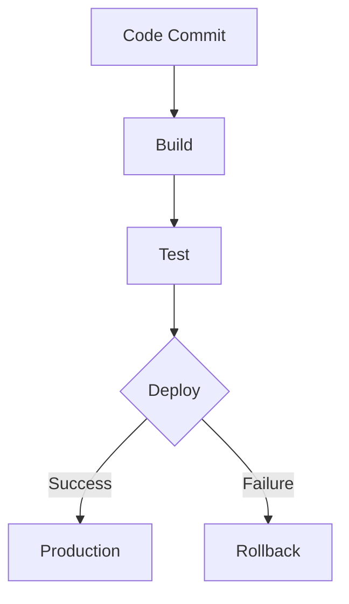

## 25.4. Continuous Integration and Continuous Deployment (CI/CD)

Continuous Integration and Continuous Deployment (CI/CD) are essential practices in modern software development, enabling teams to deliver code changes more frequently and reliably. In the context of Elixir, CI/CD can significantly enhance the development workflow by automating the build, test, and deployment processes. This section will guide you through setting up CI/CD pipelines, using popular tools, and implementing best practices to ensure seamless integration and deployment in your Elixir projects.

### Setting Up Pipelines

Setting up a CI/CD pipeline involves automating the processes of building, testing, and deploying your application. This automation helps in catching bugs early, reducing integration issues, and ensuring that your code is always in a deployable state.

#### Automating Build, Test, and Deployment Processes

1. **Build Automation**: Automate the compilation of your Elixir code using tools like Mix. Ensure that all dependencies are correctly resolved and that the code compiles without errors.

2. **Test Automation**: Use ExUnit to automate your test suite. Ensure that all tests are run on every commit to catch regressions early. Consider using property-based testing with tools like StreamData for more comprehensive test coverage.

3. **Deployment Automation**: Automate the deployment process using tools like Distillery or Mix Releases. Ensure that your application is deployed in a consistent and repeatable manner.

```elixir
# Example of a simple Elixir build script using Mix
defmodule BuildScript do
  def run do
    Mix.Task.run("deps.get")
    Mix.Task.run("compile")
    Mix.Task.run("test")
  end
end
```

### Tools for CI/CD

Several tools can help you implement CI/CD in your Elixir projects. Each tool has its strengths and can be chosen based on your specific needs and infrastructure.

#### Jenkins

Jenkins is a widely used open-source automation server that supports building, deploying, and automating any project. It offers a rich ecosystem of plugins and can be integrated with various tools and services.

- **Pipeline as Code**: Jenkins allows you to define your build pipeline as code using Jenkinsfile, which can be versioned alongside your application code.
- **Plugins**: Utilize Jenkins plugins for integration with Git, Docker, and other tools.

```groovy
pipeline {
    agent any
    stages {
        stage('Build') {
            steps {
                sh 'mix deps.get'
                sh 'mix compile'
            }
        }
        stage('Test') {
            steps {
                sh 'mix test'
            }
        }
        stage('Deploy') {
            steps {
                sh 'mix release'
                // Add deployment steps here
            }
        }
    }
}
```

#### GitLab CI/CD

GitLab CI/CD is a powerful tool integrated into GitLab, providing a seamless experience for managing your CI/CD pipelines.

- **YAML Configuration**: Define your CI/CD pipeline using a `.gitlab-ci.yml` file, which is easy to read and maintain.
- **Built-in Docker Support**: GitLab CI/CD has excellent support for Docker, making it easy to build and deploy containerized applications.

```yaml
stages:
  - build
  - test
  - deploy

build:
  stage: build
  script:
    - mix deps.get
    - mix compile

test:
  stage: test
  script:
    - mix test

deploy:
  stage: deploy
  script:
    - mix release
    # Add deployment steps here
```

#### GitHub Actions

GitHub Actions is a CI/CD tool integrated into GitHub, allowing you to automate workflows directly from your GitHub repository.

- **Workflow Files**: Define workflows using YAML files stored in the `.github/workflows` directory.
- **Marketplace**: Access a marketplace of pre-built actions to extend your workflows.

```yaml
name: Elixir CI

on: [push, pull_request]

jobs:
  build:
    runs-on: ubuntu-latest
    steps:
      - uses: actions/checkout@v2
      - name: Set up Elixir
        uses: actions/setup-elixir@v1
        with:
          elixir-version: '1.11'
      - run: mix deps.get
      - run: mix compile
      - run: mix test
```

### Best Practices for CI/CD

Implementing best practices in your CI/CD pipelines can help ensure that your deployments are reliable and efficient.

#### Incremental Deployments

Incremental deployments involve deploying only the changes made since the last deployment, reducing the risk of introducing errors and minimizing downtime.

- **Feature Toggles**: Use feature toggles to deploy incomplete features without exposing them to users.
- **Canary Releases**: Deploy changes to a small subset of users before rolling out to the entire user base.

#### Blue-Green Deployments

Blue-green deployments involve maintaining two identical production environments (blue and green). At any time, one environment is live, while the other is idle. This approach allows for zero-downtime deployments and easy rollbacks.

- **Traffic Switching**: Use a load balancer to switch traffic between the blue and green environments.
- **Rollback Strategy**: In case of issues, switch back to the previous environment without downtime.

### Visualizing CI/CD Pipelines

Visualizing your CI/CD pipeline can help you understand the flow of your build, test, and deployment processes. Below is a simple flowchart representing a typical CI/CD pipeline.



### Elixir-Specific Considerations

Elixir's unique features, such as its concurrency model and fault-tolerance, can be leveraged in your CI/CD pipelines.

- **Concurrent Testing**: Utilize Elixir's concurrency features to run tests in parallel, reducing the time taken to execute your test suite.
- **Fault-Tolerant Deployments**: Design your deployment process to handle failures gracefully, leveraging Elixir's "let it crash" philosophy.

### Differences and Similarities with Other Languages

While CI/CD principles are consistent across languages, Elixir's functional nature and concurrency model offer unique advantages.

- **Functional Pipelines**: Use Elixir's pipe operator (`|>`) to create clean and readable build scripts.
- **Process Isolation**: Leverage Elixir's lightweight processes to isolate different stages of your pipeline.

### Knowledge Check

To reinforce your understanding of CI/CD in Elixir, consider the following questions:

1. What are the benefits of automating the build, test, and deployment processes in a CI/CD pipeline?
2. How can Jenkins be used to implement a CI/CD pipeline for an Elixir project?
3. What are the advantages of using GitLab CI/CD for Elixir projects?
4. How does GitHub Actions integrate with Elixir projects for CI/CD?
5. What are the key differences between incremental deployments and blue-green deployments?

### Embrace the Journey

Remember, mastering CI/CD is a journey. As you implement these practices in your Elixir projects, you'll gain insights into optimizing your workflows and delivering value to your users more efficiently. Keep experimenting, stay curious, and enjoy the process!

## Quiz: Continuous Integration and Continuous Deployment (CI/CD)



### What is the primary benefit of automating the build process in a CI/CD pipeline?

- [x] Ensures code compiles without errors
- [ ] Increases code complexity
- [ ] Reduces code readability
- [ ] Slows down the development process

> **Explanation:** Automating the build process ensures that code compiles without errors, catching issues early in the development cycle.

### Which tool allows you to define your CI/CD pipeline as code using Jenkinsfile?

- [x] Jenkins
- [ ] GitLab CI/CD
- [ ] GitHub Actions
- [ ] Travis CI

> **Explanation:** Jenkins allows you to define your CI/CD pipeline as code using Jenkinsfile, which can be versioned alongside your application code.

### What is a key advantage of using GitLab CI/CD for Elixir projects?

- [x] Built-in Docker support
- [ ] Requires manual configuration
- [ ] Limited to small projects
- [ ] No support for YAML configuration

> **Explanation:** GitLab CI/CD has built-in Docker support, making it easy to build and deploy containerized applications.

### How does GitHub Actions integrate with Elixir projects for CI/CD?

- [x] Uses YAML workflow files
- [ ] Requires proprietary scripts
- [ ] Only supports JavaScript projects
- [ ] Does not support Elixir

> **Explanation:** GitHub Actions integrates with Elixir projects using YAML workflow files stored in the `.github/workflows` directory.

### What is the purpose of feature toggles in incremental deployments?

- [x] Deploy incomplete features without exposing them
- [ ] Increase deployment time
- [ ] Reduce code quality
- [ ] Limit user access

> **Explanation:** Feature toggles allow you to deploy incomplete features without exposing them to users, facilitating incremental deployments.

### What is a key characteristic of blue-green deployments?

- [x] Zero-downtime deployments
- [ ] Requires two different codebases
- [ ] Increases downtime
- [ ] Limited to small applications

> **Explanation:** Blue-green deployments involve maintaining two identical production environments, allowing for zero-downtime deployments.

### How can Elixir's concurrency features be leveraged in CI/CD pipelines?

- [x] Run tests in parallel
- [ ] Increase build time
- [ ] Limit deployment options
- [ ] Reduce test coverage

> **Explanation:** Elixir's concurrency features can be leveraged to run tests in parallel, reducing the time taken to execute the test suite.

### What is the role of a load balancer in blue-green deployments?

- [x] Switch traffic between environments
- [ ] Increase server load
- [ ] Limit user access
- [ ] Reduce network speed

> **Explanation:** In blue-green deployments, a load balancer is used to switch traffic between the blue and green environments.

### What is the "let it crash" philosophy in Elixir?

- [x] Design systems to handle failures gracefully
- [ ] Ignore errors and exceptions
- [ ] Increase system complexity
- [ ] Limit fault tolerance

> **Explanation:** The "let it crash" philosophy in Elixir involves designing systems to handle failures gracefully, leveraging the language's fault-tolerance features.

### True or False: CI/CD principles are consistent across all programming languages.

- [x] True
- [ ] False

> **Explanation:** While CI/CD principles are consistent across languages, the implementation details may vary based on the language's features and ecosystem.


