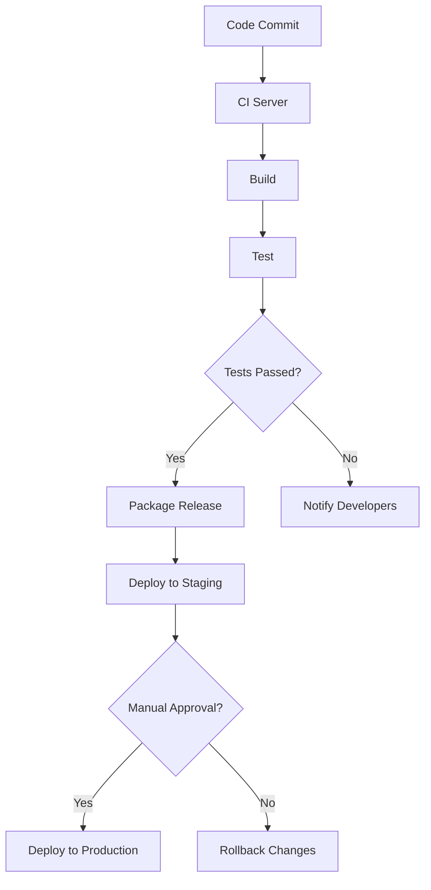

## 25.4. Continuous Integration and Continuous Deployment (CI/CD)

Continuous Integration and Continuous Deployment (CI/CD) are essential practices in modern software development, aimed at automating the process of integrating code changes, testing them, and deploying applications. This section will guide you through setting up CI/CD pipelines specifically for Elixir projects, utilizing popular tools like Jenkins, GitLab CI/CD, and GitHub Actions, and adhering to best practices such as incremental and blue-green deployments.

### Understanding CI/CD

**Continuous Integration (CI)** involves automatically testing and integrating code changes into a shared repository. This practice helps developers detect problems early, ensuring that the software is always in a deployable state.

**Continuous Deployment (CD)** extends CI by automating the release of software to production environments. This reduces manual intervention and accelerates the delivery of new features and bug fixes to end-users.

### Setting Up Pipelines

#### Automating Build, Test, and Deployment Processes

To set up a CI/CD pipeline for an Elixir project, follow these steps:

1. **Version Control System (VCS):** Ensure your code is stored in a VCS like Git. This allows for tracking changes and collaborating with team members.

2. **Build Automation:** Use tools like Mix, Elixir's build tool, to automate the compilation of code and manage dependencies.

3. **Testing:** Write automated tests using ExUnit, Elixir's built-in testing framework. Ensure tests cover various aspects of your application, including unit, integration, and end-to-end tests.

4. **Continuous Integration Server:** Set up a CI server that automatically builds and tests your application whenever changes are pushed to the repository.

5. **Deployment Automation:** Use tools like Distillery or Mix Releases to automate the packaging and deployment of your application to different environments.

#### Example CI/CD Pipeline Configuration

Below is an example of a CI/CD pipeline configuration using GitHub Actions for an Elixir project:

```yaml
name: Elixir CI/CD Pipeline

on:
  push:
    branches:
      - main
  pull_request:
    branches:
      - main

jobs:
  build:
    runs-on: ubuntu-latest

    steps:
    - name: Checkout code
      uses: actions/checkout@v2

    - name: Set up Elixir
      uses: actions/setup-elixir@v1
      with:
        elixir-version: '1.12'
        otp-version: '24'

    - name: Install dependencies
      run: mix deps.get

    - name: Run tests
      run: mix test

    - name: Build release
      run: mix release

    - name: Deploy to production
      if: github.ref == 'refs/heads/main'
      run: |
        # Deploy your application here
        echo "Deploying to production..."
```

### Tools for CI/CD

Several tools can be used to implement CI/CD pipelines for Elixir projects. Here are some popular options:

#### Jenkins

Jenkins is a widely-used open-source automation server that supports building, deploying, and automating any project. It is highly extensible with plugins and can be configured to work with Elixir projects.

**Setting Up Jenkins for Elixir:**

1. **Install Jenkins:** Follow the official [Jenkins installation guide](https://www.jenkins.io/doc/book/installing/) to set up Jenkins on your server.

2. **Create a New Job:** Create a freestyle or pipeline job for your Elixir project.

3. **Configure the Job:**
   - **Source Code Management:** Connect Jenkins to your Git repository.
   - **Build Triggers:** Set up triggers to build the project on code changes.
   - **Build Environment:** Use a shell script to install Elixir and run Mix tasks.

4. **Build Steps:**
   - Use shell commands to install dependencies, run tests, and build releases.

Example Jenkins Pipeline Script:

```groovy
pipeline {
    agent any

    stages {
        stage('Checkout') {
            steps {
                git 'https://github.com/your-repo/elixir-project.git'
            }
        }
        stage('Setup Elixir') {
            steps {
                sh 'asdf install'
                sh 'asdf global elixir 1.12.3'
                sh 'asdf global erlang 24.0.5'
            }
        }
        stage('Install Dependencies') {
            steps {
                sh 'mix deps.get'
            }
        }
        stage('Run Tests') {
            steps {
                sh 'mix test'
            }
        }
        stage('Build Release') {
            steps {
                sh 'mix release'
            }
        }
        stage('Deploy') {
            steps {
                // Add deployment steps here
                echo 'Deploying to production...'
            }
        }
    }
}
```

#### GitLab CI/CD

GitLab CI/CD is a built-in feature of GitLab that allows you to define CI/CD pipelines directly in your repository using a `.gitlab-ci.yml` file.

**Setting Up GitLab CI/CD for Elixir:**

1. **Create a `.gitlab-ci.yml` File:** Define your CI/CD pipeline in this file.

2. **Configure the Pipeline:** Specify the stages, jobs, and scripts to run for each stage.

Example GitLab CI/CD Configuration:

```yaml
stages:
  - build
  - test
  - release
  - deploy

variables:
  MIX_ENV: "test"

build:
  stage: build
  script:
    - mix deps.get
    - mix compile
  artifacts:
    paths:
      - _build/

test:
  stage: test
  script:
    - mix test

release:
  stage: release
  script:
    - mix release

deploy:
  stage: deploy
  script:
    - echo "Deploying to production..."
  only:
    - main
```

#### GitHub Actions

GitHub Actions is a powerful CI/CD tool integrated into GitHub, allowing you to automate workflows directly from your repository.

**Setting Up GitHub Actions for Elixir:**

1. **Create a Workflow File:** Add a `.github/workflows/ci.yml` file to your repository.

2. **Define the Workflow:** Specify the events that trigger the workflow and the jobs to run.

Refer to the earlier example for a complete GitHub Actions configuration.

### Best Practices for CI/CD

Implementing CI/CD effectively requires adhering to best practices that ensure smooth and efficient software delivery:

#### Incremental Deployments

Incremental deployments involve deploying only the changes made since the last release. This reduces the risk of introducing errors and simplifies troubleshooting.

**Steps for Incremental Deployments:**

- Use version control to track changes.
- Automate the deployment of only modified components.
- Roll back changes easily if issues arise.

#### Blue-Green Deployments

Blue-green deployments involve maintaining two identical production environments (blue and green). At any time, one environment serves users while the other is idle. New releases are deployed to the idle environment, and traffic is switched once testing is complete.

**Benefits of Blue-Green Deployments:**

- Minimize downtime during deployments.
- Easily roll back to the previous version if issues occur.
- Test new features in a production-like environment before going live.

### Visualizing CI/CD Pipelines

To better understand the flow of a CI/CD pipeline, consider the following diagram:


```mermaid
graph TD;
    A[Code Commit] --> B[CI Server];
    B --> C[Build];
    C --> D[Test];
    D --> E{Tests Passed?};
    E -- Yes --> F[Package Release];
    F --> G[Deploy to Staging];
    G --> H{Manual Approval?};
    H -- Yes --> I[Deploy to Production];
    E -- No --> J[Notify Developers];
    H -- No --> K[Rollback Changes];
```

**Diagram Description:** This diagram illustrates a typical CI/CD pipeline, starting from code commit to deployment. It includes stages for building, testing, packaging, and deploying, with decision points for test results and manual approvals.

### References and Links

- [Jenkins Official Documentation](https://www.jenkins.io/doc/)
- [GitLab CI/CD Documentation](https://docs.gitlab.com/ee/ci/)
- [GitHub Actions Documentation](https://docs.github.com/en/actions)
- [Elixir Mix Documentation](https://hexdocs.pm/mix/Mix.html)
- [ExUnit Testing Framework](https://hexdocs.pm/ex_unit/ExUnit.html)

### Knowledge Check

- Why is CI/CD important in modern software development?
- What are the key differences between Jenkins, GitLab CI/CD, and GitHub Actions?
- How can blue-green deployments minimize downtime?

### Embrace the Journey

Remember, mastering CI/CD is a continuous process. As you implement these practices, you'll encounter challenges and learnings that will enhance your skills. Keep experimenting, stay curious, and enjoy the journey of delivering software efficiently and effectively!

## Quiz Time!



### What is the primary goal of Continuous Integration (CI)?

- [x] To automatically test and integrate code changes into a shared repository.
- [ ] To manually deploy code to production.
- [ ] To write code without testing.
- [ ] To create manual backups of code.

> **Explanation:** Continuous Integration (CI) aims to automatically test and integrate code changes into a shared repository to ensure the software is always in a deployable state.

### Which of the following tools is NOT typically used for CI/CD in Elixir projects?

- [ ] Jenkins
- [ ] GitLab CI/CD
- [ ] GitHub Actions
- [x] Microsoft Word

> **Explanation:** Microsoft Word is a word processing software and is not used for CI/CD processes.

### What is the benefit of using blue-green deployments?

- [x] Minimize downtime during deployments.
- [ ] Increase the time taken for deployments.
- [ ] Reduce the need for testing.
- [ ] Eliminate the need for a staging environment.

> **Explanation:** Blue-green deployments minimize downtime by allowing one environment to serve users while the other is updated and tested.

### In a CI/CD pipeline, what is the purpose of the 'Test' stage?

- [x] To verify that the code changes do not break existing functionality.
- [ ] To deploy the code to production.
- [ ] To write new features.
- [ ] To create backups of the code.

> **Explanation:** The 'Test' stage verifies that code changes do not break existing functionality, ensuring the application remains stable.

### What is an incremental deployment?

- [x] Deploying only the changes made since the last release.
- [ ] Deploying the entire application from scratch.
- [ ] Deploying without any testing.
- [ ] Deploying to a single environment only.

> **Explanation:** Incremental deployment involves deploying only the changes made since the last release, reducing risk and simplifying troubleshooting.

### Which CI/CD tool is integrated directly into GitHub?

- [ ] Jenkins
- [ ] GitLab CI/CD
- [x] GitHub Actions
- [ ] Travis CI

> **Explanation:** GitHub Actions is integrated directly into GitHub, allowing automation of workflows from the repository.

### What does the 'Deploy to Production' stage signify in a CI/CD pipeline?

- [x] The application is ready to be released to end-users.
- [ ] The code is still in development.
- [ ] The code is being tested.
- [ ] The code is being backed up.

> **Explanation:** The 'Deploy to Production' stage signifies that the application is ready to be released to end-users.

### What is the role of a CI server?

- [x] To automatically build and test applications.
- [ ] To manually deploy applications.
- [ ] To write code.
- [ ] To manage user accounts.

> **Explanation:** A CI server automatically builds and tests applications, ensuring they are always in a deployable state.

### Which Elixir tool is used for managing dependencies and automating builds?

- [x] Mix
- [ ] ExUnit
- [ ] Distillery
- [ ] Phoenix

> **Explanation:** Mix is used for managing dependencies and automating builds in Elixir projects.

### True or False: Continuous Deployment (CD) requires manual intervention to release software.

- [ ] True
- [x] False

> **Explanation:** Continuous Deployment (CD) automates the release of software to production environments, reducing manual intervention.




