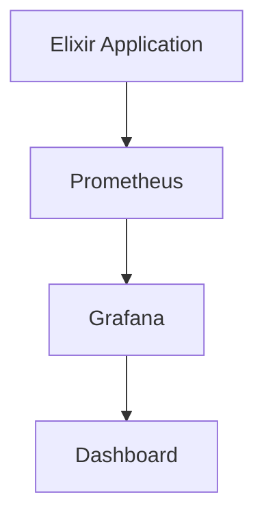
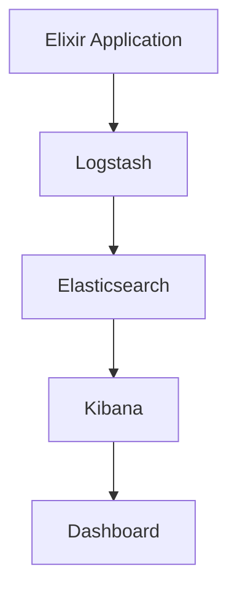

## 25.5. Monitoring and Logging Solutions

In today's fast-paced software development environment, monitoring and logging are crucial components for maintaining the health and performance of applications. For Elixir applications, which often run on the BEAM VM and are designed for high concurrency and fault tolerance, effective monitoring and logging solutions are essential. In this section, we will explore various tools and techniques for monitoring and logging in Elixir, including Prometheus, New Relic, and the ELK Stack. We will also discuss how to configure alerts for critical metrics to ensure your applications run smoothly.

### Application Monitoring

Monitoring is the process of collecting, analyzing, and visualizing data from your applications to understand their performance and health. It helps in identifying issues before they affect users and provides insights into system behavior.

#### Using Prometheus for Monitoring

Prometheus is an open-source monitoring and alerting toolkit that is widely used for monitoring applications. It is particularly well-suited for Elixir applications due to its support for time-series data and powerful query language, PromQL.

**Key Features of Prometheus:**

- **Time-Series Data Storage:** Prometheus stores all data as time-series, allowing for efficient querying and analysis.
- **Powerful Query Language (PromQL):** PromQL enables complex queries and aggregations on time-series data.
- **Alerting:** Prometheus supports alerting based on query results, allowing you to set up alerts for critical metrics.
- **Service Discovery:** Prometheus can automatically discover services to monitor through service discovery mechanisms.

**Setting Up Prometheus with Elixir:**

To integrate Prometheus with an Elixir application, you can use the `prometheus_ex` library, which provides a simple interface for defining and collecting metrics.

```elixir
# Add prometheus_ex to your mix.exs dependencies
defp deps do
  [
    {:prometheus_ex, "~> 3.0"}
  ]
end

# Define a counter metric
defmodule MyApp.Metrics do
  use Prometheus.Metric

  def setup do
    Counter.declare(name: :http_requests_total, help: "Total number of HTTP requests")
  end

  def increment_request_count do
    Counter.inc(name: :http_requests_total)
  end
end

# Increment the counter in your application code
MyApp.Metrics.increment_request_count()
```

**Visualizing Metrics with Grafana:**

Grafana is a popular open-source platform for visualizing metrics. It integrates seamlessly with Prometheus and allows you to create dashboards to monitor your Elixir applications.



*Diagram: Visualizing Elixir Application Metrics with Prometheus and Grafana*

#### Monitoring with New Relic

New Relic is a comprehensive monitoring solution that provides real-time insights into application performance. It offers features such as distributed tracing, error tracking, and detailed performance metrics.

**Key Features of New Relic:**

- **Distributed Tracing:** Trace requests across distributed systems to identify bottlenecks.
- **Error Tracking:** Monitor and analyze application errors in real-time.
- **Performance Metrics:** Gain insights into application performance with detailed metrics.

**Integrating New Relic with Elixir:**

To use New Relic with Elixir, you can leverage the `new_relic_agent` library, which provides an easy way to instrument your application.

```elixir
# Add new_relic_agent to your mix.exs dependencies
defp deps do
  [
    {:new_relic_agent, "~> 1.0"}
  ]
end

# Configure New Relic in your config.exs
config :new_relic_agent,
  app_name: "My Elixir App",
  license_key: "YOUR_NEW_RELIC_LICENSE_KEY"
```

### Log Aggregation

Log aggregation involves collecting and centralizing logs from various sources to facilitate analysis and troubleshooting. The ELK Stack (Elasticsearch, Logstash, Kibana) is a popular solution for log aggregation.

#### Centralizing Logs with the ELK Stack

The ELK Stack is a powerful toolset for log aggregation and analysis. It consists of Elasticsearch for storing and searching logs, Logstash for processing and transforming logs, and Kibana for visualizing logs.

**Setting Up the ELK Stack:**

1. **Elasticsearch:** Install and configure Elasticsearch to store logs.
2. **Logstash:** Use Logstash to collect and process logs from your Elixir application.
3. **Kibana:** Set up Kibana to visualize and analyze logs.

**Example Logstash Configuration:**

```plaintext
input {
  file {
    path => "/var/log/my_elixir_app.log"
    start_position => "beginning"
  }
}

filter {
  grok {
    match => { "message" => "%{TIMESTAMP_ISO8601:timestamp} %{LOGLEVEL:loglevel} %{GREEDYDATA:message}" }
  }
}

output {
  elasticsearch {
    hosts => ["localhost:9200"]
    index => "my_elixir_app_logs"
  }
}
```

**Visualizing Logs with Kibana:**

Kibana provides a user-friendly interface for exploring and visualizing logs stored in Elasticsearch. You can create dashboards to monitor log data and identify patterns or anomalies.



*Diagram: Log Aggregation and Visualization with the ELK Stack*

### Alerting

Alerting is a critical component of monitoring and logging solutions. It involves configuring notifications for specific events or thresholds to ensure timely response to issues.

#### Configuring Alerts for Critical Metrics

Alerts can be configured using tools like Prometheus Alertmanager or New Relic's alerting features. These tools allow you to define alert rules based on specific conditions and send notifications via email, Slack, or other channels.

**Example Prometheus Alert Rule:**

```yaml
groups:
- name: example
  rules:
  - alert: HighErrorRate
    expr: job:request_errors:rate5m{job="my_elixir_app"} > 0.05
    for: 5m
    labels:
      severity: critical
    annotations:
      summary: "High error rate detected"
      description: "The error rate for the job 'my_elixir_app' is above 5% for the last 5 minutes."
```

**Setting Up Alertmanager:**

Alertmanager handles alerts generated by Prometheus and routes them to the appropriate channels.

```yaml
global:
  resolve_timeout: 5m

route:
  receiver: "email"

receivers:
- name: "email"
  email_configs:
  - to: "alerts@example.com"
    from: "prometheus@example.com"
    smarthost: "smtp.example.com:587"
```

### Best Practices for Monitoring and Logging

1. **Define Clear Metrics:** Identify key performance indicators (KPIs) and metrics that are critical to your application's success.
2. **Automate Log Collection:** Use tools like Logstash to automate log collection and processing.
3. **Set Up Alerts for Critical Events:** Configure alerts for important metrics to ensure timely response to issues.
4. **Regularly Review Dashboards:** Monitor dashboards regularly to identify trends and potential issues.
5. **Optimize Log Storage:** Use efficient storage solutions like Elasticsearch to manage large volumes of log data.

### Try It Yourself

Experiment with the code examples provided in this section. Try modifying the Prometheus metrics or Logstash configuration to suit your application's needs. Explore different visualization options in Grafana and Kibana to gain insights into your application's performance and logs.

### Conclusion

Monitoring and logging are essential components of any robust software system. By leveraging tools like Prometheus, New Relic, and the ELK Stack, you can gain valuable insights into your Elixir applications and ensure they run smoothly. Remember, this is just the beginning. As you progress, you'll build more complex monitoring and logging solutions. Keep experimenting, stay curious, and enjoy the journey!

## Quiz: Monitoring and Logging Solutions



### What is the primary purpose of monitoring in software applications?

- [x] To collect, analyze, and visualize data to understand application performance and health
- [ ] To replace manual testing
- [ ] To automate deployments
- [ ] To manage user authentication

> **Explanation:** Monitoring helps in understanding the performance and health of applications by collecting, analyzing, and visualizing data.

### Which tool is commonly used for visualizing metrics collected by Prometheus?

- [x] Grafana
- [ ] Logstash
- [ ] Elasticsearch
- [ ] New Relic

> **Explanation:** Grafana is a popular tool for visualizing metrics collected by Prometheus.

### What is the ELK Stack used for?

- [x] Log aggregation and analysis
- [ ] Application deployment
- [ ] User authentication
- [ ] Database management

> **Explanation:** The ELK Stack (Elasticsearch, Logstash, Kibana) is used for log aggregation and analysis.

### Which component of the ELK Stack is responsible for storing logs?

- [x] Elasticsearch
- [ ] Logstash
- [ ] Kibana
- [ ] Prometheus

> **Explanation:** Elasticsearch is responsible for storing logs in the ELK Stack.

### What is the purpose of Prometheus Alertmanager?

- [x] To handle alerts generated by Prometheus and route them to appropriate channels
- [ ] To store time-series data
- [ ] To visualize metrics
- [ ] To process logs

> **Explanation:** Prometheus Alertmanager handles alerts generated by Prometheus and routes them to appropriate channels.

### Which library is used to integrate Prometheus with Elixir applications?

- [x] prometheus_ex
- [ ] new_relic_agent
- [ ] logstash_ex
- [ ] grafana_ex

> **Explanation:** The `prometheus_ex` library is used to integrate Prometheus with Elixir applications.

### What is a key feature of New Relic for monitoring applications?

- [x] Distributed tracing
- [ ] Log aggregation
- [ ] Time-series data storage
- [ ] Service discovery

> **Explanation:** Distributed tracing is a key feature of New Relic for monitoring applications.

### Which tool in the ELK Stack is used for visualizing logs?

- [x] Kibana
- [ ] Logstash
- [ ] Elasticsearch
- [ ] Prometheus

> **Explanation:** Kibana is used for visualizing logs in the ELK Stack.

### True or False: Prometheus stores all data as time-series.

- [x] True
- [ ] False

> **Explanation:** Prometheus stores all data as time-series, allowing for efficient querying and analysis.

### What is the purpose of setting up alerts in monitoring solutions?

- [x] To notify when specific events or thresholds are met
- [ ] To automate deployments
- [ ] To visualize data
- [ ] To manage user authentication

> **Explanation:** Alerts are set up to notify when specific events or thresholds are met, ensuring timely response to issues.


