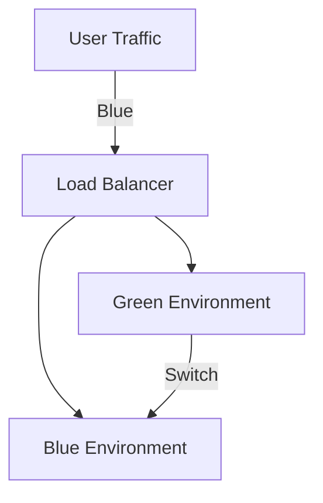

## 25.6. Deployment Strategies and Tools

In the fast-paced world of software development, deploying applications efficiently and reliably is crucial. Elixir, with its robust ecosystem and powerful features, offers several strategies and tools to streamline the deployment process. In this section, we will explore advanced deployment strategies and tools for Elixir applications, focusing on release management, deployment automation, and achieving zero-downtime deployments.

### Release Management

Release management is a critical aspect of deploying Elixir applications. It involves building, packaging, and distributing your application in a way that ensures consistency and reliability across different environments. Elixir provides tools like Mix and Distillery to facilitate this process.

#### Building Releases with Mix

Mix is the build tool that comes with Elixir, and it offers a straightforward way to manage dependencies, compile code, run tests, and more. For release management, Mix provides the `mix release` task, which allows you to build a self-contained release of your application.

```elixir
# mix.exs
defp deps do
  [
    {:phoenix, "~> 1.5.7"},
    {:ecto_sql, "~> 3.5"},
    {:postgrex, ">= 0.0.0"},
    {:distillery, "~> 2.1"}
  ]
end
```

To build a release with Mix, run the following command:

```bash
mix release
```

This command creates a release in the `_build` directory, which includes everything needed to run your application, such as the Erlang runtime, application binaries, and configuration files.

#### Distillery for Advanced Release Management

Distillery is a powerful tool for building releases in Elixir. It extends the capabilities of Mix by providing advanced features like hot code upgrades, custom release configurations, and more.

To use Distillery, add it to your project's dependencies:

```elixir
# mix.exs
defp deps do
  [
    {:distillery, "~> 2.1"}
  ]
end
```

After adding Distillery, generate a release configuration with the following command:

```bash
mix distillery.init
```

This command creates a `rel` directory with configuration files that you can customize to suit your deployment needs.

**Key Features of Distillery:**

- **Hot Code Upgrades:** Enable seamless updates to your application without downtime.
- **Custom Configurations:** Tailor your release process with custom scripts and environment-specific settings.
- **Extended Support:** Provides additional features for managing complex deployments.

### Deployment Automation

Automating the deployment process is essential for reducing human error, ensuring consistency, and speeding up the release cycle. Elixir developers can leverage several tools and scripts to automate the deployment of their applications.

#### Scripts and Tools for Deployment Automation

**1. Bash Scripts:**

Bash scripts are a simple yet effective way to automate deployment tasks. You can create scripts to handle tasks such as pulling the latest code from your repository, building the release, and deploying it to your servers.

```bash
#!/bin/bash

# Pull the latest code
git pull origin main

# Build the release
mix release

# Deploy the release
scp _build/prod/rel/my_app/releases/0.1.0/my_app.tar.gz user@server:/path/to/deploy

# Restart the application
ssh user@server "cd /path/to/deploy && ./bin/my_app restart"
```

**2. Ansible:**

Ansible is a powerful automation tool that can be used to manage server configurations and deploy applications. It uses simple YAML files to define tasks and playbooks, making it easy to automate complex deployment workflows.

```yaml
# deploy.yml
- hosts: webservers
  tasks:
    - name: Pull latest code
      git:
        repo: 'git@github.com:username/my_app.git'
        dest: /var/www/my_app

    - name: Build release
      shell: mix release
      args:
        chdir: /var/www/my_app

    - name: Deploy release
      copy:
        src: /var/www/my_app/_build/prod/rel/my_app/releases/0.1.0/my_app.tar.gz
        dest: /opt/my_app

    - name: Restart application
      shell: ./bin/my_app restart
      args:
        chdir: /opt/my_app
```

**3. Docker:**

Docker is a popular containerization platform that allows you to package your application and its dependencies into a container. This ensures that your application runs consistently across different environments.

```dockerfile
# Dockerfile
FROM elixir:1.11

# Set environment variables
ENV MIX_ENV=prod

# Install dependencies
RUN mix local.hex --force && \
    mix local.rebar --force

# Copy application files
COPY . /app
WORKDIR /app

# Build the release
RUN mix deps.get && \
    mix release

# Start the application
CMD ["_build/prod/rel/my_app/bin/my_app", "start"]
```

### Zero-Downtime Deployments

Achieving zero-downtime deployments is crucial for applications that require high availability. This involves deploying new versions of your application without interrupting the service for users.

#### Strategies for Zero-Downtime Deployments

**1. Blue-Green Deployments:**

Blue-green deployments involve maintaining two identical environments: one active (blue) and one idle (green). You deploy the new version to the idle environment, test it, and then switch traffic to it.



**2. Canary Releases:**

Canary releases involve deploying the new version to a small subset of users before rolling it out to the entire user base. This allows you to monitor the new version for issues before a full rollout.

**3. Rolling Updates:**

Rolling updates involve gradually replacing instances of your application with the new version. This ensures that some instances are always available to handle requests.

**4. Hot Code Upgrades:**

Elixir's BEAM VM supports hot code upgrades, allowing you to update your application without stopping it. This requires careful planning and testing to ensure compatibility between versions.

### Visualizing Deployment Strategies

Here is a diagram illustrating the blue-green deployment strategy:


This diagram shows how traffic is initially directed to the blue environment. Once the new version is deployed to the green environment and tested, traffic is switched to the green environment.

### References and Further Reading

- [Elixir Mix Documentation](https://hexdocs.pm/mix/Mix.html)
- [Distillery Documentation](https://hexdocs.pm/distillery/readme.html)
- [Ansible Documentation](https://docs.ansible.com/ansible/latest/index.html)
- [Docker Documentation](https://docs.docker.com/)

### Knowledge Check

To reinforce your understanding of deployment strategies and tools in Elixir, consider the following questions:

- What are the benefits of using Distillery for release management?
- How can Ansible be used to automate the deployment process?
- Describe the blue-green deployment strategy and its advantages.

### Embrace the Journey

Remember, mastering deployment strategies and tools is an ongoing journey. As you continue to explore and experiment, you'll discover new ways to optimize your deployment process. Keep learning, stay curious, and enjoy the journey!

## Quiz Time!



### What is the primary purpose of using Distillery in Elixir deployments?

- [x] To build and manage releases with advanced features like hot code upgrades
- [ ] To compile Elixir code
- [ ] To manage dependencies
- [ ] To run tests

> **Explanation:** Distillery is used for building and managing releases, providing features like hot code upgrades and custom configurations.

### Which tool can be used for automating server configurations and deployments using YAML files?

- [ ] Docker
- [x] Ansible
- [ ] Bash
- [ ] Mix

> **Explanation:** Ansible uses YAML files to define tasks and playbooks for automating server configurations and deployments.

### What is a key advantage of blue-green deployments?

- [x] They allow for testing new versions in an idle environment before switching traffic
- [ ] They reduce the need for load balancers
- [ ] They eliminate the need for version control
- [ ] They require fewer servers

> **Explanation:** Blue-green deployments involve having two environments, allowing for testing new versions in an idle environment before switching traffic.

### How does Docker help in deployment automation?

- [x] By packaging applications and their dependencies into containers for consistent environments
- [ ] By managing server configurations
- [ ] By providing a graphical user interface for deployments
- [ ] By offering zero-downtime deployments

> **Explanation:** Docker packages applications and their dependencies into containers, ensuring consistent environments across different systems.

### Which deployment strategy involves gradually replacing instances of an application with the new version?

- [ ] Blue-Green Deployments
- [ ] Canary Releases
- [x] Rolling Updates
- [ ] Hot Code Upgrades

> **Explanation:** Rolling updates involve gradually replacing instances of an application with the new version, ensuring some instances are always available.

### What is the purpose of the `mix release` command in Elixir?

- [x] To build a self-contained release of the application
- [ ] To start the application
- [ ] To run tests
- [ ] To update dependencies

> **Explanation:** The `mix release` command is used to build a self-contained release of the application, including all necessary components.

### What is a benefit of using hot code upgrades in Elixir?

- [x] They allow for updating the application without stopping it
- [ ] They simplify the codebase
- [ ] They reduce memory usage
- [ ] They eliminate the need for testing

> **Explanation:** Hot code upgrades allow for updating the application without stopping it, maintaining uptime and availability.

### Which tool is commonly used for containerization in deployment automation?

- [x] Docker
- [ ] Ansible
- [ ] Bash
- [ ] Mix

> **Explanation:** Docker is a popular containerization platform used for packaging applications and their dependencies into containers.

### What is the role of a load balancer in blue-green deployments?

- [x] To direct user traffic to the active environment
- [ ] To compile code
- [ ] To manage dependencies
- [ ] To run tests

> **Explanation:** In blue-green deployments, a load balancer directs user traffic to the active environment, facilitating the switch between environments.

### True or False: Zero-downtime deployments are not possible with Elixir.

- [ ] True
- [x] False

> **Explanation:** Zero-downtime deployments are possible with Elixir using strategies like blue-green deployments, canary releases, and hot code upgrades.




