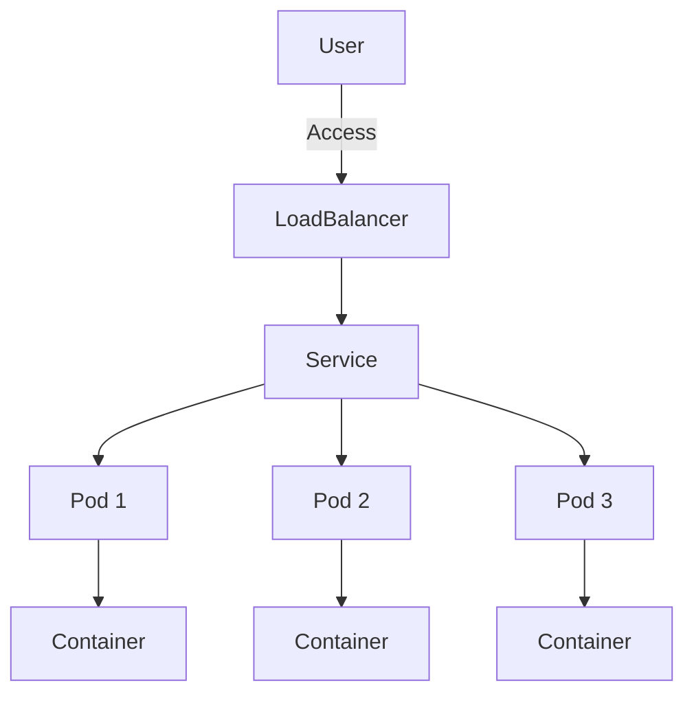

## 25.7. Containerization with Docker and Orchestration with Kubernetes

In the modern software development landscape, containerization and orchestration have become essential for deploying scalable and reliable applications. This section will guide you through the process of containerizing Elixir applications using Docker and orchestrating them with Kubernetes. We'll explore best practices, provide code examples, and offer insights into managing Elixir applications in a containerized environment.

### Dockerizing Elixir Applications

Docker is a platform that enables developers to package applications and their dependencies into a standardized unit called a container. Containers are lightweight, portable, and ensure consistency across different environments. Let's dive into the process of creating Docker images for Elixir applications.

#### Creating Docker Images for Consistent Environments

To begin with Docker, we need to create a Dockerfile, which is a script containing a series of instructions on how to build a Docker image. Here's a basic Dockerfile for an Elixir application:

```dockerfile
# Use the official Elixir image as the base
FROM elixir:1.14

# Install Hex package manager and Rebar build tool
RUN mix local.hex --force && \
    mix local.rebar --force

# Set the working directory
WORKDIR /app

# Copy the mix.exs and mix.lock files to the container
COPY mix.exs mix.lock ./

# Install dependencies
RUN mix deps.get

# Copy the rest of the application code
COPY . .

# Compile the application
RUN mix compile

# Expose the port the app runs on
EXPOSE 4000

# Start the application
CMD ["mix", "phx.server"]
```

**Explanation:**

- **Base Image:** We start with the official Elixir image, ensuring we have the necessary runtime environment.
- **Install Hex and Rebar:** These are essential tools for managing dependencies and building Elixir applications.
- **Working Directory:** We set `/app` as the working directory inside the container.
- **Copy Files:** We copy `mix.exs` and `mix.lock` first to leverage Docker's caching mechanism, reducing build times when dependencies don't change.
- **Install Dependencies:** We run `mix deps.get` to install all necessary dependencies.
- **Copy Application Code:** We then copy the rest of the application code into the container.
- **Compile Application:** We compile the application to ensure everything is set up correctly.
- **Expose Port:** We expose port 4000, which is the default for Phoenix applications.
- **Start Application:** Finally, we specify the command to start the Phoenix server.

#### Building and Running the Docker Image

To build the Docker image, navigate to the directory containing your Dockerfile and run the following command:

```bash
docker build -t my_elixir_app .
```

This command builds the Docker image and tags it as `my_elixir_app`. To run the container, use:

```bash
docker run -p 4000:4000 my_elixir_app
```

This command maps port 4000 on your host to port 4000 in the container, allowing you to access your application at `http://localhost:4000`.

### Kubernetes Orchestration

Kubernetes is a powerful orchestration platform that automates the deployment, scaling, and management of containerized applications. It provides a robust framework for running distributed systems resiliently.

#### Managing Containers at Scale

Kubernetes abstracts the underlying infrastructure and provides a set of building blocks, such as Pods, Services, and Deployments, to manage applications at scale.

##### Key Concepts in Kubernetes

- **Pod:** The smallest deployable unit in Kubernetes, a Pod can contain one or more containers that share the same network namespace.
- **Service:** An abstraction that defines a logical set of Pods and a policy to access them, often used for load balancing.
- **Deployment:** A higher-level abstraction that manages the deployment and scaling of Pods, ensuring the desired state of the application.

##### Deploying an Elixir Application on Kubernetes

To deploy an Elixir application on Kubernetes, we need to create configuration files for the Deployment and Service. Here's an example:

**Deployment Configuration (deployment.yaml):**

```yaml
apiVersion: apps/v1
kind: Deployment
metadata:
  name: elixir-app
spec:
  replicas: 3
  selector:
    matchLabels:
      app: elixir-app
  template:
    metadata:
      labels:
        app: elixir-app
    spec:
      containers:
      - name: elixir-app
        image: my_elixir_app
        ports:
        - containerPort: 4000
```

**Service Configuration (service.yaml):**

```yaml
apiVersion: v1
kind: Service
metadata:
  name: elixir-app-service
spec:
  selector:
    app: elixir-app
  ports:
    - protocol: TCP
      port: 80
      targetPort: 4000
  type: LoadBalancer
```

**Explanation:**

- **Deployment:** We define a Deployment with three replicas of our Elixir application, ensuring high availability.
- **Service:** We create a Service to expose the application, using a LoadBalancer to distribute incoming traffic across the Pods.

#### Applying the Configuration

To apply these configurations, use the `kubectl` command-line tool:

```bash
kubectl apply -f deployment.yaml
kubectl apply -f service.yaml
```

These commands create the Deployment and Service in your Kubernetes cluster, making your Elixir application accessible.

### Best Practices

When deploying Elixir applications with Docker and Kubernetes, consider the following best practices:

#### Configuring Health Checks

Health checks are crucial for ensuring that your application is running correctly. Kubernetes supports two types of health checks:

- **Liveness Probe:** Checks if the application is running. If it fails, Kubernetes restarts the container.
- **Readiness Probe:** Checks if the application is ready to serve traffic. If it fails, Kubernetes removes the Pod from the Service's endpoints.

**Example Liveness and Readiness Probes:**

```yaml
livenessProbe:
  httpGet:
    path: /health
    port: 4000
  initialDelaySeconds: 30
  periodSeconds: 10

readinessProbe:
  httpGet:
    path: /ready
    port: 4000
  initialDelaySeconds: 30
  periodSeconds: 10
```

#### Setting Resource Limits

Resource limits help prevent a single application from consuming too many resources, which can affect other applications running in the same cluster.

**Example Resource Limits:**

```yaml
resources:
  limits:
    memory: "512Mi"
    cpu: "500m"
  requests:
    memory: "256Mi"
    cpu: "250m"
```

#### Monitoring and Logging

Implement monitoring and logging to gain insights into your application's performance and troubleshoot issues. Tools like Prometheus and Grafana can be integrated with Kubernetes for monitoring, while Fluentd can be used for logging.

#### Security Considerations

- **Use Minimal Base Images:** Reduce the attack surface by using minimal base images, such as `alpine`.
- **Regularly Update Images:** Keep your Docker images up to date with the latest security patches.
- **Limit Container Privileges:** Run containers with the least privileges necessary.

### Visualizing Kubernetes Architecture

To better understand how Kubernetes manages containers, let's visualize the architecture using a Mermaid.js diagram:



**Diagram Explanation:**

- **User:** Represents the client accessing the application.
- **LoadBalancer:** Distributes incoming traffic to the Service.
- **Service:** Routes traffic to the appropriate Pods.
- **Pods:** Contain the running instances of the application.
- **Containers:** The actual application instances running inside the Pods.

### Try It Yourself

Experiment with the Docker and Kubernetes configurations provided. Try modifying the number of replicas, resource limits, or health check paths. Observe how these changes affect the application's behavior and performance.

### References and Links

- [Docker Documentation](https://docs.docker.com/)
- [Kubernetes Documentation](https://kubernetes.io/docs/)
- [Prometheus Monitoring](https://prometheus.io/)
- [Grafana Visualization](https://grafana.com/)

### Knowledge Check

- What are the benefits of using Docker for Elixir applications?
- How does Kubernetes help in managing containerized applications?
- Why are health checks important in Kubernetes deployments?

### Embrace the Journey

Remember, mastering containerization and orchestration is a journey. As you progress, you'll gain deeper insights into deploying and managing applications at scale. Keep experimenting, stay curious, and enjoy the journey!

## Quiz: Containerization with Docker and Orchestration with Kubernetes



### What is the primary purpose of Docker in application development?

- [x] To package applications and their dependencies into containers
- [ ] To provide a cloud-based hosting solution
- [ ] To replace virtual machines
- [ ] To serve as a database management system

> **Explanation:** Docker is used to package applications and their dependencies into containers, ensuring consistency across different environments.

### Which Kubernetes component is responsible for distributing incoming traffic to Pods?

- [ ] Pod
- [x] Service
- [ ] Deployment
- [ ] ReplicaSet

> **Explanation:** A Service in Kubernetes is responsible for routing and distributing incoming traffic to the appropriate Pods.

### What is a Pod in Kubernetes?

- [x] The smallest deployable unit that can contain one or more containers
- [ ] A virtual machine instance
- [ ] A configuration file for deployments
- [ ] A network protocol

> **Explanation:** A Pod is the smallest deployable unit in Kubernetes and can contain one or more containers.

### Why are health checks important in Kubernetes?

- [x] To ensure that applications are running and ready to serve traffic
- [ ] To monitor network traffic
- [ ] To manage user authentication
- [ ] To configure storage options

> **Explanation:** Health checks ensure that applications are running correctly and are ready to serve traffic, allowing Kubernetes to manage Pods effectively.

### How can you limit the resources used by a container in Kubernetes?

- [ ] By using a Service
- [ ] By setting up a LoadBalancer
- [x] By configuring resource limits in the Pod specification
- [ ] By using a Deployment

> **Explanation:** Resource limits can be set in the Pod specification to control the amount of CPU and memory a container can use.

### What is the role of a Deployment in Kubernetes?

- [x] To manage the deployment and scaling of Pods
- [ ] To provide network access to Pods
- [ ] To store application data
- [ ] To handle user authentication

> **Explanation:** A Deployment manages the deployment and scaling of Pods, ensuring the desired state of the application.

### Which tool can be used for monitoring Kubernetes clusters?

- [ ] Docker
- [ ] Kubernetes
- [x] Prometheus
- [ ] Nginx

> **Explanation:** Prometheus is a monitoring tool that can be integrated with Kubernetes to monitor clusters and applications.

### What is the benefit of using a LoadBalancer in Kubernetes?

- [x] To distribute incoming traffic across multiple Pods
- [ ] To store application logs
- [ ] To manage database connections
- [ ] To encrypt network traffic

> **Explanation:** A LoadBalancer distributes incoming traffic across multiple Pods, ensuring high availability and load balancing.

### What is the significance of using minimal base images in Docker?

- [x] To reduce the attack surface and improve security
- [ ] To increase application performance
- [ ] To simplify application development
- [ ] To enhance network connectivity

> **Explanation:** Using minimal base images reduces the attack surface, improving the security of Docker containers.

### True or False: Kubernetes can only be used with Docker containers.

- [ ] True
- [x] False

> **Explanation:** False. Kubernetes can orchestrate containers from different runtimes, not just Docker, such as containerd and CRI-O.


