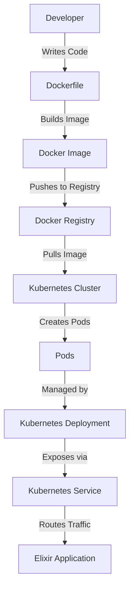

## 25.7. Containerization with Docker and Orchestration with Kubernetes

In the modern software development landscape, containerization and orchestration have become pivotal in ensuring that applications are scalable, portable, and easy to manage. This section will guide you through the process of containerizing Elixir applications using Docker and orchestrating them with Kubernetes. We'll also cover best practices for configuring health checks and resource limits, ensuring your applications run smoothly in production environments.

### Dockerizing Elixir Applications

Docker is a platform that allows developers to package applications along with their dependencies into a standardized unit called a container. Containers provide consistency across different environments, making it easier to develop, test, and deploy applications.

#### Creating Docker Images for Elixir

To start, we need to create a Docker image for our Elixir application. This image will contain everything our application needs to run, including the Elixir runtime, dependencies, and our application code.

**Step 1: Write a Dockerfile**

A Dockerfile is a script containing a series of instructions on how to build a Docker image. Here's a simple Dockerfile for an Elixir application:

```dockerfile
# Use the official Elixir image as the base
FROM elixir:1.14

# Set the working directory inside the container
WORKDIR /app

# Copy the mix.exs and mix.lock files to the working directory
COPY mix.exs mix.lock ./

# Install Hex and Rebar
RUN mix local.hex --force && \
    mix local.rebar --force

# Install the application dependencies
RUN mix deps.get

# Copy the application code to the working directory
COPY . .

# Compile the application
RUN mix compile

# Expose the port the application runs on
EXPOSE 4000

# Start the application
CMD ["mix", "phx.server"]
```

**Explanation:**

- **Base Image**: We start with the official Elixir image, ensuring we have the correct runtime environment.
- **Working Directory**: The `WORKDIR` command sets the working directory inside the container.
- **Dependencies**: We copy the `mix.exs` and `mix.lock` files to install dependencies using `mix deps.get`.
- **Application Code**: The application code is copied into the container, and the application is compiled.
- **Port Exposure**: We expose port 4000, assuming a Phoenix application.
- **Command**: The container runs the `mix phx.server` command to start the application.

**Step 2: Build the Docker Image**

To build the Docker image, run the following command in the directory containing your Dockerfile:

```bash
docker build -t my_elixir_app .
```

**Step 3: Run the Docker Container**

Once the image is built, you can run a container using:

```bash
docker run -p 4000:4000 my_elixir_app
```

This command maps port 4000 on your host to port 4000 in the container, allowing you to access the application at `http://localhost:4000`.

### Kubernetes Orchestration

Kubernetes is an open-source platform designed to automate deploying, scaling, and operating application containers. It helps manage containerized applications across a cluster of machines, providing high availability and scalability.

#### Managing Containers at Scale

Kubernetes uses several key concepts to manage containers:

- **Pods**: The smallest deployable units in Kubernetes, which can contain one or more containers.
- **Services**: Abstractions that define a logical set of Pods and a policy to access them.
- **Deployments**: Define the desired state of your application and manage the process of achieving that state.
- **Namespaces**: Provide a mechanism to isolate resources within a single cluster.

**Step 1: Define a Kubernetes Deployment**

A Kubernetes Deployment describes the desired state of your application, including the number of replicas and the container image to use. Here's a sample Deployment for our Elixir application:

```yaml
apiVersion: apps/v1
kind: Deployment
metadata:
  name: my-elixir-app
spec:
  replicas: 3
  selector:
    matchLabels:
      app: my-elixir-app
  template:
    metadata:
      labels:
        app: my-elixir-app
    spec:
      containers:
      - name: my-elixir-app
        image: my_elixir_app:latest
        ports:
        - containerPort: 4000
```

**Explanation:**

- **Replicas**: We specify 3 replicas to ensure high availability.
- **Selector**: Matches the Pods managed by this Deployment.
- **Template**: Defines the Pods, including the container image and exposed ports.

**Step 2: Create a Kubernetes Service**

A Service exposes your application to the outside world and load balances traffic across the Pods. Here's a sample Service definition:

```yaml
apiVersion: v1
kind: Service
metadata:
  name: my-elixir-app-service
spec:
  type: LoadBalancer
  selector:
    app: my-elixir-app
  ports:
  - protocol: TCP
    port: 80
    targetPort: 4000
```

**Explanation:**

- **Type**: We use a `LoadBalancer` to expose the service externally.
- **Selector**: Matches the Pods to route traffic to.
- **Ports**: Maps port 80 to port 4000 on the Pods.

**Step 3: Deploy to Kubernetes**

Use the `kubectl` command-line tool to deploy your application:

```bash
kubectl apply -f deployment.yaml
kubectl apply -f service.yaml
```

These commands create the Deployment and Service in your Kubernetes cluster.

### Best Practices

To ensure your Elixir applications run efficiently in a containerized environment, follow these best practices:

#### Configuring Health Checks

Kubernetes supports liveness and readiness probes to monitor the health of your containers. Here's how to configure them:

```yaml
livenessProbe:
  httpGet:
    path: /health
    port: 4000
  initialDelaySeconds: 30
  periodSeconds: 10

readinessProbe:
  httpGet:
    path: /ready
    port: 4000
  initialDelaySeconds: 5
  periodSeconds: 10
```

**Explanation:**

- **Liveness Probe**: Checks if the application is running. If it fails, Kubernetes restarts the container.
- **Readiness Probe**: Checks if the application is ready to serve traffic. If it fails, the Pod is removed from the Service's load balancer.

#### Setting Resource Limits

Define resource requests and limits to ensure fair resource allocation and prevent resource exhaustion:

```yaml
resources:
  requests:
    memory: "256Mi"
    cpu: "500m"
  limits:
    memory: "512Mi"
    cpu: "1000m"
```

**Explanation:**

- **Requests**: The guaranteed amount of resources for the container.
- **Limits**: The maximum amount of resources the container can use.

### Visualizing the Architecture

Let's visualize how Docker and Kubernetes work together to manage our Elixir application.


```mermaid
graph TD;
    A[Developer] -->|Writes Code| B[Dockerfile];
    B -->|Builds Image| C[Docker Image];
    C -->|Pushes to Registry| D[Docker Registry];
    D -->|Pulls Image| E[Kubernetes Cluster];
    E -->|Creates Pods| F[Pods];
    F -->|Managed by| G[Kubernetes Deployment];
    G -->|Exposes via| H[Kubernetes Service];
    H -->|Routes Traffic| I[Elixir Application];
```

**Diagram Explanation:**

- **Developer**: Writes the application code and Dockerfile.
- **Dockerfile**: Used to build the Docker image.
- **Docker Image**: Stored in a Docker registry.
- **Kubernetes Cluster**: Pulls the image and creates Pods.
- **Pods**: Managed by a Deployment and exposed via a Service.

### Try It Yourself

Now that you've learned the basics of Dockerizing and orchestrating Elixir applications, try the following exercises:

1. **Modify the Dockerfile**: Add additional dependencies or environment variables needed for your application.
2. **Scale the Deployment**: Change the number of replicas in the Kubernetes Deployment to see how it affects the application's availability.
3. **Implement Health Checks**: Add custom liveness and readiness endpoints in your Elixir application and configure them in Kubernetes.

### References and Links

- [Docker Documentation](https://docs.docker.com/)
- [Kubernetes Documentation](https://kubernetes.io/docs/home/)
- [Elixir Official Site](https://elixir-lang.org/)

### Knowledge Check

Before moving on, consider the following questions to reinforce your understanding:

1. What is the purpose of a Dockerfile?
2. How does Kubernetes manage containerized applications?
3. Why are health checks important in a Kubernetes environment?

### Embrace the Journey

Remember, containerization and orchestration are powerful tools that can significantly enhance the scalability and reliability of your applications. As you continue to experiment and learn, you'll discover new ways to leverage these technologies to build robust systems. Keep exploring, stay curious, and enjoy the journey!

## Quiz Time!



### What is the primary purpose of Docker in application development?

- [x] To package applications and their dependencies into a standardized unit
- [ ] To provide a cloud-based hosting service
- [ ] To replace the need for virtual machines
- [ ] To manage source code repositories

> **Explanation:** Docker is used to package applications and their dependencies into containers, ensuring consistency across environments.

### Which Kubernetes object is used to define the desired state of an application?

- [ ] Pod
- [x] Deployment
- [ ] Service
- [ ] Namespace

> **Explanation:** A Kubernetes Deployment defines the desired state of an application, including the number of replicas and the container image.

### What is the role of a Kubernetes Service?

- [ ] To define the desired state of an application
- [x] To expose applications and load balance traffic across Pods
- [ ] To manage container storage
- [ ] To provide a user interface for Kubernetes

> **Explanation:** A Kubernetes Service exposes applications to the network and load balances traffic across Pods.

### How can you ensure a container is restarted if it becomes unresponsive?

- [ ] Use a ConfigMap
- [ ] Use a PersistentVolume
- [x] Configure a liveness probe
- [ ] Set a resource limit

> **Explanation:** A liveness probe checks if a container is running. If it fails, Kubernetes restarts the container.

### What is a key benefit of using containers?

- [x] Consistency across different environments
- [ ] Increased hardware requirements
- [ ] Reduced application security
- [ ] Elimination of all bugs

> **Explanation:** Containers provide consistency across different environments, making it easier to develop, test, and deploy applications.

### How do you expose a containerized application to the outside world in Kubernetes?

- [ ] Using a Pod
- [ ] Using a ConfigMap
- [x] Using a Service
- [ ] Using a Deployment

> **Explanation:** A Kubernetes Service exposes a containerized application to the outside world and manages traffic routing.

### What does the `EXPOSE` command do in a Dockerfile?

- [ ] Starts the application
- [ ] Installs dependencies
- [x] Indicates the port on which the container listens
- [ ] Builds the Docker image

> **Explanation:** The `EXPOSE` command indicates the port on which the container listens for network connections.

### What is the purpose of resource limits in Kubernetes?

- [ ] To increase application performance
- [ ] To provide a backup for application data
- [x] To prevent resource exhaustion and ensure fair allocation
- [ ] To improve application security

> **Explanation:** Resource limits prevent resource exhaustion and ensure fair allocation among containers.

### Which command is used to deploy a Kubernetes configuration?

- [ ] docker run
- [ ] kubectl build
- [x] kubectl apply
- [ ] docker apply

> **Explanation:** The `kubectl apply` command is used to deploy a Kubernetes configuration.

### True or False: Kubernetes can automatically scale applications based on load.

- [x] True
- [ ] False

> **Explanation:** Kubernetes can automatically scale applications based on load using Horizontal Pod Autoscaling.


