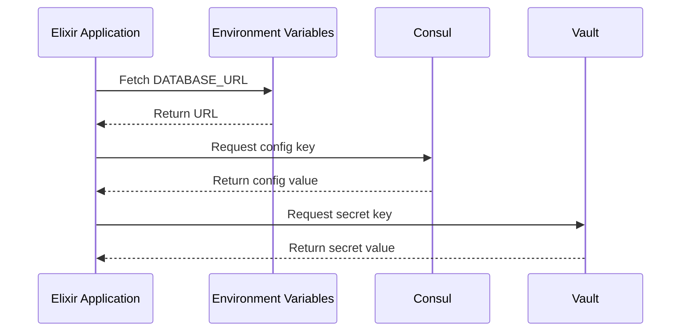

## 25.8. Configuration Management

In the world of software development, configuration management is a critical aspect that ensures applications are not only flexible but also secure and maintainable. Elixir, with its robust ecosystem and functional programming paradigm, offers powerful tools and practices for managing configurations effectively. This section will delve into dynamic configurations, secrets management, and integrating with tools like Consul and Vault to enhance your Elixir applications.

### Dynamic Configurations

Dynamic configurations refer to the ability to adjust application settings at runtime without the need to redeploy or restart the application. This flexibility is crucial in modern applications, especially those deployed in cloud environments or microservices architectures, where changes are frequent and need to be propagated quickly.

#### Using Environment Variables

Environment variables are a common way to manage configurations dynamically. They allow you to decouple configuration from code, making it easier to change settings without altering the application itself.

**Example: Accessing Environment Variables in Elixir**

```elixir
defmodule MyApp.Config do
  def get_database_url do
    System.get_env("DATABASE_URL") || "postgres://localhost/myapp_dev"
  end
end
```

In this example, we retrieve the `DATABASE_URL` environment variable. If it's not set, a default value is used. This approach ensures that the application can run in different environments (development, testing, production) with minimal changes.

#### Runtime Configuration

Elixir's `Application` module provides a way to manage application configurations at runtime. This is particularly useful for managing configurations that might change based on the environment or other external factors.

**Example: Using Application Configuration**

```elixir
defmodule MyApp.Config do
  def get_value(key) do
    Application.get_env(:my_app, key)
  end
end
```

With this setup, you can define configurations in your `config/config.exs` file:

```elixir
use Mix.Config

config :my_app, :some_key, "some_value"
```

This configuration can be overridden in environment-specific files like `config/prod.exs`, allowing for easy customization based on deployment needs.

### Secrets Management

Managing sensitive information such as API keys, database passwords, and encryption keys securely is paramount. Elixir provides several strategies for handling secrets safely.

#### Securely Managing Sensitive Configurations

One common practice is to store secrets in environment variables, as shown earlier. However, this approach can be risky if not handled properly. It's crucial to ensure that these variables are not exposed in logs or error messages.

**Example: Secure Access to Secrets**

```elixir
defmodule MyApp.Secret do
  def get_secret do
    System.get_env("SECRET_KEY_BASE")
  end
end
```

To enhance security, consider using libraries like `dotenv` to manage environment variables more securely, or leveraging Elixir's built-in support for encrypted configuration files.

#### Consul and Vault Integration

For more advanced secrets management, integrating with tools like HashiCorp's Consul and Vault can provide additional layers of security and flexibility.

##### Consul for Distributed Configuration

Consul is a tool for service discovery and configuration management. It allows you to store configuration data centrally and access it from your Elixir application.

**Example: Integrating Consul with Elixir**

```elixir
defmodule MyApp.Consul do
  @consul_url "http://localhost:8500/v1/kv/myapp/config"

  def get_config(key) do
    HTTPoison.get("#{@consul_url}/#{key}")
    |> handle_response()
  end

  defp handle_response({:ok, %HTTPoison.Response{body: body}}) do
    {:ok, Poison.decode!(body)}
  end
  defp handle_response({:error, _reason}), do: {:error, "Failed to fetch config"}
end
```

This example demonstrates how to fetch configuration data from Consul using HTTP requests. By centralizing configuration management, you can ensure consistency across distributed systems.

##### Vault for Secrets Management

Vault is a tool designed to securely store and access secrets. It provides robust access control and audit capabilities, making it ideal for managing sensitive data.

**Example: Fetching Secrets from Vault**

```elixir
defmodule MyApp.Vault do
  @vault_url "http://localhost:8200/v1/secret/data/myapp"

  def get_secret(key) do
    HTTPoison.get("#{@vault_url}/#{key}", headers())
    |> handle_response()
  end

  defp headers do
    [{"X-Vault-Token", System.get_env("VAULT_TOKEN")}]
  end

  defp handle_response({:ok, %HTTPoison.Response{body: body}}) do
    {:ok, Poison.decode!(body)}
  end
  defp handle_response({:error, _reason}), do: {:error, "Failed to fetch secret"}
end
```

In this example, we access secrets stored in Vault by making authenticated HTTP requests. This method ensures that sensitive data is accessed securely and only by authorized components.

### Visualizing Configuration Management in Elixir

To better understand how these components interact, let's visualize the configuration management process in Elixir using a sequence diagram:


```mermaid
sequenceDiagram
    participant App as Elixir Application
    participant Env as Environment Variables
    participant Consul as Consul
    participant Vault as Vault

    App->>Env: Fetch DATABASE_URL
    Env-->>App: Return URL

    App->>Consul: Request config key
    Consul-->>App: Return config value

    App->>Vault: Request secret key
    Vault-->>App: Return secret value
```

This diagram illustrates how an Elixir application retrieves configuration data and secrets from various sources, ensuring a secure and flexible setup.

### Best Practices for Configuration Management

1. **Environment-Specific Configurations**: Use environment-specific configuration files to manage settings for different environments (development, testing, production).

2. **Avoid Hardcoding Secrets**: Never hardcode sensitive information in your codebase. Use environment variables or external tools like Vault to manage secrets securely.

3. **Centralize Configuration Management**: Use tools like Consul to centralize configuration data, ensuring consistency across distributed systems.

4. **Audit and Access Control**: Implement strict access controls and audit logging for secrets management to prevent unauthorized access.

5. **Regularly Rotate Secrets**: Periodically change secrets such as API keys and passwords to minimize the risk of exposure.

### Try It Yourself

To solidify your understanding, try modifying the code examples above to suit your application's needs. Experiment with different configuration sources and see how they affect the application's behavior. 

### Further Reading

- [Elixir's Application Module](https://hexdocs.pm/elixir/Application.html)
- [HashiCorp Consul](https://www.consul.io/)
- [HashiCorp Vault](https://www.vaultproject.io/)

## Quiz Time!



### What is the primary benefit of using environment variables for configuration management?

- [x] They decouple configuration from code.
- [ ] They increase code complexity.
- [ ] They are hard to manage.
- [ ] They are only suitable for local development.

> **Explanation:** Environment variables allow configurations to be changed without altering the code, making applications more flexible and easier to manage across different environments.


### Which Elixir module is commonly used for runtime configuration management?

- [x] Application
- [ ] Config
- [ ] System
- [ ] Mix

> **Explanation:** The `Application` module in Elixir is used to fetch and manage runtime configurations.


### What is a key advantage of using Consul for configuration management?

- [x] Centralized configuration management
- [ ] It is a lightweight library
- [ ] It works only with Elixir
- [ ] It requires no setup

> **Explanation:** Consul provides a centralized system for managing configurations, which is crucial for consistency in distributed systems.


### How does Vault enhance security in secrets management?

- [x] Provides robust access control and audit capabilities
- [ ] Stores secrets in plain text
- [ ] Requires no authentication
- [ ] Only works with local files

> **Explanation:** Vault offers strong access control and auditing features, making it a secure choice for managing sensitive information.


### What should you avoid when managing secrets in your application code?

- [x] Hardcoding secrets
- [ ] Using environment variables
- [ ] Using Vault
- [ ] Using Consul

> **Explanation:** Hardcoding secrets in your codebase is a security risk and should be avoided.


### What is the role of the `System.get_env/1` function in Elixir?

- [x] Fetches environment variables
- [ ] Sets environment variables
- [ ] Deletes environment variables
- [ ] Encrypts environment variables

> **Explanation:** `System.get_env/1` is used to retrieve the value of environment variables in Elixir.


### Which tool is specifically designed for securely storing and accessing secrets?

- [x] Vault
- [ ] Consul
- [ ] Mix
- [ ] ExUnit

> **Explanation:** Vault is designed for secure secrets management, providing strong access control and auditing.


### What is a common practice for managing different configurations in various environments?

- [x] Use environment-specific configuration files
- [ ] Hardcode configurations
- [ ] Use the same configuration for all environments
- [ ] Avoid using configurations

> **Explanation:** Environment-specific configuration files allow you to tailor settings for different environments, such as development, testing, and production.


### How can you enhance the security of environment variables?

- [x] Use libraries like `dotenv` and ensure they are not exposed in logs
- [ ] Hardcode them in the source code
- [ ] Share them publicly
- [ ] Ignore them

> **Explanation:** Using libraries like `dotenv` and ensuring environment variables are not exposed in logs enhances their security.


### True or False: Consul and Vault can be integrated with Elixir for enhanced configuration and secrets management.

- [x] True
- [ ] False

> **Explanation:** Both Consul and Vault can be integrated with Elixir to provide centralized configuration management and secure secrets handling.



Remember, mastering configuration management is a journey. As you explore these tools and practices, you'll build more robust and secure applications. Keep experimenting, stay curious, and enjoy the journey!
