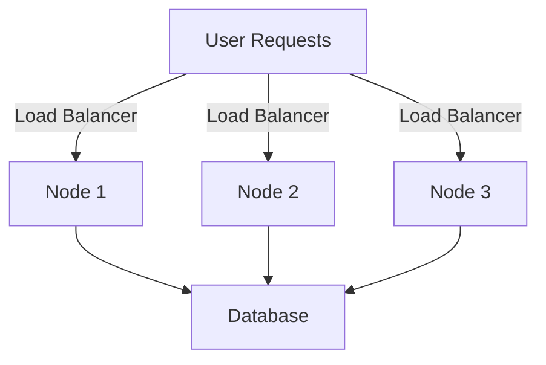

## 25.9. Scaling and Load Balancing

In today's fast-paced digital world, applications must be able to handle increasing loads and provide seamless user experiences. Scaling and load balancing are critical components in achieving these goals. In this section, we will delve into the intricacies of scaling and load balancing in Elixir applications, focusing on horizontal scaling, load balancers, and autoscaling techniques.

### Horizontal Scaling

Horizontal scaling, also known as scaling out, involves adding more nodes to a system to handle increased load. This approach is particularly effective for distributed systems and is a natural fit for Elixir, given its concurrency model and the BEAM VM's capabilities.

#### Key Concepts

- **Node**: In the context of Elixir, a node is an instance of the BEAM VM running an Elixir application. Nodes can communicate with each other, allowing for distributed computing.
- **Cluster**: A group of nodes working together to provide a service. Clustering enables fault tolerance and load distribution.
- **Distributed Erlang**: The underlying technology that allows Elixir nodes to communicate seamlessly.

#### Implementing Horizontal Scaling

To implement horizontal scaling in Elixir, follow these steps:

1. **Set Up a Cluster**: Use Erlang's distributed capabilities to connect multiple nodes. This can be done using the `Node` module in Elixir.

    ```elixir
    # Connect to another node
    Node.connect(:'node_name@hostname')
    ```

2. **Distribute Workloads**: Use Elixir's `Task` module to distribute tasks across nodes. This can be achieved by spawning tasks on remote nodes.

    ```elixir
    # Spawn a task on a remote node
    Task.async({:node_name@hostname, MyModule}, :my_function, [arg1, arg2])
    ```

3. **Monitor and Manage Nodes**: Use tools like `Observer` to monitor the health and performance of nodes in the cluster.

4. **Handle Node Failures**: Implement strategies to detect and recover from node failures, such as using supervisors and monitoring processes.

#### Benefits of Horizontal Scaling

- **Fault Tolerance**: By distributing workloads across multiple nodes, the system can continue to function even if one or more nodes fail.
- **Increased Capacity**: Adding more nodes increases the system's capacity to handle more requests.
- **Cost-Effectiveness**: Horizontal scaling can be more cost-effective than vertical scaling, as it often involves using commodity hardware.

### Load Balancers

Load balancers are essential for distributing incoming traffic across multiple nodes, ensuring that no single node becomes a bottleneck. They improve the availability and reliability of applications by distributing workloads efficiently.

#### Types of Load Balancers

- **Hardware Load Balancers**: Physical devices that distribute traffic. They are typically used in large-scale enterprise environments.
- **Software Load Balancers**: Software solutions like HAProxy and Nginx that run on commodity hardware or virtual machines.

#### Implementing Load Balancing with HAProxy

HAProxy is a popular open-source software load balancer that is well-suited for Elixir applications. Here's how to set it up:

1. **Install HAProxy**: Follow the installation instructions for your operating system.

2. **Configure HAProxy**: Create a configuration file to define the load balancing rules.

    ```haproxy
    global
        log /dev/log local0
        maxconn 4096

    defaults
        log global
        mode http
        option httplog
        timeout connect 5000ms
        timeout client 50000ms
        timeout server 50000ms

    frontend http_front
        bind *:80
        default_backend http_back

    backend http_back
        balance roundrobin
        server node1 192.168.1.1:4000 check
        server node2 192.168.1.2:4000 check
    ```

3. **Start HAProxy**: Run HAProxy with the configuration file.

    ```bash
    haproxy -f /etc/haproxy/haproxy.cfg
    ```

4. **Monitor Traffic**: Use HAProxy's built-in statistics page to monitor traffic and performance.

#### Benefits of Load Balancing

- **Improved Performance**: By distributing traffic, load balancers prevent any single node from becoming overwhelmed.
- **Increased Availability**: Load balancers can detect node failures and redirect traffic to healthy nodes.
- **Scalability**: Load balancers make it easy to add or remove nodes from the system as needed.

### Autoscaling

Autoscaling is the process of automatically adjusting the number of nodes in a system based on current demand. This ensures that resources are used efficiently and that the system can handle varying loads.

#### Implementing Autoscaling

1. **Choose an Autoscaling Solution**: Use cloud provider tools like AWS Auto Scaling, Google Cloud's Autoscaler, or Kubernetes' Horizontal Pod Autoscaler.

2. **Define Scaling Policies**: Set rules for when to add or remove nodes based on metrics like CPU usage, memory usage, or request count.

3. **Monitor Metrics**: Use monitoring tools to track system performance and trigger scaling actions.

4. **Test Autoscaling**: Simulate load to test the autoscaling configuration and ensure it behaves as expected.

#### Benefits of Autoscaling

- **Cost Efficiency**: Autoscaling ensures that you only pay for the resources you need.
- **Flexibility**: The system can adapt to changing loads without manual intervention.
- **Reliability**: Autoscaling helps maintain performance and availability during traffic spikes.

### Visualizing Scaling and Load Balancing

To better understand the concepts of scaling and load balancing, let's visualize a typical architecture using Mermaid.js.



**Diagram Description**: This diagram illustrates a basic load-balanced architecture. User requests are distributed by a load balancer to multiple nodes, which then interact with a shared database.

### Elixir-Specific Considerations

- **Concurrency Model**: Elixir's lightweight processes and message-passing model make it well-suited for distributed systems.
- **Fault Tolerance**: The "let it crash" philosophy and supervision trees provide robust error handling.
- **Hot Code Upgrades**: Elixir supports hot code upgrades, allowing you to update code without downtime.

### Try It Yourself

Experiment with the concepts discussed by setting up a simple Elixir application with horizontal scaling and load balancing. Modify the HAProxy configuration to test different load balancing algorithms, such as least connections or IP hash.

### Knowledge Check

- Explain the difference between horizontal and vertical scaling.
- Describe how load balancers improve system performance and availability.
- Discuss the benefits of autoscaling in cloud environments.

### Summary

In this section, we've explored the essential concepts of scaling and load balancing in Elixir applications. By leveraging horizontal scaling, load balancers, and autoscaling, you can build robust, high-performance systems that adapt to changing demands. Remember, this is just the beginning. As you progress, you'll discover more advanced techniques and tools to enhance your Elixir applications.

## Quiz: Scaling and Load Balancing



### What is horizontal scaling?

- [x] Adding more nodes to handle increased load
- [ ] Increasing the resources of a single node
- [ ] Using a single powerful server
- [ ] Reducing the number of nodes

> **Explanation:** Horizontal scaling involves adding more nodes to distribute the load across multiple servers.

### Which of the following is a software load balancer?

- [x] HAProxy
- [ ] Cisco Load Balancer
- [ ] F5 Big-IP
- [ ] Juniper Load Balancer

> **Explanation:** HAProxy is a popular open-source software load balancer.

### What is the primary benefit of autoscaling?

- [x] Cost efficiency
- [ ] Increased complexity
- [ ] Manual intervention
- [ ] Reduced flexibility

> **Explanation:** Autoscaling ensures that resources are used efficiently, reducing costs by scaling resources based on demand.

### How does a load balancer improve system availability?

- [x] By redirecting traffic from failed nodes to healthy ones
- [ ] By increasing the resources of a single node
- [ ] By reducing the number of nodes
- [ ] By using a single powerful server

> **Explanation:** Load balancers detect node failures and redirect traffic to healthy nodes, improving availability.

### What is the role of the `Node` module in Elixir?

- [x] To connect and manage distributed nodes
- [ ] To handle HTTP requests
- [ ] To manage database connections
- [ ] To perform file I/O operations

> **Explanation:** The `Node` module in Elixir is used to connect and manage distributed nodes in a cluster.

### Which of the following is a benefit of horizontal scaling?

- [x] Fault tolerance
- [ ] Increased complexity
- [ ] Reduced capacity
- [ ] Manual intervention

> **Explanation:** Horizontal scaling provides fault tolerance by distributing workloads across multiple nodes.

### What is the purpose of a load balancer in a distributed system?

- [x] To distribute incoming traffic across multiple nodes
- [ ] To increase the resources of a single node
- [ ] To manage database connections
- [ ] To perform file I/O operations

> **Explanation:** Load balancers distribute incoming traffic across multiple nodes to prevent any single node from becoming overwhelmed.

### Which tool can be used for monitoring Elixir nodes?

- [x] Observer
- [ ] HAProxy
- [ ] Kubernetes
- [ ] Docker

> **Explanation:** Observer is a tool used for monitoring the health and performance of Elixir nodes.

### What is a key feature of Elixir that supports distributed systems?

- [x] Lightweight processes and message-passing model
- [ ] Single-threaded execution
- [ ] Lack of concurrency support
- [ ] Manual memory management

> **Explanation:** Elixir's lightweight processes and message-passing model make it well-suited for distributed systems.

### True or False: Autoscaling requires manual intervention to adjust resources.

- [ ] True
- [x] False

> **Explanation:** Autoscaling automatically adjusts resources based on demand without manual intervention.




