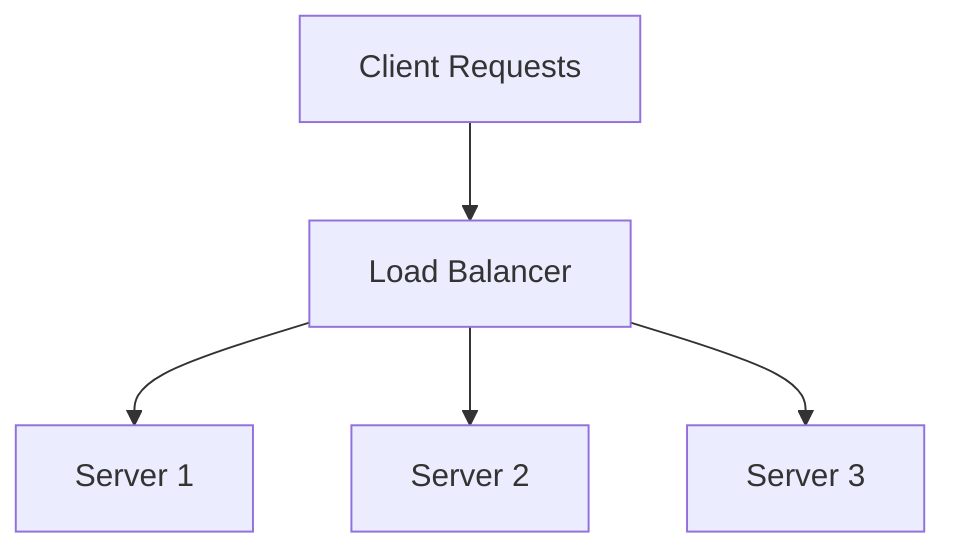
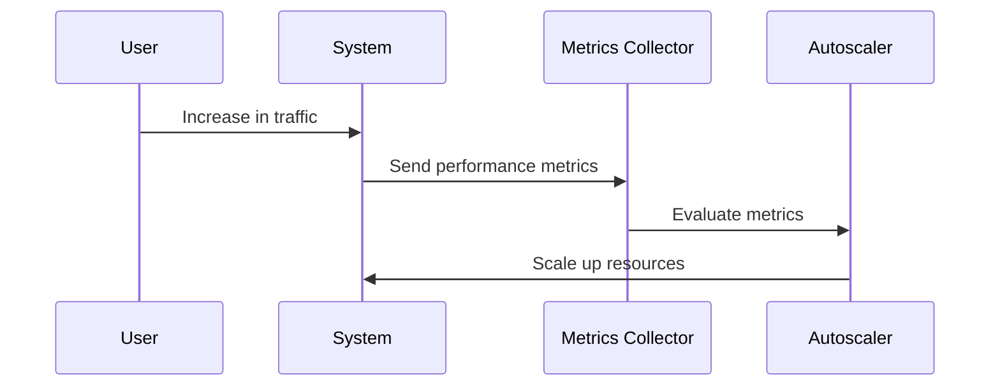

## 25.9. Scaling and Load Balancing

In the world of modern software engineering, ensuring that your application can handle increased loads and distribute traffic efficiently is crucial. This section will delve into advanced strategies for scaling and load balancing in Elixir applications, focusing on horizontal scaling, load balancers, and autoscaling. These techniques will help you build robust, scalable systems that can adapt to changing demands.

### Horizontal Scaling

Horizontal scaling involves adding more nodes to your system to handle increased load. This approach contrasts with vertical scaling, where you add more power (CPU, RAM) to existing nodes. Horizontal scaling is often more cost-effective and provides better fault tolerance.

#### Key Concepts

- **Statelessness**: Ensure that your application is stateless or can easily share state across nodes. This makes it easier to add or remove nodes without affecting the application's functionality.
- **Distributed Systems**: Elixir, running on the BEAM VM, is inherently distributed, making it an excellent choice for horizontal scaling. Leverage Elixir's distributed capabilities to manage nodes and processes efficiently.
- **Node Communication**: Use Elixir's built-in tools for node communication, such as `Node.connect/1`, to facilitate communication between different nodes in your cluster.

#### Implementing Horizontal Scaling

To implement horizontal scaling in Elixir:

1. **Design for Statelessness**: Ensure that your application can run independently on multiple nodes. Use external storage solutions like databases or caching systems to manage state.
2. **Use Distributed Erlang**: Elixir's distributed Erlang capabilities allow you to connect multiple nodes. Use the `:net_adm` and `:net_kernel` modules to manage node connections.
3. **Leverage OTP**: Use OTP applications to manage your processes and supervisors across nodes. This ensures that your application remains fault-tolerant and can recover from node failures.

```elixir
# Example of connecting nodes in Elixir
defmodule NodeManager do
  def connect_nodes(node_list) do
    Enum.each(node_list, fn node ->
      Node.connect(node)
    end)
  end
end

# Usage
NodeManager.connect_nodes([:"node1@localhost", :"node2@localhost"])
```

In this example, we define a `NodeManager` module that connects to a list of nodes. This is a simple illustration of how you can manage node connections in a distributed Elixir application.

### Load Balancers

Load balancers distribute incoming traffic across multiple servers to ensure no single server becomes overwhelmed. They play a crucial role in horizontal scaling by efficiently managing traffic distribution.

#### Types of Load Balancers

- **Hardware Load Balancers**: Physical devices that manage traffic. They are reliable but can be expensive.
- **Software Load Balancers**: Applications like HAProxy and Nginx that run on standard hardware. They are flexible and cost-effective.

#### Implementing Load Balancers

1. **Choose a Load Balancer**: Select a load balancer that fits your needs. HAProxy and Nginx are popular choices for Elixir applications.
2. **Configure the Load Balancer**: Set up your load balancer to distribute traffic based on your application's requirements. This may include round-robin, least connections, or IP hash strategies.
3. **Monitor and Adjust**: Continuously monitor the performance of your load balancer and adjust configurations as needed to optimize traffic distribution.

```nginx
# Example Nginx configuration for load balancing
http {
  upstream myapp {
    server app1.example.com;
    server app2.example.com;
    server app3.example.com;
  }

  server {
    listen 80;

    location / {
      proxy_pass http://myapp;
    }
  }
}
```

In this example, Nginx is configured to distribute traffic among three application servers. This setup ensures that incoming requests are balanced across all available nodes.

#### Visualizing Load Balancing


```mermaid
graph TD;
    A[Client Requests] --> B[Load Balancer];
    B --> C[Server 1];
    B --> D[Server 2];
    B --> E[Server 3];
```

This diagram illustrates how a load balancer distributes client requests across multiple servers, ensuring no single server is overwhelmed.

### Autoscaling

Autoscaling dynamically adjusts the number of active nodes based on current demand. This ensures that your application can handle varying loads efficiently without manual intervention.

#### Key Concepts

- **Metrics**: Use metrics like CPU usage, memory usage, and request latency to determine when to scale up or down.
- **Thresholds**: Define thresholds for these metrics that trigger scaling actions.
- **Cloud Providers**: Most cloud providers, such as AWS, Google Cloud, and Azure, offer autoscaling features that can be integrated with Elixir applications.

#### Implementing Autoscaling

1. **Set Up Monitoring**: Use monitoring tools to collect metrics on your application's performance. Tools like Prometheus and Grafana are popular choices.
2. **Define Scaling Policies**: Establish policies that define when to scale up or down based on collected metrics.
3. **Integrate with Cloud Provider**: Use your cloud provider's autoscaling features to automatically adjust resources based on your scaling policies.

```elixir
# Example of a simple autoscaling policy
defmodule Autoscaler do
  def scale_up do
    # Logic to add more nodes
  end

  def scale_down do
    # Logic to remove nodes
  end

  def check_metrics(metrics) do
    if metrics.cpu_usage > 80 do
      scale_up()
    else
      scale_down()
    end
  end
end
```

In this example, the `Autoscaler` module contains logic to scale up or down based on CPU usage metrics. This is a simplified illustration of how you might implement autoscaling logic in an Elixir application.

#### Visualizing Autoscaling


```mermaid
sequenceDiagram
    participant U as User
    participant S as System
    participant M as Metrics Collector
    participant A as Autoscaler

    U->>S: Increase in traffic
    S->>M: Send performance metrics
    M->>A: Evaluate metrics
    A->>S: Scale up resources
```

This sequence diagram shows how an autoscaler evaluates metrics and scales resources in response to increased traffic.

### Elixir Unique Features

Elixir's unique features, such as its lightweight processes and fault-tolerant design, make it particularly well-suited for scaling and load balancing. The BEAM VM allows for efficient process management, enabling you to handle thousands of concurrent connections with ease.

- **Lightweight Processes**: Elixir processes are lightweight and can be spawned in large numbers, making it easy to distribute workloads across multiple nodes.
- **Fault Tolerance**: Elixir's "let it crash" philosophy ensures that your application can recover from failures quickly, maintaining high availability.
- **Distributed Capabilities**: Elixir's built-in support for distributed systems allows you to easily manage and communicate between nodes in a cluster.

### Design Considerations

- **Stateless Design**: Ensure your application is designed to be stateless or can share state across nodes effectively.
- **Monitoring and Logging**: Implement robust monitoring and logging to track performance and identify bottlenecks.
- **Security**: Ensure that communication between nodes is secure, using encryption and authentication mechanisms as needed.

### Differences and Similarities

Scaling and load balancing in Elixir share similarities with other languages and frameworks, but Elixir's unique features, such as its lightweight processes and distributed capabilities, set it apart. While many of the principles are the same, Elixir's concurrency model and fault-tolerant design provide distinct advantages in building scalable systems.

### Try It Yourself

To get hands-on experience with scaling and load balancing in Elixir, try the following exercises:

1. **Set Up a Load Balancer**: Configure Nginx or HAProxy to distribute traffic across multiple Elixir nodes. Experiment with different load balancing strategies and observe the effects on traffic distribution.
2. **Implement Autoscaling**: Use a cloud provider's autoscaling features to dynamically adjust the number of nodes in your Elixir application based on CPU usage metrics. Test the autoscaling behavior by simulating increased load.
3. **Experiment with Node Communication**: Use Elixir's distributed capabilities to connect multiple nodes and distribute workloads. Experiment with different node configurations and observe how they affect performance.

### Knowledge Check

- What are the key differences between horizontal and vertical scaling?
- How does a load balancer distribute traffic across multiple servers?
- What metrics are typically used to trigger autoscaling actions?
- How can Elixir's distributed capabilities be leveraged for scaling?
- What are the advantages of using Elixir's lightweight processes for scaling?

### Embrace the Journey

Scaling and load balancing are critical components of building robust, high-performance applications. As you explore these concepts in Elixir, remember that this is just the beginning. Keep experimenting, stay curious, and enjoy the journey of building scalable systems with Elixir.

## Quiz Time!



### What is horizontal scaling?

- [x] Adding more nodes to handle increased load.
- [ ] Increasing the power of existing nodes.
- [ ] Reducing the number of nodes.
- [ ] Using a single powerful server.

> **Explanation:** Horizontal scaling involves adding more nodes to your system to handle increased load, as opposed to vertical scaling, which involves increasing the power of existing nodes.

### Which of the following is a software load balancer?

- [x] Nginx
- [ ] Cisco
- [ ] F5
- [ ] Juniper

> **Explanation:** Nginx is a software load balancer, while Cisco, F5, and Juniper are typically associated with hardware load balancers.

### What is the primary purpose of a load balancer?

- [x] Distributing incoming traffic across multiple servers.
- [ ] Increasing the speed of a single server.
- [ ] Reducing the number of servers needed.
- [ ] Enhancing the security of a server.

> **Explanation:** The primary purpose of a load balancer is to distribute incoming traffic across multiple servers to ensure no single server becomes overwhelmed.

### What is a key advantage of Elixir's lightweight processes?

- [x] They can be spawned in large numbers, allowing for efficient workload distribution.
- [ ] They require more memory than traditional processes.
- [ ] They are slower than traditional processes.
- [ ] They are difficult to manage.

> **Explanation:** Elixir's lightweight processes can be spawned in large numbers, allowing for efficient workload distribution and handling thousands of concurrent connections.

### Which metric is commonly used to trigger autoscaling actions?

- [x] CPU usage
- [ ] Disk space
- [ ] Network speed
- [ ] Number of users

> **Explanation:** CPU usage is a common metric used to trigger autoscaling actions, as it indicates the load on the system.

### What is the "let it crash" philosophy in Elixir?

- [x] Allowing processes to crash and restart automatically to maintain system stability.
- [ ] Preventing any process from crashing.
- [ ] Immediately shutting down the system on a crash.
- [ ] Ignoring process crashes.

> **Explanation:** The "let it crash" philosophy in Elixir involves allowing processes to crash and restart automatically to maintain system stability and high availability.

### What is a key consideration when designing for horizontal scaling?

- [x] Ensuring the application is stateless or can share state effectively.
- [ ] Increasing the power of existing nodes.
- [ ] Reducing the number of nodes.
- [ ] Using a single powerful server.

> **Explanation:** A key consideration when designing for horizontal scaling is ensuring the application is stateless or can share state effectively, making it easier to add or remove nodes.

### What is the role of a load balancer in a distributed system?

- [x] Distributing traffic efficiently across multiple servers.
- [ ] Increasing the speed of a single server.
- [ ] Reducing the number of servers needed.
- [ ] Enhancing the security of a server.

> **Explanation:** In a distributed system, a load balancer's role is to distribute traffic efficiently across multiple servers, ensuring no single server becomes overwhelmed.

### What is a common strategy used by load balancers to distribute traffic?

- [x] Round-robin
- [ ] Random selection
- [ ] Increasing server power
- [ ] Reducing server power

> **Explanation:** Round-robin is a common strategy used by load balancers to distribute traffic evenly across available servers.

### True or False: Elixir's distributed capabilities make it particularly well-suited for scaling.

- [x] True
- [ ] False

> **Explanation:** True. Elixir's distributed capabilities, along with its lightweight processes and fault-tolerant design, make it particularly well-suited for scaling and building robust, scalable systems.



Remember, mastering scaling and load balancing in Elixir is an ongoing journey. Keep experimenting, learning, and applying these concepts to build high-performance applications that can handle the demands of modern software systems.
