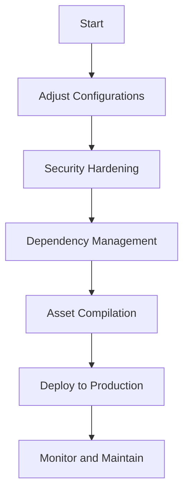

## 26.1. Preparing Applications for Production

As we embark on the journey of deploying Elixir applications to production environments, it's crucial to ensure that our applications are optimized for performance, security, and reliability. This section will guide you through the essential steps and best practices for preparing your Elixir applications for production deployment.

### Optimizing for Production Environments

When preparing an Elixir application for production, several adjustments need to be made to configurations to enhance performance, security, and reliability.

#### Adjusting Configurations

1. **Performance Tuning**: 
   - **Concurrency Settings**: Elixir runs on the BEAM VM, which is designed for high concurrency. Adjust the number of schedulers to match the number of CPU cores using `System.schedulers_online/0`.
   - **Garbage Collection**: Fine-tune garbage collection settings to optimize memory usage and reduce latency.

2. **Security Enhancements**:
   - **SSL/TLS Configuration**: Ensure secure communication by configuring SSL/TLS for all external connections.
   - **Environment Variables**: Use environment variables to manage sensitive information such as API keys and database credentials securely.

3. **Reliability Improvements**:
   - **Supervision Trees**: Design robust supervision trees to handle process failures gracefully.
   - **Health Checks**: Implement health checks to monitor application status and ensure uptime.

#### Disabling Unnecessary Logging and Debugging Features

In production, excessive logging can lead to performance degradation and increased storage costs. Disable or minimize logging levels to only capture essential information. Use the `Logger` module to configure logging levels appropriately.

```elixir
# config/prod.exs
config :logger, level: :info
```

### Security Hardening

Security is paramount when deploying applications to production. Implement measures to protect your application from potential attacks.

#### Implementing Security Measures

1. **Dependency Security**:
   - Regularly update dependencies to patch known vulnerabilities.
   - Use tools like `mix audit` to scan for security issues in dependencies.

2. **Input Validation and Sanitization**:
   - Validate and sanitize all user inputs to prevent injection attacks.
   - Use libraries like `Plug` to handle input validation.

3. **Access Control**:
   - Implement role-based access control (RBAC) to restrict access to sensitive features.
   - Use libraries like `Guardian` for authentication and authorization.

#### Ensuring Up-to-Date Dependencies

Keeping dependencies up-to-date is crucial for maintaining security and stability. Use `mix deps.update` to update dependencies and `mix hex.outdated` to check for outdated packages.

### Dependency Management

Managing dependencies effectively is essential to prevent unexpected changes and ensure application stability.

#### Locking Down Dependency Versions

Lock dependency versions in your `mix.exs` file to prevent breaking changes from affecting your application.

```elixir
defp deps do
  [
    {:phoenix, "~> 1.5.9"},
    {:ecto, "~> 3.5"}
  ]
end
```

Use `mix.lock` to lock specific versions and ensure consistency across environments.

#### Fetching Production Dependencies

Use `mix deps.get --only prod` to fetch only the dependencies required for production, reducing the application footprint and potential attack surface.

### Asset Compilation

For web applications, asset compilation is a critical step in preparing for production.

#### Precompiling Assets

Use tools like Webpack to precompile assets, ensuring they are optimized for production.

```bash
# Run Webpack to compile assets
npm run deploy
```

#### Minifying JavaScript and CSS

Minify JavaScript and CSS files to reduce load times and improve performance. Use tools like `uglify-js` and `cssnano` for minification.

### Visualizing the Production Deployment Process

To better understand the production deployment process, let's visualize the workflow using a Mermaid.js diagram.



**Diagram Description**: This flowchart illustrates the steps involved in preparing an Elixir application for production, from adjusting configurations to deploying and maintaining the application.

### Knowledge Check

Before we conclude, let's reinforce our understanding with a few questions:

- What are the key considerations when adjusting configurations for production?
- How can you ensure your dependencies are secure and up-to-date?
- Why is it important to precompile and minify assets for web applications?

### Embrace the Journey

Remember, preparing applications for production is a continuous process. As you gain experience, you'll develop a deeper understanding of the nuances involved in optimizing performance, enhancing security, and managing dependencies. Keep experimenting, stay curious, and enjoy the journey!

## Quiz: Preparing Applications for Production



### What is the primary purpose of adjusting configurations for production?

- [x] To enhance performance, security, and reliability
- [ ] To add new features
- [ ] To simplify the codebase
- [ ] To reduce development time

> **Explanation:** Adjusting configurations for production focuses on enhancing performance, security, and reliability to ensure the application runs smoothly in a production environment.

### Which tool can be used to scan for security issues in dependencies?

- [x] mix audit
- [ ] mix deps.get
- [ ] mix compile
- [ ] mix format

> **Explanation:** `mix audit` is a tool used to scan for security issues in dependencies, helping to identify and address potential vulnerabilities.

### What is the benefit of locking down dependency versions?

- [x] To prevent unexpected changes and ensure stability
- [ ] To increase application size
- [ ] To improve code readability
- [ ] To enhance logging capabilities

> **Explanation:** Locking down dependency versions prevents unexpected changes and ensures stability by maintaining consistent versions across environments.

### How can you fetch only production dependencies?

- [x] mix deps.get --only prod
- [ ] mix deps.get --only dev
- [ ] mix deps.get --all
- [ ] mix deps.get --update

> **Explanation:** `mix deps.get --only prod` fetches only the dependencies required for production, reducing the application footprint and potential attack surface.

### What is the purpose of precompiling assets?

- [x] To optimize assets for production
- [ ] To increase development speed
- [ ] To simplify asset management
- [ ] To enhance security

> **Explanation:** Precompiling assets optimizes them for production, ensuring they are efficient and ready for deployment.

### Why is it important to disable unnecessary logging in production?

- [x] To prevent performance degradation and reduce storage costs
- [ ] To hide application errors
- [ ] To simplify code
- [ ] To enhance security

> **Explanation:** Disabling unnecessary logging in production prevents performance degradation and reduces storage costs by capturing only essential information.

### Which library can be used for authentication and authorization in Elixir?

- [x] Guardian
- [ ] Plug
- [ ] Ecto
- [ ] Phoenix

> **Explanation:** Guardian is a library used for authentication and authorization in Elixir, providing tools for managing user access and roles.

### What is the role of supervision trees in production applications?

- [x] To handle process failures gracefully
- [ ] To increase application speed
- [ ] To simplify code structure
- [ ] To enhance logging capabilities

> **Explanation:** Supervision trees handle process failures gracefully, ensuring the application remains stable and reliable in production.

### How can you check for outdated packages in an Elixir project?

- [x] mix hex.outdated
- [ ] mix deps.get
- [ ] mix compile
- [ ] mix format

> **Explanation:** `mix hex.outdated` checks for outdated packages in an Elixir project, helping to keep dependencies up-to-date.

### True or False: Precompiling assets is only necessary for development environments.

- [ ] True
- [x] False

> **Explanation:** Precompiling assets is necessary for production environments to ensure they are optimized and ready for deployment.



By following these guidelines and best practices, you'll be well-equipped to prepare your Elixir applications for production, ensuring they are performant, secure, and reliable.
