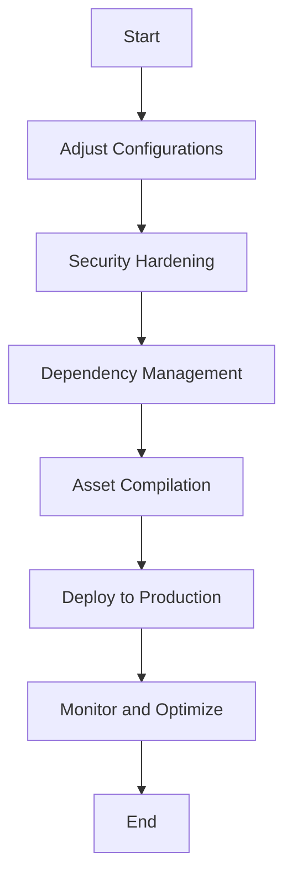

## 26.1. Preparing Applications for Production

In the world of software development, preparing an application for production is a critical step that requires careful consideration of performance, security, and reliability. This section provides a comprehensive guide for expert software engineers and architects to optimize Elixir applications for production environments. We will explore key areas such as configuration adjustments, security hardening, dependency management, and asset compilation.

### Optimizing for Production Environments

#### Adjusting Configurations for Performance, Security, and Reliability

When preparing an Elixir application for production, it is essential to adjust configurations to ensure optimal performance, security, and reliability. Here are some key considerations:

- **Performance Tuning**: Adjust the settings related to the BEAM VM to optimize performance. This includes configuring the number of schedulers, tuning garbage collection, and setting appropriate limits for process and memory usage.

- **Security Configurations**: Disable any development-specific features such as code reloading, and ensure that sensitive information is not exposed. Use environment variables to manage secrets and sensitive data.

- **Reliability Enhancements**: Implement robust error handling and logging strategies. Ensure that the application can recover gracefully from failures and that logs are appropriately managed to avoid disk space issues.

```elixir
# config/prod.exs

config :my_app, MyApp.Endpoint,
  http: [port: System.get_env("PORT") || 4000],
  url: [host: "example.com", port: 80],
  cache_static_manifest: "priv/static/cache_manifest.json",
  server: true,
  root: ".",
  version: Application.spec(:my_app, :vsn)

config :logger, level: :info
```

> **Key Point**: Always use environment variables to configure sensitive information, and ensure that production configurations are separate from development and test configurations.

#### Disabling Unnecessary Logging and Debugging Features

In a production environment, excessive logging and debugging features can impact performance and clutter log files. It is crucial to disable these features to maintain a clean and efficient production environment.

- **Reduce Log Verbosity**: Set the logging level to `:info` or `:warn` to minimize log output. This helps in focusing on critical information without overwhelming the log files.

- **Remove Debugging Code**: Ensure that any debugging code or verbose logging used during development is removed or disabled in production.

```elixir
# config/prod.exs

config :logger, level: :warn
```

> **Tip**: Use tools like `Logger` to dynamically adjust logging levels based on the environment. This flexibility allows for more detailed logs during troubleshooting without requiring code changes.

### Security Hardening

#### Implementing Measures to Protect Against Attacks

Security is a paramount concern when deploying applications to production. Implementing robust security measures helps protect against various types of attacks.

- **Secure Communication**: Use SSL/TLS to encrypt data in transit. This ensures that sensitive information is not intercepted during communication between clients and servers.

- **Input Validation**: Validate and sanitize all user inputs to prevent injection attacks. Use libraries and frameworks that provide built-in protections against common vulnerabilities.

- **Access Control**: Implement strict access control measures to ensure that only authorized users can access sensitive data and functionalities.

```elixir
# Example of using Plug.SSL to enforce HTTPS

plug Plug.SSL,
  rewrite_on: [:x_forwarded_proto],
  hsts: true
```

#### Ensuring All Dependencies Are Up-to-Date and Free from Known Vulnerabilities

Keeping dependencies up-to-date is crucial for maintaining security in production environments. Regularly check for updates and patches to ensure that your application is not vulnerable to known exploits.

- **Use Tools for Vulnerability Scanning**: Tools like `mix_audit` can help identify outdated dependencies with known vulnerabilities.

- **Automate Dependency Updates**: Consider using tools like Dependabot to automate dependency updates and receive notifications about new versions.

```elixir
# Run mix_audit to check for vulnerabilities

$ mix deps.get
$ mix audit
```

> **Reminder**: Regularly review the security advisories for the libraries and frameworks you use. Staying informed about potential vulnerabilities is key to maintaining a secure application.

### Dependency Management

#### Locking Down Dependency Versions to Prevent Unexpected Changes

In a production environment, it is important to lock down dependency versions to prevent unexpected changes that could introduce bugs or vulnerabilities.

- **Use Mix.lock**: Ensure that the `mix.lock` file is committed to version control. This file locks the exact versions of dependencies, ensuring consistency across environments.

- **Review Dependency Changes**: Before updating dependencies, review the changelogs and test the updates in a staging environment to prevent disruptions in production.

```elixir
# Example of a mix.lock file entry

%{
  "phoenix": {:hex, :phoenix, "1.5.9", "checksum", [:mix], [], "hexpm"},
  ...
}
```

#### Using Tools Like `mix deps.get --only prod` to Fetch Only Production Dependencies

Fetching only production dependencies helps reduce the size of the deployment package and ensures that development dependencies are not included in the production environment.

- **Optimize Dependency Fetching**: Use the `--only prod` flag to fetch only the necessary dependencies for production.

```bash
# Fetch only production dependencies

$ MIX_ENV=prod mix deps.get --only prod
```

> **Best Practice**: Regularly audit your dependencies to ensure that only necessary packages are included. Remove any unused or obsolete dependencies to minimize the attack surface.

### Asset Compilation

#### Precompiling Assets for Web Applications Using Tools Like Webpack

For web applications, precompiling assets such as JavaScript and CSS can significantly improve load times and performance.

- **Use Webpack for Asset Management**: Webpack can bundle and optimize assets, reducing the number of HTTP requests and improving load times.

- **Minify and Compress Assets**: Minify JavaScript and CSS files to reduce their size. Use tools like UglifyJS for JavaScript and CSSNano for CSS.

```bash
# Example Webpack configuration for production

module.exports = {
  mode: 'production',
  entry: './src/index.js',
  output: {
    filename: 'bundle.js',
    path: path.resolve(__dirname, 'dist')
  },
  optimization: {
    minimize: true
  }
};
```

#### Minifying JavaScript and CSS Files to Reduce Load Times

Minifying assets is a crucial step in preparing applications for production. It involves removing unnecessary whitespace, comments, and reducing variable names to minimize file size.

- **Automate Minification**: Integrate minification into your build process to ensure that assets are always optimized before deployment.

- **Use Gzip Compression**: Enable Gzip compression on your server to further reduce the size of assets sent over the network.

```elixir
# Enable Gzip compression in Phoenix

config :my_app, MyApp.Endpoint,
  http: [compress: true]
```

> **Pro Tip**: Regularly review and update your asset pipeline to incorporate the latest optimization techniques and tools. This ensures that your application remains performant and efficient.

### Visualizing the Production Deployment Process

To better understand the production deployment process, let's visualize the key steps involved in preparing an Elixir application for production.


```mermaid
flowchart TD
    A[Start] --> B[Adjust Configurations]
    B --> C[Security Hardening]
    C --> D[Dependency Management]
    D --> E[Asset Compilation]
    E --> F[Deploy to Production]
    F --> G[Monitor and Optimize]
    G --> H[End]
```

**Figure 1**: Visualizing the Production Deployment Process.

### Knowledge Check

As we wrap up this section, let's reinforce our understanding with a few key takeaways:

- **Performance Optimization**: Adjust configurations to enhance performance, disable unnecessary logging, and ensure efficient resource usage.
- **Security Hardening**: Implement measures to protect against attacks, keep dependencies up-to-date, and validate user inputs.
- **Dependency Management**: Lock down dependency versions and fetch only production dependencies to ensure consistency and security.
- **Asset Compilation**: Precompile and minify assets to improve load times and performance.

### Embrace the Journey

Remember, preparing applications for production is an ongoing process that requires continuous monitoring and optimization. As you gain more experience, you'll develop a deeper understanding of the nuances involved in deploying robust, secure, and performant applications. Keep experimenting, stay curious, and enjoy the journey!

## Quiz Time!



### What is a key consideration when adjusting configurations for production?

- [x] Performance tuning
- [ ] Increasing log verbosity
- [ ] Enabling code reloading
- [ ] Using development secrets

> **Explanation:** Performance tuning is crucial for optimizing the application for production environments.

### How can you ensure that sensitive information is not exposed in production?

- [x] Use environment variables
- [ ] Hardcode secrets in the code
- [ ] Enable verbose logging
- [ ] Share credentials in public repositories

> **Explanation:** Environment variables are a secure way to manage sensitive information without exposing it in the codebase.

### What is the purpose of using SSL/TLS in production environments?

- [x] Encrypt data in transit
- [ ] Increase application speed
- [ ] Disable input validation
- [ ] Reduce server load

> **Explanation:** SSL/TLS encrypts data in transit, ensuring secure communication between clients and servers.

### Which tool can help identify outdated dependencies with known vulnerabilities?

- [x] mix_audit
- [ ] Logger
- [ ] Webpack
- [ ] UglifyJS

> **Explanation:** mix_audit is a tool that helps identify outdated dependencies with known vulnerabilities.

### What is the benefit of locking down dependency versions?

- [x] Prevent unexpected changes
- [ ] Increase application size
- [ ] Enable automatic updates
- [ ] Reduce code readability

> **Explanation:** Locking down dependency versions prevents unexpected changes that could introduce bugs or vulnerabilities.

### How can you fetch only production dependencies?

- [x] Use `mix deps.get --only prod`
- [ ] Use `mix deps.get --only dev`
- [ ] Use `mix deps.get --all`
- [ ] Use `mix deps.get --test`

> **Explanation:** The `--only prod` flag ensures that only production dependencies are fetched.

### What is a key step in asset compilation for web applications?

- [x] Precompiling assets
- [ ] Disabling asset pipeline
- [ ] Increasing asset size
- [ ] Removing asset compression

> **Explanation:** Precompiling assets is essential for optimizing web applications for production.

### Why is minifying JavaScript and CSS files important?

- [x] To reduce load times
- [ ] To increase file size
- [ ] To add comments
- [ ] To disable caching

> **Explanation:** Minifying JavaScript and CSS files reduces their size, improving load times.

### What does enabling Gzip compression on a server do?

- [x] Reduces the size of assets sent over the network
- [ ] Increases server load
- [ ] Disables asset caching
- [ ] Adds debug information

> **Explanation:** Gzip compression reduces the size of assets, improving network efficiency.

### Is it important to regularly audit your dependencies?

- [x] True
- [ ] False

> **Explanation:** Regularly auditing dependencies ensures that only necessary packages are included, minimizing the attack surface.


