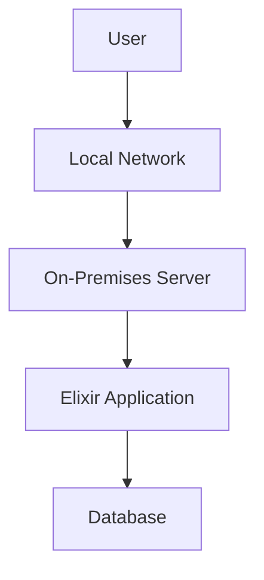
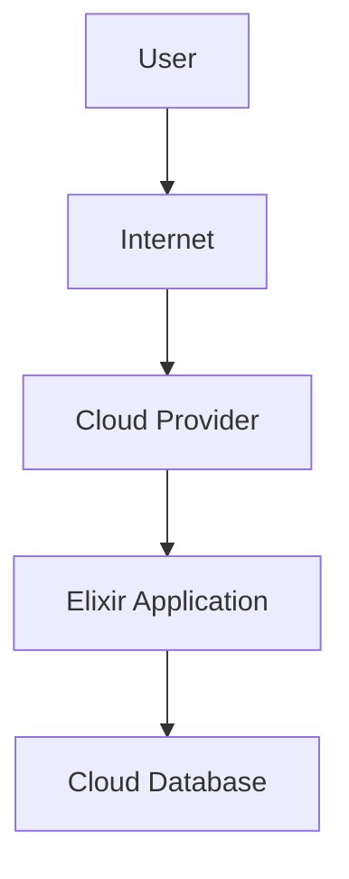
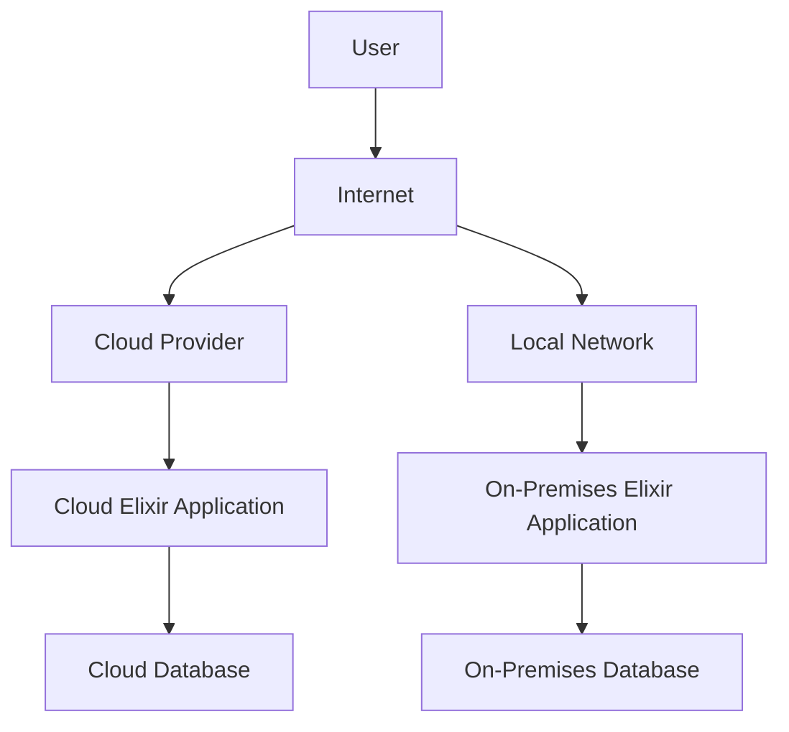

## 26.2. Deployment Options: On-Premises, Cloud, and Hybrid

In the world of software development, deploying applications efficiently and effectively is crucial for ensuring performance, scalability, and reliability. Elixir, with its robust concurrency model and fault-tolerant capabilities, is well-suited for a variety of deployment environments. In this section, we will explore three primary deployment options for Elixir applications: on-premises, cloud, and hybrid solutions. We will delve into the benefits, challenges, and best practices for each approach, providing you with the knowledge to make informed decisions for your deployment strategy.

### On-Premises Deployment

On-premises deployment involves hosting your Elixir applications on local servers within your organization's infrastructure. This approach provides complete control over the hardware, networking, and security aspects of your deployment. Let's explore the key aspects of on-premises deployment:

#### Benefits of On-Premises Deployment

1. **Control and Customization**: On-premises deployment offers unparalleled control over your infrastructure. You can customize hardware configurations, network setups, and security protocols to meet your specific requirements.

2. **Data Security and Compliance**: For organizations with strict data security and compliance requirements, on-premises deployment provides the ability to keep sensitive data within the organization's boundaries, reducing the risk of data breaches.

3. **Performance Optimization**: With direct access to hardware resources, you can optimize performance by fine-tuning server configurations and minimizing latency.

#### Challenges of On-Premises Deployment

1. **High Initial Costs**: Setting up and maintaining an on-premises infrastructure can be expensive. It requires significant upfront investment in hardware, networking equipment, and skilled personnel.

2. **Scalability Limitations**: Scaling on-premises infrastructure can be challenging and time-consuming. It often involves purchasing additional hardware and reconfiguring network setups.

3. **Maintenance Overhead**: Managing and maintaining on-premises infrastructure requires dedicated IT staff to handle hardware failures, software updates, and security patches.

#### Best Practices for On-Premises Deployment

- **Capacity Planning**: Conduct thorough capacity planning to ensure your infrastructure can handle peak loads and future growth.
- **Redundancy and Backup**: Implement redundancy and backup solutions to minimize downtime and data loss in case of hardware failures.
- **Security Measures**: Establish robust security protocols, including firewalls, intrusion detection systems, and regular security audits.

### Cloud Deployment

Cloud deployment involves hosting your Elixir applications on cloud platforms such as Amazon Web Services (AWS), Microsoft Azure, or Google Cloud Platform (GCP). This approach offers scalability, flexibility, and reduced operational overhead. Let's explore the key aspects of cloud deployment:

#### Benefits of Cloud Deployment

1. **Scalability and Flexibility**: Cloud platforms provide the ability to scale resources up or down based on demand. This flexibility allows you to handle varying workloads efficiently.

2. **Cost Efficiency**: Cloud deployment eliminates the need for large upfront investments in hardware. You pay for resources on a pay-as-you-go basis, optimizing costs.

3. **Global Reach**: Cloud providers offer data centers in multiple regions, enabling you to deploy applications closer to your users for improved performance and reduced latency.

#### Challenges of Cloud Deployment

1. **Vendor Lock-In**: Relying on a single cloud provider can lead to vendor lock-in, making it challenging to switch providers or move applications back on-premises.

2. **Data Security Concerns**: Storing sensitive data in the cloud raises concerns about data privacy and security. It's essential to implement encryption and access controls.

3. **Complexity of Cloud Management**: Managing cloud resources and services can be complex, requiring expertise in cloud architecture and management tools.

#### Best Practices for Cloud Deployment

- **Multi-Region Deployment**: Deploy applications across multiple regions to ensure high availability and disaster recovery.
- **Cost Monitoring and Optimization**: Use cloud cost management tools to monitor and optimize resource usage and costs.
- **Security Best Practices**: Implement security best practices, including encryption, identity and access management, and regular security assessments.

### Hybrid Solutions

Hybrid deployment combines on-premises and cloud resources to create a flexible and scalable infrastructure. This approach allows organizations to balance control with scalability and cost considerations. Let's explore the key aspects of hybrid solutions:

#### Benefits of Hybrid Solutions

1. **Flexibility and Agility**: Hybrid solutions provide the flexibility to run workloads in the most suitable environment, whether on-premises or in the cloud.

2. **Cost Optimization**: By leveraging both on-premises and cloud resources, organizations can optimize costs by using the cloud for burst workloads and on-premises for steady-state operations.

3. **Data Sovereignty**: Hybrid solutions allow organizations to keep sensitive data on-premises while leveraging the cloud for less sensitive workloads.

#### Challenges of Hybrid Solutions

1. **Complexity of Integration**: Integrating on-premises and cloud environments can be complex, requiring careful planning and management.

2. **Security and Compliance**: Ensuring consistent security and compliance across on-premises and cloud environments can be challenging.

3. **Network Latency**: Hybrid solutions may introduce network latency when data is transferred between on-premises and cloud environments.

#### Best Practices for Hybrid Solutions

- **Unified Management**: Use unified management tools to monitor and manage resources across on-premises and cloud environments.
- **Data Integration**: Implement data integration solutions to ensure seamless data flow between on-premises and cloud systems.
- **Security Consistency**: Establish consistent security policies and practices across all environments to ensure data protection and compliance.

### Containerization

Containerization is a powerful technique for packaging and deploying applications consistently across different environments. Docker is a popular containerization platform that simplifies environment setups and ensures consistent deployments. Let's explore the key aspects of containerization:

#### Benefits of Containerization

1. **Consistency Across Environments**: Containers encapsulate applications and their dependencies, ensuring consistent behavior across development, testing, and production environments.

2. **Portability**: Containers can run on any platform that supports Docker, making it easy to move applications between on-premises and cloud environments.

3. **Resource Efficiency**: Containers are lightweight and share the host OS kernel, allowing for efficient resource utilization and faster startup times.

#### Challenges of Containerization

1. **Complexity of Orchestration**: Managing and orchestrating containers at scale requires tools like Kubernetes, which can introduce complexity.

2. **Security Considerations**: Containers share the host OS kernel, which can pose security risks if not properly managed.

3. **Persistent Storage**: Managing persistent storage for stateful applications in containers can be challenging.

#### Best Practices for Containerization

- **Use Orchestration Tools**: Use orchestration tools like Kubernetes to manage containerized applications at scale.
- **Implement Security Best Practices**: Follow security best practices, including image scanning, access controls, and network segmentation.
- **Optimize Resource Usage**: Monitor and optimize resource usage to ensure efficient container performance.

### Visualizing Deployment Options

To better understand the deployment options, let's visualize the architecture of on-premises, cloud, and hybrid deployments using Mermaid.js diagrams.

#### On-Premises Deployment Architecture

*Caption: On-Premises Deployment Architecture - Users access the Elixir application hosted on local servers within the organization's network.*

#### Cloud Deployment Architecture

*Caption: Cloud Deployment Architecture - Users access the Elixir application hosted on cloud servers, leveraging cloud databases for storage.*

#### Hybrid Deployment Architecture

*Caption: Hybrid Deployment Architecture - Users access Elixir applications hosted both on cloud and on-premises servers, with data integration between cloud and on-premises databases.*

### Try It Yourself

To gain hands-on experience with deployment options, try the following exercises:

1. **Set Up a Local Elixir Application**: Deploy a simple Elixir application on a local server and configure the network settings for external access.

2. **Deploy an Elixir Application on AWS**: Use AWS Elastic Beanstalk or EC2 to deploy an Elixir application in the cloud. Experiment with scaling options and monitoring tools.

3. **Create a Hybrid Deployment**: Combine on-premises and cloud resources to deploy an Elixir application. Use a cloud database and integrate it with your on-premises application.

### Knowledge Check

- What are the key benefits of on-premises deployment?
- How does cloud deployment provide scalability and flexibility?
- What are the challenges of integrating on-premises and cloud environments in a hybrid solution?
- Why is containerization beneficial for consistent deployments?

### Conclusion

Choosing the right deployment option for your Elixir applications depends on various factors, including control, scalability, cost, and security requirements. On-premises deployment offers control and customization, cloud deployment provides scalability and flexibility, and hybrid solutions offer a balance between the two. Containerization further enhances deployment consistency and portability. By understanding the benefits and challenges of each approach, you can make informed decisions to optimize your deployment strategy.

## Quiz: Deployment Options: On-Premises, Cloud, and Hybrid



### What is a key benefit of on-premises deployment?

- [x] Complete control over infrastructure
- [ ] Automatic scalability
- [ ] Reduced initial costs
- [ ] Vendor lock-in

> **Explanation:** On-premises deployment offers complete control over the infrastructure, allowing for customization and optimization.

### Which deployment option provides scalability and flexibility?

- [ ] On-premises deployment
- [x] Cloud deployment
- [ ] Hybrid solutions
- [ ] Containerization

> **Explanation:** Cloud deployment provides scalability and flexibility, allowing resources to be adjusted based on demand.

### What is a challenge of hybrid solutions?

- [ ] High initial costs
- [x] Complexity of integration
- [ ] Lack of control
- [ ] Limited scalability

> **Explanation:** Hybrid solutions can be complex to integrate, requiring careful planning and management.

### What is a benefit of containerization?

- [x] Consistency across environments
- [ ] High initial costs
- [ ] Vendor lock-in
- [ ] Limited scalability

> **Explanation:** Containerization ensures consistency across development, testing, and production environments.

### What is a challenge of cloud deployment?

- [ ] Complete control over infrastructure
- [x] Vendor lock-in
- [ ] Lack of scalability
- [ ] High initial costs

> **Explanation:** Cloud deployment can lead to vendor lock-in, making it difficult to switch providers.

### How can on-premises deployment optimize performance?

- [x] By fine-tuning server configurations
- [ ] By using cloud resources
- [ ] By reducing initial costs
- [ ] By relying on vendor services

> **Explanation:** On-premises deployment allows for performance optimization through direct access to hardware resources.

### What is a benefit of hybrid solutions?

- [ ] High initial costs
- [x] Flexibility and agility
- [ ] Complexity of integration
- [ ] Vendor lock-in

> **Explanation:** Hybrid solutions offer flexibility and agility by allowing workloads to run in the most suitable environment.

### What is a challenge of containerization?

- [ ] Consistency across environments
- [x] Complexity of orchestration
- [ ] High initial costs
- [ ] Lack of portability

> **Explanation:** Managing and orchestrating containers at scale requires tools like Kubernetes, which can introduce complexity.

### What is a benefit of cloud deployment?

- [ ] Complete control over infrastructure
- [ ] High initial costs
- [x] Global reach
- [ ] Complexity of integration

> **Explanation:** Cloud deployment offers global reach, allowing applications to be deployed closer to users for improved performance.

### True or False: Containerization can help with consistent deployments across different environments.

- [x] True
- [ ] False

> **Explanation:** Containerization encapsulates applications and their dependencies, ensuring consistent behavior across environments.



Remember, this is just the beginning. As you progress, you'll build more complex and interactive applications. Keep experimenting, stay curious, and enjoy the journey!
