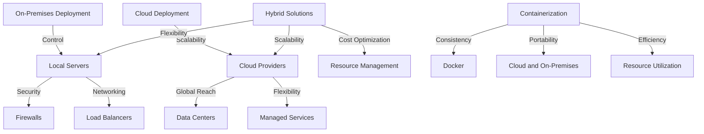

## 26.2. Deployment Options: On-Premises, Cloud, and Hybrid

As expert software engineers and architects, understanding the various deployment options available for Elixir applications is crucial to building scalable, resilient, and efficient systems. In this section, we will delve into the different deployment strategies—on-premises, cloud, and hybrid—each offering unique advantages and challenges. We will also explore containerization as a tool to streamline deployments across these environments.

### On-Premises Deployment

**On-premises deployment** involves hosting your Elixir applications on local servers that you manage. This traditional approach provides complete control over the hardware, networking, and security infrastructure. Let's explore the key aspects of on-premises deployments.

#### Managing Hardware and Infrastructure

- **Hardware Control**: Deploying on-premises allows you to select and configure the hardware that best suits your application needs. This can be particularly beneficial for applications with specific performance requirements.
  
- **Networking**: You have full control over the network configuration, allowing for custom setups that can optimize data flow and security. This includes configuring firewalls, load balancers, and network segmentation.

- **Security**: On-premises deployments offer the highest level of security control, as you manage the physical and digital security measures. This is crucial for industries with strict compliance requirements, such as healthcare or finance.

#### Challenges of On-Premises Deployment

- **Cost**: Initial setup costs can be high due to the need for purchasing and maintaining hardware. Additionally, ongoing operational expenses for power, cooling, and IT staff can be significant.

- **Scalability**: Scaling on-premises infrastructure can be slow and costly, as it involves purchasing and installing new hardware.

- **Maintenance**: Regular maintenance and updates are required to ensure the reliability and security of the infrastructure. This includes hardware repairs, software updates, and security patches.

### Cloud Deployment

**Cloud deployment** leverages cloud service providers like AWS, Azure, or Google Cloud to host your applications. This approach offers scalability, flexibility, and reduced operational overhead, making it a popular choice for modern applications.

#### Advantages of Cloud Deployment

- **Scalability**: Cloud platforms provide on-demand resources, allowing you to scale applications up or down based on demand. This elasticity is ideal for applications with variable workloads.

- **Cost Efficiency**: Cloud providers offer a pay-as-you-go pricing model, reducing the need for large upfront investments in hardware. This can lead to significant cost savings, especially for startups and small businesses.

- **Flexibility**: Cloud environments offer a wide range of services and tools that can accelerate development and deployment processes. This includes managed databases, machine learning services, and serverless computing.

- **Global Reach**: Cloud providers have data centers around the world, enabling you to deploy applications closer to your users, reducing latency and improving performance.

#### Challenges of Cloud Deployment

- **Security Concerns**: While cloud providers offer robust security measures, the shared responsibility model requires you to manage application-level security. This includes data encryption, access controls, and compliance management.

- **Vendor Lock-In**: Relying heavily on a single cloud provider can lead to vendor lock-in, making it challenging to switch providers or move applications back on-premises.

- **Downtime and Reliability**: Although cloud providers offer high availability, outages can still occur. It's essential to design applications with redundancy and failover mechanisms to mitigate potential downtime.

### Hybrid Solutions

**Hybrid deployment** combines on-premises and cloud resources, offering a balance between control and scalability. This approach is suitable for organizations looking to leverage the benefits of both environments.

#### Benefits of Hybrid Solutions

- **Flexibility and Control**: Hybrid deployments allow you to keep sensitive data and critical applications on-premises while utilizing the cloud for less sensitive workloads or to handle peak demand.

- **Cost Optimization**: By using on-premises resources for baseline workloads and cloud resources for spikes, you can optimize costs while maintaining performance.

- **Disaster Recovery**: Hybrid solutions can enhance disaster recovery strategies by replicating data and applications across on-premises and cloud environments.

#### Challenges of Hybrid Solutions

- **Complexity**: Managing a hybrid environment can be complex, requiring seamless integration between on-premises and cloud systems. This includes network connectivity, data synchronization, and unified monitoring.

- **Security Management**: Ensuring consistent security policies across both environments can be challenging. It's crucial to implement robust identity and access management, encryption, and compliance measures.

### Containerization

**Containerization** is a technology that packages applications and their dependencies into containers, ensuring consistent deployments across different environments. Docker is a popular tool for containerization, and it plays a vital role in modern deployment strategies.

#### Advantages of Containerization

- **Consistency**: Containers provide a consistent environment for applications, eliminating the "it works on my machine" problem. This consistency simplifies development, testing, and deployment processes.

- **Portability**: Containers can run on any system with a container runtime, whether it's on-premises, in the cloud, or in a hybrid setup. This portability enhances flexibility and reduces vendor lock-in.

- **Resource Efficiency**: Containers are lightweight and share the host OS kernel, allowing for efficient resource utilization. This can lead to cost savings, especially in cloud environments.

- **Microservices Architecture**: Containers are well-suited for microservices architectures, enabling you to deploy and scale individual services independently.

#### Implementing Containerization

Let's look at a simple example of containerizing an Elixir application using Docker.

```dockerfile
# Use the official Elixir image as the base
FROM elixir:1.12

# Set the working directory
WORKDIR /app

# Copy the mix.exs and mix.lock files
COPY mix.exs mix.lock ./

# Install dependencies
RUN mix do deps.get, deps.compile

# Copy the application source code
COPY . .

# Compile the application
RUN mix compile

# Start the application
CMD ["mix", "run", "--no-halt"]
```

This Dockerfile demonstrates how to build a Docker image for an Elixir application. It starts with the official Elixir image, sets the working directory, copies the necessary files, installs dependencies, compiles the application, and finally runs it.

#### Try It Yourself

Experiment with the Dockerfile by:

- Adding more dependencies to the `mix.exs` file and observing how the build process changes.
- Modifying the application code and rebuilding the Docker image to see how changes are reflected.
- Deploying the Docker container to different environments, such as a local Docker instance or a cloud-based Kubernetes cluster.

### Visualizing Deployment Options

To better understand the relationships and workflows between on-premises, cloud, and hybrid deployments, let's visualize these concepts using a diagram.


```mermaid
graph TD;
    A[On-Premises Deployment] -->|Control| B[Local Servers];
    B -->|Security| C[Firewalls];
    B -->|Networking| D[Load Balancers];
    
    E[Cloud Deployment] -->|Scalability| F[Cloud Providers];
    F -->|Global Reach| G[Data Centers];
    F -->|Flexibility| H[Managed Services];
    
    I[Hybrid Solutions] -->|Flexibility| B;
    I -->|Scalability| F;
    I -->|Cost Optimization| J[Resource Management];
    
    K[Containerization] -->|Consistency| L[Docker];
    K -->|Portability| M[Cloud and On-Premises];
    K -->|Efficiency| N[Resource Utilization];
```

This diagram illustrates the key components and benefits of each deployment option, highlighting how containerization can be integrated into these strategies.

### Key Takeaways

- **On-Premises Deployment** offers complete control over infrastructure but requires significant investment in hardware and maintenance.
- **Cloud Deployment** provides scalability and flexibility with reduced operational overhead, making it ideal for dynamic workloads.
- **Hybrid Solutions** combine the best of both worlds, offering control and scalability but requiring careful integration and management.
- **Containerization** enhances deployment consistency and portability, supporting modern architectures like microservices.

### References and Further Reading

- [AWS Cloud Deployment](https://aws.amazon.com/solutions/)
- [Azure Cloud Services](https://azure.microsoft.com/en-us/services/)
- [Google Cloud Platform](https://cloud.google.com/)
- [Docker Documentation](https://docs.docker.com/)
- [Kubernetes Documentation](https://kubernetes.io/docs/home/)

## Quiz Time!



### Which deployment option offers complete control over hardware and infrastructure?

- [x] On-Premises Deployment
- [ ] Cloud Deployment
- [ ] Hybrid Solutions
- [ ] Containerization

> **Explanation:** On-premises deployment allows organizations to manage their own hardware and infrastructure, providing complete control.

### What is a key advantage of cloud deployment?

- [ ] High initial setup cost
- [x] Scalability
- [ ] Complex maintenance
- [ ] Limited flexibility

> **Explanation:** Cloud deployment offers scalability, allowing applications to scale up or down based on demand.

### Which deployment strategy combines on-premises and cloud resources?

- [ ] On-Premises Deployment
- [ ] Cloud Deployment
- [x] Hybrid Solutions
- [ ] Containerization

> **Explanation:** Hybrid solutions combine on-premises and cloud resources, offering flexibility and scalability.

### What is a primary benefit of containerization?

- [ ] Increased hardware costs
- [x] Consistency across environments
- [ ] Vendor lock-in
- [ ] Limited portability

> **Explanation:** Containerization provides consistency across different environments, ensuring that applications run the same way everywhere.

### What tool is commonly used for containerization?

- [ ] Kubernetes
- [x] Docker
- [ ] AWS Lambda
- [ ] Azure Functions

> **Explanation:** Docker is a popular tool used for containerizing applications, providing a consistent runtime environment.

### What is a challenge associated with hybrid solutions?

- [ ] Lack of scalability
- [ ] High initial costs
- [x] Complexity in integration
- [ ] Limited control

> **Explanation:** Hybrid solutions can be complex to integrate, requiring seamless connectivity and management between on-premises and cloud systems.

### Which deployment option is ideal for applications with strict compliance requirements?

- [x] On-Premises Deployment
- [ ] Cloud Deployment
- [ ] Hybrid Solutions
- [ ] Containerization

> **Explanation:** On-premises deployment is ideal for applications with strict compliance requirements, as it offers complete control over security measures.

### What is a potential downside of relying heavily on a single cloud provider?

- [ ] Increased scalability
- [ ] Reduced operational overhead
- [x] Vendor lock-in
- [ ] Enhanced flexibility

> **Explanation:** Relying heavily on a single cloud provider can lead to vendor lock-in, making it difficult to switch providers or move applications back on-premises.

### Which deployment option allows you to deploy applications closer to your users?

- [ ] On-Premises Deployment
- [x] Cloud Deployment
- [ ] Hybrid Solutions
- [ ] Containerization

> **Explanation:** Cloud deployment allows you to deploy applications closer to your users by leveraging global data centers, reducing latency.

### True or False: Containerization is only beneficial for cloud deployments.

- [ ] True
- [x] False

> **Explanation:** Containerization is beneficial for both cloud and on-premises deployments, providing consistency and portability across environments.



Remember, deployment is a critical aspect of software development, and choosing the right strategy can significantly impact the success of your Elixir applications. Keep experimenting, stay curious, and enjoy the journey of mastering deployment options!
