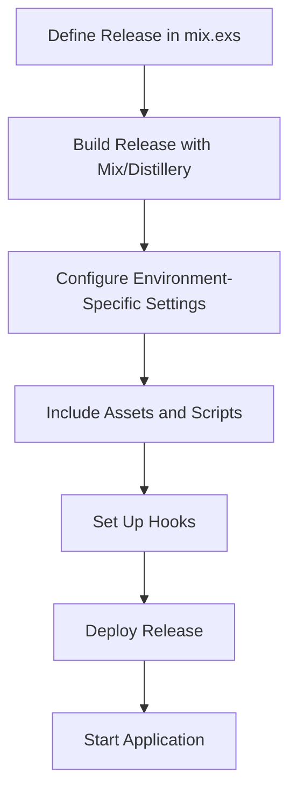

## 26.3. Release Handling with Distillery and Mix Releases

In the world of Elixir, deploying applications efficiently and reliably is crucial for maintaining robust and scalable systems. This section delves into the intricacies of release handling using Distillery and Mix Releases, providing expert guidance on building, configuring, and customizing releases for Elixir applications.

### Building Releases

Building releases in Elixir involves creating self-contained packages of your application, which can be deployed to production environments. These packages include the compiled code, necessary dependencies, and a runtime environment. Let's explore the tools and techniques for building releases in Elixir.

#### Mix Releases for Elixir 1.9+

With the introduction of Elixir 1.9, Mix Releases became the standard tool for building releases. Mix Releases simplify the release process by integrating seamlessly with the Elixir ecosystem.

**Creating a Release with Mix Releases**

To create a release using Mix, follow these steps:

1. **Define a Release in `mix.exs`:**

   Add a release configuration to your `mix.exs` file:

   ```elixir
   defmodule MyApp.MixProject do
     use Mix.Project

     def project do
       [
         app: :my_app,
         version: "0.1.0",
         elixir: "~> 1.9",
         start_permanent: Mix.env() == :prod,
         deps: deps()
       ]
     end

     defp deps do
       []
     end

     defp releases do
       [
         my_app: [
           include_executables_for: [:unix],
           applications: [runtime_tools: :permanent]
         ]
       ]
     end
   end
   ```

2. **Build the Release:**

   Use the Mix task to build the release:

   ```bash
   mix release
   ```

   This command generates a release in the `_build/prod/rel/my_app` directory.

3. **Start the Release:**

   Navigate to the release directory and start the application:

   ```bash
   _build/prod/rel/my_app/bin/my_app start
   ```

#### Distillery for Earlier Versions

For Elixir versions prior to 1.9, Distillery is the go-to tool for building releases. Distillery provides a powerful and flexible framework for managing releases.

**Creating a Release with Distillery**

1. **Add Distillery to Your Project:**

   Add Distillery as a dependency in your `mix.exs` file:

   ```elixir
   defp deps do
     [
       {:distillery, "~> 2.1"}
     ]
   end
   ```

2. **Initialize Distillery:**

   Run the following command to initialize Distillery:

   ```bash
   mix release.init
   ```

   This command generates a `rel/config.exs` file, which you can customize for your release.

3. **Build the Release:**

   Use the Distillery command to build the release:

   ```bash
   mix release
   ```

4. **Start the Release:**

   Navigate to the release directory and start the application:

   ```bash
   _build/prod/rel/my_app/bin/my_app start
   ```

### Configuration Management

Managing configurations is a critical aspect of release handling. Elixir provides robust mechanisms for handling environment-specific configurations and sensitive data.

#### Handling Environment-Specific Configurations

Elixir's configuration system allows you to define environment-specific settings in `config/config.exs` and `config/{env}.exs` files. This approach ensures that your application behaves correctly in different environments.

**Example Configuration:**

```elixir
# config/config.exs
use Mix.Config

config :my_app, MyApp.Repo,
  username: "postgres",
  password: "postgres",
  database: "my_app_dev",
  hostname: "localhost",
  pool_size: 10
```

**Environment-Specific Configuration:**

```elixir
# config/prod.exs
use Mix.Config

config :my_app, MyApp.Repo,
  username: "prod_user",
  password: "prod_pass",
  database: "my_app_prod",
  hostname: "prod_host",
  pool_size: 20
```

#### Using Runtime Configuration for Sensitive Data

For sensitive data like API keys and passwords, it's best to use runtime configuration. This approach allows you to inject sensitive data at runtime, keeping it out of version control.

**Example Runtime Configuration:**

```elixir
# config/releases.exs
use Mix.Config

config :my_app, MyApp.Repo,
  username: System.get_env("DB_USERNAME"),
  password: System.get_env("DB_PASSWORD"),
  database: System.get_env("DB_NAME"),
  hostname: System.get_env("DB_HOST"),
  pool_size: String.to_integer(System.get_env("DB_POOL_SIZE") || "10")
```

### Customizing Releases

Customizing releases involves including necessary assets, scripts, and configurations to tailor the release to your application's needs.

#### Including Necessary Assets and Scripts

You can include additional files and scripts in your release by specifying them in the release configuration.

**Example:**

```elixir
defp releases do
  [
    my_app: [
      include_executables_for: [:unix],
      applications: [runtime_tools: :permanent],
      steps: [:assemble, &copy_extra_files/1]
    ]
  ]
end

defp copy_extra_files(release) do
  File.cp_r!("priv/static", Path.join(release.path, "static"))
  release
end
```

#### Setting Up Hooks for Pre and Post-Deployment Tasks

Hooks allow you to execute custom scripts before or after certain release tasks, such as starting or stopping the application.

**Example Hook:**

```elixir
# rel/hooks/pre_start.sh
#!/bin/sh
echo "Running pre-start hook"
```

To use the hook, add it to your release configuration:

```elixir
defp releases do
  [
    my_app: [
      include_executables_for: [:unix],
      applications: [runtime_tools: :permanent],
      hooks: [
        pre_start: "rel/hooks/pre_start.sh"
      ]
    ]
  ]
end
```

### Visualizing the Release Process

To better understand the release process, let's visualize the steps involved in building and deploying a release.



**Diagram Description:** This flowchart illustrates the steps involved in building and deploying an Elixir release, from defining the release in `mix.exs` to starting the application.

### References and Further Reading

- [Elixir Mix Releases Documentation](https://hexdocs.pm/mix/Mix.Tasks.Release.html)
- [Distillery Documentation](https://hexdocs.pm/distillery/)
- [Elixir Configuration and Releases Guide](https://elixir-lang.org/getting-started/mix-otp/config-and-releases.html)

### Knowledge Check

- What are the main differences between Mix Releases and Distillery?
- How can you manage sensitive data in Elixir releases?
- What are hooks, and how can they be used in release handling?

### Embrace the Journey

Remember, mastering release handling in Elixir is a journey. As you progress, you'll gain deeper insights into building robust and scalable applications. Keep experimenting, stay curious, and enjoy the process!

## Quiz: Release Handling with Distillery and Mix Releases



### What is the primary purpose of building releases in Elixir?

- [x] To create self-contained packages for deployment
- [ ] To compile code for development
- [ ] To manage dependencies
- [ ] To run tests

> **Explanation:** Building releases creates self-contained packages that include compiled code, dependencies, and a runtime environment for deployment.

### Which tool is recommended for building releases in Elixir 1.9+?

- [x] Mix Releases
- [ ] Distillery
- [ ] Rebar3
- [ ] Hex

> **Explanation:** Mix Releases is the recommended tool for building releases in Elixir 1.9 and later versions.

### How can environment-specific configurations be managed in Elixir?

- [x] Using `config/{env}.exs` files
- [ ] Using environment variables only
- [ ] Hardcoding values in the application
- [ ] Using a separate configuration tool

> **Explanation:** Elixir allows managing environment-specific configurations using `config/{env}.exs` files.

### What is the purpose of runtime configuration?

- [x] To inject sensitive data at runtime
- [ ] To compile code faster
- [ ] To manage dependencies
- [ ] To run tests

> **Explanation:** Runtime configuration allows injecting sensitive data like API keys and passwords at runtime, keeping them out of version control.

### What are hooks used for in release handling?

- [x] To execute custom scripts before or after release tasks
- [ ] To manage dependencies
- [ ] To compile code
- [ ] To run tests

> **Explanation:** Hooks are used to execute custom scripts before or after certain release tasks, such as starting or stopping the application.

### Which command is used to build a release with Mix?

- [x] `mix release`
- [ ] `mix compile`
- [ ] `mix run`
- [ ] `mix deps.get`

> **Explanation:** The `mix release` command is used to build a release in Elixir.

### How can additional files and scripts be included in a release?

- [x] By specifying them in the release configuration
- [ ] By placing them in the `lib` directory
- [ ] By adding them to the `deps` list
- [ ] By hardcoding them in the application

> **Explanation:** Additional files and scripts can be included in a release by specifying them in the release configuration.

### What is the role of Distillery in Elixir releases?

- [x] To build releases for Elixir versions prior to 1.9
- [ ] To manage dependencies
- [ ] To compile code
- [ ] To run tests

> **Explanation:** Distillery is used to build releases for Elixir versions prior to 1.9.

### True or False: Mix Releases and Distillery can be used interchangeably in all Elixir versions.

- [ ] True
- [x] False

> **Explanation:** Mix Releases is recommended for Elixir 1.9+, while Distillery is used for earlier versions.

### Which of the following is a benefit of using Mix Releases?

- [x] Seamless integration with the Elixir ecosystem
- [ ] Requires additional dependencies
- [ ] Only works with Unix systems
- [ ] Limited to development environments

> **Explanation:** Mix Releases seamlessly integrates with the Elixir ecosystem, making it a preferred choice for building releases.


