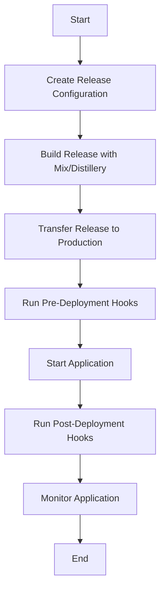

## 26.3. Release Handling with Distillery and Mix Releases

In the world of Elixir, deploying applications efficiently and reliably is crucial for maintaining the performance and uptime of your systems. Release handling is a key aspect of deployment, and Elixir provides powerful tools to manage this process: Distillery and Mix Releases. In this section, we will explore how to build, configure, and customize releases using these tools, ensuring your applications are robust and ready for production.

### Building Releases

Building a release involves creating a self-contained package of your application that can be deployed to a production environment. This package includes your compiled application code, dependencies, and the Erlang runtime system, making it easy to deploy on any compatible server without needing to install Elixir or Erlang separately.

#### Creating Self-Contained Packages

To build a release, you need to compile your application and bundle it with its dependencies. This process ensures that everything your application needs to run is included in a single package. Let's look at how this is done using Mix Releases and Distillery.

##### Mix Releases (Elixir 1.9+)

With Elixir 1.9 and later, Mix Releases is the built-in tool for creating releases. It simplifies the process by integrating release building into the Mix build tool.

Here's a step-by-step guide to creating a release with Mix:

1. **Create a Release Configuration**: Add a `rel` directory in your project with a `config.exs` file to specify release settings.

   ```elixir
   # rel/config.exs
   use Mix.Releases.Config,
       default_release: :default,
       default_environment: Mix.env()

   environment :prod do
     set include_erts: true
     set include_src: false
     set cookie: :my_secret_cookie
   end

   release :my_app do
     set version: current_version(:my_app)
     set applications: [
       :runtime_tools
     ]
   end
   ```

2. **Build the Release**: Use the `mix release` command to build the release.

   ```shell
   mix release
   ```

   This command compiles the application and generates a release in the `_build/prod/rel/my_app` directory.

3. **Deploy the Release**: Copy the release directory to your production server and run the `bin/my_app start` script to start your application.

##### Distillery (For Elixir Versions Before 1.9)

For Elixir versions before 1.9, Distillery is the preferred tool for building releases. It provides a powerful and flexible way to manage releases.

Here's how you can create a release using Distillery:

1. **Add Distillery to Your Project**: Add Distillery as a dependency in your `mix.exs` file.

   ```elixir
   defp deps do
     [
       {:distillery, "~> 2.1"}
     ]
   end
   ```

2. **Generate Release Configuration**: Run the `mix release.init` command to generate the necessary configuration files.

   ```shell
   mix release.init
   ```

   This creates a `rel` directory with configuration files.

3. **Build the Release**: Use the `mix release` command to build the release.

   ```shell
   mix release
   ```

   The release will be generated in the `_build/prod/rel/my_app` directory.

4. **Deploy the Release**: Transfer the release to your production environment and start it using the `bin/my_app start` script.

### Configuration Management

Managing configurations is a critical aspect of deploying applications. Different environments (development, staging, production) may require different configurations. Additionally, sensitive data such as API keys and database passwords should be handled securely.

#### Handling Environment-Specific Configurations

Elixir provides a flexible way to manage environment-specific configurations using configuration files and environment variables.

1. **Use Configuration Files**: Define configurations in `config/config.exs` and environment-specific configurations in `config/dev.exs`, `config/test.exs`, and `config/prod.exs`.

   ```elixir
   # config/config.exs
   import Config

   config :my_app, MyApp.Repo,
     username: "postgres",
     password: "postgres",
     database: "my_app_dev",
     hostname: "localhost",
     show_sensitive_data_on_connection_error: true,
     pool_size: 10
   ```

2. **Override with Environment Variables**: Use environment variables to override configurations for different environments.

   ```elixir
   config :my_app, MyApp.Repo,
     username: System.get_env("DB_USERNAME") || "postgres",
     password: System.get_env("DB_PASSWORD") || "postgres",
     database: System.get_env("DB_NAME") || "my_app_dev",
     hostname: System.get_env("DB_HOST") || "localhost"
   ```

#### Using Runtime Configuration for Sensitive Data and Secrets

For sensitive data, it's essential to use runtime configuration to ensure that secrets are not stored in version control. Elixir supports runtime configuration through the `config/releases.exs` file, which is evaluated at runtime.

1. **Create a Runtime Configuration File**: Add a `config/releases.exs` file to handle runtime configurations.

   ```elixir
   # config/releases.exs
   import Config

   config :my_app, MyApp.Repo,
     username: System.get_env("DB_USERNAME"),
     password: System.get_env("DB_PASSWORD"),
     database: System.get_env("DB_NAME"),
     hostname: System.get_env("DB_HOST")
   ```

2. **Set Environment Variables**: Ensure that the necessary environment variables are set on the production server.

   ```shell
   export DB_USERNAME=my_user
   export DB_PASSWORD=my_secret_password
   export DB_NAME=my_app_prod
   export DB_HOST=prod-db-host
   ```

### Customizing Releases

Customizing releases allows you to tailor the release package to your specific needs, including adding assets, scripts, and configurations, as well as setting up hooks for pre and post-deployment tasks.

#### Including Necessary Assets, Scripts, and Configurations

1. **Add Assets and Scripts**: Include any necessary assets and scripts in your release by specifying them in the release configuration.

   ```elixir
   release :my_app do
     set version: current_version(:my_app)
     set applications: [
       :runtime_tools
     ]
     set include_erts: true
     set include_src: false
     set cookie: :my_secret_cookie
     set overlays: [
       {:copy, "rel/overlays/etc/my_app.conf", "etc/my_app.conf"},
       {:copy, "rel/overlays/bin/my_script.sh", "bin/my_script.sh"}
     ]
   end
   ```

2. **Use Overlays**: Overlays allow you to include additional files in your release package.

   ```elixir
   set overlays: [
     {:copy, "rel/overlays/etc/my_app.conf", "etc/my_app.conf"},
     {:copy, "rel/overlays/bin/my_script.sh", "bin/my_script.sh"}
   ]
   ```

#### Setting Up Hooks for Pre and Post-Deployment Tasks

Hooks are scripts that run at specific points during the release lifecycle, such as before or after deployment. They can be used to perform tasks like database migrations, cache clearing, or sending notifications.

1. **Define Hooks**: Add hooks to your release configuration.

   ```elixir
   release :my_app do
     set version: current_version(:my_app)
     set applications: [
       :runtime_tools
     ]
     set pre_start_hooks: "rel/hooks/pre_start"
     set post_start_hooks: "rel/hooks/post_start"
   end
   ```

2. **Create Hook Scripts**: Write scripts for each hook in the specified directories.

   ```shell
   # rel/hooks/pre_start
   #!/bin/sh
   echo "Running pre-start hook"
   ```

   ```shell
   # rel/hooks/post_start
   #!/bin/sh
   echo "Running post-start hook"
   ```

### Visualizing Release Workflow

To better understand the release workflow, let's visualize the process using a flowchart.


```mermaid
graph TD;
    A[Start] --> B[Create Release Configuration];
    B --> C[Build Release with Mix/Distillery];
    C --> D[Transfer Release to Production];
    D --> E[Run Pre-Deployment Hooks];
    E --> F[Start Application];
    F --> G[Run Post-Deployment Hooks];
    G --> H[Monitor Application];
    H --> I[End];
```

**Figure 1: Release Workflow**

This flowchart illustrates the steps involved in creating, deploying, and managing a release, from configuration to monitoring.

### References and Links

- [Elixir Releases Documentation](https://hexdocs.pm/mix/Mix.Tasks.Release.html)
- [Distillery Documentation](https://hexdocs.pm/distillery/introduction/welcome.html)
- [Elixir Configuration Guide](https://elixir-lang.org/getting-started/mix-otp/config-and-releases.html)

### Knowledge Check

- How do Mix Releases and Distillery differ in handling releases?
- What are the benefits of using runtime configuration for sensitive data?
- How can hooks be used to automate tasks during the release process?

### Embrace the Journey

Remember, mastering release handling is a journey. As you explore and experiment with Mix Releases and Distillery, you'll gain valuable insights into deploying robust and reliable Elixir applications. Keep experimenting, stay curious, and enjoy the journey!

## Quiz Time!



### What is the primary purpose of building a release in Elixir?

- [x] To create a self-contained package of the application for deployment.
- [ ] To compile the application for development purposes.
- [ ] To run tests on the application.
- [ ] To generate documentation for the application.

> **Explanation:** Building a release creates a self-contained package that includes the application code, dependencies, and the Erlang runtime, making it ready for deployment.

### Which tool is built into Elixir 1.9+ for creating releases?

- [x] Mix Releases
- [ ] Distillery
- [ ] ExUnit
- [ ] Phoenix

> **Explanation:** Mix Releases is the built-in tool for creating releases in Elixir 1.9 and later versions.

### How can environment-specific configurations be managed in Elixir?

- [x] Using configuration files and environment variables.
- [ ] By hardcoding configurations in the application code.
- [ ] By using external configuration management tools only.
- [ ] By storing configurations in a database.

> **Explanation:** Elixir allows managing environment-specific configurations using configuration files and environment variables.

### What is the purpose of runtime configuration in Elixir?

- [x] To handle sensitive data and secrets securely.
- [ ] To compile the application code at runtime.
- [ ] To manage application dependencies.
- [ ] To generate runtime documentation.

> **Explanation:** Runtime configuration is used to handle sensitive data and secrets securely, ensuring they are not stored in version control.

### How can hooks be used in the release process?

- [x] To automate tasks like database migrations and cache clearing.
- [ ] To compile the application code.
- [ ] To generate documentation.
- [ ] To run tests on the application.

> **Explanation:** Hooks are scripts that run at specific points during the release lifecycle, automating tasks like database migrations and cache clearing.

### What is the role of overlays in customizing releases?

- [x] To include additional files in the release package.
- [ ] To manage application dependencies.
- [ ] To compile the application code.
- [ ] To generate runtime documentation.

> **Explanation:** Overlays allow including additional files, such as assets and scripts, in the release package.

### Which of the following is a step in the release workflow?

- [x] Create Release Configuration
- [ ] Generate Documentation
- [ ] Run Tests
- [ ] Compile Code

> **Explanation:** Creating a release configuration is a step in the release workflow, where settings for the release are defined.

### What does the `mix release` command do?

- [x] Builds the release package.
- [ ] Runs tests on the application.
- [ ] Generates documentation.
- [ ] Compiles the application code.

> **Explanation:** The `mix release` command builds the release package, compiling the application and bundling it with its dependencies.

### True or False: Distillery is used for creating releases in Elixir 1.9 and later.

- [ ] True
- [x] False

> **Explanation:** Distillery is used for creating releases in Elixir versions before 1.9. Mix Releases is used in Elixir 1.9 and later.

### What is the benefit of using Mix Releases over Distillery?

- [x] Mix Releases is built into Elixir, simplifying the release process.
- [ ] Mix Releases supports more programming languages.
- [ ] Mix Releases generates documentation automatically.
- [ ] Mix Releases is faster at compiling code.

> **Explanation:** Mix Releases is built into Elixir 1.9 and later, simplifying the release process by integrating it into the Mix build tool.




