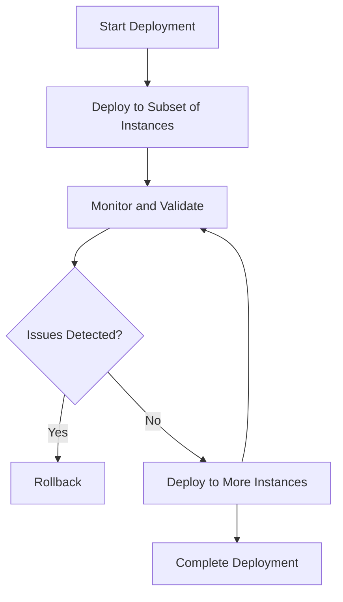
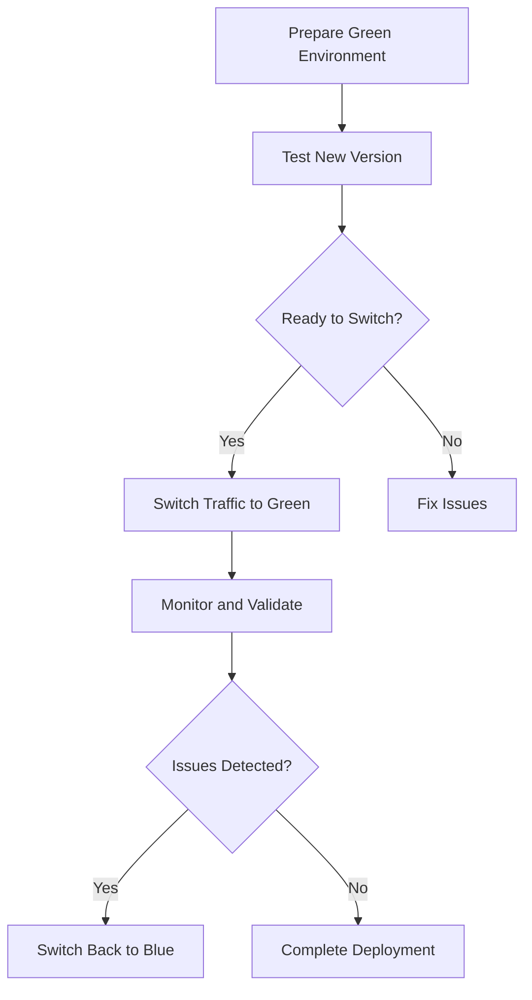
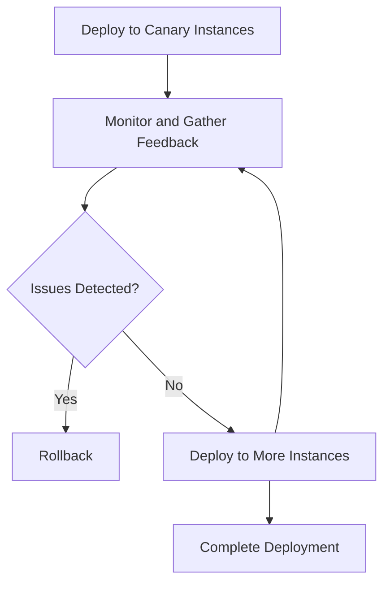

## 26.4. Zero-Downtime Deployments

In the fast-paced world of software development, ensuring that your application remains available and responsive during updates is crucial. Zero-downtime deployments are a set of strategies and techniques that allow you to deploy new versions of your application without interrupting service to your users. In this section, we'll explore various approaches to achieve zero-downtime deployments in Elixir applications, including rolling deployments, blue-green deployments, and canary releases. We'll also discuss the challenges associated with these strategies and how to overcome them.

### Introduction to Zero-Downtime Deployments

Zero-downtime deployments aim to minimize or eliminate service interruptions during application updates. This is particularly important for applications with high availability requirements, such as e-commerce platforms, financial services, and real-time communication systems. By implementing zero-downtime deployment strategies, you can ensure that your application remains available to users even as you roll out new features, bug fixes, or performance improvements.

### Rolling Deployments

Rolling deployments involve gradually replacing old instances of your application with new ones. This approach allows you to update your application incrementally, reducing the risk of introducing errors or downtime.

#### Key Steps in Rolling Deployments

1. **Prepare the New Version**: Build and test the new version of your application to ensure it meets all requirements and passes all tests.

2. **Deploy Incrementally**: Start by deploying the new version to a small subset of instances. Monitor these instances closely for any errors or issues.

3. **Monitor and Validate**: Continuously monitor the application for errors, performance issues, and user feedback. Validate that the new version is functioning as expected.

4. **Gradual Rollout**: If no issues are detected, gradually increase the number of instances running the new version until all instances are updated.

5. **Rollback if Necessary**: If any issues are detected during the rollout, be prepared to roll back to the previous version quickly.

#### Code Example: Rolling Deployment Script

```elixir
defmodule Deployment do
  @moduledoc """
  A module to handle rolling deployments.
  """

  @instances ["instance1", "instance2", "instance3", "instance4"]

  def deploy_new_version(version) do
    Enum.each(@instances, fn instance ->
      IO.puts("Deploying version #{version} to #{instance}")
      # Simulate deployment
      :timer.sleep(1000)
      IO.puts("Deployment to #{instance} complete")
    end)
  end
end

# Usage
Deployment.deploy_new_version("1.2.0")
```

### Blue-Green Deployments

Blue-green deployments involve maintaining two identical environments, referred to as "blue" and "green." One environment serves live traffic, while the other is used for staging the new version. Once the new version is ready, you switch traffic to the updated environment.

#### Key Steps in Blue-Green Deployments

1. **Prepare the Green Environment**: Deploy the new version to the green environment and perform thorough testing.

2. **Switch Traffic**: Once the green environment is ready, switch traffic from the blue environment to the green environment.

3. **Monitor and Validate**: Monitor the application closely for any issues. Ensure that the new version is functioning as expected.

4. **Rollback if Necessary**: If any issues are detected, switch traffic back to the blue environment.

#### Code Example: Blue-Green Deployment Script

```elixir
defmodule BlueGreenDeployment do
  @moduledoc """
  A module to handle blue-green deployments.
  """

  def switch_traffic_to(environment) do
    IO.puts("Switching traffic to #{environment} environment")
    # Simulate traffic switch
    :timer.sleep(1000)
    IO.puts("Traffic switched to #{environment} environment")
  end
end

# Usage
BlueGreenDeployment.switch_traffic_to("green")
```

### Canary Releases

Canary releases involve deploying a new version of your application to a small subset of users before rolling it out to the entire user base. This approach allows you to test new features and gather feedback from real users without affecting the majority of your user base.

#### Key Steps in Canary Releases

1. **Deploy to a Subset**: Deploy the new version to a small subset of users or instances.

2. **Monitor and Gather Feedback**: Monitor the application for errors and gather feedback from users.

3. **Gradual Rollout**: If no issues are detected, gradually increase the number of users or instances running the new version.

4. **Rollback if Necessary**: If any issues are detected, roll back to the previous version for the affected users.

#### Code Example: Canary Release Script

```elixir
defmodule CanaryRelease do
  @moduledoc """
  A module to handle canary releases.
  """

  @canary_instances ["instance1", "instance2"]

  def deploy_canary(version) do
    Enum.each(@canary_instances, fn instance ->
      IO.puts("Deploying canary version #{version} to #{instance}")
      # Simulate deployment
      :timer.sleep(1000)
      IO.puts("Canary deployment to #{instance} complete")
    end)
  end
end

# Usage
CanaryRelease.deploy_canary("1.2.0")
```

### Challenges in Zero-Downtime Deployments

While zero-downtime deployments offer significant benefits, they also present several challenges that must be addressed to ensure a smooth deployment process.

#### Managing Database Migrations

One of the most significant challenges in zero-downtime deployments is managing database migrations. Changes to the database schema can lead to downtime if not handled carefully.

- **Backward-Compatible Changes**: Ensure that database changes are backward-compatible with both the old and new versions of the application.

- **Two-Step Migrations**: Perform migrations in two steps: first, apply changes that are compatible with both versions, and then, once the new version is fully deployed, apply any remaining changes.

#### Ensuring Session Continuity and Data Consistency

Maintaining session continuity and data consistency during deployments is crucial to avoid disrupting user experiences.

- **Session Management**: Use distributed session management to ensure that sessions are not lost during deployments.

- **Data Consistency**: Implement strategies to ensure data consistency across different versions of the application.

### Visualizing Zero-Downtime Deployment Strategies

To better understand the flow of zero-downtime deployment strategies, let's visualize the process using Mermaid.js diagrams.

#### Rolling Deployment Flow



#### Blue-Green Deployment Flow



#### Canary Release Flow



### References and Further Reading

For more information on zero-downtime deployments and related topics, consider exploring the following resources:

- [Continuous Delivery: Reliable Software Releases through Build, Test, and Deployment Automation](https://www.amazon.com/Continuous-Delivery-Deployment-Automation-Addison-Wesley/dp/0321601912) by Jez Humble and David Farley
- [The Phoenix Framework Guide](https://hexdocs.pm/phoenix/overview.html) for insights into deploying Elixir applications with Phoenix
- [Elixir Deployment Strategies](https://elixir-lang.org/getting-started/mix-otp/deploying.html) on the official Elixir website

### Knowledge Check

Before we conclude, let's reinforce what we've learned with a few questions:

1. What are the key steps in a rolling deployment?
2. How do blue-green deployments facilitate easy rollbacks?
3. What is the primary benefit of canary releases?
4. How can you manage database migrations without downtime?
5. What strategies can you use to ensure session continuity during deployments?

### Embrace the Journey

Remember, mastering zero-downtime deployments is a journey. As you gain experience, you'll develop a deeper understanding of the nuances involved in deploying Elixir applications without interrupting service. Keep experimenting, stay curious, and enjoy the process of continuous improvement!

## Quiz: Zero-Downtime Deployments



### What is the primary goal of zero-downtime deployments?

- [x] To minimize or eliminate service interruptions during application updates
- [ ] To increase the speed of deployments
- [ ] To reduce the cost of deployments
- [ ] To improve application security

> **Explanation:** Zero-downtime deployments aim to minimize or eliminate service interruptions during application updates, ensuring continuous availability to users.

### Which deployment strategy involves gradually replacing old instances with new ones?

- [x] Rolling Deployments
- [ ] Blue-Green Deployments
- [ ] Canary Releases
- [ ] Hotfix Deployments

> **Explanation:** Rolling deployments involve gradually replacing old instances with new ones, allowing for incremental updates.

### In a blue-green deployment, what is the purpose of maintaining two identical environments?

- [x] To switch traffic between them for updates
- [ ] To increase redundancy
- [ ] To improve performance
- [ ] To reduce costs

> **Explanation:** Blue-green deployments maintain two identical environments to switch traffic between them during updates, facilitating easy rollbacks.

### What is a key benefit of canary releases?

- [x] Testing new features with a small subset of users
- [ ] Reducing deployment costs
- [ ] Increasing deployment speed
- [ ] Improving application security

> **Explanation:** Canary releases allow testing new features with a small subset of users, gathering feedback before a full rollout.

### How can you manage database migrations without downtime?

- [x] Use backward-compatible changes and two-step migrations
- [ ] Deploy all changes at once
- [ ] Avoid database changes
- [ ] Use a single-step migration process

> **Explanation:** Managing database migrations without downtime involves using backward-compatible changes and two-step migrations.

### What strategy can ensure session continuity during deployments?

- [x] Distributed session management
- [ ] Local session storage
- [ ] Session termination
- [ ] Manual session handling

> **Explanation:** Distributed session management ensures session continuity during deployments by preventing session loss.

### Which deployment strategy allows for easy rollback by reverting traffic?

- [x] Blue-Green Deployments
- [ ] Rolling Deployments
- [ ] Canary Releases
- [ ] Hotfix Deployments

> **Explanation:** Blue-green deployments allow for easy rollback by reverting traffic to the previous environment.

### What is a challenge associated with zero-downtime deployments?

- [x] Managing database migrations
- [ ] Increasing deployment speed
- [ ] Reducing deployment costs
- [ ] Improving application security

> **Explanation:** Managing database migrations without downtime is a significant challenge in zero-downtime deployments.

### What is the first step in a rolling deployment?

- [x] Prepare the new version
- [ ] Switch traffic
- [ ] Deploy to all instances
- [ ] Rollback

> **Explanation:** The first step in a rolling deployment is to prepare the new version by building and testing it.

### True or False: Zero-downtime deployments eliminate the need for monitoring during updates.

- [ ] True
- [x] False

> **Explanation:** Monitoring is crucial during zero-downtime deployments to detect and address any issues that arise.


