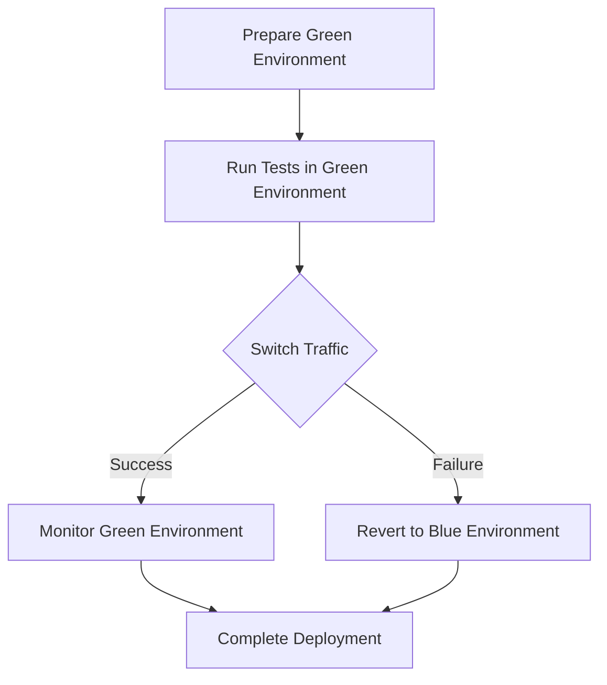

## 26.4. Zero-Downtime Deployments

In the fast-paced world of software development, delivering updates and new features without interrupting service is crucial. Zero-downtime deployments are a set of strategies and techniques that allow you to deploy new versions of your application without any noticeable downtime for your users. This section will delve into various deployment strategies, challenges, and best practices to achieve zero-downtime deployments in Elixir.

### Introduction to Zero-Downtime Deployments

Zero-downtime deployments aim to minimize or eliminate service interruptions during software updates. This is particularly important for applications that require high availability and reliability. The goal is to ensure that users experience a seamless transition from the old version of the application to the new one.

### Key Concepts and Strategies

#### Rolling Deployments

Rolling deployments involve gradually replacing old instances of an application with new ones. This strategy allows you to monitor the application during the rollout and quickly address any issues that arise.

- **Process**: 
  1. Deploy the new version to a small set of instances.
  2. Monitor these instances for errors or performance issues.
  3. Gradually increase the number of instances running the new version.
  4. Continue monitoring until all instances are updated.

- **Advantages**: 
  - Reduces the risk of widespread failure.
  - Allows for incremental testing and validation.

- **Challenges**: 
  - Requires careful monitoring and rollback mechanisms.
  - May complicate database migrations and session management.

#### Blue-Green Deployments

Blue-green deployments involve maintaining two identical environments: one for the current production (blue) and one for the new version (green). Traffic is switched between these environments to deploy updates.

- **Process**:
  1. Prepare the green environment with the new version.
  2. Run tests in the green environment.
  3. Switch traffic from the blue environment to the green environment.
  4. Monitor the new environment for issues.
  5. If issues arise, revert traffic back to the blue environment.

- **Advantages**:
  - Simplifies rollback by allowing traffic to switch back to the previous environment.
  - Provides a stable testing environment for the new version.

- **Challenges**:
  - Requires double the infrastructure during the deployment.
  - Managing data consistency between environments can be complex.

#### Canary Releases

Canary releases involve deploying a new version to a small subset of users before a full rollout. This strategy allows you to test new features and gather feedback with minimal risk.

- **Process**:
  1. Deploy the new version to a small percentage of users.
  2. Monitor user feedback and application performance.
  3. Gradually increase the percentage of users on the new version.
  4. Continue monitoring until all users are on the new version.

- **Advantages**:
  - Provides real-world testing with minimal risk.
  - Allows for gradual rollout and feedback collection.

- **Challenges**:
  - Requires careful user segmentation and monitoring.
  - May require additional infrastructure to support multiple versions simultaneously.

### Challenges in Zero-Downtime Deployments

Achieving zero-downtime deployments involves overcoming several challenges, particularly in areas such as database migrations, session continuity, and data consistency.

#### Managing Database Migrations

Database migrations can be a significant challenge in zero-downtime deployments. Changes to the database schema must be handled carefully to avoid breaking the application.

- **Strategies**:
  - **Backward-Compatible Migrations**: Ensure that new database changes are compatible with both the old and new versions of the application.
  - **Phased Migrations**: Break down migrations into smaller steps, such as adding new columns or tables first and then updating the application logic.
  - **Feature Toggles**: Use feature toggles to control the rollout of new features that depend on database changes.

#### Ensuring Session Continuity

Maintaining session continuity during deployments is crucial to avoid disrupting user experience.

- **Strategies**:
  - **Session Replication**: Use distributed session stores to replicate session data across instances.
  - **Sticky Sessions**: Ensure that user sessions are consistently routed to the same instance during the deployment.

#### Data Consistency

Data consistency is critical in zero-downtime deployments, especially when dealing with distributed systems.

- **Strategies**:
  - **Eventual Consistency**: Design the system to tolerate eventual consistency, where data may be temporarily inconsistent but will eventually become consistent.
  - **Data Versioning**: Use versioning to manage changes to data structures and ensure compatibility between different versions of the application.

### Code Examples

Let's explore some code examples to illustrate how these strategies can be implemented in Elixir.

#### Rolling Deployment Example

```elixir
defmodule Deployment do
  def rolling_deploy(instances, new_version) do
    instances
    |> Enum.each(fn instance ->
      # Deploy new version to the instance
      deploy_to_instance(instance, new_version)
      
      # Monitor the instance for errors
      monitor_instance(instance)
    end)
  end

  defp deploy_to_instance(instance, new_version) do
    # Logic to deploy new version to the instance
    IO.puts("Deploying #{new_version} to #{instance}")
  end

  defp monitor_instance(instance) do
    # Logic to monitor the instance
    IO.puts("Monitoring #{instance} for errors")
  end
end

# Example usage
instances = ["instance1", "instance2", "instance3"]
Deployment.rolling_deploy(instances, "v2.0")
```

#### Blue-Green Deployment Example

```elixir
defmodule BlueGreenDeployment do
  def switch_traffic_to_green do
    # Logic to switch traffic to the green environment
    IO.puts("Switching traffic to the green environment")
  end

  def rollback_to_blue do
    # Logic to revert traffic to the blue environment
    IO.puts("Reverting traffic to the blue environment")
  end
end

# Example usage
BlueGreenDeployment.switch_traffic_to_green()
# If issues arise
BlueGreenDeployment.rollback_to_blue()
```

#### Canary Release Example

```elixir
defmodule CanaryRelease do
  def deploy_to_canary(users, percentage) do
    canary_users = Enum.take_random(users, trunc(length(users) * percentage / 100))
    
    canary_users
    |> Enum.each(fn user ->
      # Deploy new version to the canary user
      deploy_to_user(user)
      
      # Monitor user feedback
      monitor_user_feedback(user)
    end)
  end

  defp deploy_to_user(user) do
    # Logic to deploy new version to the user
    IO.puts("Deploying new version to user #{user}")
  end

  defp monitor_user_feedback(user) do
    # Logic to monitor user feedback
    IO.puts("Monitoring feedback from user #{user}")
  end
end

# Example usage
users = ["user1", "user2", "user3", "user4", "user5"]
CanaryRelease.deploy_to_canary(users, 20)
```

### Visualizing Deployment Strategies

Below is a diagram illustrating the flow of a blue-green deployment strategy:


```mermaid
graph TD;
    A[Prepare Green Environment] --> B[Run Tests in Green Environment];
    B --> C{Switch Traffic};
    C -->|Success| D[Monitor Green Environment];
    C -->|Failure| E[Revert to Blue Environment];
    D --> F[Complete Deployment];
    E --> F;
```

**Figure 1: Blue-Green Deployment Flowchart**

### Best Practices for Zero-Downtime Deployments

- **Automate Deployment Processes**: Use automation tools to streamline the deployment process and reduce the risk of human error.
- **Implement Monitoring and Alerts**: Set up monitoring and alerts to quickly detect and address issues during deployments.
- **Test Deployments in Staging**: Always test deployments in a staging environment before rolling them out to production.
- **Use Feature Toggles**: Implement feature toggles to control the rollout of new features and minimize risk.
- **Plan for Rollback**: Always have a rollback plan in case issues arise during the deployment.

### Elixir-Specific Considerations

Elixir's concurrency model and fault-tolerance features make it well-suited for zero-downtime deployments. Here are some Elixir-specific considerations:

- **Hot Code Upgrades**: Elixir's BEAM VM supports hot code upgrades, allowing you to update running code without stopping the system.
- **Supervision Trees**: Use supervision trees to manage application processes and ensure fault tolerance during deployments.
- **Distributed Systems**: Leverage Elixir's distributed system capabilities to manage deployments across multiple nodes.

### Knowledge Check

- **What are the main benefits of zero-downtime deployments?**
- **How can database migrations be managed during zero-downtime deployments?**
- **What are the differences between rolling deployments and blue-green deployments?**
- **How can Elixir's hot code upgrades be utilized in zero-downtime deployments?**

### Embrace the Journey

Remember, mastering zero-downtime deployments is a journey. As you progress, you'll develop more efficient and reliable deployment strategies. Keep experimenting, stay curious, and enjoy the journey!

## Quiz Time!



### What is the main goal of zero-downtime deployments?

- [x] To update software without interrupting service
- [ ] To reduce deployment costs
- [ ] To increase server capacity
- [ ] To improve code readability

> **Explanation:** Zero-downtime deployments aim to update software without interrupting service, ensuring a seamless user experience.


### Which deployment strategy involves gradually replacing old instances with new ones?

- [x] Rolling Deployments
- [ ] Blue-Green Deployments
- [ ] Canary Releases
- [ ] Hot Code Upgrades

> **Explanation:** Rolling deployments involve gradually replacing old instances with new ones, allowing for incremental updates and monitoring.


### What is a key advantage of blue-green deployments?

- [x] Simplified rollback by switching traffic back to the previous environment
- [ ] Requires less infrastructure
- [ ] Eliminates the need for testing
- [ ] Reduces code complexity

> **Explanation:** Blue-green deployments simplify rollback by allowing traffic to switch back to the previous environment if issues arise.


### How do canary releases help in deployment?

- [x] By deploying to a small subset of users before a full rollout
- [ ] By eliminating the need for user feedback
- [ ] By reducing server load
- [ ] By increasing code complexity

> **Explanation:** Canary releases help by deploying to a small subset of users before a full rollout, allowing for testing and feedback collection.


### What is a common challenge in zero-downtime deployments?

- [x] Managing database migrations without downtime
- [ ] Reducing code complexity
- [ ] Increasing server capacity
- [ ] Eliminating user feedback

> **Explanation:** Managing database migrations without downtime is a common challenge in zero-downtime deployments, as changes to the database schema must be handled carefully.


### What is a strategy for maintaining session continuity during deployments?

- [x] Session Replication
- [ ] Code Refactoring
- [ ] Increasing Server Capacity
- [ ] Eliminating User Sessions

> **Explanation:** Session replication involves using distributed session stores to replicate session data across instances, ensuring session continuity.


### How can Elixir's hot code upgrades be utilized in deployments?

- [x] By updating running code without stopping the system
- [ ] By eliminating the need for testing
- [ ] By increasing server capacity
- [ ] By reducing code complexity

> **Explanation:** Elixir's hot code upgrades allow for updating running code without stopping the system, facilitating zero-downtime deployments.


### What is a benefit of using feature toggles in deployments?

- [x] Controlling the rollout of new features
- [ ] Reducing server load
- [ ] Increasing code complexity
- [ ] Eliminating user feedback

> **Explanation:** Feature toggles allow for controlling the rollout of new features, minimizing risk during deployments.


### What is the purpose of monitoring and alerts during deployments?

- [x] To quickly detect and address issues
- [ ] To increase server capacity
- [ ] To reduce code complexity
- [ ] To eliminate user feedback

> **Explanation:** Monitoring and alerts help quickly detect and address issues during deployments, ensuring a smooth transition.


### True or False: Zero-downtime deployments eliminate the need for a rollback plan.

- [ ] True
- [x] False

> **Explanation:** Zero-downtime deployments do not eliminate the need for a rollback plan. Having a rollback plan is crucial in case issues arise during the deployment.




