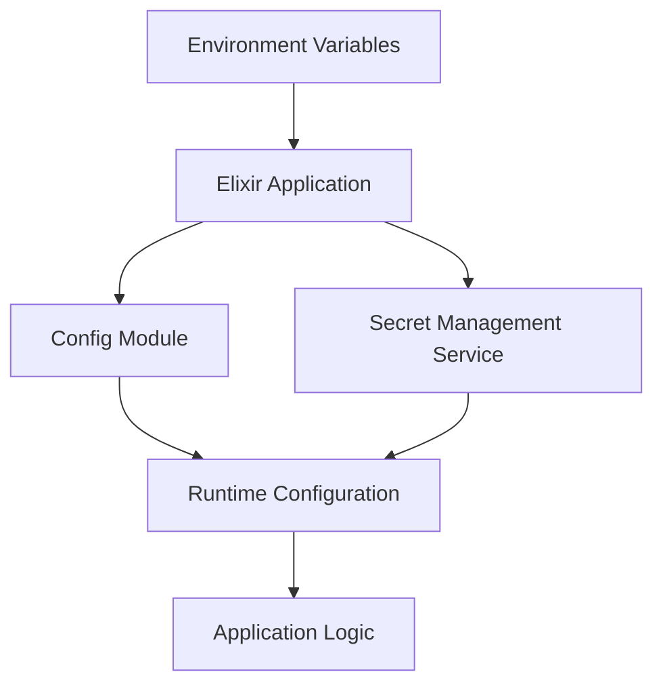

## 26.5. Managing Configuration and Secrets

In modern software development, managing configuration and secrets effectively is crucial for building secure, maintainable, and scalable applications. This section will delve into advanced techniques for managing configuration and secrets in Elixir applications, focusing on best practices, tools, and libraries to enhance your application's security and flexibility.

### Environment Variables

Environment variables are a fundamental way to store configuration outside the codebase, allowing you to change configuration without modifying code. This practice is essential for maintaining clean code and adhering to the Twelve-Factor App methodology, which promotes storing configuration in the environment.

#### Storing Configuration Outside the Codebase

Storing configuration outside the codebase provides several benefits:

1. **Security**: Sensitive information, such as API keys and database credentials, should not be hard-coded in the source code. Environment variables keep these details out of version control systems.
2. **Flexibility**: Different environments (development, testing, production) often require different configurations. Environment variables allow you to switch configurations easily without changing the code.
3. **Portability**: Applications can be deployed across various environments (local, staging, production) with minimal changes.

#### Using Tools like `dotenv` for Local Development

For local development, tools like `dotenv` can be used to load environment variables from a `.env` file. This approach simplifies managing environment-specific configurations during development.

```elixir
# Mix.exs
defp deps do
  [
    {:dotenv, "~> 3.0"}
  ]
end
```

Create a `.env` file in the root of your project:

```
# .env
DATABASE_URL=postgres://localhost/my_database
SECRET_KEY_BASE=your_secret_key
```

Load the environment variables in your application:

```elixir
# config/config.exs
import Config

config :my_app, MyApp.Repo,
  url: System.get_env("DATABASE_URL")

config :my_app, MyAppWeb.Endpoint,
  secret_key_base: System.get_env("SECRET_KEY_BASE")
```

**Try It Yourself**: Modify the `.env` file to include additional environment variables, such as API keys, and observe how they are accessed within your Elixir application.

### Secret Management

Managing secrets securely is a critical aspect of application security. Hard-coded secrets in code repositories can lead to severe security vulnerabilities. Instead, use dedicated secret management tools and services.

#### Using Services like HashiCorp Vault or AWS Secrets Manager

**HashiCorp Vault** and **AWS Secrets Manager** are popular tools for managing secrets securely.

- **HashiCorp Vault**: Provides a secure way to store and access secrets, with features like dynamic secrets, leasing, and revocation.
- **AWS Secrets Manager**: Offers a fully managed service for secret management, with integrated rotation and access control.

##### Example: Using HashiCorp Vault with Elixir

1. **Install Vault**: Follow the [official installation guide](https://www.vaultproject.io/docs/install) to set up Vault.

2. **Store a Secret**: Use the Vault CLI to store a secret.

   ```bash
   vault kv put secret/myapp DATABASE_URL=postgres://localhost/my_database
   ```

3. **Access the Secret in Elixir**: Use a library like `vault` to access secrets from Vault.

   ```elixir
   # Mix.exs
   defp deps do
     [
       {:vault, "~> 0.8"}
     ]
   end
   ```

   ```elixir
   # lib/my_app/secrets.ex
   defmodule MyApp.Secrets do
     use Vault.Client

     def get_database_url do
       {:ok, secret} = Vault.read("secret/myapp")
       secret["DATABASE_URL"]
     end
   end
   ```

4. **Use the Secret**: Access the secret in your application configuration.

   ```elixir
   # config/config.exs
   config :my_app, MyApp.Repo,
     url: MyApp.Secrets.get_database_url()
   ```

**Try It Yourself**: Experiment with AWS Secrets Manager by storing and retrieving secrets for your Elixir application. Compare the features and ease of use between HashiCorp Vault and AWS Secrets Manager.

### Configuration Libraries

Elixir provides powerful libraries for managing configuration at runtime, enabling dynamic and flexible configuration management.

#### Leveraging Libraries like `Config` for Runtime Configuration

The `Config` module in Elixir allows you to manage configuration at runtime, supporting environment-specific configurations and dynamic loading.

```elixir
# config/config.exs
import Config

config :my_app, MyApp.Repo,
  url: {:system, "DATABASE_URL"}

config :my_app, MyAppWeb.Endpoint,
  secret_key_base: {:system, "SECRET_KEY_BASE"}
```

#### Structuring Configurations for Clarity and Maintainability

Organizing configurations systematically enhances clarity and maintainability. Consider the following strategies:

1. **Environment-Specific Configuration Files**: Use separate configuration files for different environments (e.g., `dev.exs`, `prod.exs`).

2. **Hierarchical Configuration**: Group related configurations under a common namespace.

   ```elixir
   # config/config.exs
   config :my_app, :database,
     url: System.get_env("DATABASE_URL"),
     pool_size: 10

   config :my_app, :web,
     secret_key_base: System.get_env("SECRET_KEY_BASE")
   ```

3. **Use of Defaults**: Provide sensible defaults for configurations that can be overridden by environment variables.

   ```elixir
   # config/config.exs
   config :my_app, MyApp.Repo,
     url: System.get_env("DATABASE_URL") || "ecto://localhost/my_app_dev"
   ```

**Try It Yourself**: Refactor your application's configuration to use hierarchical configuration and defaults. Test the configuration in different environments to ensure it behaves as expected.

### Visualizing Configuration Management

Understanding the flow of configuration management can be enhanced through visualization. Below is a diagram illustrating the process of managing configuration and secrets in an Elixir application.


```mermaid
graph TD;
    A[Environment Variables] --> B[Elixir Application];
    B --> C[Config Module];
    B --> D[Secret Management Service];
    C --> E[Runtime Configuration];
    D --> E;
    E --> F[Application Logic];
```

**Diagram Description**: This flowchart demonstrates how environment variables and secret management services interact with the Elixir application, utilizing the `Config` module for runtime configuration, ultimately influencing the application's logic.

### References and Links

- [Twelve-Factor App Methodology](https://12factor.net/)
- [HashiCorp Vault Documentation](https://www.vaultproject.io/docs)
- [AWS Secrets Manager Documentation](https://aws.amazon.com/secrets-manager/)
- [Elixir Config Module](https://hexdocs.pm/elixir/Config.html)

### Knowledge Check

- **Question**: Why is it important to store configuration outside the codebase?
- **Exercise**: Implement a simple Elixir application that uses environment variables for configuration. Experiment with different tools for managing these variables.

### Embrace the Journey

Managing configuration and secrets is a critical aspect of building secure and maintainable applications. Remember, this is just the beginning. As you progress, you'll encounter more complex scenarios, but with the right tools and practices, you'll be well-equipped to handle them. Keep experimenting, stay curious, and enjoy the journey!

### Quiz Time!



### What is the primary benefit of storing configuration outside the codebase?

- [x] Security and flexibility
- [ ] Easier debugging
- [ ] Faster application startup
- [ ] Reduced code complexity

> **Explanation:** Storing configuration outside the codebase enhances security by keeping sensitive information out of version control and provides flexibility for different environments.

### Which tool can be used to load environment variables from a `.env` file in Elixir?

- [x] dotenv
- [ ] Mix
- [ ] ExUnit
- [ ] Phoenix

> **Explanation:** `dotenv` is a tool that loads environment variables from a `.env` file, making it useful for local development.

### What is a key feature of HashiCorp Vault?

- [x] Dynamic secrets management
- [ ] Real-time analytics
- [ ] Machine learning integration
- [ ] Frontend development

> **Explanation:** HashiCorp Vault provides dynamic secrets management, allowing for secure storage and access to secrets.

### How can you access a secret stored in AWS Secrets Manager from an Elixir application?

- [x] Use a library to integrate with AWS Secrets Manager
- [ ] Hard-code the secret in the application
- [ ] Use environment variables directly
- [ ] Store the secret in a database

> **Explanation:** Using a library to integrate with AWS Secrets Manager is the recommended approach for accessing secrets securely.

### What is the purpose of the `Config` module in Elixir?

- [x] Manage runtime configuration
- [ ] Handle HTTP requests
- [ ] Perform database migrations
- [ ] Generate HTML templates

> **Explanation:** The `Config` module in Elixir is used to manage runtime configuration, allowing for dynamic and flexible configuration management.

### Which of the following is a strategy for structuring configurations?

- [x] Hierarchical configuration
- [ ] Inline configuration
- [ ] Hard-coded configuration
- [ ] Static configuration

> **Explanation:** Hierarchical configuration involves grouping related configurations under a common namespace for clarity and maintainability.

### What is a benefit of using environment-specific configuration files?

- [x] Tailored configurations for different environments
- [ ] Reduced application size
- [ ] Increased code readability
- [ ] Faster execution time

> **Explanation:** Environment-specific configuration files allow for tailored configurations for different environments, such as development, testing, and production.

### What is a common pitfall when managing secrets?

- [x] Hard-coding secrets in the codebase
- [ ] Using environment variables
- [ ] Utilizing secret management services
- [ ] Implementing runtime configuration

> **Explanation:** Hard-coding secrets in the codebase is a common pitfall that can lead to security vulnerabilities.

### Why is it important to provide sensible defaults in configuration?

- [x] To ensure the application functions correctly without environment variables
- [ ] To reduce code complexity
- [ ] To increase application speed
- [ ] To enhance user experience

> **Explanation:** Providing sensible defaults ensures that the application functions correctly even if environment variables are not set.

### True or False: The `Config` module can be used to manage both compile-time and runtime configurations.

- [x] True
- [ ] False

> **Explanation:** The `Config` module in Elixir can manage both compile-time and runtime configurations, providing flexibility in how configurations are handled.


